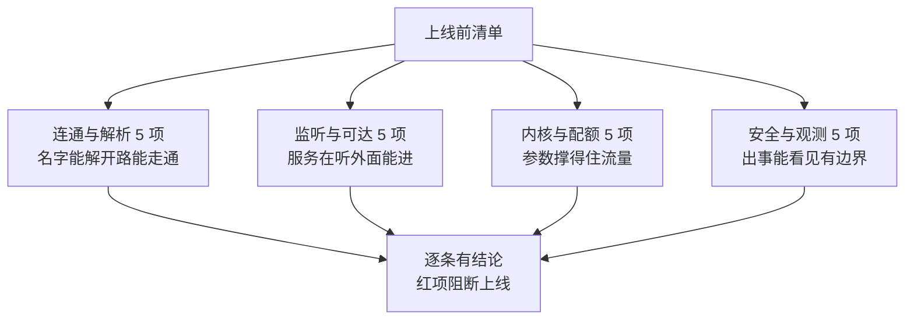

# 交付前的网络检查清单：二十项逐条过，三项全绿再上线

> **要点**：网络配置的交付质量靠一张 20 项清单守住——连通与解析（5 项）、监听与可达（5 项）、内核与配额（5 项）、安全与观测（5 项），每项给检查命令与判定标准；清单的价值在"上线前 10 分钟逐条过"，把网络类上线事故从"事后救火"变成"事前拦截"。

## 要解决的问题

网络问题的特点是"改配置一时爽，出了事难定位"：DNS 配错一个地址、防火墙少开一个端口、内核参数没调，都在上线后的流量高峰爆发——**上线前的检查是性价比最高的拦截点**。本库已有网络侧的机制文（DNS 全链路、SYN 队列、TIME_WAIT），缺一张把检查动作收拢的**交付清单**：检查什么、用什么命令、判什么标准、不合格怎么处理。本篇按四个阶段组织 20 项检查，供上线评审与发布前核对使用。

## 机制：四个阶段二十项

**阶段一：连通与解析（5 项）**——验证"名字能解开、路能走通"。

1. DNS 解析正确：`dig +short <内部域名>` 返回预期 IP（核对解析层与缓存层的答案一致，本库 DNS 全链路篇的四层缓存）；
2. 外部域名可达：`dig +short <外部域名>` 在超时阈值内返回（防 resolv.conf 只配了内网 DNS）；
3. 路由正确：`ip route get <目标IP>` 走预期网卡与网关（多网卡机器的经典错配）；
4. 端口连通：`nc -zv <依赖地址> <端口>` 全部依赖可达（列出依赖清单逐个测，不留"应该通"）；
5. 大包通过：`ping -M do -s 1472 <目标>` 验证 MTU 路径（VPN 与隧道场景的隐形分片故障）。

**阶段二：监听与可达（5 项）**——验证"服务在听、外面能进来"。

6. 监听地址正确：`ss -tlnp | grep <端口>` 显示 `0.0.0.0` 或预期地址（监听 `127.0.0.1` 导致容器外不可达是高频错误）；
7. 监听进程正确：`ss` 显示的 pid 是预期服务（端口被残留进程占用的检测）；
8. 防火墙放行：`iptables -L -n` 或 `firewall-cmd --list-all` 含目标端口；
9. 负载均衡后端健康：控制台或 API 核对新实例已注册、健康检查通过（本库健康检查篇的三级探测）；
10. 本机回环自测：`curl -s http://127.0.0.1:<端口>/<健康端点>` 返回预期（服务自身先绿）。

**阶段三：内核与配额（5 项）**——验证"内核参数撑得住流量"。

11. 文件描述符上限：`ulimit -n` 与服务配额联动（本库"连接与文件描述符的配额要联动"）；
12. 连接跟踪上限：`sysctl net.netfilter.nf_conntrack_max` 与 `nf_conntrack_count` 对比，水位低于 70%（本库 conntrack 篇的溢出形态）；
13. SYN 队列参数：`net.ipv4.tcp_max_syn_backlog` 与 `somaxconn` 达标（本库"连接建立失败先看内核队列"）；
14. 端口范围与 TIME_WAIT：`ip_local_port_range` 足够宽、主动连接多的服务核对回收参数（本库 TIME_WAIT 篇）；
15. 缓冲区参数：`tcp_rmem/tcp_wmem` 与 BDP 匹配（高带宽长延迟链路核对）。

**阶段四：安全与观测（5 项）**——验证"出事能看见、访问有边界"。

16. 监控接入：指标端点、日志出口、Trace 上报逐项验证（本库监控四问分层篇的四层齐备）；
17. 告警规则生效：新服务的症状告警在告警平台可见（不是"配了"是"在管"）；
18. 拨测覆盖：外部拨测已对新端点开跑（本库拨测篇的外部视角）；
19. 访问控制：管理端点不暴露公网、探测端点有访问限制；
20. 变更记录：本次网络配置变更全部登记（参数、防火墙、DNS、负载均衡配置），回滚路径写在变更单里。

## 看完能判断：清单的使用纪律

四个阶段各拦一类错误，红项阻断、黄项记录后决策：



图回答的是 20 项的组织骨架：四段各管一类错配，检查结论分三色、只有红项有阻断权，跳过的那项就是出事的。

**逐条过，全绿才上线**：清单的纪律是"每项有结论（绿/黄/红），红项阻断上线、黄项记录风险后决策"——**跳项检查的清单等于没查**（跳过的那项恰是出事的），上线评审时逐条念出结论比"大概看了一眼"可靠一个量级。

**清单随架构演进**：容器化部署把部分检查移到平台层（K8s 的 NetworkPolicy、Service 抽象），清单要区分"应用自查项"与"平台确认项"——**维护的收益是检查项永远与部署形态一致，代价是每次平台升级要同步改清单**——**两项的负责人不同**，应用团队核 6-10、14-20，平台团队核 1-5、11-13 的平台侧等价物。

**清单与自动化互补**：可自动化的项（11-15 的内核参数、6-7 的监听状态）进 CI 或部署前自动检查，清单保留人工核对的部分（10、18-20 的验证动作需要人看输出）——**自动检查拦截低级错误，人工清单拦截判断性错误**，两层不互替。

## 边界

三条边界防止清单走形。

**清单覆盖不了运行时的突发**：上线前全绿不保证运行中不出网络故障（对端故障、运营商问题），清单的定位是拦截"配置与部署类"错误——运行时的保障靠监控告警与拨测（阶段四的存在意义）。

**检查命令有环境差异**：不同发行版的防火墙工具（iptables/firewalld/nftables）、DNS 配置路径不同，清单按部署环境维护分支版本——**命令不适用时先换命令，跳过检查**是清单失效的开始。

**20 项是基线，按服务类型增补**：对外网关服务加 TLS 证书有效期与加密套件核对，数据库代理加连接数上限核对——基线统一、增补按类型，增补项进服务类型的部署手册。

## 验证

可复现的验证路径：

1. 清单回放：对最近一次上线做清单回放核对，预期 20 项全部可判定、发现的历史问题类别与清单条目对应；
2. 拦截演练：故意注入三类错配（监听 127.0.0.1、conntrack 水位超限、DNS 少配），预期清单逐项检出；
3. 断言锚点：**四个阶段 20 项有命令有判据、红黄绿三色结论有记录、清单按环境维护分支版本**——三件齐备，网络交付检查从"凭经验"变成"过清单"。

```text
覆盖断言 = 连通监听内核观测四段齐全
纪律断言 = 逐条有结论红项即阻断
演进断言 = 清单随平台层演进分工
```

网络交付的质量下限由清单决定：20 项检查覆盖从解析到观测的完整链路，上线前 10 分钟的逐条核对，换来的是运行期网络类事故的大幅减少——清单把"老师傅的经验"变成"任何人可执行的动作"。

## 相关

- [[工程知识/性能工程：从用户等待到资源瓶颈/存储与网络/连接建立失败先看内核队列：SYN 队列与 accept 队列是两个瓶颈.md]] —— 阶段三第 13 项的机制层
- [[工程知识/性能工程：从用户等待到资源瓶颈/存储与网络/连接与文件描述符的配额要联动：ulimit 是连接数的隐形上限.md]] —— 阶段三第 11 项的联动核算
- [[工程知识/性能工程：从用户等待到资源瓶颈/存储与网络/依赖服务的健康检查要带拨测与退避：探测结果决定流量去留.md]] —— 阶段四观测项的机制层
- [[工程知识/后端系统：在并发、失败与变化中维持服务/基础设施/DNS解析的全链路：递归缓存与失效传播.md]] —— 阶段一解析项的机制层
