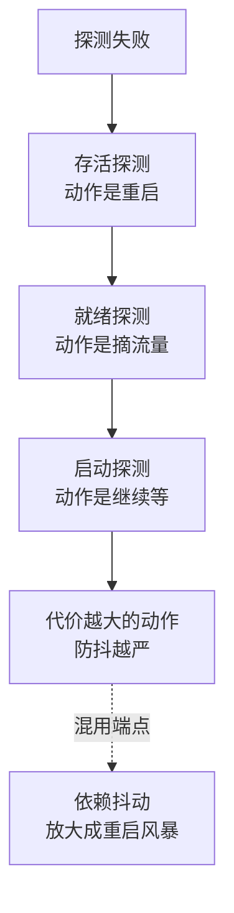
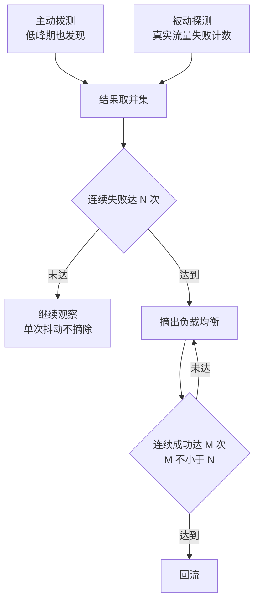

# 依赖服务的健康检查要带拨测与退避：探测结果决定流量去留

> **要点**：健康检查的工程要求是"探测动作本身要可靠、失败判定要防抖"——主动拨测（定时探 + 结果驱动动作）、被动探测（流量失败计数）、失败退避（连续 N 次才判定，恢复要宽）；三级探测（存活、就绪、启动）各管一个决策，混用一个端点是熔断失效的常见根因。

## 要解决的问题

健康检查的误判有两种代价：**误报**（服务其实健康，探测被网络抖动或瞬时 GC 干扰，流量被错误摘除、雪崩放大）；**漏报**（服务已坏，探测还在过——探测路径与业务路径不同，探测过的路径不代表业务可用）。上游 BookKeeper 的一个复现改进是"auto-recovery 在 bookie 下线时降噪日志"（探测与恢复的联动里，误判的代价是重复恢复动作）——**探测结果的消费方（负载均衡、熔断器、恢复任务）都依赖判定准确**。本篇展开：**三级探测的分工、主动与被动的组合、防抖的判定设计**。

## 机制：三级探测的分工

**存活探测（liveness）**：进程还活着吗——失败动作是**重启进程**。判定要极保守（误重启的代价是所有在途请求全灭）：只探进程级指标（事件循环是否阻塞），不探依赖（数据库挂了不该重启应用）。

**就绪探测（readiness）**：能接新流量吗——失败动作是**摘出负载均衡**（不重启）。探的范围包括关键依赖（数据库连接可获取、缓存可达）：依赖挂了摘流量是对的（新请求路由到健康实例），恢复后自动回流量——**就绪探测的判定可以比存活激进**（摘流量的代价远小于重启）。

**启动探测（startup）**：冷启动完成没——失败动作是**继续等**（不给存活/就绪判定）。解决重启动服务的误杀：加载缓存的慢启动进程在就绪探测介入前被启动探测保护，避免"启动 40 秒被存活探测 30 秒超时杀掉"的循环。

**三级各自独立端点**：`/healthz`（进程级，探活）、`/ready`（依赖级，探就绪）、启动用同一就绪端点加宽参数——**一个端点混三用的失败模式**：依赖抖动打挂在 liveness 上（重启风暴）。

三级探测各探一层，失败后驱动的动作不同，动作的代价决定判定的保守程度：



图回答的是三探分工的依据：动作代价从重启到等待依次递减，判定激进度随代价反向排，混用端点会把依赖抖动放大成重启风暴。

## 机制：主动拨测与被动探测的组合

**主动拨测（active）**：按周期主动发探测请求（HTTP 探针、TCP 连接测试、自定义轻量业务探针）。主动拨测不依赖真实流量，低峰期也能发现故障。代价在覆盖面：探测路径跟业务路径可能不同，探测打到的接口缓存命中时，业务路径的数据库依赖就没被覆盖。覆盖修正的做法：探测请求穿透到真依赖（禁缓存的探测头）或多层探测（进程探针 + 业务拨测，本库"拨测与合成监控"的外部拨测是更外层）。

**被动探测（passive）**：从真实流量的失败计数推断（连续 N 笔 5xx / 超时 → 判定不健康）——**优点是测的就是业务路径**、缺点是低峰期样本稀疏（流量少时判定慢）。被动计数的实现按连接级熔断器模式（Envoy 的 outlier detection、gRPC 的 health protocol）。

**组合的原则**：主动拨测管"有没有流量都要发现"（低峰期故障），被动探测管"业务路径的真实可用性"——两者结果取并集进入摘除决策，各自带独立的防抖参数。



主动拨测与被动探测各补一个盲区：主动探测在低峰期没有真实流量时仍能发现故障，被动探测覆盖的是真实业务路径（探测请求打不到的依赖它能测到）。两路结果取并集后进防抖判定——连续失败达到 N 次才摘除，回流要连续成功 M 次且 M 不小于 N，防止在边界上反复摘除回流。判定参数按误报代价设定：摘流量代价越高的服务，N 取值越大。

## 看完能判断：防抖的判定设计

**失败判定防抖**：连续 N 次失败才判定（单次失败可能是抖动），N 按误报成本定（摘流量代价高的服务 N 大）——**恢复判定更宽**：连续 M 次成功才回流（M ≥ N，防"抖动边界反复横跳"：摘了回、回了摘）。

**探测超时与间隔的量级**：探测超时要短于业务超时（探测在等业务超时,摘除就太晚了），间隔按故障发现速度需求定（秒级探测 + 3 次失败 = 分钟级发现）——**探测频率与探测成本的平衡**：每实例每秒探测 ×千实例规模，探测本身的流量要进容量核算。

**判定结果的消费方各自防抖**：负载均衡摘除、熔断器打开、恢复任务触发——三个消费方对同一探测结果的消费动作不同，**探测判定与消费动作的参数分开调**（熔断器的半开试探与负载均衡的回流判定不是一个机制）。

## 边界

三条边界防止防线走形。

**就绪探测不等于熔断器**：就绪摘除保护的是"新请求不再进来"，在途请求与已建立的连接不归它管——熔断器在调用方侧管"还敢不敢调"，两个机制互补，**只用其一的盲区**：只有摘除没有熔断，调用方在摘除生效前的窗口持续撞墙。

**依赖健康不等于整链健康**：A 实例就绪探测通过（它依赖的 B 正常）不代表 B 的容量够全集群用——探测是点判定，容量是全局量，**探测通过与容量告警是两层防线**。

**探测端点自身的安全与隔离**：探测端点暴露内部信息（版本、依赖列表）要有访问控制；探测流量与业务流量隔离（独立端口或标记路由），防探测风暴挤占业务容量。

## 验证

可复现的验证路径：

1. 误报复现：注入瞬时抖动（单次超时），预期单次失败不触发摘除（防抖生效）、连续失败才摘除；
2. 依赖故障复现：停掉探测覆盖的依赖，预期就绪摘除在探测周期 × N 内生效、恢复后自动回流，存活探测不误重启；
3. 慢启动复现：重启带大缓存的服务，预期启动探测保护下存活探测不误杀、就绪在启动完成后才接流量；
4. 断言锚点：**三级探测独立端点、主动与被动双路探测、防抖参数（N/M）有文档且按误报成本定**——三件齐备，健康检查从"配了个端点"变成"探测结果可信、可驱动流量决策"。

```text
分级断言 = 存活就绪启动三探分端点
防抖断言 = 摘除需连续失败回流需更宽
组合断言 = 主动被动双路互为补充
```

健康检查的可靠性是整个流量治理的地基：摘除、熔断、恢复的每个动作都建立在"探测判定可信"上——三级分工、双路组合、防抖判定三件配齐，探测结果才有资格决定流量去留。

## 相关

- [[工程知识/性能工程：从用户等待到资源瓶颈/存储与网络/滚动重启的摘流量顺序：先停新请求，再让旧请求做完.md]] —— 摘除动作的消费端时序
- [[工程知识/后端系统：在并发、失败与变化中维持服务/基础设施/服务网格控制面与数据面：mTLS与流量治理.md]] —— 网格侧健康检查与熔断的机制层
- [[工程知识/性能工程：从用户等待到资源瓶颈/观测与诊断/拨测与合成监控：在用户之前从外面敲一遍门.md]] —— 更外层的拨测视角
- [[工程知识/后端系统：在并发、失败与变化中维持服务/分布式可靠性/重试的正确姿势：退避、抖动与重试预算.md]] —— 探测失败后调用方的重试配合
