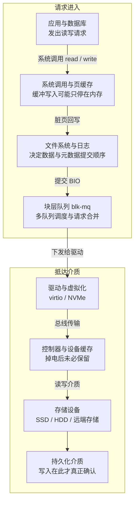

# 存储 I/O 性能取决于访问模式、队列与持久化语义

存储调优不是“换 SSD”或“把队列调大”，而是回答三件事：应用发出了什么 I/O，I/O 在哪一层等待，数据可靠性要求允许做什么取舍。

一个写入返回很快，可能只是进入页缓存或设备缓存；一个读请求很慢，可能在应用队列、文件系统、块层或云盘限额等待。性能数字必须和持久化确认点绑定，否则吞吐提升可能只是把数据损失窗口扩大。

## 完整路径



一次“写完成”可能只到达应用缓冲区、操作系统页缓存、设备缓存或真正持久介质。性能测试和故障分析必须写清确认点，否则吞吐数字与可靠性结论都不可比较。

## 核心变量及其关系

| 变量 | 含义 | 常见误区 |
| --- | --- | --- |
| 延迟 | 单个请求从产生到完成的时间；区分排队、提交和设备完成 | 只看平均值，遗漏 p99/p99.9 尾延迟 |
| IOPS | 每秒完成的 I/O 数 | 不写块大小和读写模式；4 KiB 与 1 MiB 的 IOPS 不可直接比 |
| 带宽 | 每秒传输字节数，近似 `IOPS × 平均块大小` | 把接口理论带宽当成应用可用吞吐 |
| 队列深度 | 同时在途的 I/O 数 | 越深通常越能压满并行设备，但排队和尾延迟也会上升 |
| 放大 | 逻辑 I/O 与物理 I/O 的比例 | 忽略文件系统、数据库 WAL、压缩、GC 和 SSD 写放大 |
| 持久性 | 断电/崩溃后哪些写入仍存在 | 把 buffered write 返回当作 durable commit |

Little's Law 给出稳定系统中的近似关系：`并发在途数 ≈ 吞吐 × 平均响应时间`。当吞吐接近设备能力上限时，新增并发主要进入队列，延迟会快速上升。目标不是得到最高 IOPS，而是在业务尾延迟和持久性约束下找到可持续吞吐。

## 介质与协议为什么不同

### HDD

机械寻道和旋转延迟使随机 I/O 代价高；顺序、合并和较少的并发队列更重要。碎片、邻道与 RAID 重建会改变时延分布。

### SSD/NVMe

无机械寻道，但内部仍有闪存页/块、擦除、垃圾回收、FTL 映射和有限写寿命。NVMe/PCIe 提供更多硬件队列和并行性；这不代表无限加深队列都有收益。设备接近满盘、长期写入、温度降频、SLC cache 耗尽和 GC 都可能造成突发尾延迟。

### 云盘、网络盘与虚拟磁盘

观察到的延迟同时包含主机、虚拟化、网络、后端存储和限额。云产品还可能有 IOPS/带宽配额、突发积分和邻居噪声；只在实例内看 `%util` 无法证明物理设备饱和。

## 页缓存、Direct I/O 与持久化

- **Buffered I/O** 经过页缓存，重复读取可能命中内存，写入可先变成 dirty page；适合通用文件访问，但基准容易测到内存而非设备。
- **Direct I/O** 尝试绕过页缓存，通常要求地址、长度和 offset 对齐；数据库常自行管理缓存，但 direct 并不自动等于 durable。
- **`fsync`/`fdatasync`** 请求把相应数据推进到稳定存储语义；效果仍依赖文件系统、设备缓存和硬件是否正确实现 flush/FUA。
- **mmap** 把文件映射到虚拟地址空间，缺页触发读取；写回、崩溃一致性和生命周期必须单独设计。

调优前先回答：数据能否丢、能丢多久、是否允许重放、崩溃后如何恢复。降低同步刷盘频率可以提高吞吐，但本质是改变数据损失窗口，不是免费优化。

## 观测：从业务等待向下定位

### 第一层：业务现象

- 哪个请求、事务或后台任务变慢？p50/p95/p99 是否同时恶化？
- 是读取、写入、checkpoint、compaction、日志刷盘还是备份？
- 延迟增加时吞吐、错误、队列和 CPU iowait 如何变化？

### 第二层：进程与文件

- `pidstat -d 1`：进程读写速率和 I/O delay。
- `lsof -p <pid>`：定位文件、设备和删除但仍打开的文件。
- 应用/数据库指标：buffer/cache hit、WAL/binlog flush、checkpoint、compaction、pending I/O。
- eBPF/perf/trace：当系统级指标不足时，定位同步调用、块请求和文件系统延迟分布。

### 第三层：块设备

`iostat -x 1` 常用字段：

| 指标 | 含义 | 正确解读 |
| --- | --- | --- |
| `r/s`, `w/s` | 完成读写请求速率 | 与请求大小、合并和业务吞吐一起看 |
| `rkB/s`, `wkB/s` | 读写带宽 | 检查设备/云盘带宽上限 |
| `r_await`, `w_await` | 排队加服务的平均完成时间 | 平均值不能替代延迟分布 |
| `aqu-sz` | 平均队列长度 | 持续增长通常表示到达率超过完成率 |
| `%util` | 有 I/O 在处理的时间占比 | 对串行设备接近 100% 可提示饱和；对 RAID/现代并行 SSD 不能直接代表性能上限 |

[iostat 手册](https://man7.org/linux/man-pages/man1/iostat.1.html) 明确指出 `%util` 对并行设备不反映其性能极限。因此“低 util 一定没瓶颈”与“100% util 一定已满”都不是普遍结论。

## 基准测试：先定义负载，再运行 fio

### 必须固定的维度

- 读/写比例，顺序/随机模式；
- 块大小分布，不只一个平均值；
- 同步/异步 I/O engine、job 数和实际队列深度；
- buffered/direct、文件/裸设备、文件系统与挂载参数；
- 工作集大小是否超过内存和设备缓存；
- 预热、运行时长、steady state、数据可压缩性；
- fsync/flush 频率与断电一致性要求；
- 输出 IOPS、带宽、p50/p95/p99/p99.9、CPU、错误和达到的 queue depth。

### 安全示例：只测试专用文件

```ini
[global]
filename=/data/fio-test.bin
size=8G
ioengine=io_uring
direct=1
time_based=1
runtime=60
ramp_time=10
group_reporting=1
randrepeat=1

[random-read-4k]
rw=randread
bs=4k
iodepth=16
numjobs=4
```

不要在包含真实数据的裸设备上执行破坏性写测试。`fio` 文档指出：异步引擎也可能因操作系统限制达不到请求的 `iodepth`，所以必须检查输出里的实际 depth distribution；只看配置值会产生错误结论。[fio documentation](https://fio.readthedocs.io/en/master/fio_doc.html)

## 常见症状与最小实验

| 症状 | 候选原因 | 最小区分实验 |
| --- | --- | --- |
| 高 `await`、队列持续增长 | 设备饱和、限额、GC、下层网络或 flush 阻塞 | 分读写看 await；固定 rate/queue depth；对照云监控和设备日志 |
| 吞吐高但业务 p99 差 | 队列太深、批次过大、后台 compaction/checkpoint | 限制到达率/深度；暂停后台任务；比较尾延迟 |
| 读很快但冷启动慢 | 页缓存掩盖设备性能 | 使用超过内存的工作集；明确冷/热缓存两套结果 |
| 写入周期性尖刺 | dirty page 回写、checkpoint、SSD GC、日志轮转 | 对齐时间线；监控 dirty/writeback、fsync 和设备延迟 |
| CPU iowait 高 | CPU 有未完成块 I/O，但不自动证明设备本身是根因 | 看进程、队列、设备和虚拟化下层；检查任务是否可运行 |
| `%util` 接近 100% | 串行设备可能饱和；并行设备可能只是一直有请求 | 改变 queue depth/rate，看吞吐与尾延迟是否仍能扩展 |
| 数据库读 I/O 高 | buffer pool 不足、扫描、坏计划或工作集变化 | 对齐执行计划、逻辑读/物理读、cache hit 和数据分布 |

## 调优顺序

1. **固定可靠性语义**：确认允许的数据损失窗口、恢复方式和 flush 要求。
2. **还原业务负载**：请求大小、读写比、并发、热点和周期性任务。
3. **定位等待层**：应用锁/队列、页缓存、文件系统、块层、虚拟化或设备。
4. **降低无效 I/O**：修查询/索引，去重、批量、压缩、减少写放大和小文件元数据操作。
5. **平滑负载**：背压、限速、分批 checkpoint/compaction，避免无限加队列。
6. **按证据改系统参数**：readahead、scheduler、dirty writeback 和挂载参数都先做 A/B 与回滚。
7. **最后扩容/换介质**：验证瓶颈确在设备或配额，且新介质的耐久、冗余和故障模型满足要求。

## 反模式

- 看到 iowait 就断言“磁盘坏了”。
- 只比较厂商最大 IOPS，不固定块大小、读写比、队列深度和持久化语义。
- 用短时间、可压缩、能完全进入内存的数据做“磁盘基准”。
- 把 `%util` 当成所有设备的统一饱和度。
- 无基线地修改多个内核/数据库参数，无法知道收益来自哪里。
- 通过关闭 fsync 获得数字，却不记录数据损失窗口。
- 用生产裸设备直接跑 fio 写测试。

## 验收与关联

- [ ] 业务 SLO 与 I/O 延迟、队列和吞吐在同一时间线中。
- [ ] 基准记录 workload、环境、版本、缓存和持久化语义。
- [ ] 优化前后用相同输入比较，并确认代价没有转移到 CPU、内存、网络或恢复时间。
- [ ] 变更有回滚、容量余量和长期 steady-state 验证。

相关页面：[[工程知识/性能工程：从用户等待到资源瓶颈/观测与诊断/性能问题定位]]、[[工程知识/性能工程：从用户等待到资源瓶颈/处理器与内存/CPU性能来自有效执行与数据供给]]、[[工程知识/数据系统：在并发与故障中保存事实/可靠性与运维/数据库基准必须描述负载与资源边界]]、[[工程知识/数据系统：在并发与故障中保存事实/可靠性与运维/InnoDB用日志连接事务、恢复与复制]]。

验证的锚点：持久化结论要与两个时刻对账——预写写入返回与数据真正持久之间的时间窗，实测丢失窗口与预期对不上时先确认同步刷盘是否真的发出。

## 验证

1. 持久化语义：分别记录写入返回与数据真正持久两个时刻，确认两者之间相隔多少时间；用关闭 fsync 的对照跑法记录数据损失窗口，不把两者混成一个数字。
2. 基准条件固定：在同一次基准中固定块大小、读写比、队列深度与持久化配置，改变其中一项后重测，确认 IOPS 与延迟的变化方向与机制描述一致。
3. 队列与并发：逐级提高队列深度，记录只有一次下发的设备延迟与端到端延迟，两者的差距即为排队等待。
4. 饱和度核对：在并行设备上对比 %util 与实测吞吐，确认 %util 达到高位时吞吐是否仍在上升。
5. 代价转移检查：优化前后用相同输入比较，确认耗时没有转移到 CPU、内存、网络或恢复时间上。
6. 断言锚点：持久化语义有明确记录，基准条件与版本写清，%util 只作为参考，代价转移经过检查。

## 要解决的问题

一次写入返回很快，事后发现数据还停留在页缓存里；一次读取发生等待，却不知道等待发生在应用队列、文件系统、块层还是远端存储的配额上；两个存储基准的 IOPS 数字相差数倍，原因是块大小与读写模式并未写清。本篇回答：一次 I/O 依次经过哪些层、每层的"完成"在持久化语义上代表什么、延迟与吞吐由哪几个变量共同决定、并行设备上 %util 为何不能代表饱和度、以及调优应当按什么顺序进行。

## 相关

- [[工程知识/性能工程：从用户等待到资源瓶颈/操作系统与运行时/零拷贝把数据通路的CPU让给业务|零拷贝把数据通路的CPU让给业务]]——讲内核数据通路上的拷贝消除技术，补本篇 IO 路径分层的通路层视角
