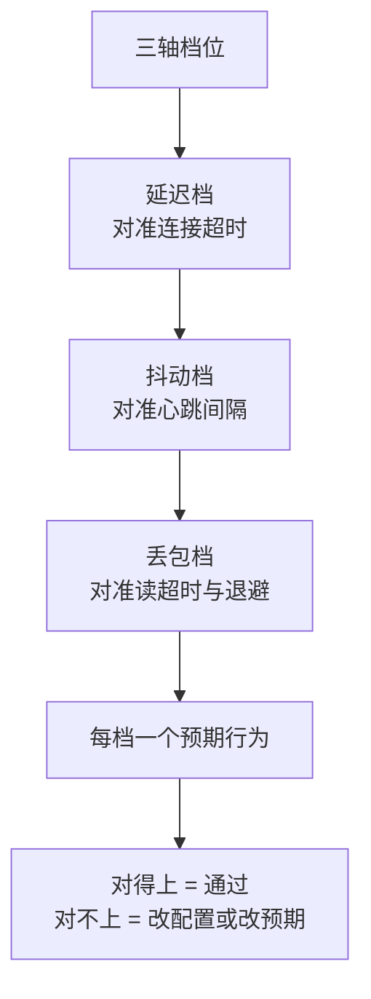
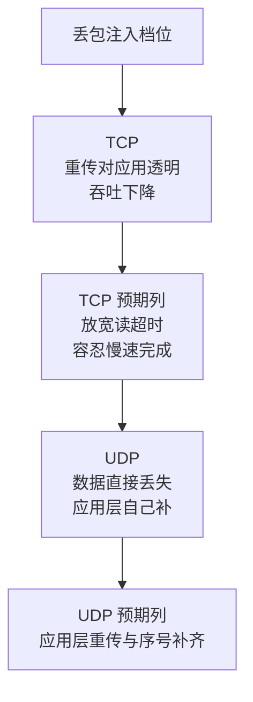
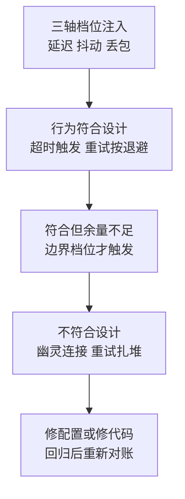

# 弱网测试要把网络当变量：延迟、抖动、丢包三轴注入到超时边界

> **要点**：办公网里测出来的全绿，到了地铁与跨境链路全是事故——弱网测试的核心是把网络从背景变成变量：延迟（RTT 抬高）、抖动（延迟方差）、丢包（上行与下行分开）三轴逐轴注入，每组注入都对准一个具体超时（连接超时、读超时、重试退避），验证系统在"慢"与"坏"下给出确定行为（降级、重试、明确报错），避免永久挂起或雪崩。

## 要解决的问题：环境全绿掩盖的网络假设

应用对网络的行为抱着几个从未验证的假定：RTT 在几十毫秒内、丢包接近零、抖动吞不掉心跳间隔、带宽足够心跳与数据共用。这些假定在办公网恒成立，**测试环境因此测不出任何网络问题**——代码跑通了，可网络这个变量根本没进测试。产线现场的真实形态：移动端在电梯里丢包 30%、跨境链路 RTT 300ms 抖动 ±200ms、机房间瞬时闪断 2 秒。**弱网测试的定义**：把这三个轴的取值范围显式注入测试环境，验证每个注入组合下系统的可观察行为符合设计预期——超时触发、重试按退避走、用户拿到明确反馈。本库"故障注入验证的是处理路径"篇讲过注入验证的通用框架；本篇只讲网络变量的注入方法与超时边界的对账。

## 机制：三轴注入与超时对账

**轴一：延迟（`netem delay`）**。基线 RTT 上加固定延迟（如 `delay 200ms`），验证两个边界：连接超时（dial timeout）大于注入值时连接照常建立（只是慢），小于注入值时按预期失败并反馈；请求级读超时的语义（从发送到收完还是两次读之间）在慢链路下的实际行为。**常见发现**：无超时的调用在 200ms 延迟下不坏、在 5 秒延迟下把线程池占满——延迟注入的第一课就是找出"没有超时的调用点"。

**轴二：抖动与相关性（`delay 100ms 50ms 25%`）**。延迟带方差后，"平均 RTT 达标"不再保证体验：抖动吞掉心跳间隔（抖动毛刺盖过心跳间隔时，对端判定超时断连）、重试风暴（延迟毛刺让一批请求同时超时同时重试）。**注入验证的边界**：心跳间隔要明显长于最大抖动（常见给心跳间隔留出数倍于抖动峰值的余量），该余量在最大抖动下仍安全；重试的退避与抖动（jitter）参数让重试时间错开，验证方法是观察注入期重试请求的时间分布不扎堆。

**轴三：丢包（`loss 5%` 与方向分离）**。丢包分上行与下行注入（`corrupt`/`loss` 加方向规则），两轴验证的失败形态不同：上行丢包（请求到不了）表现为超时与重试；下行丢包（响应回不来）表现为读等待与部分响应。**TCP 与 UDP 的差异**要分开验：TCP 重传对应用透明但吞吐下降（验证应用在慢 TCP 下的超时不要过紧），UDP 丢包直接丢（验证应用层重传与序号补齐）。**注入的组合纪律**：单轴扫过再上组合（延迟 + 丢包），组合注入对准"产线最痛场景"（如移动弱网 = 高抖动 + 上行丢包），全部组合矩阵是浪费，按场景挑 3-5 个组合够用。

**超时边界对账表**：注入的每个档位对应验证的超时配置——连接超时（1s/3s/10s 档）、读超时、心跳间隔、重试次数与退避基数。**对账的判据**：每个档位下系统行为有确定的预期描述（"10s 连接超时在 delay 5s 下正常建连，delay 15s 下超时并反馈"），实际行为与预期描述一致即通过，不一致要么改配置要么改预期——**弱网测试的产出就是这张表**，它让"系统在弱网下的行为"从口头印象变成逐档可查的规格。



三轴各对准一个超时参数：延迟档压连接超时，看慢链路下建连是照常还是按预期失败；抖动档压心跳间隔，看毛刺是否吞掉心跳导致误断连；丢包档压读超时与重试退避，看重试是否按 jitter 错开。每档配一句可判定的预期描述，实测与描述一致才算通过——这张对账表就是弱网测试的产物。

同一档丢包打进 TCP 与 UDP，应用看到的失败形态不同，对账表的预期列要按协议分别写：



图回答的是丢包档位的对账要按协议分列：TCP 的失败被传输层吸收成慢，UDP 的失败直抛给应用，两张预期表不能混用。

## 看完能判断：注入环境的选择

**三个层次的注入环境**：本机 netem（tc 命令对网卡加规则，成本最低，验证单服务的网络处理逻辑）、容器环境注入（在容器 netns 内加 netem，验证服务在编排环境的完整链路）、专门弱网测试机/网关（全流量过网关整形，验证端到端）。**选择的判据**：验证目标在哪个边界内——服务自身的超时与重试逻辑本机注入够；跨服务调用链的弱网行为容器注入；客户端到服务端的端到端体验（App 弱网表现）要网关或真机工具。**注入的可控与可逆**：netem 规则要明确加在哪块网卡的哪个方向（`tc qdisc add dev eth0 root netem ...`），清除命令与加规则命令成对保存——**忘删的 netem 规则**是测试环境"莫名其妙变慢"的经典来源（本库"Linux 调查先收集事实"的同款教训：先看 `tc qdisc show` 再怀疑代码）。

**与故障注入的关系**：弱网注入是故障注入的网络子集，复用同一套纪律——注入有计划（注入哪些轴哪些档）、有预期（每档的行为规格）、有观察（注入期的错误率与延迟曲线）、有恢复（注入撤销后系统回到基线）。恢复验证常被漏：撤销注入后连接池与重试状态要回到正常（重试风暴后的连接池污染、退避后的请求堆积）——**注入结束时的状态清理是弱网测试的收尾动作**。

## 收益与代价

弱网注入的收益是把网络类故障的暴露时间从产线前移到测试环境（事故发现成本降一个量级），代价是环境搭建与档位维护的持续投入（netem 环境半天搭好，档位表按业务流量形态每季度校准）；档位过激的代价是测试资源耗在学術场景，档位过缓的代价是产线形态覆盖不到——投入的平衡点在"档位来自产线观测"，观测数据现成时维护成本极低。

## 边界

三条边界防止防线走形。

**弱网测试不替代带宽测试**：延迟、抖动、丢包之外，带宽（`netem rate`）是第四轴——大文件传输与视频类场景带宽是主变量，API 类服务三轴为主。按业务流量形态挑轴，不追求全轴矩阵。

**注入档位来自产线数据**：档位表（延迟几档、丢包几个点）的依据是产线观测（接入层延迟分布、运营商丢包报告），拍脑袋的极端档（99% 丢包）验证的是学術兴趣，验证不出产线会遇到的形态。

**netem 在高 pps 下有精度限制**：netem 的排队机制在高包率下引入额外延迟与抖动（它自己成了瓶颈），精确测量用专用硬件或分层注入——**注入工具的自身误差要知道**，验证结论只信明显大于工具噪声的差异。

三轴档位往超时边界上一压，系统行为归到三类结果：



图回答的是注入档位与系统行为的对应关系：每一档的观察结果要么进对账表，要么暴露设计缺口，两者都是有效产出。

## 验证

可复现的验证路径：

1. 档位扫描：netem 按对账表逐档注入，每档记录系统行为（建连结果、错误码、恢复时间），与预期列比对，预期全对上；
2. 心跳存活：注入的抖动幅度给到两个心跳周期的量级（超过一整个心跳周期的毛刺，比常规弱网档位更狠），预期连接不断（或按设计主动断并快速重连），对端无幽灵连接残留；
3. 重试不扎堆：注入毛刺延迟，观察重试请求的时间戳分布，预期错开（退避 + jitter 生效）而非同一毫秒齐发；
4. 断言锚点：**超时对账表存在且逐档验证过、注入命令与清除命令成对留存、撤销注入后基线恢复**——三件齐备，弱网从"产线才能暴露的事故"变成测试环境里的常规科目。

```text
注入断言 = 延迟抖动丢包三轴有档位表
对账断言 = 每档行为与超时配置对得上
恢复断言 = 撤销注入后回到基线
```

弱网测试把网络当成变量对待：三轴注入把它从背景搬进测试用例，超时对账表让每个档位下的系统行为有名有姓——产线那些"偶发慢、偶发断"的告警，多数能在测试环境的三轴档位里提前找到名字。

## 相关

- [[工程知识/软件构建：让变化可以理解、验证与交付/测试与交付/混沌工程验证系统是否真的能处理故障.md]] —— 注入验证的通用框架
- [[工程知识/性能工程：从用户等待到资源瓶颈/存储与网络/交付前的网络检查清单：二十项逐条过，三项全绿再上线.md]] —— 上线前检查与弱网档位的衔接
- [[工程知识/后端系统：在并发、失败与变化中维持服务/基础设施/长连接网关的工程要点：心跳推送与连接迁移.md]] —— 心跳与连接保活的机制层
- [[工程知识/软件构建：让变化可以理解、验证与交付/开发工具/Linux调查先收集事实再改变状态.md]] —— 先看现场再动手的纪律
