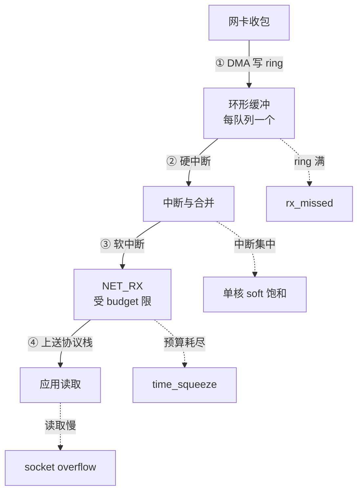

# 网卡丢包先看环形缓冲区溢出：队列、中断与软中断的接力

> **要点**：网卡收包是一条接力链——DMA 写环形缓冲区、硬中断触发软中断、软中断取包上送协议栈，丢包发生在接力赛的每一棒（ring 满了丢、中断没来丢、软中断处理慢丢），`ethtool -S` 的 drop 计数按队列定位丢在第几棒；调优按瓶颈棒次选动作（ring 加深、RSS 分流、软中断亲和与 budget）。

## 要解决的问题：丢包发生在主机的哪一棒

网络丢包的排查常停在"交换机没问题、ping 也不丢"——主机侧的丢包发生在内核收包路径里，不出网卡：**接力链的四棒**：网卡 DMA 收包写 ring buffer（每队列一个环形缓冲）→ 硬中断通知内核（理想是每包一中断，高流量下合并）→ 软中断（NET_RX）批量取包 → 协议栈处理上送应用。**丢包的形态**：ring 满（软中断来不及取，网卡通丢）、中断丢失/合并过度（延迟堆积后集中丢）、软中断 CPU 饱和（单队列打满单核，多核闲着）。**本库网卡与内核旁路篇**讲过中断与轮询的设计取舍；本篇给**丢包的定位与调优**：按队列读计数、按棒次定瓶颈。



四棒是一条递进链，每棒各挂一种丢包计数：ring 满看 `rx_missed`、中断集中看单核 `%soft`、预算耗尽看 `time_squeeze`、应用慢收看 socket overflow。排查动作按链的顺序走，哪一棒的计数在涨就是瓶颈所在——这就是「按棒次读计数定瓶颈」的具体形态。

## 机制：四棒的计数与瓶颈判定

**第一棒：ring buffer 溢出**。`ethtool -S <网卡> | grep -E "rx_dropped|rx_no_buffer|rx_missed"`——`rx_missed`/`rx_no_buffer` 增长即 ring 满实锤（网卡没地方放新包）。**判定细节**：按队列看（`ethtool -S` 输出按 rx_queue_N 分列），单队列涨 = 该队列的软中断跟不上，全队列均匀涨 = 总处理能力不足。**当前 ring 深度**：`ethtool -g`（预设/最大值），加深用 `ethtool -G rx <值>`——**加深是缓冲不是根治**（软中断处理能力不变时只是推迟溢出，且增大内存占用与延迟），配合第三棒的 CPU 调优才闭环。

**第二棒：中断与合并**。`/proc/interrupts | grep <网卡>` 看硬中断的分布与速率——**中断全打在一个 CPU**（IRQ 亲和未配，RSS 未启用）时，该核软中断饱和后其他核无法分担。**中断合并**（`ethtool -c`）的两面性：合并降低中断频率（省 CPU），但增加延迟与突发（攒一批一起软中断）——低延迟场景调低合并、高吞吐场景适度合并，**合并参数的验证看 drop 与延迟的联动**。

**第三棒：软中断的处理能力**。`mpstat -P ALL 1` 的 `%soft` 列——单核 `%soft` 持续 80%+ 且 `rx_dropped` 增长 = 软中断瓶颈。**分流手段**：RSS（Receive Side Scaling，网卡按哈希把流分到多队列，`ethtool -x` 看分流表）、RPS（软件层分流到其他核，队列少的虚拟网卡用）、`irqbalance` 的策略核对（自动均衡有时把关键中断挪走）。**budget 与时间片**：`net.core.netdev_budget` 与 `netdev_budget_usecs` 限制单次软中断的处理量——大量流量时"处理到时间片用尽就停"，下一轮再续，**预算不够的表现**是 `time_squeeze` 计数增长（`/proc/net/softnet_stat` 第二列）。

**第四棒：协议栈与应用**。`netstat -s | grep -i "pruned\|collapsed\|overflow"`（receive buffer 不足的剪裁）、`ss -m` 看 socket 缓冲占用——应用读取慢导致 socket 缓冲满，向上游反压为 buffer 剪裁与丢包。**接力链的判定顺序**：从第一棒往后逐棒排除（ring 计数 → 中断分布 → softnet_stat → socket 缓冲），**计数增长的那一棒就是瓶颈**。

## 看完能判断：按瓶颈棒次的动作表

| 瓶颈棒 | 计数特征 | 动作 |
| --- | --- | --- |
| ring 满 | rx_missed/rx_no_buffer 涨 | `ethtool -G` 加深 + 第三棒联动 |
| 中断集中 | 单核 %soft 饱和 | RSS/多队列 + IRQ 亲和 |
| 软中断弱 | time_squeeze 涨 | budget 加大 + RPS 分流 |
| 应用慢收 | socket overflow/pruned | 应用读取提速 + 缓冲调大 |

**虚拟化环境的修正**：virtio 网卡的队列数默认少（`ethtool -l` 看组合，`ethtool -L` 调整）——虚拟机丢包的第一动作是把队列数调到与 vCPU 数匹配（单队列虚拟机在高流量下的丢包是标配问题）；Overlay 网络（VXLAN）的封解开销让第三棒更重，budget 相应加大。

**监控的承接位置**：drop 计数按网卡按队列进监控（增量速率而非累计值）、softnet_stat 的 squeeze 与 drop 两列、单核 %soft 的饱和告警——**三个监控点覆盖前三棒**，第四棒在应用侧的缓冲指标里。

## 边界

三条边界防止防线走形。

**ring 加深不是独立开关**：加深 ring 的同时核内存（每队列每 descriptor 约 2KB 的预留）与延迟（队列长=排队久）——**加深的量按溢出速率定**（够撑住软中断的突发处理即可，不是越大越好）。

**零拷贝/内核旁路不是丢包的万能解**：DPDK/AF_XDP 绕过内核栈，绕过的是第三四棒的开销，代价是可运维性（本库 RDMA 篇的同类取舍）——**先做完标准调优再考虑旁路**，多数丢包问题在标准路径内可解。

**drop 计数的语义因驱动而异**：`rx_dropped` 在不同驱动里含义不同（有的含 filter 丢弃、有的只计缓冲不足）——**判定时对照驱动文档**，跨机器对比用同一驱动的同名计数。

## 验证

可复现的验证路径：

1. ring 溢出复现：把 ring 调到最小 + 高流量压测，预期 rx_missed 增长、加深后归零——验证第一棒判定；
2. 单核饱和复现：关闭 RSS/多队列压测，预期单核 %soft 飙升与丢包同步，开 RSS 后分散且丢包停止——验证分流动作；
3. squeeze 复现：压低 netdev_budget 压测，预期 time_squeeze 增长、加大后回落——验证第三棒判定；
4. 断言锚点：**drop 计数按队列进监控、softnet_stat 两列在管、队列数与 vCPU 匹配进部署基线**——三件齐备，主机侧丢包从"ping 不丢但业务说丢"的悬案变成四棒接力的一张计数表。

```text
接力断言 = 四棒计数逐棒排查
分流断言 = 队列与核数匹配基线
监控断言 = drop 增速按队列在管
```

主机侧丢包的定位是把接力链显性化：ring、中断、软中断、协议栈四棒各有计数、各有动作——按棒次读计数定瓶颈，调优动作就不散打，"网络偶尔丢包"的最后一站常在主机的第一棒。

## 相关

- [[工程知识/后端系统：在并发、失败与变化中维持服务/基础设施/网卡与内核旁路：中断与轮询的取舍.md]] —— 第一二棒的设计取舍层
- [[工程知识/性能工程：从用户等待到资源瓶颈/存储与网络/连接建立失败先看内核队列：SYN 队列与 accept 队列是两个瓶颈.md]] —— 协议栈入口的队列瓶颈
- [[工程知识/后端系统：在并发、失败与变化中维持服务/基础设施/DNS解析的全链路：递归缓存与失效传播.md]] —— UDP 小包高QPS的同类路径压力
- [[工程知识/性能工程：从用户等待到资源瓶颈/存储与网络/交付前的网络检查清单：二十项逐条过，三项全绿再上线.md]] —— 队列基线进交付清单
