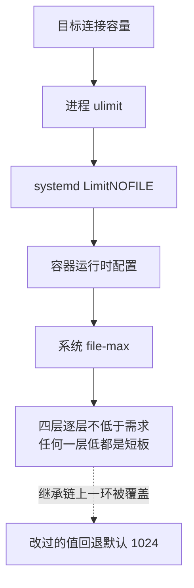
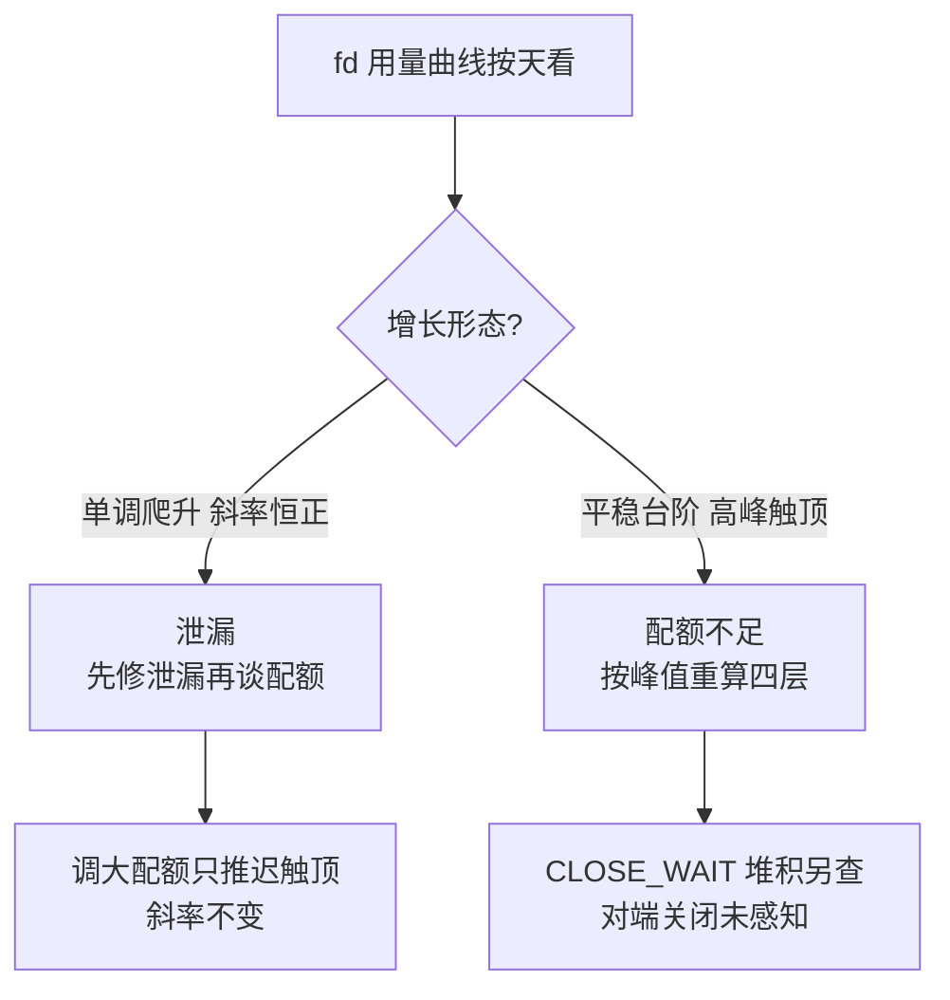

# 连接与文件描述符的配额要联动：ulimit 是连接数的隐形上限

> **要点**：每个连接、监听套接字、打开的文件都占一个文件描述符，进程级 ulimit 与系统级 file-max、fs.nr_open 三层配额中任何一层卡住，服务在"连接数配额远未用完"的错觉下拒绝新连接；容量规划把描述符配额当一等公民与连接数一起算，部署配置把三层配额的核对自动化。

## 要解决的问题

长连接服务（网关、消息推送、数据库代理）的容量规划通常按内存与 CPU 算连接数上限，**文件描述符配额经常被当作"调大一次就完事"的环境参数**——直到某天服务开始拒绝新连接、日志报 "Too many open files"，而连接监控显示数量远低于设计容量。本库基础设施域"长连接网关的工程要点"提过描述符与连接数的关系；本篇把配额体系讲完整：**三层配额各自的语义、联动核算的方法、静默触顶的诊断路径**——描述符是最常见的隐形上限，因为它在四层（进程、用户、系统、容器）各有一份且默认值彼此独立。

## 机制：三层配额与静默触顶

**进程级（ulimit -n / LimitNOFILE）**：单个进程能打开的描述符上限。**它的隐蔽性在继承链**：shell 的 limit 传给 systemd 传给服务进程，任何一环的配置覆盖都会让"改过的值"悄悄回退到默认 1024——上游 BookKeeper 的一个复现改进是日志记录 GC 线程的所有错误（包含因描述符耗尽被吞掉的清理失败），同一原则：**配额触顶的失败经常发生在清理与后台路径，不记日志就完全静默**。

**系统级（file-max / fs.nr_open）**：整个内核的描述符总量上限与单进程可设置的上限。容器化部署时还要算上**容器运行时自己的限制**（Docker 的 default-ulimit、Kubernetes 的 securityContext）——四层里任何一层的值低于目标容量，目标就作废。

**静默触顶的机制**：描述符泄漏（连接未关闭、文件流未释放、第三方库的隐藏句柄）让用量缓慢爬升；**触顶后的失败形态取决于代码路径**——accept 失败（新连接被拒）、connect 失败（出向调用全断）、open 失败（日志文件都打不开，故障最黑的时刻连日志都没有）。**"日志突然消失"本身是描述符耗尽的诊断信号之一**。

## 看完能判断：核算方法与诊断路径

**联动核算四步**：一是算需求——并发连接数 + 每连接的内部描述符（上游连接、日志、本地 socket、epoll 实例）+ 库的隐藏句柄，按峰值乘安全系数；二是核四层——进程 limit、systemd 配置、容器运行时配置、系统 file-max，**四层的值逐层 ≥ 需求，任何一层低于需求都是短板**，配额核到位的收益是触顶从生产事故变成压测场景，代价是每次部署多一道四层核对；三是留增长余量——配额按一年后的容量定，改配额要重启进程，机会成本高；四是建监控——进程的当前描述符用量（/proc/self/fd 计数）与配额的比值进监控，**80% 告警**，触顶后再告警就晚了（失败已经发生）。

**诊断路径**：服务拒绝连接时按顺序核——进程实际 limit（/proc/<pid>/limits，配置文件的值不算数，**运行时实值才是事实**）、当前用量（/proc/<pid>/fd | wc -l）、用量构成（fd 链接目标分类统计：socket 多还是文件多）。**socket 异常多 → 连接泄漏（对端关闭未感知）；文件异常多 → 文件流泄漏**——两类泄漏的修复方向不同。



图回答的是配额的串联结构：连接要建立，四层配额逐层都要放行，任何一层低于目标容量，目标就作废——这是「连接数配额远未用完却拒绝新连接」的成因。虚线是继承链的隐患：shell 传 systemd 传服务进程的任何一环被覆盖，改过的值悄悄回退到默认 1024，所以核对要按运行时实值（/proc/<pid>/limits），配置文件的值不作数。

**泄漏的定位**：lsof 按进程列出 fd，按类型分组看增长源；对 socket 看 TCP 状态分布（CLOSE_WAIT 堆积是经典的"应用没调 close"签名，本库 TCP 状态机篇的异常路径）。**增长曲线按天看**——泄漏是斜率，配额不足是台阶（流量高峰触顶）。两条曲线形态不同，处置方向完全不同：



图回答的是曲线形态与处置的对应：斜率问题靠代码纪律与压测，台阶问题靠容量核算，把台阶当泄漏修或反向，都会在下次高峰复发。

## 边界

三条边界防止防线走形。

**调大配额不修复泄漏**：泄漏型触顶调大配额只是推迟触顶时间，斜率不变——**先修泄漏再谈配额**，配额是容量规划工具，防泄漏靠代码纪律与压测。

**file-max 不是越大越好**：每个描述符在内核有内存开销，总量上限按机器内存定——单机几十万连接的服务把 file-max 配到千万级，内存被描述符结构吃掉，触发的是另一种 OOM。

**连接池的描述符也要算**：应用内每个连接池、每个 HTTP 客户端的连接上限各自独立，总量是各池之和——**池化组件的"每池上限"配置分散在代码各处**，总量核算要遍历配置，漏算一个池就是漏算一类触顶。

## 验证

可复现的验证路径：

1. 触顶复现：把 limit 调到小值压测连接建立，预期 accept 失败、日志报 Too many open files、fd 用量停在配额值——形态与生产事故对得上；
2. 泄漏复现：构造不关闭响应体的 HTTP 调用，预期 fd 曲线按请求量线性爬升、CLOSE_WAIT 堆积，修复后斜率归零；
3. 四层核对验证：故意在容器运行时配低于 systemd 的值，预期部署核查脚本报出短板层；
4. 断言锚点：**fd 用量与配额比值进监控（80% 告警）、部署核查脚本核对四层配置、描述符容量写进容量规划文档**。

```text
触顶断言 = 实值与用量在 /proc 可核
泄漏断言 = 斜率归零为修复判据
监控断言 = 80% 比值告警在管
```

描述符配额从"环境参数"升格为容量规划的一等公民：四层核算、运行时实值核对、用量监控三件齐备，"Too many open files"从事故变成演练过的场景。

## 相关

- [[工程知识/后端系统：在并发、失败与变化中维持服务/基础设施/长连接网关的工程要点：心跳推送与连接迁移]] —— 连接容量的主场景
- [[工程知识/后端系统：在并发、失败与变化中维持服务/基础设施/TCP连接建立与断开的状态机：握手挥手与异常路径]] —— CLOSE_WAIT 等异常状态的机制层
- [[工程知识/后端系统：在并发、失败与变化中维持服务/任务与并发/后台任务的守护链：进程托管与会话脱离是可靠性的底线配置]] —— systemd 与进程托管链上的 limit 继承
- [[工程知识/后端系统：在并发、失败与变化中维持服务/服务设计/连接池参数的联动校验：池大小、超时与队列深度是一组约束]] —— 连接池上限的联动核算
