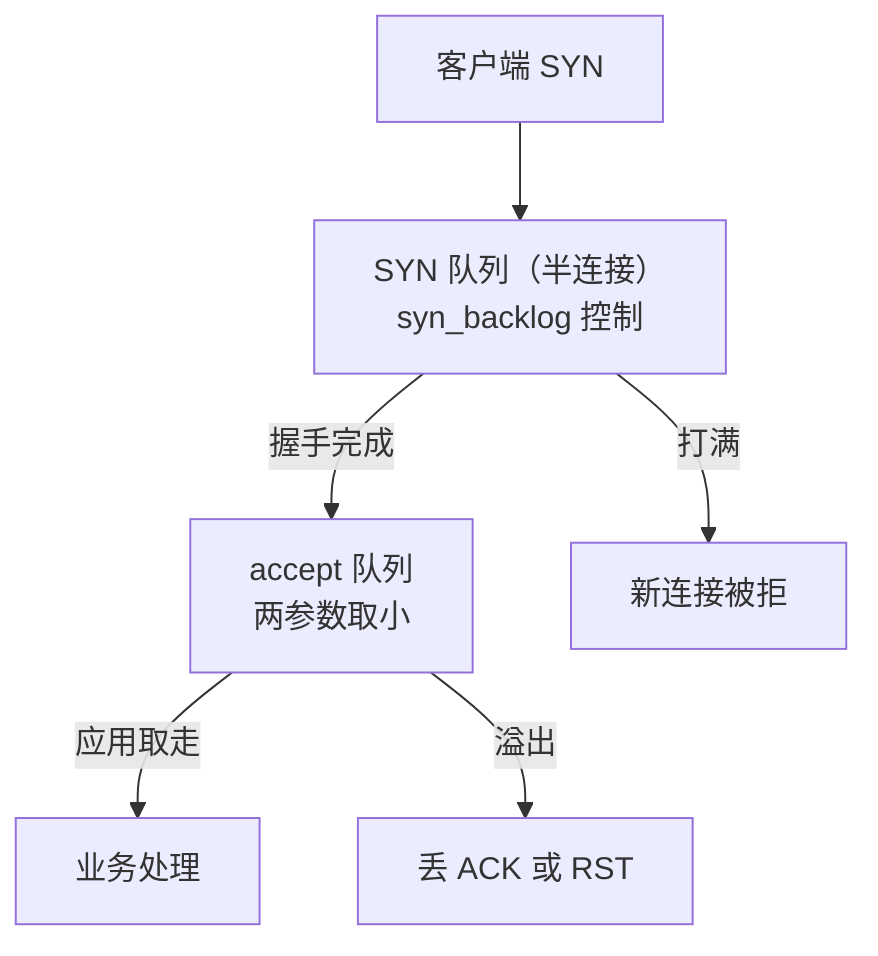
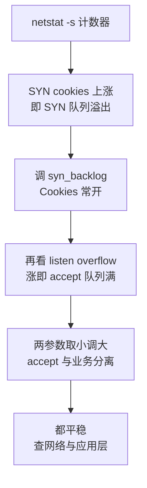

# 连接建立失败先看内核队列：SYN 队列与 accept 队列是两个瓶颈

> **要点**：三次握手的完成与交给应用是两段队列——SYN 队列装半连接、accept 队列等应用 accept，溢出时新连接被丢弃或重置；建连失败按"哪段队列溢出、溢出时内核动作是什么"取证，缓解按"调队列、加快 accept、挡住突发"三路走。

## 要解决的问题

服务偶发"新连接失败"而 CPU、内存都很空闲：建连失败的原因在内核的两段队列里——SYN 队列（半连接，收到 SYN 未完成握手）与 accept 队列（完成握手、等应用 accept），两段任何一个打满，新连接就被丢或被 RST。本库基础设施域"TCP 连接建立与断开的状态机"提过队列溢出触发 RST 的一种情形；本篇把两段队列的机制、取证与缓解展开：**队列长度怎么算、溢出时内核做什么、监控盯哪两个计数器**——这类故障的迷惑性在"资源都空闲"，瓶颈在内核队列这个不进常规监控的维度。

## 机制：两段队列的分工与溢出行为

**SYN 队列（半连接队列）**：服务端收到 SYN 后把连接放进 SYN 队列，回 SYN+ACK 等第三次 ACK——**队列长度按 `tcp_max_syn_backlog` 控制**。SYN Flood 攻击打的就是这段队列：大量伪造 SYN 占住位置、永远不来 ACK，队列被塞满后真实用户的新连接也被拒。内核的防护是 SYN Cookies：队列满后不占队列、把连接状态编码进 SYN+ACK 的序列号里，第三次 ACK 到达时再重建连接——**Cookies 开启后半连接不再被占位消耗，但部分 TCP 选项协商丢失**（存储空间被序列号挤掉）。

**accept 队列（全连接队列）**：完成三次握手的连接从 SYN 队列转入 accept 队列，等应用调用 accept 取走——**长度按 listen 的 backlog 参数与 `somaxconn` 的较小值**。溢出行为由 `tcp_abort_on_overflow` 决定：为 0（默认）时丢弃第三次 ACK、连接停留在半开状态等客户端重传（表现为"连接建立成功但第一笔请求超时"），为 1 时直接发 RST（表现为"连接立刻被重置"）。**两种表现都是 accept 队列溢出**，默认行为更隐蔽——连接看似成功，数据传输才开始失败。

**两段队列的关系**：accept 队列满时新完成握手的连接进不去——**SYN 队列调大解决不了 accept 慢**，两段的瓶颈要分开诊断。应用 accept 速度慢的原因常见三类：事件循环被慢请求占住、线程池饱和、accept 与业务处理在同一循环（处理一笔时新连接全在排队）。

连接从网卡到应用要过两道闸，溢出发生在哪一道，故障形态完全不同：



上图给出两道闸的先后与各自的溢出后果：SYN 队列装未完成握手的连接，accept 队列装已完成握手等应用取走的连接，打满时前者拒掉新连接、后者把失败推迟到首笔数据传输。

## 看完能判断：取证与缓解

**取证盯两个计数器**：`netstat -s` 的 **SYN cookies sent**（SYN 队列溢出后 Cookies 被触发的次数）与 **listen queue overflow / times the listen queue of a socket overflowed**（accept 队列溢出次数）；配合 `ss -lnt` 的 **Recv-Q/Send-Q**（监听套接字上 Recv-Q 是当前 accept 队列深度，接近 Send-Q 上限即临溢出）。**监控把这两个计数器做成速率曲线**——溢出偶发时按天看累计值，突发时按秒看速率，两者都要有告警。

**缓解按瓶颈分段**：SYN 队列瓶颈（溢出 + Cookies 频繁）——确认 `tcp_max_syn_backlog` 合理（通常 1024+）、确认 SYN Cookies 常开（防护与容量兼得）；accept 队列瓶颈——调大 backlog 与 `somaxconn`（二者取小才生效，**只改应用不改 sysctl 是常见的无效操作**）+ 加快 accept（accept 与业务处理分离、事件循环职责分离）+ 挡突发（接入层限连、按来源分摊）。上游 BookKeeper 的一个同类改进是把 Netty 与 ZooKeeper 客户端升到新版本（减少连接层的行为差异），同一原则：**连接层的组件版本也是队列行为的变量**，取证时把组件版本一并记录。



**压测验证**：用连接型压测工具把并发建连速率拉过队列上限，预期 `netstat -s` 的溢出计数按注入速率增长、默认行为下首包超时、`tcp_abort_on_overflow=1` 下连接被 RST——**压测报告里标注队列参数**，参数不同的两次压测结果不可比。

## 边界

三条边界防止防线走形。

**调大队列不解决 accept 慢**：accept 速率跟不上建连速率时，队列只是推迟溢出——**先分离 accept 与业务处理，再谈队列长度**，队列是缓冲是调节量。

**容器环境的 sysctl 要按 namespace 核**：网络命名空间隔离部分参数，容器内修改宿主机参数不生效（或反向）——**在容器内核 `ss` 与 `sysctl` 的实际值**，宿主机配置不自动等于容器生效。

**长连接服务与短连接服务的队列语义不同**：长连接服务建连频率低、accept 慢一点无碍；短连接高频建连（每次请求新建连接）时 accept 是每请求路径的一部分——**按连接复用率定队列压力**，高频短连服务优先做连接池化。

## 验证

可复现的验证路径：

1. 溢出复现：小 backlog + 高并发建连压测，预期溢出计数增长、默认行为下"连接成功首包超时"、改 RST 模式后"连接立即失败"——两种形态与生产故障对得上；
2. 参数验证：调大 `somaxconn` 与 backlog 后重压，预期同速率下溢出归零、首包超时消失；
3. 监控验证：`ss -lnt` 的 Recv-Q 在压测中爬到接近 Send-Q，预期监控告警在溢出前触发；
4. 断言锚点：**两个溢出计数器的速率监控在管、sysctl 与 backlog 的生效值有配置记录、压测脚本标注队列参数**——三件齐备，"资源空闲却建连失败"从悬案变成按计数器定位的工程问题。

```text
计数断言 = 溢出计数器有速率监控
参数断言 = backlog 与 somaxconn 取小生效
压测断言 = 队列参数进压测报告
```

建连失败的三层视角（应用 accept、内核队列、网络路径）里，内核队列最常被漏看——两个计数器加上两段队列的分工机制，是这一维度的全部取证起点。

## 相关

- [[工程知识/后端系统：在并发、失败与变化中维持服务/基础设施/TCP连接建立与断开的状态机：握手挥手与异常路径]] —— 状态机全景，本篇深挖队列维度
- [[工程知识/性能工程：从用户等待到资源瓶颈/存储与网络/TIME_WAIT是连接收尾的代价与设计]] —— 连接收尾侧的状态堆积
- [[工程知识/性能工程：从用户等待到资源瓶颈/观测与诊断/tcpdump与抓包定位网络问题的现场方法.md]] —— 队列溢出的报文级取证
- [[工程知识/后端系统：在并发、失败与变化中维持服务/服务设计/连接池参数的联动校验：池大小、超时与队列深度是一组约束]] —— 客户端侧的连接约束
