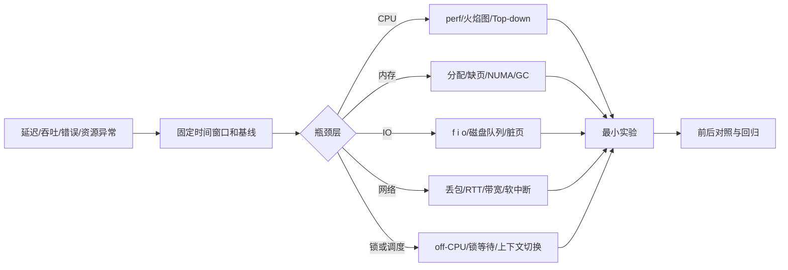

# 性能工程：从用户等待到资源瓶颈

性能不是“把某个参数调大”，而是用模型、测量和实验回答：系统的瓶颈在哪里，优化后代价转移到了哪里，是否值得上线。

## 从现象到根因



## 系统层次

| 能力 | 主问题 | 现有页面 |
| --- | --- | --- |
| 性能建模 | 延迟、吞吐、并发、容量如何互相约束？ | [[工程知识/性能工程：从用户等待到资源瓶颈/观测与诊断/性能问题定位]] |
| CPU、内存与运行时 | 指令、分支、缓存、调度、NUMA、分配和 GC 谁在消耗时间？ | [[工程知识/性能工程：从用户等待到资源瓶颈/处理器与内存/CPU性能来自有效执行与数据供给]]、[[工程知识/性能工程：从用户等待到资源瓶颈/操作系统与运行时/垃圾回收与内存分配决定延迟尾部]]、[[工程知识/性能工程：从用户等待到资源瓶颈/观测与诊断/性能剖析与火焰图]] |
| GPU | kernel、显存带宽、并行度、同步与通信谁在限制工作完成？ | [[工程知识/性能工程：从用户等待到资源瓶颈/处理器与内存/GPU性能取决于计算、访存、并行与通信]] |
| IO/存储 | 随机/顺序、队列深度、刷盘和带宽如何影响尾延迟？ | [[工程知识/性能工程：从用户等待到资源瓶颈/存储与网络/存储IO性能取决于访问模式、队列与持久化语义]]、[[工程知识/性能工程：从用户等待到资源瓶颈/观测与诊断/性能剖析与火焰图]] |
| 网络 | RTT、拥塞、连接、软中断和协议栈如何影响请求？ | [[工程知识/性能工程：从用户等待到资源瓶颈/存储与网络/端到端网络延迟来自排队、协议、传输与处理]] |
| 观测/剖析 | 如何从指标下钻到线程、系统调用和函数？ | [[工程知识/性能工程：从用户等待到资源瓶颈/观测与诊断/系统指标与观测]]、[[工程知识/性能工程：从用户等待到资源瓶颈/观测与诊断/指标、日志、Trace与剖析各答一问，合起来才构成证据]]、[[工程知识/性能工程：从用户等待到资源瓶颈/观测与诊断/性能剖析与火焰图]] |

底层基础与实验方法：[[工程知识/性能工程：从用户等待到资源瓶颈/操作系统与运行时/进程线程与系统调用构成执行边界]]、[[工程知识/性能工程：从用户等待到资源瓶颈/操作系统与运行时/虚拟内存与文件系统把地址和持久化分层]]、[[工程知识/性能工程：从用户等待到资源瓶颈/处理器与内存/CPU缓存与分支决定有效执行时间]]、[[工程知识/性能工程：从用户等待到资源瓶颈/存储与网络/Socket与TCP把连接可靠性分成多层]]、[[工程知识/性能工程：从用户等待到资源瓶颈/观测与诊断/基准测试必须先定义负载和测量误差]]。

## 延迟、吞吐和并发的关系

Little's Law 在稳定系统中给出平均关系：系统内请求数 L = 到达率 lambda × 平均停留时间 W。它不是容量保证，却能解释为什么延迟上升会迅速堆积并发状态。系统接近饱和后，新增并发主要进入队列，吞吐不再线性增长，尾延迟和超时开始放大。

性能工程因此先问用户等待发生在哪里，再问哪个资源造成等待。CPU 使用率、GPU 利用率、IOPS 和带宽都是中间证据，不是目标。

## 证据优先级

1. 用户可感知的 SLO、请求 trace 和错误率。
2. 资源指标与队列/锁/GC 等运行时证据。
3. Profile、系统调用、内核事件和硬件计数器。
4. 基准测试和合成数据。它们用于验证假设，不能替代真实负载。

## 容量规划先找瓶颈

扩容前先问每种资源的 USE：利用率、饱和度、错误。应用实例从 4 台扩到 16 台，而数据库连接池和 CPU 已经饱和时，新增实例只会制造更多排队和连接，QPS 不会线性增长。

容量实验要逐步增加负载，找到吞吐不再增长、p95/p99 和错误率开始陡升的拐点。每个台阶都同时记录请求类型、并发、队列、连接池、CPU、内存、I/O 和下游限制。Little's Law `L = lambda * W` 用于解释稳定系统中并发量、到达率和停留时间的关系，但不能替代峰值、突发和故障测试。

容量结论必须对应到具体组件和安全余量：入口能接多少、队列能等多久、数据库能维持多少并发、降级后保留哪些请求。目标不是把资源压到 100%，而是在依赖变慢、实例损失或流量突增时仍有恢复空间。

## 调优闭环

```text
定义目标和不可退让约束
 -> 建立基线和可重复负载
 -> 只改一个变量
 -> 记录吞吐、p50/p95/p99、资源和错误
 -> 判断收益是否转移瓶颈
 -> 回归、灰度、设置回滚阈值
```

不要把“CPU 使用率下降”“火焰图变窄”直接当作成功；最终目标是业务 SLO、容量和成本改善。

验证的锚点：性能结论要与负载对账——每个优化结论限定在测它的负载形态（并发、数据量、热读比例）内成立，负载变了预期要重写，实测与预期对不上的结论不进容量规划。

性能工程的机制与本质：性能问题是一次请求把时间花在哪的分配问题——排队、计算、传输、等待各占一份，资源是分配的约束；
本质方法是测量先于猜测：分层计时把等待归属到具体层，资源画像把饱和点定位到具体设备，优化就是把最贵的那份时间换掉。


## 验证

最小验证：对一个已定位的瓶颈做一次单变量改动，固定负载与测量方法，断言业务侧的 SLO 指标改善，且没有把成本、错误率或尾延迟转移到另一层。改动前后各测多轮，报告中位数与分位数。

转移检查：改动生效后复查原本正常的层级，断言该层的资源占用与延迟没有超出预先设定的范围。

## 要解决的问题

性能问题出现时，团队凭直觉调参数、加机器或换组件，改动之后无法说明瓶颈是否真的移动、改善是否值得上线。本篇回答：性能问题怎样用模型与测量与实验构成闭环、目标从业务侧怎样反推、优化之后代价转移到哪里去查，以及什么条件下应当停止优化。

