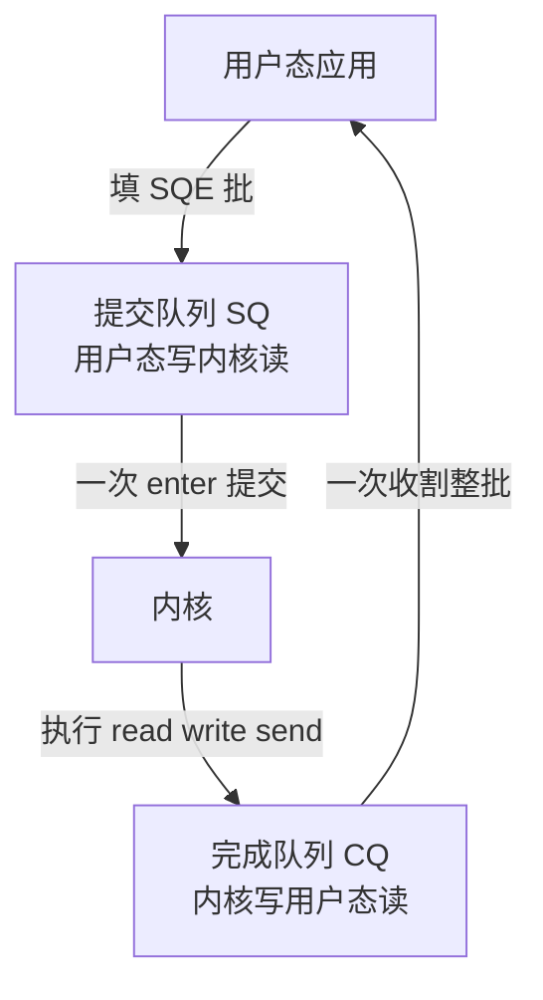

## 要解决的问题

一次 read() 或 write() 要 CPU 从用户态切到内核态再切回来，单次开销约 50-100ns，还要付模式切换的缓存污染。select/poll/epoll 解决了"多 fd 同时等"的复用问题，但每次就绪后仍要逐个调用 read/write，高连接高频率场景 syscall 开销积少成多。问题的本质：**同步阻塞模型把"提交请求"与"等待完成"绑定在一次切换里，epoll 把等待复用了，提交与收割仍是每操作两次穿越**——异步 IO 的目标就是把这两个动作也批量化，让一次切换提交一批、收割一批。

## 机制

**演进三阶段：复用等待 → 提交/收割分离 → 全异步**。select（1983，fd_set 1024 上限）→ poll（无上限但每次全量拷贝）→ epoll（2002，内核维护就绪表，返回只带就绪 fd）解决了等待复用。但 epoll + read 模型里，每次 IO 仍是"epoll_wait 一次 + 每就绪 fd 一次 read"，提交开销没省。Linux AIO（libaio，2002 时代）尝试真异步但接口残废（只支持 O_DIRECT，语义坑多），工业界用不成。io_uring（2019，Jens Axboe）成建制解决：**提交队列（SQ）与完成队列（CQ）两个环形缓冲，用户态写 SQ、内核消费，内核写 CQ、用户态收割，两边各自批量，syscall 次数从 N 次降到接近每轮一次**。

**SQ/CQ 环的本质：共享内存 + 内存序**。SQ 与 CQ 是用户态与内核共享的映射内存（mmap），生产者消费者各写各的尾指针。批量收割时 `io_uring_enter(IORING_ENTER_GETEVENTS)` 一次进出收全部就绪；SQ_POLL 模式甚至让内核线程轮询 SQ，用户态连 enter 都不用调（代价是内核线程常驻烧核，适合超高吞吐低延迟场景）。**这个设计把 syscall 的边界从"每个操作"推到"每批操作"，开销摊薄到接近零**。

**链式请求（linked SQE）与操作谱**。SQE 可链（IOSQE_IO_LINK）：send 后自动 recv、读后自动写，内核内完成依赖编排，免中间唤醒。操作谱从 read/write 扩到 openat/stat/splice/sendmsg/timeout/取消，把"文件操作 + 网络操作 + 定时"统一进一个异步模型，这是与 epoll 模型的本质差异——epoll 只管 socket 等待，io_uring 管整个 IO 生命周期。

**供给决定收益**。syscall 开销占比高的场景（小包高频、百万 IOPS 的 NVMe、海量连接的 echo/proxy 类）收益最大；单次大块传输（大文件顺序读写）syscall 占比本就低，收益有限。syscall 次数与 CPU 上下文切换（context-switches）是收益的直接观测面。

## 背景与代价

思想背景：异步 IO 的概念早于 Linux（Windows IOCP 1990s 就是完成端口模型、FreeBSD kqueue 2000 年前后），Linux 社区长期缺一等公民方案。Jens Axboe（块层维护者）2019 年的 io_uring 从块层 IO 加速需求出发，一年内覆盖全 IO 子系统，成为 Linux 近十年最大的 syscall 级革新。Google 的 FlexSC（2010 前后，系统调用批量化研究）与 SPDK（用户态轮询存储路径）是同一方向的两个先行坐标。

最精巧的一笔是**把 syscall 从"操作粒度"改写成"批次粒度"**：传统模型里 API 边界与操作边界重合（一次 read 一次切换），io_uring 用共享内存环把两者解耦，API 边界退到批次尾（一次 enter 提交收割一整批）。syscall 开销从每操作 50-100ns 摊薄到每批几 ns，这跟 SIMD 把指令从标量改批量是同构的批发思路。

图的骨架是两个环四条边：提交侧用户态填 SQE、一次 enter 整批下推，收割侧内核写 CQE、一次调用整批上收。syscall 的边界从「每个操作各穿一次」移到「每批各穿一次」，这就是摊薄的来源；SQ_POLL 模式连提交那一次也省掉，代价是内核线程常驻烧核。

代价要摆明：**io_uring 的安全与稳定性争议**——共享内存环 + 内核消费的攻击面大（任意地址读写类 CVE 逐年出现，Google Project Zero 曾建议禁用，容器/沙箱环境默认 seccomp 封锁 io_uring syscall，Docker 2023 起默认 mask）；内存开销（SQ/CQ 环常驻，每连接多出环形缓冲）；编程模型复杂（错误处理异步化、调试时调用栈变深，io_uring 上的 bug 释放时机在收割端）。**适用判定与零拷贝同款逻辑：syscall/切换开销占比可观才有账可算**，多数业务服务（几十 QPS 到几千 QPS、大包为主）epoll + 同步读写的开销占比 <1%，迁移收益不抵复杂度。

## 边界

- **吞吐与延迟的目标场景分离**。吞吐场景（代理、CDN 边缘、NVMe 存储）batch 提交摊薄 syscall，收益明确；延迟敏感场景要小心 SQ_POLL 的常驻核与批内最长等待（batching 天然攒延迟，IOPOLL 模式还要独占）。延迟 P99 敏感的服务先测再上。
- **安全策略与沙箱封锁**。seccomp/AppArmor 与主流容器运行时对 io_uring 默认封锁（攻击面考量），沙箱化部署（gVisor、部分 serverless）不可用。上生产前确认运行环境是否放行。
- **不是 epoll 的全面替代**。跨平台代码（BSD/macOS 用 kqueue）与存量 epoll 生态（nginx 的 reuseport、Redis 的事件循环）迁移成本高，io_uring 的红利集中在 Linux-only 的新高性能组件（RocksDB 新版、QEMU、新型 proxy）。混合方案：libuv 通过 `UV_USE_IO_URING` 渐进启用。
- **版本与特性门控**。5.1 引入、5.10 后操作谱才齐（openat/stat/timeout），5.15+ 提供 buf ring 等新特性；目标内核版本决定可用面，写代码前按 `io_uring_register` 的特性探测分支。

## 验证

- **syscall 计数实验**：同一 echo 服务（epoll+read/write 版 vs liburing 批量版），同连接压测，`perf stat -e context-switches,syscalls:sys_enter_read` 对比。预期：io_uring 版 syscall 计数塌降一两个量级，同吞吐 CPU 占用下降。批量化收益的可复现证据。
- **批大小扫描实验**：SQE 批大小从 1 扫到 256，测每操作均摊开销与延迟。预期：批越大均摊越低，延迟中位数缓升（攒批代价），交叉点给出该负载的最优批大小。批量化权衡曲线的实测。
- **安全封锁验证**：Docker 默认配置下跑 liburing 程序。预期：seccomp 拒绝 io_uring_enter（Operation not permitted），显式放行（security-opt seccomp=unconfined 或自定义 profile）后可用。部署环境约束的一手确认。

## 相关

- [[工程知识/性能工程：从用户等待到资源瓶颈/操作系统与运行时/进程线程与系统调用构成执行边界.md]] —— syscall 是执行边界上的税，io_uring 把税从操作粒度摊到批次粒度
- [[工程知识/性能工程：从用户等待到资源瓶颈/操作系统与运行时/零拷贝把数据通路的CPU让给业务.md]] —— 消拷贝与消切换是数据通路降本的两条轴，两篇互补
- [[工程知识/性能工程：从用户等待到资源瓶颈/存储与网络/Socket与TCP把连接可靠性分成多层.md]] —— socket 缓冲区与多路复用是 epoll 模型的底盘，io_uring 是它的批量化后继
