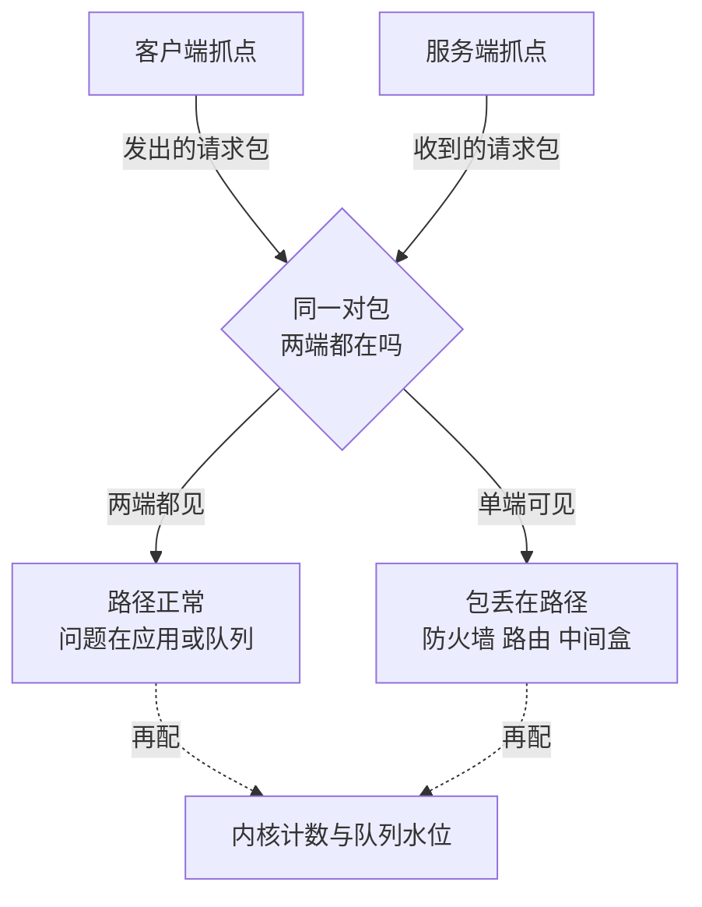

# tcpdump与抓包定位网络问题的现场方法

"网络不通"是最含混的报障。要解决的问题：网络层的"怎么看见、怎么定位"是知识库当前真空格，本篇给出从报障到根因的抓包诊断现场方法，把"感觉网络有问题"变成"第几个包、哪一层、什么证据"。

## 机制：按层下钻的诊断路线表

抓包诊断本质是按 TCP/IP 分层逐层验证"这一层收到的包是否正常"，异常在哪一层出现，问题就在哪一层或其下层。

| 症状 | 先抓什么 | 看什么证据 | 常见根因 |
| --- | --- | --- | --- |
| 连不上 | 三次握手包 | SYN 无 SYN-ACK：对端或路径问题 | 防火墙、服务未监听 |
| 连上但慢 | 双向包流 + 时间戳 | 重传率、RTT 抖动 | 丢包、拥塞、bufferbloat |
| 连接重置 | RST 包上下文 | 谁发的 RST、第几秒 | 超时、中间盒、应用主动断 |
| 数据错乱 | 序列号与校验 | 校验错、序号跳 | 网卡/驱动 checksum offload bug |

方法要点：先定边界（客户端抓、服务端抓、还是两边对抓——单边只能证明这一侧的收发），再定切片（BPF 过滤器越早下越好，高流量下全抓必丢），后看时间线（把包按时间轴展开，重传/RST 的相对时间揭示因果）。收益是把不可见的网络行为变成可指认的证据；代价是抓包本身有开销（高流量下 cpu 与丢包风险），生产环境用更窄的过滤器与环形缓冲。



图回答的是抓点的选择逻辑：单边抓包只能证明这一侧的收发，「客户端发出了」与「服务端收到了」是两个独立命题——同一对包两端都在，路径洗清，问题转向应用与内核队列；只有一端见到，包丢在路径上，按防火墙、路由、中间盒逐个排查。两类结论都要配上内核计数（`netstat -s`、`ss -lnti`）才能从「包层的证据」走到「队列层的成因」。

## 案例回流与边界：抓包现场的实录

案例回流（通用形态）："偶发接口超时"抓包五分钟拿到证据链——过滤目标端口，看到三次握手正常、请求发出后 40 秒才收到 SYN+ACK 重传前的 RST；对照内核计数（`netstat -s` 的 overflow）定位为 accept 队列溢出，应用层零日志、网络层证据完整——抓包的价值就是把"应用看不到的层"的证据拿到手。过滤条件的实录教训：抓包先带 `port` 与 `host` 过滤再写入磁盘（生产机全量抓包一分钟就能写满磁盘，反而把现场冲掉），加 `-s 96` 截断载荷（定位网络层问题不需要业务数据，还顺带满足数据安全）。边界：抓包看得到包的时序与控制位，看不到内核队列水位与缓冲区计数（要配 `ss -lnti` 与 `netstat -s`），也看不到加密内容（TLS 流量只能看握手与时序，语义层要靠应用日志对时——两边的证据按时间戳并排核对）。工具链的分工见 [[工程知识/性能工程：从用户等待到资源瓶颈/存储与网络/网卡丢包先看环形缓冲区溢出：队列、中断与软中断的接力.md]]（内核计数器层）与本篇（线上的包层），两层证据交叉验证才是完整现场。


*图源：Wikimedia Commons「Fedoratcpdump」，作者 Lars martin4，许可 CC BY-SA 4.0。*

## 验证

```bash
# 三次握手是否完整
tcpdump -i eth0 -n 'tcp[tcpflags] & (tcp-syn|tcp-fin) != 0' and host 10.0.0.5
# 重传率统计（看拥塞窗口行为）
tcpdump -i eth0 'tcp[13] & 0x04 != 0' -w /tmp/ret.pcap
# wireshark 的 expert information 面板做重传/乱序聚合
tshark -r /tmp/ret.pcap -q -z io,stat,1
```
预期：健康连接的重传率低于 1%，握手在一两个 RTT 内完成。数字对不上时先确认过滤器没把证据滤掉（把过滤器放宽到 host 级重抓一次）。tcpdump 手册的 BPF 表达式与 Wireshark 的 display filter 是两套语法，混用是新手常错。

## 边界

本篇讲网络层的现场抓包方法。单机侧的性能观测（火焰图、系统调用）见 [[工程知识/性能工程：从用户等待到资源瓶颈/观测与诊断/性能剖析与火焰图|性能剖析与火焰图]]。慢在哪一跳的定量方法（traceroute 变体）与 DNS 层诊断见 [[工程知识/性能工程：从用户等待到资源瓶颈/存储与网络/DNS解析是延迟与故障的隐形入口|DNS解析是延迟与故障的隐形入口]]。抓到包之后的 TCP 行为解读（重传机制、拥塞控制语义）见 [[工程知识/性能工程：从用户等待到资源瓶颈/存储与网络/拥塞控制在吞吐与公平之间动态调节|拥塞控制在吞吐与公平之间动态调节]]。应用层协议在包里的样子（HTTP/TLS）见 [[工程知识/性能工程：从用户等待到资源瓶颈/存储与网络/TLS握手与证书链决定连接建立成本|TLS握手与证书链决定连接建立成本]] 的握手包结构段。

## 相关

- [[工程知识/性能工程：从用户等待到资源瓶颈/存储与网络/拥塞控制在吞吐与公平之间动态调节]]——抓到重传后的语义解读
- [[工程知识/性能工程：从用户等待到资源瓶颈/观测与诊断/性能剖析与火焰图]]——单机侧对照方法
- [[工程知识/性能工程：从用户等待到资源瓶颈/观测与诊断/连通性诊断的分层顺序：从链路到应用逐层收窄，不跳层]]——抓包在四环收窄链中的位置与双端取证纪律
