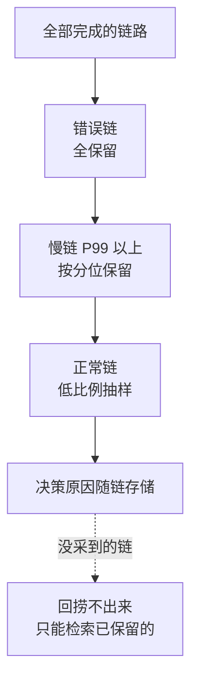

# 分布式追踪的采样与补齐：低频异常要靠尾部采样与标签回捞

> **要点**：头部采样均匀丢掉低频异常的关键证据，尾部采样按结果保留慢与错、对账读放大与错误恢复补全残链——采样策略按"异常的稀有程度 × 证据价值"设计，追不上链时按时间与上下游边界补齐。

## 要解决的问题

分布式追踪的默认策略是头部采样：请求进入时按固定概率决定是否记录。这个策略在"平均"意义上公平，在"异常"意义上失明——**千分之一概率的缺陷请求，头部采样保留它的概率同样只有千分之一**，恰好采到时证据残缺（链路后半段在其他服务里被独立丢弃），追查时只剩"用户说有这个问题，系统里没有记录"。本库可观测性域"指标、日志、Trace与剖析各答一问"确立了证据分工；本篇解决追踪证据的完整性问题：**采样策略决定哪些证据留得下来，补齐手段决定残链能拼回多少**——低频异常的追查能力，在采样配置时就已注定。

## 机制：尾部采样与读放大的补偿

**尾部采样的原理**：请求完成后再决定是否保留——决策点从入口移到出口，规则按结果制定：慢请求（P99 以上延迟）保留、错误请求全保留、正常请求按低比例抽样。**尾部采样的实现代价是缓冲与延迟**：每个请求的完成要等链路收齐（或超时），采集端要持有全量 span 等待决策——缓冲窗口按"链路最大耗时 + 余量"定，超窗口的链路按已有 span 决策。


*图源：OpenTelemetry 官方文档「Concepts / Sampling」页面的 Tail Sampling Processor 示意图，地址 https://opentelemetry.io/docs/concepts/sampling/tail-sampling-process.svg 。*

**读放大的补偿规则**：一次用户读可能在存储层放大成上百次内部读（缓存未命中、副本读、rebalance 读），头部采样按入口概率均匀抽，抽中的链要么全是正常读（无信息量），要么把放大路径抽得支离破碎。**采样规则要给放大路径显式配额**：上游 BookKeeper 的一个复现改进是 reorderReadSequence 的读放大路径对追踪可见——读放大的决策（为什么这次读去了这些节点）是容量与副本问题的核心证据，这类链路按"决策事件"而不是"请求量"采样，决策链的保留优先级高于普通读。

**错误恢复的链路补全**：重试、故障转移、副本切换产生的链路，一次用户操作对应多段内部尝试——尾部采样按"最终结果"保留时，要把失败的尝试段一并保留（它们是异常的证据主体），只留成功段的"错误恢复链"是残次品。**保留规则按"链路含错误段"判定，成功收尾不豁免**。

## 看完能判断：采样配置与补齐手段

**配置的三层结构**：一层错误全保留（错误链是最高价值证据，成本可控）；二层慢链按分位保留（P99 以上的延迟证据）；三层正常链低比例抽（维持基线画像）。**每层的比例按证据价值与存储预算定**，全量保留正常链是预算黑洞，全不保留则容量规划失去依据。



图回答的是证据预算的分配顺序：错误链价值最高全保，慢链按分位保，正常链抽样维持基线，每层按证据价值与存储预算定比例。虚线是回捞的边界——采样时没留下的证据，回捞扩大的只是检索面，找不回证据本身。

**回捞（标签检索）的边界**：尾部采样外的回捞手段是"按标签重新过滤已保留的链"——它扩大的只是检索面，**采样时没留下的证据，回捞不出来**。把回捞当采样替代品的期望无法兑现：低频异常的证据必须在采样决策时保留，回捞只是把已保留的证据按维度（用户、租户、错误码）找出来。

**残链的补齐顺序**：链路追不上（上下文丢失、跨队列断链）时按三个方向补：**时间对齐**（按时间戳窗口找同时段的相关服务记录）、**边界锚点**（队列与网关的入出记录补上断点两侧）、**关联标识**（业务单号、消息 ID 作为跨系统的次级关联键）。**补齐后的链要标注证据等级**（完整链 / 时间对齐推断 / 单侧记录），把推断当实证是误诊的来源。

## 边界

三条边界防止防线走形。

**尾部采样的缓冲是内存热点**：高流量系统的决策缓冲要限量与降级（缓冲满时按头部采样兜底），否则采样系统自己成为过载源——**观测系统的自保设计**与本库性能域"指标采集的基数控制"同源。

**采样决策要留审计**：为什么这条链被保留（错误？慢？抽样命中？）——决策原因随链存储，追查时"这是全量错误链还是抽样命中"直接影响证据权重。

**跨系统采样率不对齐**：各服务独立配置采样时，同一条链的保留概率是各段概率之积——**入口服务决定保留，下游跟随入口的采样标记**（trace flags 传递），下游再自作主张采样就把入口的决定打碎。

## 验证

可复现的验证路径：

1. 低频异常保留验证：构造 0.1% 的错误注入，预期错误链 100% 被尾部采样保留（头部采样对照组大部分丢失）；
2. 放大路径验证：构造缓存未命中风暴，预期放大决策链按配额保留、可检索；
3. 残链补齐验证：故意截断某服务的追踪上报，按时间对齐与队列边界补链，预期补齐结果标注了证据等级；
4. 断言锚点：**三层采样配置在管、错误链保留率 100%、采样决策原因随链存储**——三者齐备，低频异常从"没记录"变成"按标签可回捞"。

```text
保留断言 = 错误注入链 100% 在库
决策断言 = 决策原因字段随链可查
补齐断言 = 残链可按时间与边界补齐并标注等级
```

采样策略的本质是证据预算的分配：异常按价值全保、基线按比例抽、回捞负责检索面——分配对了，追踪才配得上"分布式系统最细粒度证据"的名分。

## 相关

- [[工程知识/性能工程：从用户等待到资源瓶颈/观测与诊断/指标、日志、Trace与剖析各答一问，合起来才构成证据]] —— 证据体系的分工，本篇解决 Trace 证据的完整性
- [[工程知识/性能工程：从用户等待到资源瓶颈/观测与诊断/拨测与合成监控：在用户之前从外面敲一遍门]] —— 主动证据与被动证据的互补
- [[工程知识/后端系统：在并发、失败与变化中维持服务/分布式可靠性/超时的层次设计：连接、读写与整链路的预算分配]] —— 慢链判定与超时预算的联动
- [[工程知识/缺陷分析：从个案到体系/并发/并发缺陷的复现策略：压力放大与确定性调度]] —— 低频异常的复现与追踪证据的配合
