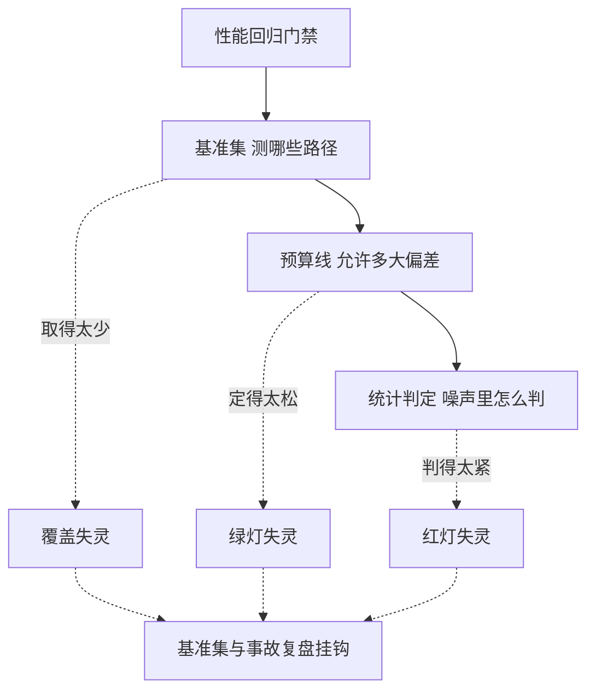
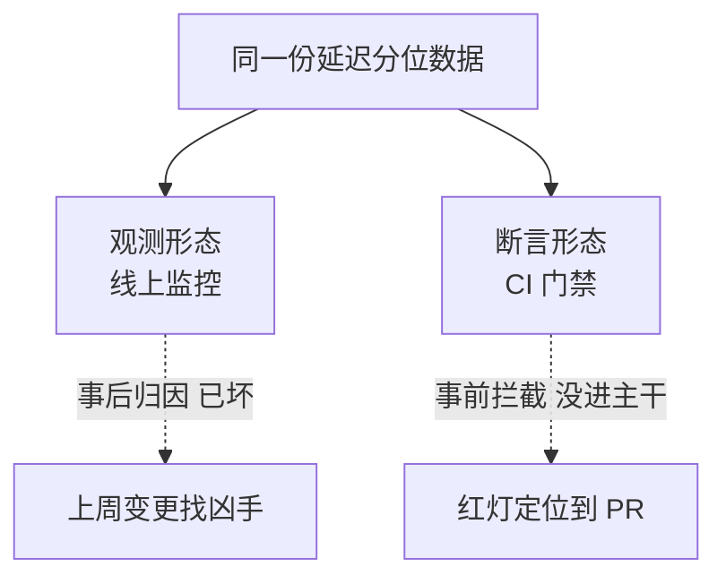
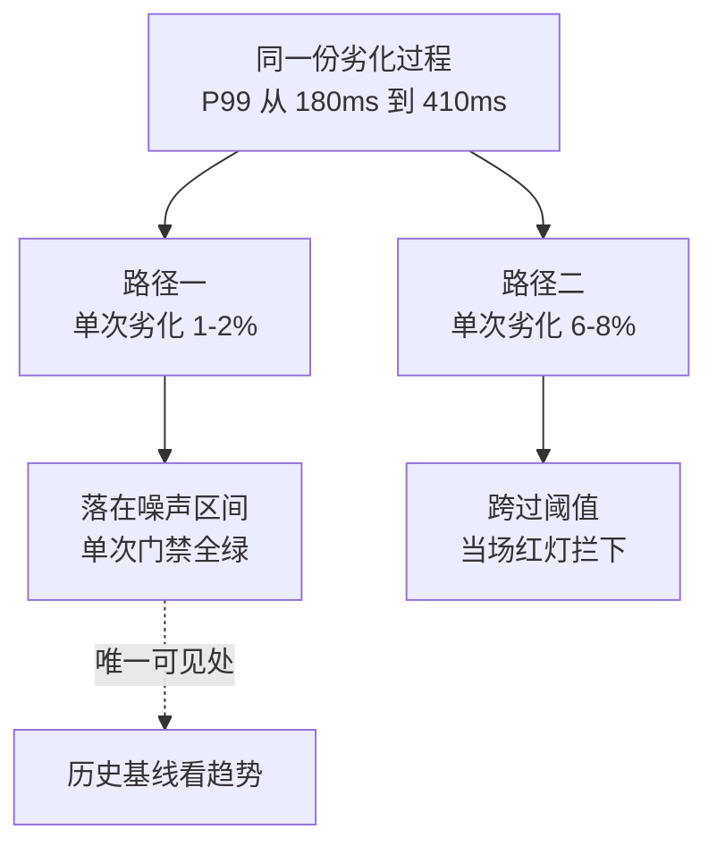

## 要解决的问题

功能回归有测试挡，性能回归裸奔：一次"无害的小重构"把热路径加了一层锁，延迟涨 30%，上线后才发现，回滚的代价是事故级的。性能问题发现得越晚，定位成本越高（发布窗口里的变更一堆，哪个都不像凶手）。问题的本质：**性能是可回归的质量属性，但多数团队把它当"出了事再查"的运维属性**。性能回归门禁把性能预算变成 CI 里的可执行断言：关键路径的基准跑在流水线上，超预算即红灯，回归在合入前被拦下。发现时点从"线上告警"前移到"提交时刻"，定位范围从"上周所有变更"缩小到"这次 PR"。

## 机制

**门禁的三要素**。基准集：从真实流量形态提炼的代表性负载（核心接口的 p50/p99、关键算法的吞吐、启动时间、内存足迹），覆盖稳定热路径而非全接口（全接口基准跑不起，挑 5-10 个"坏了就是事故"的路径）。预算线：每条基准的允许区间（绝对值或相对基线的百分比偏差），预算从 SLO 反推（SLO 说 p99 ≤ 200ms，基准预算留出安全边际定 180ms）。统计判定：单次运行的噪声（CI 机器的邻居干扰、频率漂移）会让 ±10% 的抖动常态化，判定必须带统计——重复 N 次取分位数、与历史基线比而非单点比、噪声超出区间时重跑或标 inconclusive 而非硬判。

三要素各管一段，各自松紧都会以特定形态失效：



同一份延迟数据在两种形态里的分工：



图回答的是门禁的本质交换：同一份数据（延迟分位数），观测形态留在事后归因（线上告警后从一堆变更里找凶手），断言形态把时点前移到提交时刻（红灯即拦、定位范围缩小到这次 PR）——门禁是断言形态的实现，它不替代线上监控，两者是同一份数据的两种时态。

**基线的管理是门禁的命脉**。基线不是一次定终身：性能优化合入后基线要更新（否则新代码永远跟旧基线比，误报淹没真回归）；基线更新与预算变更要显式走 PR（预算是团队决策，不是个人随手改）；历史基线序列（每合并一批的基准值曲线）让趋势可见——**门禁挡突变，趋势图治渐变**（每次涨 2% 的慢性回归过得了单次门禁，曲线上一年的累积塌方一目了然）。

**CI 里的执行形态**。触发策略：每 PR 全跑（贵但拦得早）vs 夜间全量 + 发布前必跑（省但晚）vs 只跑改动路径关联的基准（需要变更影响映射）。环境隔离：性能基准对 CI 共享机器的噪声极敏感，专用 runner、cgroup 限邻居、锁频（cpupower frequency-set）、丢弃前几轮预热是标配。耗时控制：全套基准 10 分钟内（超了就会被跳过或砍掉），分层：快速集（每 PR，秒级微基准）+ 慢速集（夜间，端到端宏基准）。

**门禁失灵的三种形态**。绿灯失灵（基准太松，回归过了门禁线上才炸）；红灯失灵（基准太敏感，噪声天天误报，团队学会的第一个动作是跳过门禁）；覆盖失灵（测的是微基准，回归发生在没测的路径或路径间的组合上）。三种失灵的对策同一个：**门禁的基准集与线上事故复盘挂钩**——每次线上性能事故，问"哪条基准本该拦住它"，答案缺席就补基准，门禁集跟着事故演化。

每次只劣化一点的慢性回归与一次跨过阈值的突变，在门禁与趋势图里的可见性完全不同：



两条路径的差别只在单次幅度：落在噪声区间里的劣化每次都能过门禁，唯一的可见处是历史基线序列的趋势；单次幅度跨过阈值的劣化当场被拦，定位范围缩小到那一个 PR。这也是「门禁挡突变、趋势图治渐变」两件设施都必须有的原因。

## 背景与代价

思想背景：性能回归检测的工业化是 CI/CD 成熟期的产物（2015 后），Google 的"性能值守"（perf sheriffs，大仓库的持续性能监控）与 Meta 的大规模基准跟踪是工业界标杆；开源生态成型为 Bencher、CodSpeed、Google Benchmark 的 CI 集成（benchmark 结果持久化 + 统计比较）；Rust/Chromium/Linux kernel 的 perftest 基础设施是"性能即测试"的公共样本。

最精巧的一笔是**把性能从"观测指标"改写成"断言"**：观测（线上监控）告诉你"已经坏了"，断言（CI 门禁）告诉你"这个还没进主干"。同一份数据（延迟分位数），观测形态服务事后归因，断言形态服务事前拦截，门禁是断言形态的具体实现。代价要摆明：**CI 机器的测量噪声是门禁的头号敌人**（共享 runner 的邻居负载让统计判定需要多次重复，耗时翻几倍；专用性能 runner 是真金白银的基建投入）；基准集的维护是持续成本（热路径漂移、负载形态演进，基准不跟就过时，过时的基准拦不住新形态的回归）；**门禁的假阳性代价不对称**——误报拦住一个好 PR 的团队摩擦，比漏报一次回归（还有线上监控兜底）更伤门禁的公信力，所以预算线宁可先松后紧（先拦 30% 突变，跑稳了再收 10%）。适用判定：延迟敏感型服务（交易、广告、搜索）与基础库（语言运行时、存储引擎）收益最大；迭代期原型与小范围工具类项目，线上监控够了，门禁是提前的奢侈。

## 边界

- **门禁挡的是可复现的回归，不是线上事故的全部**。容量型事故（流量突增）、配置型事故（线上配置与基准环境不同）、数据型事故（生产数据分布触发慢查询）不在门禁射程内。门禁与容量规划、影子流量、慢查询审查是互补件，不是替代件。
- **微基准与宏基准的判定分离**。微基准的噪声小、判定严（±5% 可判）；宏基准噪声大、判定宽（±15% 起步），且只在夜间全量跑。同一套预算线套两种基准是配置错误。
- **跳过门禁要有显式通道**。紧急修复（安全漏洞）允许 override，但 override 记录进审计（谁、为什么、事后补基准），静默跳过（改配置文件绕过）要把门禁配置本身纳入保护（改门禁配置的 PR 需要额外评审）。
- **跨语言/跨服务的性能预算**。本篇门禁在单系统内；跨服务的延迟预算（端到端 SLO 分解到各服务）是另一层工程（SLO 分解与错误预算），别把门禁写成分布式预算系统，单点做好单点的事。

## 验证

- **拦截实验**：故意提交一个热路径加锁的 PR（模拟 30% 延迟回归）。预期：CI 门禁红灯，报告指出哪条基准超预算、超出幅度、历史基线对比。门禁拦截能力的直接证据。
- **噪声画像实验**：同一份代码在 CI runner 上重复跑基准 20 次，画延迟分布。预期：共享 runner 的分布宽（±10% 以上），专用 runner 窄（±3% 内）；分布宽度决定统计判定需要的重复次数。门禁噪声地基的实测。
- **趋势复盘**：导出一条基准的历史序列（6 个月），标出线上性能事故时间点。预期：事故前的曲线有可见漂移（或事故对应基准覆盖缺口），漂移点即"门禁该拦没拦"或"基准该补没补"的证据。门禁集与事故挂钩的方法验证。

## 可运行示例与案例回流：门禁的账

```text
一条性能门禁的推演账（通用形态）：

  预算声明：P99 ≤ 200ms、QPS ≥ 5000、内存峰值 ≤ 2GB（写进配置随代码走）
  基线：性能基准环境固定（同机型、同负载模型），每次合并跑基准取基线
  判定：新版与基线同环境对比，劣化 > 5% 且排除环境噪声 → 拦截合并
  噪声控制：同一 commit 跑 3 次取中位数；环境漂移单独监控
    （噪声 8% 的环境里拦 5% 的劣化只会误报）
  失效模式：环境不固定 → 数字不可比；只测均值不看分位 → 长尾劣化漏网
```

案例回流：慢劣化漏网的实录——六个月里每次合并劣化 1-2% 都在噪声里放行，累计 P99 从 180ms 涨到 410ms（无门禁时每次都"看起来没变化"）；上门禁后同类累计劣化在第一次跨过 5% 阈值时被拦。环境漂移误报的实录——基准机被其他任务占用，门禁连拦 12 个无辜合并，团队把门禁改成"可跳过"（门禁失去信用等于不存在）；机器画像绑定与独占基准机是门禁可信的前提。均值陷阱的实录——均值 P50 全绿但 P99 翻倍（长尾被新加的慢路径拖垮），门禁按分位逐项设预算后才拦得住。负载模型与误差的声明规范见 [[工程知识/性能工程：从用户等待到资源瓶颈/观测与诊断/基准测试必须先定义负载和测量误差.md]]、环境可比性见 [[工程知识/性能工程：从用户等待到资源瓶颈/观测与诊断/基准报告要绑定机器画像：没有环境描述的数字不可比较.md]]。

## 相关

- [[工程知识/性能工程：从用户等待到资源瓶颈/观测与诊断/基准测试必须先定义负载和测量误差.md]] —— 门禁的基准复用这套纪律：负载定义与误差区间先行
- [[工程知识/软件构建：让变化可以理解、验证与交付/测试与交付/可观测性断言：把运行时行为写进测试.md]] —— 同一套断言思路的另一侧：它在运行时约束行为，本篇在 CI 侧约束性能预算
- [[工程知识/性能工程：从用户等待到资源瓶颈/观测与诊断/优化收益递减决定何时该停手.md]] —— 门禁的预算线从 SLO 反推，优化停手点决定预算松紧
- [[工程知识/缺陷分析：从个案到体系/复现与回归/回归风险评估的通用骨架：从变更面到测试选择.md]] —— 性能风险档的专门门禁，骨架里性能风险一档的具体实现
