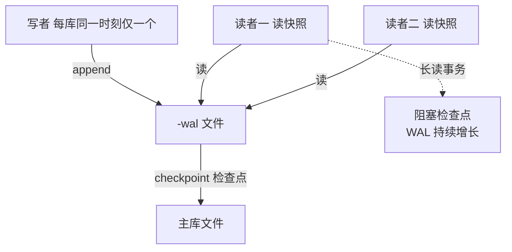
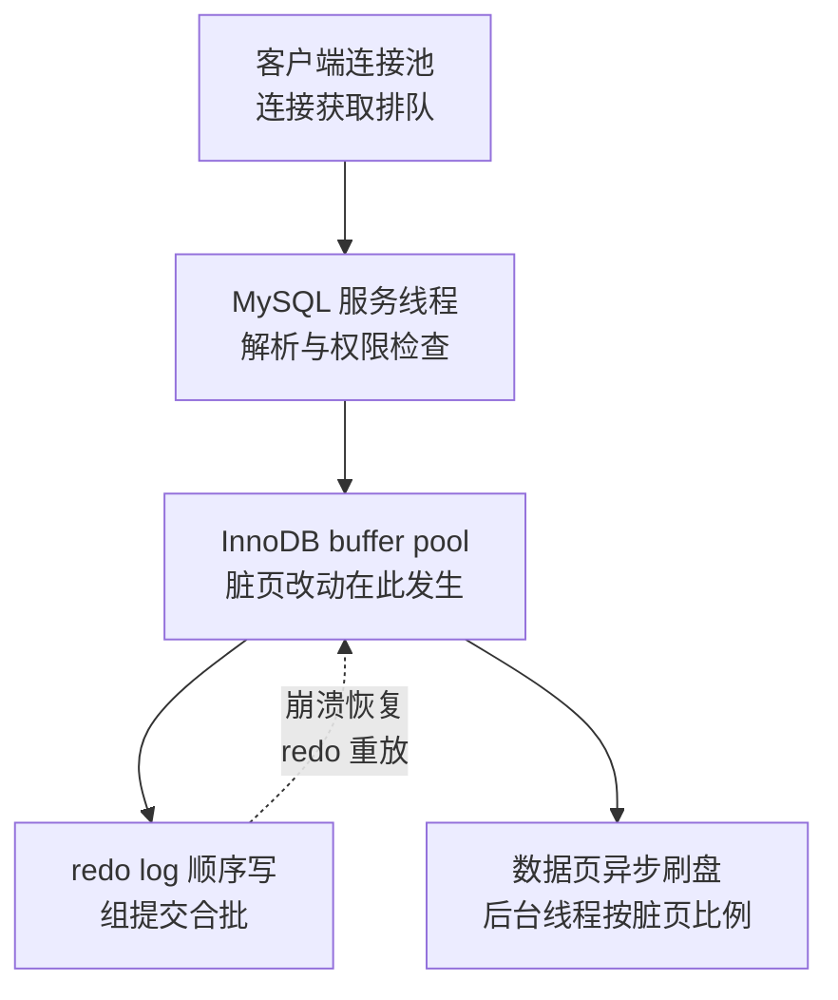

# SQLite 与 MySQL 代表不同的并发与运维边界

SQLite 和 MySQL 都提供 SQL、事务和索引，但它们解决的系统问题不同：SQLite 是嵌入应用的本地数据库库，MySQL 是通过服务进程向多个客户端提供共享数据的客户端/服务器数据库。选型的判断点落在五个可核对的维度：数据位置、写入并发、故障边界、运维责任和未来迁移成本——背"适合小项目/大项目"回答不了这五个维度中任何一个。

## 一张决策表

| 问题 | 更偏向 SQLite | 更偏向 MySQL（或其他服务型 RDBMS） |
| --- | --- | --- |
| 数据与发起 SQL 的代码是否在同一台机器？ | 是，且本地文件可控 | 否，需要跨网络共享 |
| 写入并发 | 单机低到中等，可排队 | 多个实例/连接需要并行写入 |
| 访问方式 | 应用内库、桌面/移动/边缘设备 | 多服务、多租户、统一数据库服务 |
| 运维与权限 | 零配置、单文件、应用自带 | 需要账号、审计、备份、复制和集中治理 |
| 数据规模 | 单文件可承受，容量边界明确 | 需要横向扩展、分片或多卷存储 |
| 网络与可用性 | 可离线运行，稍后同步 | 依赖中心服务，集中一致性和高可用 |

这不是硬性容量阈值。SQLite 官方建议以“是否跨网络直接访问、是否有许多同时写入者、是否无法接受单文件”作为主要分界，而不是使用脱离工作负载的固定 QPS 数字。[SQLite 适用场景](https://www.sqlite.org/whentouse.html)

## 共同的抽象：页面、事务与索引

两者都把表和索引组织成页，并通过日志/锁保证事务的原子性与崩溃恢复。索引的代价账与事务的代价账对所有数据库成立：索引减少扫描、增加写放大与空间成本；事务变大、锁持有时间与日志量随之上升。选型前先回答四个定义问题：

- 事实源、派生缓存和可重建索引分别在哪里；
- 读一致性（是否需要读己之写、快照或线性一致）和写入约束；
- 备份、恢复点目标（RPO）、恢复时间目标（RTO）与删除/保留策略；
- 迁移是否需要向前/向后兼容，以及如何验证回滚。

## SQLite 的核心机制

### 嵌入式与文件边界

SQLite 引擎直接链接进应用，数据库通常是一个可复制、可备份的文件。它没有独立服务进程、账号系统或网络连接池；这些边界简化了部署，也意味着应用必须自己负责进程隔离、文件权限、并发访问、备份和密钥管理。数据库文件不应放在不可靠的网络文件系统上直接被多台机器写入，底层锁语义不可靠时可能导致性能问题甚至损坏。[SQLite 适用场景](https://www.sqlite.org/whentouse.html)

### 读写并发与 WAL

SQLite 可以有多个并发读者，但一个数据库文件同一时刻只有一个写者。WAL 模式把提交追加到 `-wal` 文件，使读者读取稳定快照、读写通常可以并行；检查点再把 WAL 内容合并回主库。WAL 依赖同一主机的共享内存索引，不能作为网络文件系统上的分布式锁方案；长读事务还可能阻塞检查点，导致 WAL 增长。[SQLite WAL 原理](https://www.sqlite.org/wal.html)

```sql
PRAGMA journal_mode = WAL;
PRAGMA busy_timeout = 5000;
```

这两行不是万能“性能开关”：要结合磁盘耐久性、检查点策略、读事务时长和写入批次验证。`synchronous` 的选择会在延迟与断电后的持久性之间做取舍，必须写进部署配置和恢复演练。

WAL 模式下的读写关系，图示如下。



图回答的是「WAL 让 SQLite 支持多写者」这一误解的确切边界：写者始终串行（一个文件同一时刻只有一个写者），WAL 换来的是读写并行——读者从追加日志里拿稳定快照，检查点再把日志合并回主库。虚线是长读事务的代价：检查点被阻塞，`-wal` 文件持续增长，所以 WAL 模式要盯的不只是主文件大小，还有检查点是否正常推进。

### 删除与空间回收

`DELETE` 会把页标记为可复用，文件通常不会立即变小；这与“数据还能被恢复”无关，而是避免每次删除都重写文件。需要缩小文件时可在独占维护窗口执行 `VACUUM`；需要长期在线回收时评估创建数据库时启用的 `auto_vacuum`，并测量写放大和碎片。WAL 模式还要观察 `-wal` 文件及检查点，而不是只看主文件大小。

## MySQL/InnoDB 的核心机制

MySQL 由服务进程集中管理连接、权限、日志、备份和复制；InnoDB 默认提供事务、行级锁、MVCC、崩溃恢复和外键等能力。服务化带来跨进程/跨主机共享与治理能力，也带来网络延迟、连接池、版本升级、容量规划和高可用运维责任。[InnoDB 存储引擎](https://dev.mysql.com/doc/refman/8.4/en/innodb-storage-engine.html)

典型写入路径是：客户端连接池 → MySQL 服务 → InnoDB buffer pool/日志/数据页。应用仍需定义事务边界、隔离级别、死锁重试、幂等键、慢查询观测和在线 schema 迁移；“有行锁”不等于可以忽略热点、长事务或锁等待。

一次写从客户端到达磁盘要穿过的层与各自的贡献：



图回答的是提交延迟的构成：客户端看到的提交完成点在 redo log 落稳之后（WAL 纪律），buffer pool 的脏页是异步刷写——这条路径解释了为什么 MySQL 的写吞吐由 redo log 的顺序写带宽决定，崩溃恢复时 redo 重放把未刷脏页重建回来。

## 设计时不要混淆的边界

| 误解 | 更准确的判断 |
| --- | --- |
| “SQLite 只能做原型” | 本地、边缘、离线、单机服务和应用文件格式都可能适合；关键是访问拓扑与写入并发。 |
| “WAL 让 SQLite 支持多写者” | WAL 允许读写并行，但每个数据库文件仍只有一个写者。 |
| “MySQL 自动解决一致性” | 数据库只覆盖自己的事务边界；跨服务副作用仍需 outbox、幂等、补偿或工作流。 |
| “删除后文件变小就是回收成功” | 逻辑空间可重用、物理文件大小、WAL 大小是三个不同指标。 |
| “换库只改连接串” | SQL 方言、锁/隔离、迁移工具、时间类型、分页和运维模型都可能不同。 |

## 迁移与共存路径

1. **本地优先**：客户端用 SQLite 记录离线事实和待同步操作，服务端 MySQL 保存权威事实；同步协议必须有版本、幂等键、冲突策略和重放记录。
2. **从 SQLite 迁移到 MySQL**：先盘点 schema、约束、触发器、索引和 SQL 方言；用双写/回放或停机导入建立校验，再切换读流量，保留可回退窗口。
3. **测试替身**：SQLite 可用于快速单元/演示，但不能替代 MySQL 的锁、隔离级别、执行计划和方言测试；关键路径必须在目标数据库上做集成测试。
4. **数据导出**：把 SQLite 文件当作可验证的快照，导出前固定事务和 schema 版本，接收方校验文件哈希、行数、约束和时间范围。

## 最小检查清单

- [ ] 画出“应用—数据库文件/服务—网络—备份”的拓扑，并标注事实源。
- [ ] 测量读写比例、并发写者数、事务时长、p95/p99 延迟、锁等待和数据增长，而不是引用通用数字。
- [ ] 明确断电、进程崩溃、网络分区、磁盘满、长事务和死锁时的恢复行为。
- [ ] 为连接、事务、迁移、备份和恢复设置可观测指标与告警。
- [ ] 为数据同步、重试和迁移准备幂等、校验、回滚和人工接管路径。

## 关联知识

- [[工程知识/数据系统：在并发与故障中保存事实/数据系统：在并发与故障中保存事实]]
- [[工程知识/数据系统：在并发与故障中保存事实/数据系统：在并发与故障中保存事实]]
- [[工程知识/后端系统：在并发、失败与变化中维持服务/分布式可靠性/部分失败决定分布式系统的设计]]
- [[工程知识/软件构建：让变化可以理解、验证与交付/测试与交付/测试策略从风险选择证据]]
- [[工程知识/数据系统：在并发与故障中保存事实/数据治理/数据组件的迁移清单：能力等价按逐项核对建立，不按名称对应]] —— 本篇讲的边界差异正是迁移清单要逐项核对的隐性保障

## 验证

1. 并发写入测量：在两种数据库上分别施加并发写者，记录写入延迟、锁等待与错误，确认并发写能力与文档描述一致。
2. 故障行为对照：分别制造进程崩溃、断电与磁盘满，记录数据完整性与恢复步骤，核对是否存在需要人工介入的状态。
3. 访问边界：让嵌入式数据库的文件被另一个进程以写方式打开，预期出现锁冲突或拒绝；服务型数据库在同一场景下由服务端统一协调访问。
4. 迁移核对：把一侧的数据与事务迁移到另一侧，逐项核对类型、约束、事务语义与备份方式是否等价。
5. 断言锚点：并发能力有实测数据，故障行为逐场景记录，访问边界被验证过，迁移差异逐项列出。

## 效果与代价

按数据位置、写入并发与故障边界判断选型，换来的是并发写入能力与恢复目标在部署之前就有对应结论，迁移时需要改动哪些部分也能提前列出。代价是服务型数据库引入连接、权限、备份与复制的运维责任，嵌入式数据库则把进程隔离、文件权限与并发访问的责任留在应用侧，两者的决定不可互换。

## 要解决的问题

两者都提供 SQL、事务与索引，按项目规模选择之后在写入并发、故障边界与迁移成本上出现预期之外的限制。本篇回答：数据存放位置与访问方式差在哪里、各自支持怎样的写入并发、故障影响范围与运维责任如何划分，以及从一侧迁移到另一侧需要改动哪些部分。

