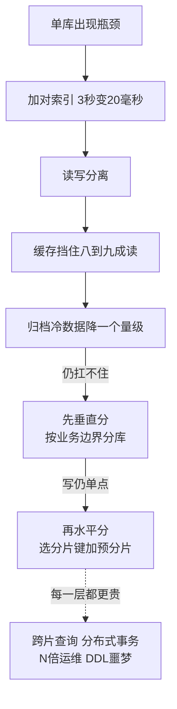

# 分库分表只在单库成为瓶颈后使用

## 背景：提前分了 16 个库，然后麻烦开始了

一个项目预估"未来会有千万用户"，一开始就分了 16 个库。

上线半年后实际只有 20 万用户，但已经付出：

- **跨库查询做不了**："查询所有 VIP 用户"要查 16 个库再合并，代码里全是 `for shard := range shards`
- **事务基本不可用**：跨库事务要么不支持，要么性能极差 → 所有业务改成最终一致，复杂度暴涨
- **扩容困难**：从 16 扩到 32 要迁移一半数据，得停机
- **运维成本**：16 套主从、16 倍的备份和监控

**结果：为一个没到来的规模，提前付出了全部代价。**

## 从 0 开始：什么时候真的需要分

### 单库的容量到底有多大

先搞清楚单库的真实上限，别凭感觉：

| 瓶颈 | 单库（32 核 128G，NVMe）大致上限 |
| --- | --- |
| 数据量 | **2-5 TB**（超过后备份、DDL、索引维护都很痛苦） |
| QPS（简单主键查询） | **5-10 万** |
| 写入 TPS | **1-3 万**（受限于 redo log fsync） |
| 连接数 | **500-1000**（超过后上下文切换严重） |

**关键认知**：**数据量通常不是最先到的瓶颈，QPS 和连接数才是。**

很多团队因为"表有 8000 万行"就急着分表——但如果查询都走索引，8000 万行的表查询只要几毫秒，完全不需要分。

### 分之前，先把这些做完

**按这个顺序优化，往往能推迟分库分表 2-3 年：**

| 优化 | 效果 |
| --- | --- |
| **加对索引** | 3 秒 → 20 毫秒（见 [[工程知识/数据系统：在并发与故障中保存事实/查询与索引/B+Tree索引为访问路径服务]]） |
| **读写分离** | 读压力分散到多个从库 |
| **缓存热点** | 挡住 80-95% 的读 |
| **归档冷数据** | 把 3 年前的数据迁到历史表，主表体积降一个量级 |
| **优化大字段** | 把 TEXT/BLOB 移到独立表，主表变紧凑 |
| **连接池调优** | 消除"连接数不够"这个假瓶颈（见容量规划） |

**做完这些还是扛不住，才考虑分。**

## 方案：两种分法，难度差别很大

### 垂直分法（先做这个）

**按业务把表分到不同库**：

| 分出的库 | 包含的表 |
| --- | --- |
| 用户库 | users |
| 订单库 | orders |
| 商品库 | products |
| 日志库 | logs |

**好处**：
- 业务隔离：订单库压力大不影响用户库
- 可以独立扩容、独立优化
- **跨库事务通常可以避免**（因为业务边界清晰）

**代价**：低。**这是应该优先做的分法。**

### 水平分法（分库分表，真正的难点）

**把一张表的数据按规则分散到多个库/表**，4 亿行的 orders 表按哈希分成四张：

- orders_0：1 亿行
- orders_1：1 亿行
- orders_2：1 亿行
- orders_3：1 亿行

### 分片键的选择（最关键的决定）

**分片键决定了几乎所有查询的效率。**

| 分片键 | 适用 | 问题 |
| --- | --- | --- |
| **用户 ID** | 大多数 C 端业务 | 查"某商家的订单"要扫全部分片 |
| **订单 ID** | 订单详情查询 | 查"某用户的所有订单"要扫全部分片 |
| **商户 ID** | B 端 SaaS | 大商户数据倾斜 |
| **时间** | 日志、流水 | 热点集中在新分片 |

**选择原则**：

1. **选查询最频繁的那个维度**（通常是用户 ID）
2. **数据分布要均匀**（避免热点分片）
3. **尽量让 80% 的查询只命中一个分片**（避免跨片）

**实际常用做法：基因法 / 复合分片键**

订单 ID 由"用户 ID 后 4 位 + 时间戳 + 序列号"拼成，取用户 ID 的后 4 位作为基因。这样同一个用户的订单必然命中同一个分片。

这样既能按订单 ID 查（能路由），也能按用户 ID 查（同一分片）。

### 跨分片查询：分库分表最大的痛点

| 场景 | 难点 | 解法 |
| --- | --- | --- |
| 不带分片键的查询 | 要查所有分片 | **异构索引表**（另建一张按其他维度分片的表） |
| 分页排序 | 每个分片都要排序再归并 | 业务上避免深分页；或用"游标 + 分片并发" |
| 聚合（COUNT/SUM） | 各分片算完再合并 | 可以接受的话用并行查询；否则预聚合 |
| Join | 跨库 Join 性能极差 | **业务层做**：先查 A，再用 ID 批量查 B |
| 分布式事务 | 2PC 代价高 | **避免**：用 Saga + 对账 |

**这就是为什么要晚分**：这些复杂度是实打实的，而且要持续维护。

### 扩容：从 N 个分片扩到 2N

**方案 1：停机迁移**（简单但不可用）

1. 停写
2. 双倍分片，重新哈希迁移数据
3. 切换路由
4. 恢复

**方案 2：一致性哈希**（减少迁移量）

从 N → N+1 时，只迁移 1/N 的数据，而不是全部。

**方案 3：预分片（推荐）**

```
一开始就建 1024 个逻辑分片，放在 8 个物理库上（每库 128 个）
  → 扩容到 16 个库时，只需移动逻辑分片，不重新哈希
```

**这是最实用的方案**：前期用少量物理库承载大量逻辑分片，扩容时只搬逻辑分片。

**方案 4：用中间件**

Vitess（MySQL）、ShardingSphere、TiDB、PolarDB-X。**它们解决了路由、扩容、分布式查询，但有学习成本和运维依赖。**

## 效果与代价

**收益**

- **容量线性扩展**：分片数 × 单分片容量
- **写压力分散**：多主写入
- **故障隔离**：一个分片挂了不影响其他

**代价（很重，要清楚）**

- **跨分片操作复杂**：查询、分页、聚合、Join 都要重写
- **事务受限**：分布式事务代价高，通常要改成最终一致
- **运维复杂度翻倍**：N 个库 = N 倍的备份、监控、DDL
- **DDL 噩梦**：加一个字段要在 N 个分片上执行，且要保证一致性
- **全局 ID**：不能用数据库自增，要引入 Snowflake 之类的方案



图回答的是「晚分」的完整路径：单库到瓶颈后按代价从低到高逐层做——索引、读写分离、缓存、归档冷数据（这四层往往能推迟分片两三年），然后先垂直分（按业务边界，代价低）最后才水平分（分片键与预分片，真正的复杂度从这里开始）。虚线挂的是水平分一次性买下的持续成本：跨片查询、分布式事务、N 倍运维与 DDL——每往下一层都更贵，所以分片的时机由实测瓶颈决定，不由预估规模决定。

## 从什么地方做

**第一步：先量化瓶颈**

是数据量、QPS、连接数还是磁盘 IO？**不同的瓶颈对应不同的方案**（可能根本不需要分）。

**第二步：先做垂直分法**

按业务边界划分。**代价低、收益明确，且往往就够了。**

**第三步：归档冷数据**

把历史数据迁走。**这一步常常能让数据量降一个量级，直接推迟水平分法。**

**第四步：选分片键（花最多时间在这）**

列出所有高频查询，看它们按什么维度查。**80% 的查询能单分片命中，才能分。**

**第五步：用预分片 + 中间件**

不要自己写路由逻辑。**用 Vitess/ShardingSphere 或云厂商的分布式数据库。**

## 常见错误

**错误 1：过早分片**

前面那个案例。**分片是不可逆的复杂度，晚分比早分好。**

**错误 2：分片键选错**

按订单 ID 分片，但 90% 的查询是"查我的订单" → 每次查所有分片。**必须先看查询模式。**

**错误 3：以为中间件能解决一切**

Vitess 能路由、能扩容，但**改变不了跨分片聚合和 Join 的本质代价**。

**错误 4：忽略数据倾斜**

按商户 ID 分片，一个大商户占了 30% 的数据 → 那个分片是热点。**大客户要单独处理。**

**错误 5：还在用数据库自增 ID**

多个分片各自自增 → ID 冲突。**必须用全局 ID 生成（Snowflake、号段、UUID）。**

**错误 6：分片后还写跨分片事务**

用 2PC 硬撑 → 性能和可用性都很差。**改成最终一致 + 对账。**

相关：[[工程知识/数据系统：在并发与故障中保存事实/查询与索引/B+Tree索引为访问路径服务]] · [[工程知识/性能工程：从用户等待到资源瓶颈/性能工程：从用户等待到资源瓶颈]]

## 验证

1. 瓶颈确认：在决定分片之前记录单库的 CPU、IO、连接数与写入延迟水位，确认限制出现在数据库侧；出现跨机网络或应用侧瓶颈时先处理那一层。
2. 分片键核对：按候选分片键统计数据分布，确认各分片承载的量接近、单一大客户的占比可控。
3. 跨片操作：对跨分片查询与写入分别记录影响的分片数量、延迟与失败处理方式，确认代价已被计算。
4. 标识唯一：在多个分片上分别生成业务标识，预期不出现重复；使用自增标识的实现应能观察到冲突。
5. 扩容重分布：在演练环境按新分片数重分布数据，记录迁移期间的读写可用性与对账结果。
6. 断言锚点：单库瓶颈有实测依据，分片键分布与跨片代价有数据，标识唯一性经过验证，重分布演练过。

## 要解决的问题

按用户规模预期提前分库分表之后，跨分片查询、分布式事务与扩容迁移的复杂度立即出现，而单库并未成为限制。本篇回答：分片解决的是哪一项瓶颈、单库在什么条件下才构成这个瓶颈、分片键与路由方式怎样确定、跨片操作需要付出什么代价，以及扩容时数据怎样重分布。

