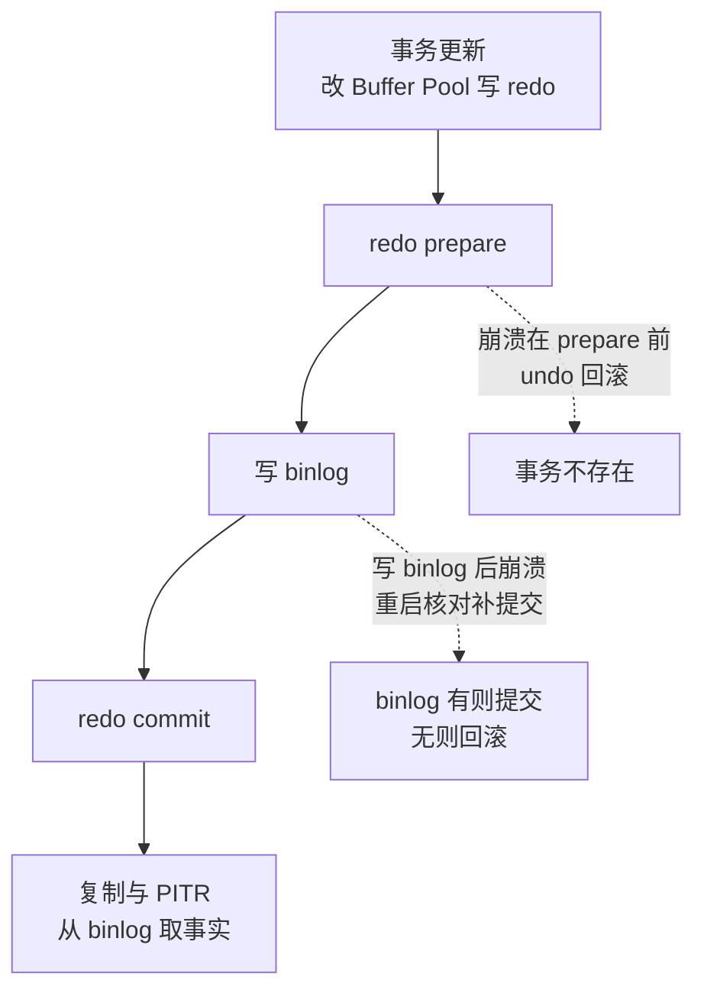
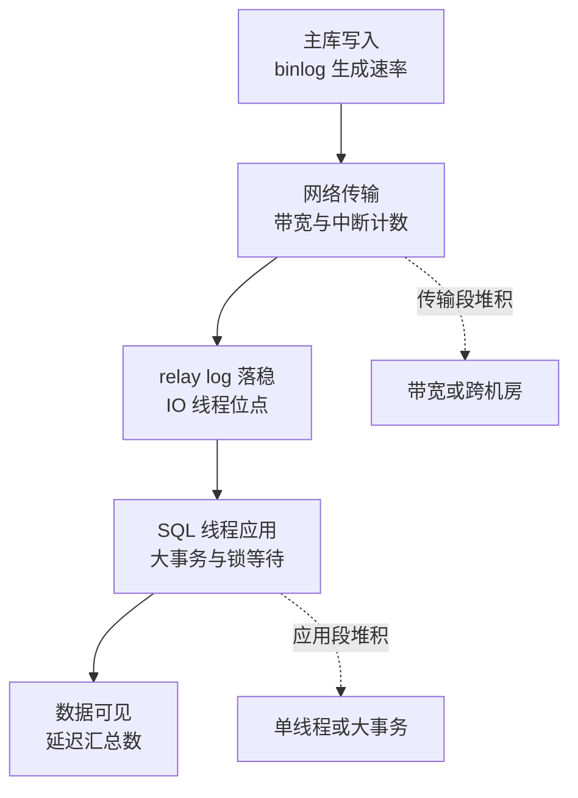

# InnoDB 用日志连接事务、恢复与复制

## 三类日志各自解决什么问题

| 日志 | 主要职责 | 不能替代 |
| --- | --- | --- |
| `redo log` | WAL；崩溃后把已提交修改重做到数据页 | 逻辑审计、跨库复制 |
| `undo log` | 回滚、MVCC 旧版本和一致性读 | 崩溃后的完整备份 |
| `binlog` | Server 层逻辑变更记录；复制、PITR、审计 | 代替 redo 的页级恢复 |

三份日志在提交时刻由两阶段提交协调，衔接的形状：



图回答的是三份日志为什么在提交时刻必须有协调者：redo 与 binlog 分属引擎层与 Server 层，各写各的，崩溃恢复要判定“这个事务到底算不算提交”，唯一依据是两阶段提交留下的衔接状态——prepare 后崩、写完 binlog 后崩、commit 后崩，三种时刻的结局各不相同（回滚、核对后补提交、已提交），恢复从检查点重放时靠这套状态接续。复制与 PITR 不读 redo，事实来源统一在 binlog，这是“逻辑复制不绑引擎页格式”的代价与自由。

更新通常先改 Buffer Pool、写 redo；提交时通过两阶段提交协调 redo 和 binlog，避免“binlog 有记录但 InnoDB 未提交”或反过来的不一致。`binlog_format=ROW` 通常比 statement 更适合可靠复制和按行恢复，但要结合版本、工具和合规要求验证。

两个日志文件在同一时刻必须给出同一个结论，靠的是提交前先问一圈、全部答应了才落最终决定：


*图源：Wikimedia Commons「Two phase commit seq diagram success 01」，作者 Jayaprabhakar，许可 [CC0](https://commons.wikimedia.org/wiki/File:Two_phase_commit_seq_diagram_success_01.png)。图里两个阶段的分界就是正文说的那个协调点：Prepare 阶段任何一方回绝，Commit 阶段就不会开始，redo 与 binlog 因此不会各自走到不同的终点。*

## 持久性和抖动

`innodb_flush_log_at_trx_commit=1` 与 `sync_binlog=1` 常被称为“双 1”，可提供更强的提交持久性，代价是更多刷盘。具体取值必须根据 RPO、磁盘能力和复制架构决定，不能把参数名当作绝对保证。

平时更新快、偶尔整体变慢，常见原因是刷脏页：redo 写满、Buffer Pool 淘汰脏页、后台空闲刷盘或正常关闭。重点观察 redo 使用率、checkpoint age、脏页比例、I/O 延迟和 `innodb_io_capacity` 是否与真实磁盘能力匹配。redo 太小会造成写入堵塞，参数过大则增加崩溃恢复时间和空间占用。

## 复制、高可用和读写分离

复制链路至少要监控：主库写入、日志生成、网络传输、从库 relay 应用和 SQL 应用。延迟可能来自大事务、单线程应用、热点锁、磁盘或网络；只看一个 `Seconds_Behind_Master` 不足以定位原因。

延迟定位按链路五段对账，每一段有自己的观察点与判据：



图回答的是"只看一个延迟数定位不了原因"的结构性依据：五段串联，延迟累积在哪一段决定了对策完全不同——传输段是带宽与机房问题、应用段是单线程与大事务问题、主库段是写入洪峰问题，`Seconds_Behind_Master` 只反映末端汇总，三个不同病因共用一个表象。定位顺序：先看 relay log 位点与 binlog 位点的差（传输段），再看 relay 与已应用位点的差（应用段），差值在哪一段停住，病因就在哪一段。

半同步的账要把丢失窗口摆进数字：`rpl_semi_sync_master_wait_point=AFTER_SYNC`（增强半同步，5.7+ 默认形态）在从库收到 binlog 后即应答，主库崩溃切换时刚应答的事务在从库有 relay 但可能未应用——窗口是"应答到应用"的距离；退化判定看 `Rpl_semi_sync_master_status` 是否退化为 OFF（`rpl_semi_sync_master_timeout` 超时后自动降级为异步，这是半同步最常见的失效形态：平时是半同步，主从断连超时后变成异步，丢失窗口静默扩大）。核对命令：`SHOW GLOBAL STATUS LIKE 'Rpl_semi_sync%'` 与故障注入切换演练配合，参数表上的半同步不等于故障时刻的半同步。

高可用切换必须回答：

- 谁判定主库故障，如何防止脑裂？
- 候选从库是否追平，缺失事务如何处理？
- 客户端如何刷新连接和路由，正在执行的请求如何重试？
- 切换后的写入点、读后写一致性和数据丢失窗口是多少？

读写分离要显式定义一致性策略：关键读走主库、等待从库位点追平、或携带会话粘性；不能假设“写完立刻读”一定能在从库看到。

## 备份与误删恢复

推荐把恢复目标写成可测试的 RPO/RTO，并至少演练：全量备份校验、binlog 连续性、时间点恢复、恢复到隔离实例、业务数据抽样校验和切换回滚。误删后先停止进一步写入或保护现场，保存 binlog/备份，再恢复到临时实例核对，最后用幂等方式回灌；不要直接在生产库“凭记忆反向操作”。

```text
发现 -> 保护现场 -> 确认时间点/影响范围 -> 临时恢复
      -> 校验行数和业务不变量 -> 小批量回灌 -> 对账 -> 复盘
```

## 变更安全

- 大表 DDL 要检查 MDL、执行时间、复制影响和回滚方案。
- `ALTER TABLE ... ENGINE=InnoDB`/`OPTIMIZE TABLE` 可能重建表；`ANALYZE TABLE` 主要更新统计信息，不等同于收缩数据文件。
- 在线 DDL 或 gh-ost 等工具也需要变更窗口、限速、监控和终止条件。

## 关联页面

- [[工程知识/数据系统：在并发与故障中保存事实/事务与存储/事务隔离决定并发读写能观察到什么]]
- [[工程知识/数据系统：在并发与故障中保存事实/查询与索引/一条SQL如何穿过优化器与存储引擎]]
- [[工程知识/数据系统：在并发与故障中保存事实/可靠性与运维/MySQL空间、容量与在线运维]]
- [[工程知识/性能工程：从用户等待到资源瓶颈/观测与诊断/性能问题定位]]

验证的锚点：日志配置要与故障场景对账——双 1 配置（sync_binlog=1、innodb_flush_log_at_trx_commit=1）在断电演练下零丢失，改成 2 后实测一次断电能丢一秒事务，性能收益与丢失窗口要对账后由业务裁决，主从延迟与半同步的实际行为用故障注入验证，看参数得不到结论。

机制与本质：日志把随机的数据页写回变成顺序的追加，本质问题在于崩溃后重放与撤销各自需要一个明确的起点，这个起点由检查点位置决定。

适用边界：日志配置的结论只在这台机器的刷盘方式与复制模式下成立——换成异步刷盘或跨机房半同步，丢失窗口与复制延迟都要重测。

## 验证

1. 崩溃恢复：在事务提交、日志刷盘、数据页写回三个时刻分别终止进程，重启后与预期核对——已确认的事务应全部保留、未提交的事务应全部撤销，与预期对不上就说明恢复点判定有误。
2. 日志衔接：核对 redo 与 undo 的接续位置，确认重启后恢复从正确的检查点开始，而不是从头重放或跳过未处理的记录。
3. 副本接续：在复制中断后重新建立连接，核对副本从哪个位点继续拉取，确认中断期间没有丢失事务。
4. 备份可用：用备份加上归档日志执行一次时间点恢复，与崩溃前的账目对照。
5. 断言锚点：各时刻崩溃后的数据状态有记录，恢复起点可核对，副本接续位点明确，时间点恢复演练过。

## 要解决的问题

事务的提交、崩溃之后的恢复与副本之间的数据同步看起来是三件独立的事，各自的配置也分散在不同参数里，出问题时无法判断日志之间的衔接在哪一步断开。本篇回答：几种日志各自负责哪一段、它们之间怎样互相依赖、哪一类日志不能替代另一类的作用，以及恢复与复制分别从哪个位置接续。

