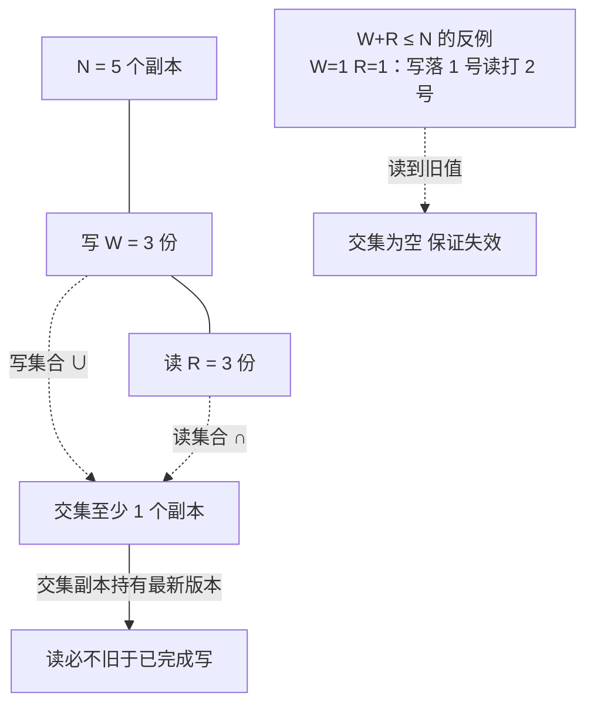

# 复制的三种模式：主从、多主与无主的失败形态

## 要解决的问题

复制要解决的问题，是**单机失效不能带走数据的可用性**。RAID 解决磁盘失效（机器内冗余，见 [[工程知识/数据系统：在并发与故障中保存事实/可靠性与运维/RAID等级与数据可靠性：镜像与纠删的数学.md]]），复制解决机器失效（跨机器冗余）。核心矛盾：多副本带来可用性，但同一数据的多个副本在网络上分处各地，写入怎么同步、冲突怎么解决、故障时怎么切换——每种复制拓扑都在这三个问题上给出不同答案，也各自暴露不同的失败形态。本文写三种基本拓扑（主从、多主、无主）的机制与失败形态，这是理解高可用数据库与分布式一致性的骨架。

## 机制

**主从复制：单点写，同步或异步**。一个主节点接受全部写，把变更日志（binlog/WAL/oplog）发给从节点重放。读可分散到从节点（读写分离）。同步/异步的取舍：同步复制（主等从确认）保证故障切换不丢数据但延迟受最慢从节点拖累；异步复制（主不等）快但主崩溃时未同步的写入丢失。主从的失败形态：**异步丢写**（主宕机时从库落后，切换后已确认的写消失，对用户是数据丢失）；**脑裂**（网络分区时旧主还在接受写，新主已选出，两主并存——必须配 fencing 强制旧主下台，见 [[工程知识/后端系统：在并发、失败与变化中维持服务/分布式可靠性/租约必须配合FencingToken阻止过期持有者.md]]）；**复制延迟读旧**（读己之写在从库读不到，见 [[工程知识/数据系统：在并发与故障中保存事实/事务与存储/复制滞后的一致性补救：读己之写与会话保证.md]]——本篇同步写的姊妹篇）。

**多主复制：多写点，冲突是常态**。多个节点同时接受写，变更互相传播。优点是写可用性高（分区两侧都能写）、异地写延迟低。失败形态集中在**写冲突**：两个主同时改同一行，日志互传时冲突暴露。解法光谱：最后写入胜（LWW，用时间戳，但时钟不可靠，见 [[工程知识/后端系统：在并发、失败与变化中维持服务/分布式可靠性/电源与时钟：UTC与单调钟的工程含义.md]]）；CRDT（冲突解决内建在数据结构里，自动合并）；自定义合并函数。LWW 靠时间戳比大小，机器时钟漂移就让“最后”变成“时钟快的那个”，静默丢写。

**无主复制：客户端直写多数派**。没有主节点，客户端（或协调者）把写发给 N 个副本中的任意若干个，读也直接读多个副本，版本号/时间戳/向量时钟裁决谁新。Dynamo 系（DynamoDB、Cassandra）的法定读写（quorum）：写 W 个副本、读 R 个副本，W+R > N 则读写集合必有交集，读必然覆盖到最新值。quorum 的失败形态：**一致性调优的暗坑**（W=1 快但两个写并发时无仲裁，冲突丢写；W=N 慢但强）；**sloppy quorum**（网络分区时写入临时节点保可用，恢复后回流，可用性换一致性，CAP 的直接体现）；**读修复与 hinted handoff**（读时发现旧副本顺手修、临时节点事后回流）——自愈机制让“最终一致”在正常时看起来像强一致，但分区期间的静默丢写风险真实存在。

## 场景与代价

思想背景：主从是最古老的形态（1980s 的磁盘镜像与早期数据库热备），它假设“写是稀缺的、读是海量的”（互联网读多写少负载），单点写+读扩展是性价比最高的解。多主兴起于离线协作场景（日历同步、CouchDB、Notion 类应用），承认“分区与离线是常态”，把冲突解决搬到数据结构层。无主来自 Dynamo 论文（2007，Amazon，可用性优先的购物车场景），核心洞察是“多数派读写可以不要主”，把选主与切换的开销省掉，代价是把这个开销转移给了开发者（一致性语义变弱，要自己处理旧读与冲突）。

最精巧的一笔是**quorum 的 W+R>N 交集论证**。一行集合论保证读覆盖到写：写集合与读集合在 N 个副本上的交集非空，交集里的副本必然持有最新值。这个数学上极简的保证，让无主系统在任意时刻可调（W+R=N 强，W+R<N 快但可能旧读）——把一致性做成参数，是 Dynamo 系对行业最大的思想贡献。代价要摆明：三种拓扑不是并列选项，是按**业务对丢写与旧读的容忍度**排序的阶梯。主从+同步复制是丢写零容忍的默认选择；多主与无主用一致性换可用性/延迟，适合可以旧读但不能丢数据丢失感知的场景（购物车丢了用户重来，聊天记录丢了不可接受）。选型时先问业务语义：这笔写丢了会怎样？这条读旧了会怎样？答案决定拓扑。

交集论证画出来就一行：N 个副本里写 3 份、读 3 份，两个集合在 5 个副本上至少交 1 个，交集副本必然带着最新版本号。W 与 R 是可调的旋钮——往强调（W=N, R=1），往快调（W=1, R=N），唯独 W+R>N 这条线不能破，破了交集为空（图下的反例：写落 1 号、读打 2 号，读到旧值）。把一致性做成参数，是这套数学对工程最大的便利；参数由业务语义挑，不是默认值说了算。

## 边界

- **同步复制的“不丢”以延迟为价**。同步等确认（semi-sync 等 N 个）让主库写延迟受网络 RTT 放大（同机房 1ms，跨地域 30ms+），跨地域同步复制在数学上受光速约束。异地多活必然异步或多主，“跨地域不丢+强一致”是物理上做不到的组合，见 CAP 详见超时（上文链接）。
- **故障切换不是瞬时事件是窗口**。主宕到新主可写之间的秒到分钟窗口，写全部失败或排队；切换期间“哪台是主”的判定靠共识（consensus：Raft/Paxos），现代数据库把选主内建（etcd 系、MongoDB replica set），老式人工切换的高危操作已进化。但窗口存在本身没变——RTO（恢复时间目标）是 SLA 的一部分。
- **复制不等于备份**。复制防机器失效不防误删（DROP TABLE 在从库同样重放）、不防逻辑损坏（bug 写坏数据，从库忠实复制坏数据）。备份是时间维度的独立防线，见 [[工程知识/数据系统：在并发与故障中保存事实/可靠性与运维/备份的价值由恢复演练来验证.md]]。
- **从库不只是热备，还是读扩展与数据出口**。读写分离分摊读负载；从库做分析查询、CDC 源（见 [[工程知识/数据系统：在并发与故障中保存事实/数据管道与流处理/CDC把数据库变化传播为可重放事实.md]]），把重查询从主库卸载。从库延迟（复制延迟）是读写分离的天花板，延迟大的从库读到的旧数据需要会话保证（姊妹篇）。

## 邺证

- **同步与异步的行为差异实测**：PostgreSQL 同步复制（synchronous_standby_names）与异步配置下插入延迟对比，预期：同步复制延迟增加 1 个 RTT 量级；主库突然断电（或 pg_ctl stop -m immediate）后重启，预期：异步从库存在滞后窗口（某些已确认事务在新主不存在），同步复制无丢失。这是两种模式的代价最直接证据。
- **复制延迟观测**：pg_stat_replication 的 write/lag 字段，压测主库写、从库读，预期：延迟随写压力上升，从库重放有单调趋势；从库滞后造成的“写后立即读”读旧实验（会话保证的实况）。
- **quorum 交集验证**（如有环境）：Cassandra/DynamoDB 调 W/R 参数（W=1,R=1 vs W=N,R=N），并发写读，预期：弱 quorum 下读到旧值概率上升；W+R>N 配置下读不旧于已完成写。参数与行为的对应是交集数学的实证。

## 相关

- [[工程知识/数据系统：在并发与故障中保存事实/事务与存储/复制滞后的一致性补救：读己之写与会话保证.md]] —— 廣场视角：从库延迟的会话级补救
- [[工程知识/后端系统：在并发、失败与变化中维持服务/分布式可靠性/租约必须配合FencingToken阻止过期持有者.md]] —— 切换窗口的脑裂防御
- [[工程知识/数据系统：在并发与故障中保存事实/可靠性与运维/备份的价值由恢复演练来验证.md]] —— 复制与备份的分层防御
相关：[[工程知识/数据系统：在并发与故障中保存事实/可靠性与运维/恢复点目标要先算账：RPO 是数据的时间边界，不是备份频率的同义词.md]] —— 复制延迟进 RPO 合成账
