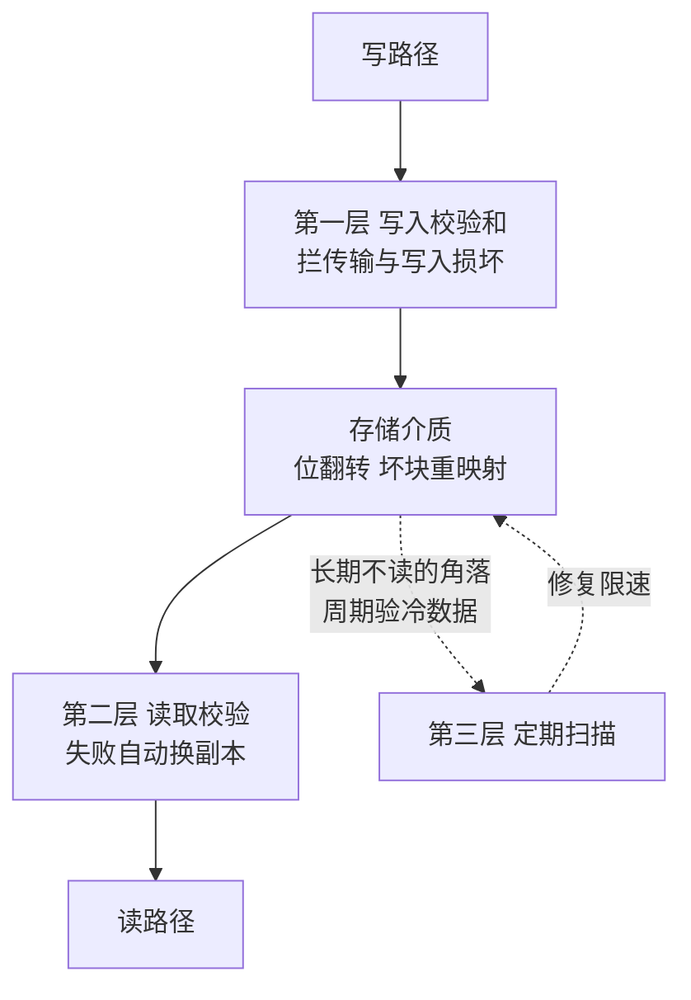

# 存储的静默损坏防线：校验和、副本比对与定期扫描各拦一层

> **要点**：存储介质会"说成功但写坏"——位翻转、坏块静默重映射、固件 bug，错误不报给上层；防线分三层：写入时校验和拦传输与写入磁盘过程中的损坏、读取时校验拦静默劣化、定期扫描与副本比对拦"长期不读的角落"；三层各拦一段，缺一层就有一段盲区。

## 背景与本质：硬件说成功不等于数据还对

静默损坏要解决的问题是：存储链路的每一层都可能改错数据而不报错。磁盘的位翻转（宇宙射线与介质缺陷）、坏块的静默重映射（固件把坏扇区的数据搬丢）、RAID 控制器与文件系统的 bug、传输链路的误码——**这些错误的共同点是写入与读取都"成功"，只是数据不对**。研究表明大规模磁盘群体中静默损坏以年为单位必然出现（年度损坏率在百分位级别，规模化后是确定事件）；**它的问题在"静默"**：损坏的数据被读出、参与计算、随副本扩散，发现时已经污染了下游。本库缺陷分析域"静默数据损坏靠校验与副本投票检出"给过检出机制；本篇把防线分层展开：**三层各自拦截的损坏类型、元数据与数据的校验差异、扫描的成本设计**。

## 机制：三层防线各拦一段

**第一层：写入时校验和（拦传输与写入磁盘过程中的损坏）**。数据写入时算校验和、与数据一起存储，读取时重算比对——**拦截的是"这一份数据从写入到读取之间被改"的所有场景**（传输误码、写入磁盘后位翻转、坏块重映射丢数据）。关键设计是**校验和与数据分离存储**（独立块、独立冗余）：数据块和它的校验和放在一起时，同一坏块可能一起损坏，校验形同虚设。校验算法按出错模式选：CRC 系列拦位翻转与突发错误，哈希系列加防篡改语义——**存储校验用 CRC 级**（硬件级误码的拦截足够），密码学哈希留给信任链场景。校验和的敏感性一眼可见——输入只改一个字母，输出完全变样：


*图源：Wikimedia Commons「Checksum」，作者 Leadaxe，许可 [CC BY-SA 4.0](https://commons.wikimedia.org/wiki/File:Checksum.svg)。*

**第二层：读取时校验（拦静默劣化的暴露）**。每次读都过校验——这一层把第一层存的校验用起来：读时校验失败，上层可以换副本（多副本系统重读其他副本并触发修复）、回退备份或报错。**关键在失败后的动作要自动**：校验失败静默返回坏数据等于没有校验；自动换副本 + 标记坏块 + 触发修复才是完整链路。上游 BookKeeper/ZooKeeper 类系统的 ledger 条目校验、ZooKeeper 的事务日志校验都是这一层的实现——** journal 类高频写入路径的校验尤其关键**（写入失败在提交时才暴露，比读路径的损坏更早污染状态）。

**第三层：定期扫描与副本比对（拦长期不读的角落）**。冷数据（备份、归档、低频分区）可能几年不被读取——校验和存在但从不被验证，损坏在恢复时才暴露（**恢复时才发现备份坏了，这是代价最高的暴露时点**）。定期扫描（scrubbing）把"读时校验"变成"周期校验"：按计划逐块读、验、修；多副本系统做副本比对（同位置数据跨副本比校验和，不一致即修复）。**扫描的成本设计**：全量扫描的成本 = 数据量 ÷ 扫描速率，按"全部数据在一个周期内被验一遍"倒排周期（备份库按备份保留期限约束：扫描周期 ≤ 备份保留周期，保证每份备份在过期前至少被验一次）——扫描的收益是损坏发现时点从"恢复时"提前到"例行扫描时"，代价是持续的扫描带宽占用，限速后两者可以兼得。



图回答的是三层防线怎么组成纵深：写路径与读路径是两条主道，第一层守在写入侧（校验与数据分离存储），第二层守在读取侧（校验失败的动作要自动），第三层是虚线巡逻——冷数据不经过任何主道，只有周期扫描能摸到它；修复流量回到介质时有限速，防止修复风暴把集群压垮。三层各拦一段，缺一层就有一段盲区。

## 看完能判断：元数据与数据的校验差异

**元数据校验的优先级更高**：数据块坏了丢的是一份数据；元数据（索引、目录、manifest）坏了丢的是"找到数据的能力"（整片数据读不出来）——**元数据的校验强度与冗余度都高于数据**（更强的校验、跨设备冗余），这条优先级在自己搭建的存储与选型评估时都适用。

**校验的粒度与成本**：块级校验（每 4KB-1MB 一份校验和）的开销是每块几字节的存储与读取时一次计算——**粒度缩小则定位更准、开销相应上升**；日志型存储（追加写）按条目校验（每条记录自带校验），页式存储按页校验。粒度选择跟修复单元匹配：**修复按块换副本，校验按块算**。

**副本比对与投票**：三副本系统里坏了一份数据还能对（2/3 一致），**副本投票（按校验和多数一致）能同时定位坏副本与恢复好数据**——投票的前提是"多数副本同时坏同一位置"概率可忽略，副本分散在不同故障域（本库硬件域"退役与冗余"的同域约束）是前提。

## 边界

三条边界防止防线走形。

**校验和不防逻辑错误**：应用把错误数据写进来（业务 bug、上游污染），校验和忠实地为错误数据背书——**校验拦介质与传输损坏，逻辑错误靠业务校验与对账**，两层各自的领地不重叠。

**修复动作要限速**：扫描发现坏块触发副本修复，修复流量与业务共享带宽——**修复速率要限流**（本库性能域"节流与容量匹配"原则），大规模修复风暴本身能把集群压垮。

**加密与压缩在校验的下游**：先校验后加密/压缩的顺序错了会把密文当数据校验（校验失败但数据其实完好，或反之）——**校验作用于明文层**，链路顺序是校验 → 压缩 → 加密。

## 验证

可复现的验证路径：

1. 损坏注入：测试环境对存储块注入位翻转，预期读时校验失败、自动换副本、坏块标记、修复任务触发——三层链路逐段可核；
2. 副本比对演练：手动篡改一个副本的数据，预期比对任务检出、投票结果按多数恢复；
3. 扫描周期验证：核对扫描计划覆盖全部数据的周期与备份保留周期，预期每份备份过期前至少被扫描一次；
4. 断言锚点：**写入校验在存储路径默认开启、校验失败的处理动作（换副本/标记/修复）自动化、扫描任务按周期排程且有完成率监控**——三件齐备，静默损坏从"恢复时才发现"变成"定期被修掉"。

```text
校验断言 = 写入校验与分离存储默认在
动作断言 = 校验失败自动换副本并修复
扫描断言 = 全量数据周期内验一遍
```

静默损坏的防线是纵深：写入校验拦住每一笔的损坏，读取校验让损坏在暴露时被换掉，定期扫描把不读的角落也验到——三层配齐，"硬件说成功"才有资格被当作可信。

## 相关

- [[工程知识/缺陷分析：从个案到体系/硬件故障/静默数据损坏靠校验与副本投票检出：硬件说成功不等于数据还对.md]] —— 检出机制与投票的缺陷分析视角
- [[工程知识/缺陷分析：从个案到体系/硬件故障/磁盘坏道与静默损坏的检测修复路径.md]] —— 磁盘层面的坏道处理
- [[工程知识/数据系统：在并发与故障中保存事实/可靠性与运维/复制的三种模式：主从、多主与无主的失败形态]] —— 副本冗余是比对与投票的前提
- [[工程知识/数据系统：在并发与故障中保存事实/可靠性与运维/备份的价值由恢复演练来验证]] —— 扫描周期受备份保留期限约束的推理
