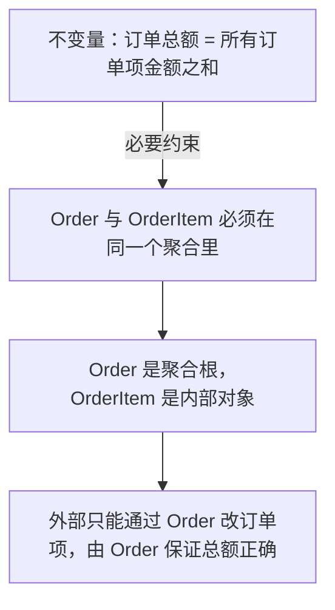

# 聚合边界由业务不变量而不是 ER 图决定

它解决的是数据库表能分别保存成功，但业务规则在并发更新后被破坏的问题。聚合把必须原子保持的不变量圈进一个写入边界，并只允许外部通过聚合根修改；收益是规则有唯一入口，代价是聚合过大会增加冲突和加载成本。边界不由 ER 图、外键或对象引用数量决定，而由“哪些事实必须同时成立”决定。

## 要解决的问题：跟着数据库表设计出来的一团泥（本质）

照着 ER 图建了对象：`Order`、`OrderItem`、`User`、`Address`、`Payment`、`Shipment`，互相都有引用。

然后业务代码变成：

```go
// 下单时要保证：总金额 = 各项之和，且库存够
order := repo.Find(id)
for _, item := range order.Items {
    item.Price = calcPrice(item)     // 改单项
}
order.Amount = sum(order.Items)      // 再改总额
repo.Save(order)
repo.SaveItems(order.Items)          // 分别保存
```

问题在并发下暴露：两个请求同时改订单项，**总额和明细对不上**。

根本原因：**"总额必须等于明细之和"这个不变量，跨越了 Order 和 OrderItem 两个对象，没有任何东西强制它们一起更新。**

## 方案：把不变量圈进一个边界

### 聚合的定义

**聚合 = 一组必须保持一致的对象，有一个根（Aggregate Root），外部只能通过根访问。**

划定边界的唯一依据：**不变量（invariant）**——那些"必须永远成立"的业务规则。



### 设计规则

**规则 1：聚合内强一致，聚合间最终一致**

这是最重要的一条。跨聚合的一致性用事件/消息实现，**不要试图用事务保证**。

```
Order 聚合（强一致）：订单 + 订单项 + 金额
Inventory 聚合（强一致）：库存 + 锁定量

订单扣库存 → 跨聚合 → 用事件最终一致
```

**规则 2：聚合要小**

聚合越大，并发冲突越多（因为整个聚合被锁）。

| 做法 | 后果 |
| --- | --- |
| 聚合太大（User 包含所有订单） | 改用户信息锁住整个用户的所有订单 |
| 聚合太小（每个字段一个聚合） | 不变量无法保证 |

**判断标准：能小就小，只要不变量还在边界内。**

**规则 3：聚合之间通过 ID 引用，不通过对象引用**

```go
// 差：直接持有对象
type Order struct {
    User *User      // 加载订单会连带加载用户
}

// 好：只存 ID
type Order struct {
    UserID UserID   // 需要用户信息时单独查
}
```

**为什么**：对象引用会让聚合边界失效（改一个聚合能摸到另一个），且加载成本高。

**规则 4：一个事务只修改一个聚合**

如果必须改两个聚合，用领域事件：

```
事务 1：修改 Order（发布 OrderPlaced 事件）
事务 2（异步）：修改 Inventory（消费事件）
```

### 实现：聚合根保证不变量

```go
type Order struct {
    id     OrderID
    items  []OrderItem   // 私有，外部无法直接改
    amount Money
}

// 唯一的修改入口，保证不变量
func (o *Order) AddItem(product ProductID, qty int, price Money) error {
    if o.status != StatusPending {
        return ErrOrderNotModifiable
    }
    o.items = append(o.items, OrderItem{product, qty, price})
    o.amount = o.recalculate()   // 总额在这里重算，不可能不一致
    return nil
}

func (o *Order) recalculate() Money {
    var total Money
    for _, it := range o.items {
        total = total.Add(it.Price.Mul(it.Qty))
    }
    return total
}
```

**关键：`items` 私有 + 唯一入口 + 不变量在入口处保证。** 外部无法构造出"总额和明细不一致"的订单。

## 效果与代价

**收益**

- **不变量由类型保证**：编译期/构造期就不可能造出非法状态
- **并发冲突减少**：小聚合 = 小锁粒度
- **边界清晰**：哪些是强一致（聚合内），哪些是最终一致（跨聚合），一目了然

**代价**

- **需要识别不变量**：这要和领域专家反复确认，不是看代码能得出的
- **跨聚合查询变麻烦**：不能 `order.Items` 直接拿了，要单独查询。**通常需要读模型（CQRS）配合**
- **边界划分错误的代价高**：边界划错后重构成本大——因为聚合是领域的核心结构
- **团队需要共同理解**：聚合概念需要团队达成共识，否则会退回 ER 图思维

## 从什么地方做

**第一步：列出所有不变量**

问业务方："什么条件必须永远成立？"

- 订单总额 = 明细之和
- 库存不能为负
- 已发货的订单不能取消
- 账户余额不能小于 0

**每一条不变量都对应一个聚合边界。**

**第二步：按不变量分组，而不是按表分组**

把必须一起保持一致的对象圈在一起。**ER 图上的外键不代表聚合边界。**

**第三步：检查聚合是不是太大**

如果一个聚合有 10 个以上的实体，问：**它们真的都需要强一致吗？** 很多时候"用户地址"不需要和"订单"强一致。

**第四步：用 ID 替换对象引用**

逐个把跨聚合的对象引用改成 ID。**这一步会让一些隐式依赖暴露出来**——那些"以为能用其实不该用"的引用。

**第五步：给聚合根写不变量测试**

```go
func TestOrderAmountAlwaysMatchesItems(t *testing.T) {
    o := NewOrder()
    o.AddItem(p1, 2, money(10))
    o.AddItem(p2, 1, money(15))
    assert.Equal(t, money(35), o.Amount)   // 不变量
}
```

## 常见错误

**错误 1：照着数据库表建对象**

ER 图是存储结构，不是领域模型。**外键关系不等于聚合关系。**

**错误 2：聚合过大**

把整个"用户"做成一个巨大聚合，包含订单、地址、支付、偏好。**结果：任何用户相关操作都锁住整个用户。**

**错误 3：在应用层保证不变量**

不变量的检查写在 service 里 → 换一个 service 调用就绕过。**不变量必须在聚合根内部保证。**

**错误 4：跨聚合用事务**

为了"保证一致"用分布式事务锁两个聚合。**应该接受最终一致，用事件。**

**错误 5：聚合之间双向引用**

`Order.User` 和 `User.Orders` 互相持有 → 循环依赖，加载成本爆炸。**单向引用 + ID。**

相关：[[工程知识/软件构建：让变化可以理解、验证与交付/架构与代码/状态机把隐式状态变成显式约束]] · [[工程知识/软件构建：让变化可以理解、验证与交付/架构与代码/分层与依赖方向决定可测试性和演进成本]]
