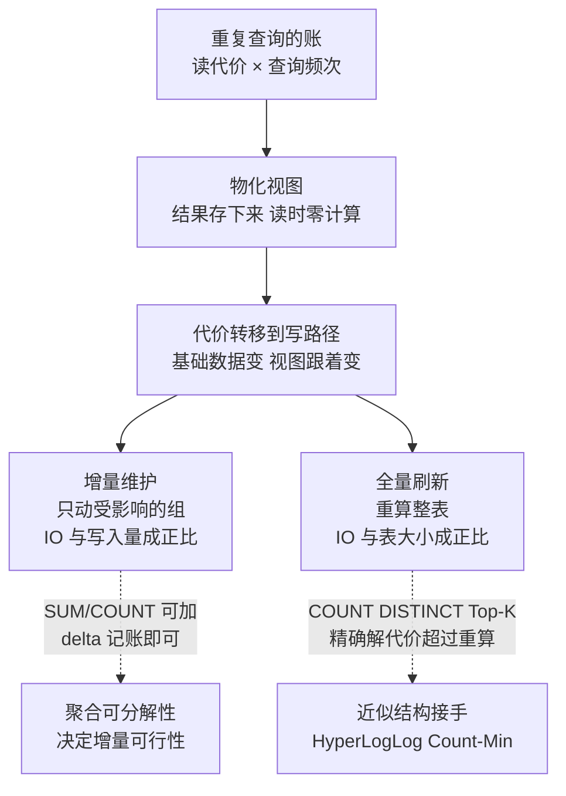

# 物化视图把重复计算变成增量维护

每五分钟跑一次的报表 SQL，读的是同一批数据、算的是同一个聚合，每次都从零扫描。要解决的问题：查询代价与查询频次的乘积被重复支付。物化视图（materialized view）把查询结果存下来，读时零计算；代价转移到写路径——基础数据每次变化，视图要跟着更新。它本质是把计算从读时挪到写时，与 [[工程知识/数据系统：在并发与故障中保存事实/数据建模与SQL/聚合边界由业务不变量而不是ER图决定]] 的"读时计算 vs 写时计算"是同一取舍家族。

## 机制：三种维护策略

| 策略 | 刷新时机 | 一致性窗口 | 适用 |
| --- | --- | --- | --- |
| 定时全量 | cron/手动 REFRESH | 两次刷新之间 | 小表、可容忍滞后 |
| 增量维护 | 基础表写入触发 delta 更新 | 秒级 | 聚合可分解（SUM/COUNT 可加） |
| 流式物化 | Flink/流引擎持续算 | 毫秒级 | 实时大屏、风控 |

代价从读路径挪到写路径的完整账：



图回答的是物化视图的核心交换：查询代价与频次的乘积一次性换成写路径的持续维护——增量维护按写入量记账（每次只动受影响的组），全量刷新按表大小记账（每次重算整表），两条虚线把可行性判据挂出来：聚合函数可分解（SUM/COUNT/AVG 分量）走增量，不可分解（COUNT DISTINCT、Top-K）用近似结构换。选错维护策略的形态在刷新风暴一节展开。

聚合可分解性决定增量可行性：SUM/COUNT/MIN 可加，delta 记账即可；AVG 存 SUM+COUNT 两个分量再相除；COUNT DISTINCT 与 Top-K 需要近似结构（HyperLogLog、Count-Min Sketch），精确解的增量维护代价可能超过重算。

## 刷新风暴与并发读写

全量刷新的问题：扫全表期间视图被锁或读到半新半旧。PostgreSQL 的 REFRESH CONCURRENTLY 走临时结果 + 原子切换；流式引擎用 checkpoint 保证视图版本与基础表位点对齐。并发读的隔离语义：读到的视图对应基础表的某个一致快照，不是"正在变化的部分状态"，这与 [[工程知识/数据系统：在并发与故障中保存事实/事务与存储/事务隔离决定并发读写能观察到什么]] 的快照读同族。

## 可运行示例与案例回流：增量维护的账

可运行示例：一个"每渠道每日销售额"的物化视图，两种维护方式的代价：

```sql
-- 定义：物化视图 = 预算好的查询结果
CREATE MATERIALIZED VIEW sales_by_channel AS
SELECT dt, channel, SUM(amount) AS total, COUNT(*) AS cnt
FROM orders GROUP BY dt, channel;

-- 方式 A：全量刷新（每小时重算整表）
REFRESH MATERIALIZED VIEW sales_by_channel;
-- 10 亿行基表 → 每小时扫全表一次，IO 与 CPU 恒定高企

-- 方式 B：增量维护（基表写入时只动受影响的组）
-- 新写入：orders 追加 (2026-09-23, app, 88) 一行
-- 维护动作：只对 (2026-09-23, app) 这一组做聚合合并
--   total += 88, cnt += 1   → IO 与写入量成正比，与表大小无关
-- 支持增量聚合的函数：SUM/COUNT/AVG（可合并求和），MIN/MAX（可比较合并）
-- 不支持的：MEDIAN、COUNT(DISTINCT)（需 HLL 等近似结构替代）
```

案例回流：物化视图与源表不一致的实录形态——刷新延迟窗口内读到旧值（最终一致），报表对不上实时大屏，两种读法要对同一延迟语义达成一致（要么都读视图，要么标刷新时间戳）；[[工程知识/数据系统：在并发与故障中保存事实/数据管道与流处理/数据编排要保证依赖、重试与幂等.md]] 的幂等纪律直接适用——增量维护的合并动作天然可重放（加两次同一行会算重），任务身份与去重键在这里同样是安全线。

## 验证

验证的锚点：增量维护要与全量重算对账——预写写入已知增减量后刷新得到的视图值应与全量重算完全相等，不等即与预期对不上，说明增量逻辑漏了分支。

- PostgreSQL：EXPLAIN ANALYZE 对比物化前后的查询计划与耗时；刷新期间并发 SELECT 是否阻塞（锁等待事件）。
- 增量正确性：基础表写入已知 delta（+10 条、-3 条），刷新后视图值与全量重算值必须相等——这是不变量检查，方法见 [[工程知识/缺陷分析：从个案到体系/正确性/静默失真的检测靠对账与不变量而不是报错]]。
- ClickHouse/Flink：物化视图的滞后（view lag）作为 SLI 持续监控，滞后超过 SLO 的刷新周期要报警。

## 边界

- 物化视图是读优化的空间换时间，不是正确性保证：视图与基础表的一致性靠刷新机制承诺，机制坏了就是静默失真，对账是必须的防线。
- 复杂连接的增量维护可能退化为重算：join 键分布变化、多级视图级联刷新，代价结构在 [[工程知识/数据系统：在并发与故障中保存事实/数据管道与流处理/批处理与流处理共享逻辑但不共享时间语义]] 的时间语义下才谈得清。
- 写入洪峰时增量维护自身成为瓶颈：视图更新的写放大与 LSM 的 compaction 竞争同一批 I/O（[[工程知识/数据系统：在并发与故障中保存事实/事务与存储/LSM树用写放大换取顺序写和可扩展性]]）。

## 相关

- [[工程知识/数据系统：在并发与故障中保存事实/数据建模与SQL/聚合边界由业务不变量而不是ER图决定]]：物化视图物化的往往就是聚合，聚合边界决定哪些视图可物化
- [[工程知识/数据系统：在并发与故障中保存事实/数据治理/数据质量与血缘让指标可以被解释]]：视图是血缘链的节点，级联刷新的血缘导航
- [[工程知识/数据系统：在并发与故障中保存事实/查询与索引/列式存储把扫描与压缩交给分析路径]]：分析型物化视图的存储底座
- [[工程知识/数据系统：在并发与故障中保存事实/查询与索引/列存与向量化执行：OLAP引擎快的两个来源.md]] —— 宽行预拼的物化方案
