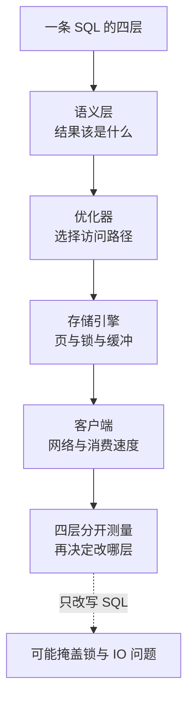

# 一条 SQL 如何穿过优化器与存储引擎

一条 SQL 的结果和耗时是多层共同产物：语义决定“应该得到什么”，优化器决定“怎样访问”，存储引擎决定“怎样读写页和锁”，客户端还可能在等待网络或消费结果。把这些层分别看清楚，才能避免用改写 SQL 掩盖锁、I/O 或连接池问题。

## 核心模型

```text
客户端/连接池
  -> 连接器：认证、权限、连接状态
  -> 解析器：词法和语法
  -> 预处理/语义检查：表列、权限、类型
  -> 优化器：重写、索引、JOIN 顺序、访问路径
  -> 执行器
  -> 存储引擎（InnoDB）：页、索引、Buffer Pool、事务、锁
  -> 结果集/影响行数
```

Server 层负责协议、解析、优化和 binlog；InnoDB 负责数据页、索引、MVCC、行锁、redo/undo。排障时先判断问题属于哪一层，否则容易把“SQL 写法问题”和“磁盘/锁问题”混为一谈。

同一条 SQL 变慢，可能是统计信息让优化器选了错误路径，也可能是锁等待、Buffer Pool 未命中、磁盘抖动或客户端读取过慢。先把逻辑计划、物理执行、存储等待和结果传输分开测量，才能避免用改 SQL 掩盖系统层瓶颈。

SQL 文本、执行计划和端到端耗时是三个不同观测面；只贴一张 `EXPLAIN` 不能证明线上瓶颈，也不能证明结果在并发下仍然正确。



图回答的是耗时的归属：同一句变慢可能出在四层任何一层——语义层是结果集设计，优化器是统计信息与成本估算，存储引擎是页读写与锁等待，客户端是结果消费速度。四层的测量手段不同（EXPLAIN、performance_schema、锁等待视图、应用侧计时），先把每层分开量，才能避免用改写 SQL 掩盖锁或 I/O 的真实瓶颈。

## 最小路径实验

用固定数据和参数分别执行一次冷缓存、热缓存、无竞争和有锁等待的查询，保存 `EXPLAIN ANALYZE`、实际行数、锁等待、Buffer Pool 命中、磁盘 I/O 和客户端耗时。对照后再决定是改索引、改事务范围还是改连接/网络配置。

## 查询路径

1. 连接池复用连接，但长连接会积累会话状态和内存；连接池应设置上限、空闲回收和断开重连。
2. 优化器根据统计信息估算扫描行数和成本。`EXPLAIN` 是估算计划，不能代替真实行数和线上指标。
3. InnoDB 以页为 I/O 单位，通常页大小为 16 KB。Buffer Pool 命中时避免磁盘访问；二级索引命中后可能需要回表到主键索引。
4. 普通 `SELECT` 使用一致性读，不主动加行锁；`FOR UPDATE`、`FOR SHARE` 和 DML 使用当前读并参与锁竞争。
5. 结果返回还可能受排序、临时表、网络传输和客户端消费速度影响；`Sending data` 不是“正在发送”这一种含义，也可能代表扫描和计算。

## 更新路径

```text
定位目标行 -> 当前读/加锁 -> 修改 Buffer Pool 中的数据页
          -> 写 undo（回滚/MVCC）和 redo（崩溃恢复）
          -> 提交时与 binlog 协调（两阶段提交）
          -> 返回客户端，后台刷脏页
```

提交成功不等于数据页已经同步写回表文件；在正确的持久性配置下，redo 已写入磁盘即可在崩溃后恢复。更新索引列时还要维护相应 B+Tree，可能触发页分裂和额外写放大。

## 读写检查清单

- 用 `EXPLAIN`/`EXPLAIN ANALYZE`（版本支持时）核对访问类型、估算与实际行数、`key`、`rows`、`filtered`、`Extra`。
- `Using filesort`、`Using temporary`、大量回表、扫描行数远大于返回行数，都是进一步调查信号，不是单独的定罪结论。
- 检查隐式类型转换、索引列函数、前导通配符、错误的 JOIN 顺序和过大的分页偏移。
- 把慢日志按 digest 聚合，结合 `performance_schema`、锁等待、Buffer Pool 命中和磁盘 I/O 看完整链路。
- 查询只取需要的列，限制结果集和超时；大结果集采用分页/流式读取，避免应用和数据库内存同时被打满。

## 常见误区

- 查询缓存不是通用加速器；表一旦更新，相关缓存会大面积失效，MySQL 8.0 已移除查询缓存。
- `SELECT` 快不代表系统健康。连接排队、锁等待、磁盘抖动或客户端不消费结果，都可能让端到端延迟升高。
- 优化器“选错索引”通常是统计信息、数据分布或成本估算不准，不要第一反应永久固定 `FORCE INDEX`；先更新统计、重写查询并验证。

## 关联页面

- [[工程知识/数据系统：在并发与故障中保存事实/查询与索引/B+Tree索引为访问路径服务]]
- [[工程知识/数据系统：在并发与故障中保存事实/事务与存储/事务隔离决定并发读写能观察到什么]]
- [[工程知识/数据系统：在并发与故障中保存事实/可靠性与运维/InnoDB用日志连接事务、恢复与复制]]
- [[工程知识/数据系统：在并发与故障中保存事实/可靠性与运维/MySQL空间、容量与在线运维]]

机制与本质：一条查询的执行路径由优化器按统计信息估算成本后选定，本质问题在于估算行数与实际行数偏离越大，选出的访问路径离最优越远。

适用边界：计划结论只在该表的数据分布与统计信息新鲜度下成立——数据量级或分布变化后要重新执行 `ANALYZE` 并复核计划。

## 验证

验证的锚点：优化器的选择要与执行计划对账——`EXPLAIN` 看到的计划与手写 SQL 的预期对账（索引选没选、join 顺序对不对），统计信息过期导致的计划偏差用 `ANALYZE` 修正，hint 只作逃生门，日常手段靠统计信息与查询改写。

1. 计划对照：对同一条查询先后执行 `EXPLAIN` 与 `EXPLAIN ANALYZE`，比对各节点的估算行数与实际行数、访问类型与命中的索引，偏差明显的节点即为统计信息或谓词写法的问题所在。
2. 耗时分布：把慢日志按 digest 聚合，配合 `performance_schema` 的语句统计、锁等待与 Buffer Pool 命中，确认耗时出在优化器估算、存储读写还是客户端消费。
3. 改写等价性：对每处查询改写，在相同数据上返回完全一致的结果集，再比对改写前后的执行计划与耗时。
4. 客户端侧核对：在应用侧记录结果集消费用时，与数据库侧执行用时相比对，区分数据库繁忙与客户端未及时读取。
5. 断言锚点：计划估算与实际行数逐节点核对过，耗时归因有数据支撑，改写经过等价性测试。

## 要解决的问题

一条查询变慢之后，团队直接改写 SQL，改写之后耗时变化但原因不明，锁等待、存储读写与客户端消费各自的影响无法区分。本篇回答：语义、优化器、存储引擎与客户端四层各自决定什么、耗时在多处等待中的分布怎样观察、每一层的输出用什么方式核对，以及什么情况下改写语句会掩盖真正的问题。

