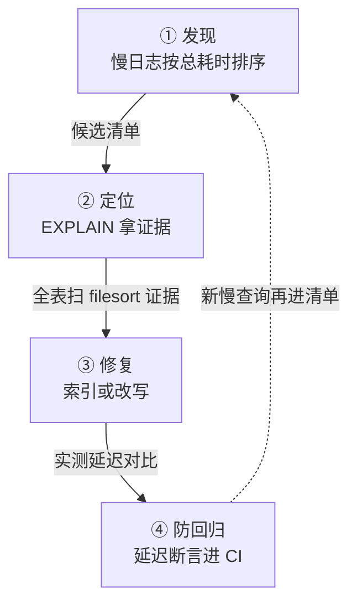

# 慢查询治理从发现到索引闭环

数据库的延迟毛刺、CPU 突刺、连接池耗尽，追到底常常是几条慢查询。要解决的问题：数据层的"日常怎么做"（观测与治理的闭环纪律）当前覆盖薄，本篇给出从发现、定位、修复到防回归的完整操作闭环，让慢查询治理从"救火"变成"例行"。

## 机制：四步闭环与工具表

| 步骤 | 动作 | 工具 | 产出 |
| --- | --- | --- | --- |
| 发现 | 慢查询日志持续收集 + 阈值告警 | slow log（MySQL）、pg_stat_statements（PG） | 候选清单（按总耗时排序，不是单次耗时） |
| 定位 | 执行计划分析 | EXPLAIN / EXPLAIN ANALYZE | 全表扫、索引失效、rows 估算偏差的证据 |
| 修复 | 索引设计或 SQL 改写 | 覆盖索引、前缀索引、延迟关联 | 修复后计划与实测延迟 |
| 防回归 | 把修复前后的延迟断言进 CI | 基准测试（sysbench 类） | 回归即拦截 |

排序纪律的关键：按"总耗时 = 单次耗时 × 频次"排序，单次 10 秒但每天跑 3 次的查询排不过单次 200ms 但每秒跑 500 次的。收益是治理动作集中在真实大头上；代价是索引本身有写放大（每个索引都拖慢写入），加索引前要权衡读写比——索引不是免费的。Use The Index Luke 是索引设计的免费权威教程，覆盖了大多数失效模式。

## 案例回流：一条慢查询的闭环实录

案例回流（通用形态）：`SELECT ... WHERE user_id = ? AND status = ? ORDER BY created_at DESC LIMIT 20`，单表两千万行，P99 4 秒。发现：慢日志聚合到该模板（聚合按 fingerprint，不看参数值）。诊断：`EXPLAIN` 显示 type=ALL 全表扫 + filesort——复合索引缺失。决策：建 `(user_id, status, created_at)` 三列复合索引，顺序按"等值列在前、排序列在后"的原则，同时评估写放大（该表写 QPS 200，索引加一列的写代价可接受）。验证：新索引后 P99 降到 15ms，且执行计划从 filesort 变为 index range scan。收尾：观察两周确认优化器稳定选中新索引（统计信息更新后才稳定），把索引决策记入 schema 变更单——闭环的最后一环是"决策有记录"，下次同类查询直接复用决策依据。反例形态见 [[工程知识/数据系统：在并发与故障中保存事实/查询与索引/慢查询治理从发现到索引闭环.md]] 的邻篇 [[工程知识/数据系统：在并发与故障中保存事实/查询与索引/列式存储把扫描与压缩交给分析路径.md]]——分析型查询（全表聚合）在该场景加行级索引是方向性错误，治理闭环的第一步是判断查询形态属于哪条路径。



闭环的四步各有一个产出物：发现步产出按总耗时（单次耗时乘频次）排序的候选清单，定位步产出 EXPLAIN 的证据（全表扫、filesort、rows 估算偏差），修复步产出实测延迟对比，防回归步把断言写进 CI 拦截复发。虚线是闭环成立的条件——新慢查询持续进候选清单，治理才是例行，救火只在闭环断开时发生。

## 验证

```bash
# 发现：开启并轮转慢查询日志
SET GLOBAL slow_query_log = 1; SET GLOBAL long_query_time = 0.2;
mysqldumpslow -s t /var/log/mysql/slow.log | head -20
# 定位：看真实执行计划
EXPLAIN ANALYZE SELECT ... ;
# 修复后：同负载压测对比 p99
sysbench oltp_read_only --threads=32 --time=60 run
```
预期：闭环跑一轮后 TOP20 慢查询的总耗时占比下降（健康目标：TOP20 占比 < 30% 总数据库时间）；p99 延迟在压测中可复现地改善。数字对不上（加索引后没变快）时先查优化器是否真的选了新索引（EXPLAIN 确认），再查统计信息是否过期（ANALYZE TABLE）。

## 边界

本篇讲查询性能的治理闭环。单条 SQL 怎么穿过优化器与存储引擎（机制深度）见 [[工程知识/数据系统：在并发与故障中保存事实/查询与索引/一条SQL如何穿过优化器与存储引擎|一条SQL如何穿过优化器与存储引擎]]。索引结构本身（B+Tree 为什么适合）见 [[工程知识/数据系统：在并发与故障中保存事实/查询与索引/B+Tree索引为访问路径服务|B+树用页与有序结构换取范围查询能力]]。存储引擎的三放大权衡（加索引的写代价来源）见 [[工程知识/数据系统：在并发与故障中保存事实/事务与存储/读写三放大是存储引擎的中央权衡|读写三放大是存储引擎的中央权衡]]。观测侧的全链路视角见 [[工程知识/性能工程：从用户等待到资源瓶颈/观测与诊断/性能剖析与火焰图|性能剖析与火焰图]]。

## 相关

- [[工程知识/数据系统：在并发与故障中保存事实/查询与索引/一条SQL如何穿过优化器与存储引擎]]——慢在哪一步的机制深度
- [[工程知识/数据系统：在并发与故障中保存事实/事务与存储/读写三放大是存储引擎的中央权衡]]——加索引的写代价
