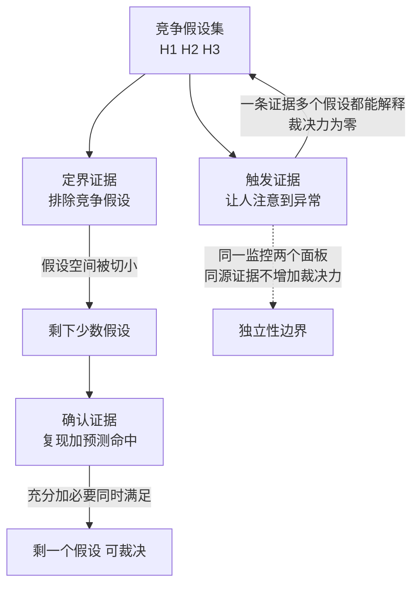

# 证据链的够用判据——从孤证到可裁决

排查缺陷时，证据够不够用没有天然标准：多采总是更安全，但排查有成本与时效；少采快出结论，但结论可能是错的。判据问题在复现（见 [[工程知识/缺陷分析：从个案到体系/复现与回归/从复现到回归——让证据走完一圈]]）与回归之间被反复遇到，这里给它一个显式标准：**证据链的够用判据是"能裁决假设"——每个竞争假设都有证据支持或排除，且证据间互相独立**。

孤证的问题不是数量少，是**不能裁决**：一个现象可以同时被多个假设解释时，一条证据不改变假设间的相对可信度。反之，两条互相独立的证据可以把假设空间切到只剩一个。

## 证据的三种角色

| 角色 | 作用 | 缺失的后果 |
| --- | --- | --- |
| 触发证据 | 让人注意到异常存在 | 问题继续潜伏 |
| 定界证据 | 排除竞争假设 | 结论停留在"可能" |
| 确认证据 | 把因果关系确证（复现/预测命中） | 修复了但不知道为什么好 |

常见失败形态是只有触发证据就动手修：监控报警（触发）→ 看到代码里有个可疑之处 → 改了 → 报警消失。报警消失可能因为修复生效，也可能因为负载自然回落——没有确认证据（复现条件与预测命中），回归发生后无法判断是修复无效还是新问题。库内案例二十四（并行度被自己折叠）的排查路径就是反面教材的对照：从现象到配置到并行度证据，每一环都有下一环的预测验证。

三种角色对假设空间的裁决力各不相同，孤证与完整链的对照：

图回答的是裁决力怎么长出来：触发证据只证明异常存在（一个现象多个假设都能解释，相对可信度不变）；定界证据把假设空间切小（排除掉的假设不再回来）；确认证据把充分与必要同时钉住（复现证明条件充分、预测证明条件必要），假设空间收敛到一个点。虚线是独立性的反面样本：同一个采集端的两个面板互相印证是同源证据，裁决力不增加，只增加确认感。三问都过才可出结论，任一不过标待证。

## 独立性判据

两条证据独立，指它们**不经过同一条产生路径**。典型反面：用同一个监控系统的两个面板互相印证——采集端同一个 bug 会同时骗过两个面板。独立性要沿证据产生链往上查：日志 A 与日志 B 由同一进程写入，进程的日志逻辑有 bug 就同错；日志与该进程的 Trace 由不同子系统产生，独立性更好。

最小独立集的构造：一个假设的确认至少要**一条复现证据 + 一条预测证据**——复现证明"条件充分"（满足这些条件必然出错），预测证明"条件必要"（不满足时确实不出错）。只有复现没有预测，可能是巧合相关；只有预测没有复现，可能改对了症状而非根因。

## 够用判据的操作化

对每个竞争假设问三个问题：

1. 有没有证据**只**与它一致（与其他假设矛盾）？
2. 这些证据是否来自不同产生路径？
3. 反向假设（"其实是 X"）有没有被证据排除而不是被直觉排除？

三问都过，证据链够用，可以出结论；任一不过，结论标"待证"继续采证。这个判据也解释了为什么"再多看几条日志"经常无益：新增日志与已有日志同源，不增加裁决力，只增加确认感。

## 从个案到体系

证据链判据的体系价值在**回归防护**：确认证据（复现条件）直接转化为回归测试的用例；定界证据里的排除项转化为测试的边界用例（证明修复没有顺带破坏相邻行为）。一条证据链的价值不止于本次排查，在于它沉淀成的测试与监控。这也是 [[工程知识/软件构建：让变化可以理解、验证与交付/测试与交付/发布门禁必须绑定真实证据]] 要求门禁绑定证据的原因——门禁消费的就是证据链的产出。

AI 系统里证据链同样成立且更紧迫：模型给出的结论（触发证据）必须配上执行证据才能采信，这条原则见 [[工程知识/AI 系统工程：从模型能力到生产能力/安全与治理/执行证据必须独立于AI结论]]。

## 边界

判据本身有成本边界：三问适合**值得深挖的缺陷**（复发型、伤业务底线、影响面大），一次性、低价值的环境问题不值得构造完整证据链，快速验证后关闭即可。判断标准与影响面估算衔接（见 [[工程知识/缺陷分析：从个案到体系/影响判断/影响面估算先于修复——从改一行到伤多少服务]]）：影响面大才配得上完整证据链。

另一个边界是时效：线上事故优先止血，证据链可以在止血后补齐——但止血动作本身要记录（改了什么、何时），否则事后补链时止血会污染现场。

## 验证

验证的锚点：结论可裁决要与三角色齐备对账——预写触发、确认与排除三种证据都有对应，只有触发证据而确认缺失，与预期对不上，该结论降级为待证。

对每个已结案的缺陷，把证据链按三角色标注一遍，检验是否有角色缺失。常见发现是确认证据缺失（修好了但没复现证据），这类条目是回归风险清单的第一批候选。

反向验证：拿一条只有触发证据的历史结论，找它的竞争假设，检查该假设是否真的被排除过。找到未被排除的假设，说明当时判据不满足，该结论应降级为"待证"。

## 要解决的问题

排查缺陷时证据采到什么程度才算够用没有显式标准，多采总是更稳妥但要付出成本与时间，少采则结论可能建立在未被排除的其他可能性上。本篇回答：够用判据怎样用裁决能力表达、各类证据之间为什么要互相独立、止血动作与证据采集的先后怎样安排，以及只有单一触发证据的结论应当按什么处理。

## 相关

关系：[[工程知识/缺陷分析：从个案到体系/复现与回归/从复现到回归——让证据走完一圈]] · [[工程知识/AI 系统工程：从模型能力到生产能力/安全与治理/执行证据必须独立于AI结论]] · [[工程知识/软件构建：让变化可以理解、验证与交付/测试与交付/发布门禁必须绑定真实证据]]

- [[工程知识/缺陷分析：从个案到体系/症状到机制的判定树——新缺陷的归类入口]] —— 证据采集前的归类
- [[工程知识/软件构建：让变化可以理解、验证与交付/测试与交付/调试从假设到最小复现]] —— 复现证据的构造方法
- [[工程知识/性能工程：从用户等待到资源瓶颈/观测与诊断/指标、日志、Trace与剖析各答一问，合起来才构成证据]] —— 证据类型选择的输入
