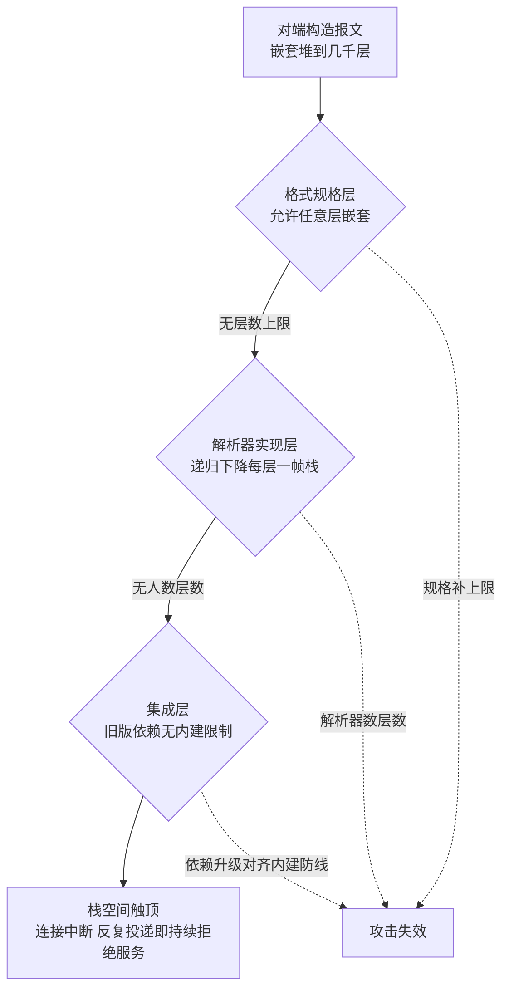

# 解析器的递归深度：对端可以决定你的调用栈有多深

> **要点**：自递归的消息格式遇到递归下降的解析器，报文嵌套多少层、解析器递归就多深——对端用一条报文决定你调用栈的深度，栈溢出即服务中断，反复投递即持续拒绝服务。

## 要解决的问题

数据格式的规格定义里常有自引用结构（嵌套消息、嵌套分组、任意层级的树），解析器的自然实现是递归下降——遇到嵌套就调自己。这两件事单独看都正常，组合起来是一条攻击通道：**报文由对端构造，对端把嵌套堆到几千层，解析器的调用栈就跟到几千层**，栈空间耗尽，解析崩溃。Apache BookKeeper 的一个真实病例（上游 commit b9c567cb，已在本环境真实复现）：对端向 bookie 端口发送嵌套数千层未知 group 字段的 protobuf 报文，解析入口没有递归深度限制，解码时栈溢出、连接中断——单条报文即可让这台**被多客户端共享的存储节点**无法处理正常请求，攻击者反复投递即构成持续拒绝服务，且服务不会自愈。

这类缺陷的杀伤力来自三个放大器。**共享节点**：bookie 是多账本共享的存储层，打瘫一台，上面全部租户的读写都受影响；**低成本**：攻击的代价是一条几 KB 的报文，防御的代价是服务的可用性；**不自愈**：栈溢出发生在解码线程，崩溃的连接不会带崩进程，但反复投递让"可用窗口"趋近于零——修复前的系统在攻击面暴露期间实际等于下线。

protobuf 官方安全指引把递归深度限制列为核心防线，各语言运行时随后内建了深度上限——但**上限只在解析器启用了对应版本才存在**。BookKeeper 的病例正是解析入口没有做深度校验：依赖声明停在旧版 protobuf（3.21.9），上游修复的动作之一就是把版本升到 3.25.5，让运行时内建的限制生效。

## 机制：递归信任链的断裂点

把解析一条报文要经过的信任链摆出来，断裂点清晰可见。

**格式规格层**：protobuf 的 wire format 允许 group 嵌套 group，规格本身不设层数上限——规格关注表达能力，安全边界留给实现。XML、JSON（嵌套对象）、YAML（锚点引用）各有各的自引用形态。

**解析器实现层**：递归下降是最自然的实现（与文法同构），每层嵌套消耗一帧栈。栈空间是线程启动时就固定的（JVM 默认几百 KB 到 1MB），几千层递归必然触顶——问题在触发之前有没有人来"数层数"。

**调用方集成层**：运行时可能内建了深度上限（新版本 protobuf 的 recursion limit），但集成方停留在旧版本、或调用的是绕过限制的底层 API，防线就停在"别人有、我没有"的状态。

攻击者的操作是把三个层次的缝隙连起来：规格允许嵌套 → 实现按嵌套递归 → 集成没有限制 → 一条报文决定你的栈深。**信任链上任何一环补上限，攻击即失效**——这就是纵深防御在这一类缺陷上的具体含义。

三层信任链的缝隙连成攻击通道，每层补上限攻击即失效：



图回答的是攻击通道的构成与截断点：三个层次各自正常（规格关注表达能力、递归下降与文法同构、集成方按文档接依赖），缝隙连起来才有通道——报文嵌套深度直接映射调用栈深度。三条虚线是纵深防御的落点：任何一层补上限制，通道断在那一层，BookKeeper 的修复选在最外层（升级依赖对齐内建防线），因为规格层与实现层都不在自己手里。

## 为什么这类缺陷总在安全审计时才被发现

功能测试造不出几千层嵌套（没有业务场景需要），缺陷在正常流量下永不触发，"发现它"的路径只有主动构造畸形输入。这决定了两个工程事实：

**模糊测试是主要发现手段**：对解析入口做结构感知的 fuzzing（按格式规格生成深嵌套、超长字段、畸形标记），是发现这类缺陷的标准方法。没有 fuzzing 的解析器，等于把健壮性押在"所有客户端都善意"上。

**发现它的人大概率是攻击者**：不设防的解析入口在公网或半可信网络上，被发现的顺序几乎注定是"先被外部发现，后被自己发现"。安全缺陷的修复时点由暴露面决定，由不得排期。

## 修复与防线

上游修复用升级对齐了解析器的内建防线，按纵深排四层：

**解析器带深度限制**：启用支持递归深度限制的解析器版本，限制值按合法业务的最大嵌套深度设定（protobuf 默认 100 层，远高于正常业务）。这是地基——集成层的一切防线都以"解析器会数层数"为前提。

**入口做结构预检**：报文进入解码前做轻量结构检查（长度上限、嵌套深度粗查），把明显畸形的报文挡在完整解析之前。预检用迭代遍历实现（显式栈或计数器），自身不引入新的递归通道。

**崩溃与攻击的监控区分**：栈溢出类错误要有独立的错误码与计数，运维能看到"解析失败"的分布——畸形报文的持续增长是攻击在敲门，与偶发的解析错误是两种信号、两种响应。

**依赖升级的时效纪律**：解析器运行时的深度限制是逐版本补齐的，依赖停留在旧版本等于主动放弃上游修好的防线——这与本库安全域"带漏洞依赖"病例同源，升级不只是功能追新，是防线的组成部分。

## 边界

三条边界防止防线变形。

**深度限制要有业务校准**：限制值不是越小越安全——合法业务真的需要深层嵌套时（某些序列化树、嵌套表达式），过低的限制把正常请求变成故障。按业务 P99 嵌套深度加余量设定，并监控被限制拒绝的请求数（拒绝率骤升可能是限制过紧）。

**深度只是攻击面之一**：长度超限、字段数超限、压缩炸弹（小报文解出大对象）是同一家族的其他形态，解析入口的防御是"资源预算"整体（深度、大小、时间），只防深度是纸糊的纵深。

**内部流量不豁免**：内网服务间调用的解析器同样要设限——本病例的 bookie 就在"内部"网络上，横向移动的前提正是内网互信。防线按解析入口部署，不按网络位置部署。

## 验证

可复现的验证路径：

1. 构造畸形报文：按格式规格生成嵌套 N 层（N 取 1000、5000、10000）的报文，另备合法深度（10 层）的对照报文；
2. 未修复基线：发送深嵌套报文，观察解析端栈溢出、连接中断，对照报文正常——捕获一次即为缺陷证据；
3. 修复后重跑：深嵌套报文被深度限制拒绝（明确的错误响应），服务与连接持续可用，对照报文不受影响；
4. 断言锚点：**任意深度的畸形报文不中断服务、不占用异常资源**；被拒绝请求有独立计数可观测。

```text
畸形集 = 嵌套 1000/5000/10000 层报文
可用断言 = 发送畸形报文后，正常请求持续成功
可观测断言 = 深度拒绝计数出现，错误码独立
```

"畸形输入之后服务还活着"是解析器健壮性的终局判据——把畸形集固化进持续集成的安全用例，任何回退（升级时关掉限制、重构成递归实现）都会当场红。验证时预期与实际的对照规则提前写明：深嵌套报文预期被深度限制拒绝并返回明确错误，对不上（栈溢出、连接中断）即限制未生效或被绕过；对照报文预期不受任何影响，对不上（合法业务被拒绝）即限制值过紧需要校准。

## 相关

- [[工程知识/缺陷分析：从个案到体系/安全/案例五：安全两例——认证绕过与带漏洞依赖]] —— 同批上游安全缺陷的案例侧写，依赖升级防线的同源
- [[工程知识/缺陷分析：从个案到体系/安全/主机名校验的解析边界：谁先解析 URL 谁定规则]] —— 解析器安全家族的兄弟篇：解析语义的信任边界
- [[工程知识/后端系统：在并发、失败与变化中维持服务/基础设施/服务网格控制面与数据面：mTLS与流量治理]] —— 内网互信与横向移动的暴露面治理
- [[工程知识/数据系统：在并发与故障中保存事实/事务与存储/存储引擎的两大路线：B树与LSM的写读取舍]] —— 被共享存储层的机制背景
