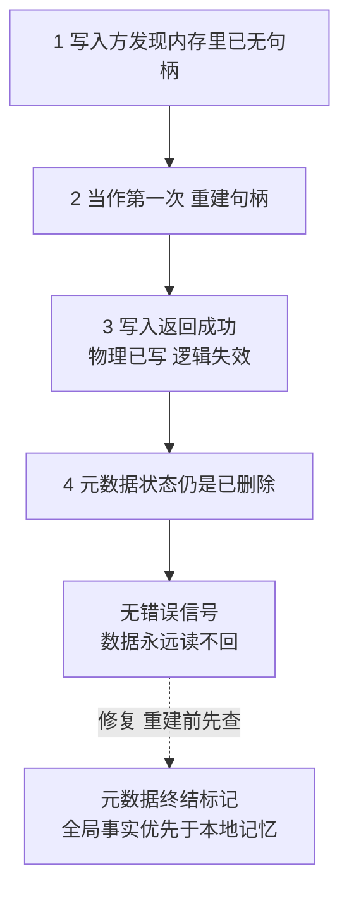

# 删除与写入的并发窗口：复活句柄是静默丢数据的机器

> **要点**：同一对象的删除与写入并发时，写入方发现句柄不在了会按"第一次打开"重建——重建出来的新句柄指向一个已被删除的对象，写入返回成功，数据却永远读不回来。

## 要解决的问题

分布式存储里，一个对象的删除与写入通常由不同角色发起：删除来自治理动作（过期清理、用户操作、会话过期后的接管），写入来自数据路径。两者没有天然的协调——删除方不知道此刻有没有写入在途，写入方也不知道对象刚被删除。错开就无事，撞上就出事。

Apache BookKeeper 的一个真实缺陷（上游 commit 93118aa5，已在本环境真实复现）展示了撞上之后的完整链条：一个账本被客户端确认删除后，另一个持有旧句柄的写入方继续提交，发现内存里的句柄已被移除，写入路径按"第一次打开"的逻辑**重新创建句柄并继续写入**，每一条都返回成功。而账本在元数据里的状态已是删除，这些写入的数据没有任何读取路径能到达——生产者看到成功，消费者读不到消息，重试和重启都无法找回。

这类缺陷有一个共同的名字值得记住：**复活句柄**——对一个已终结对象的操作路径，不拒绝而重建，让终结状态被静默推翻。

## 机制：缺失分支的默认语义是"当作第一次"

把写入路径的决策展开，错误的位置看得非常清楚。写入方提交一条数据时按顺序判断：

1. 内存里有句柄吗？有 → 用它写。
2. 没有 → **当作第一次打开：创建/重新打开句柄，继续写。**

第 2 步的分支在"对象从未存在"的场景里完全正确——第一次写就是这么发生的。问题在于"没有句柄"有两种成因：从未打开过，以及**曾经打开、已被删除**。两种成因共用一个默认分支，后者的语义就从"应当拒绝"滑成了"当作第一次"。

删除侧同样有分工错位：删除完成后，终结事实记在元数据里，但不会广播给每一个还拿着旧句柄的写入方（广播的成本与时效在分布式里都不现实）。于是"对象已终结"这个事实只有一个全局副本（元数据），而写入方的本地判断（内存里有没有句柄）是一个会过期的副本。**本地副本过期时，默认分支把过期当成初始。**

后果的三段式在这里齐全：写入返回成功（调用方得到确定性承诺）、数据位于无法到达的位置（物理上写了，逻辑上已经失效）、没有错误信号（每一个环节都认为自己做对了）。这是静默数据丢失的标准形态——与"写入失败"不同，失败会触发重试与告警，成功却没有数据是最危险的组合。



图回答的是静默丢失的形成过程：写入方的本地判断（内存里有没有句柄）是会过期的副本，过期时默认分支把「曾被删除」当成「从未存在」，重建句柄继续写。每个环节都按自己的规则做对了，组合出来的却是「成功承诺 + 数据不可达 + 无错误信号」。虚线是修复的位置：重建之前先查元数据的终结标记，全局事实优先于本地记忆。

## 修复与防线

上游修复抓住的是"刚被删除"这个过渡状态：删除时记录一个短期的终结标记，在线写入路径命中标记即抛出异常，只有内部日志回放这类受控路径放行。分开来看是两条通用防线。

**终结状态要有写入路径可见的守卫**：删除不只是"从元数据里移除"，还要留下一个写入路径查得到的标记（带时效，防止永久残留）。写入路径在"没有句柄"的分支上先查标记，命中即拒绝。这条防线把两种"没有句柄"的成因区分开。

**区分"第一次"与"复活"**：打开逻辑要能回答"这是第一次打开，还是对已删除对象的重新打开"。判据来自全局事实（元数据状态、终结标记），不来自本地记忆。凡是允许重建的路径，重建必须带着"我确认它未被终结"的证据。

推广成防线清单：

- **删除语义定义三件事**：元数据状态何时翻转、终结标记保留多久、在途写入如何被告知，三件事缺一不可；
- **写成功必须可读**：存储层的写入完成承诺，隐含"存在一条读取路径"；元数据已终结时继续接受写入，等于发出假承诺；
- **交接场景重点排查**：会话过期、主备切换、故障接管这类"角色换人"的时刻，最容易同时出现"新角色删除旧对象"与"旧角色的写入还在飞"；
- **对删除后的写入有观测**：命中终结标记的拒绝要计数、要告警，它出现说明系统里存在"删除与写入赛跑"，频率升高就是交接逻辑有毛病的信号。

## 边界

三条边界说清楚这套防线的适用范围。

**拒绝窗口是权衡，不是免费午餐**：终结标记保留多久是两难——留短了写入方仍可能撞上窗口，留长了"同名对象重新创建"的合法场景被误伤（删除后立刻重建同名资源）。标记要带时效或带版本，按业务语义选择，没有通用值。

**日志回放类路径需要豁免**：故障恢复时，内部回放要按历史日志重放写入，这些写入"迟到"是正常的。豁免清单必须显式枚举，豁免路径与在线路径用不同的入口区分，不能靠参数开关混用同一条路径。

**多副本不豁免本条**：副本机制对这种丢失无能为力——所有副本收到的都是同一份"成功写入已删除对象"的指令，删除动作也在副本间同步。一致性协议解决的是副本间的agree，解决不了"对已终结对象该不该写"的业务语义。

## 验证

可复现的验证路径：

1. 构造竞态：线程 A 循环写入对象，线程 B 周期性删除同一对象（注意先在单进程内构造，分布式注入放在第二阶段）；
2. 未修复版本：断言在某个交错点上出现"写入成功但读取失败"，捕获一次即可作为缺陷证据；
3. 修复后重跑：删除后的所有写入必须收到显式异常，不存在"成功但读不到"的组合；
4. 全量不变量：对每次写入成功，随后立即读取并比对内容，整个压测期间"成功写入集合"与"可读集合"必须相等。

```text
竞态注入 = 写循环 + 删除循环
不变量   = 写成功 ⇒ 立即可读且内容一致
修复后   = 删除后写入收到显式拒绝
```

"写成功 ⇒ 可读"这条不变量是所有存储层共有的底线承诺，把它写进集成测试，复活句柄这类缺陷再也藏不住。验证的预期结果在修复前后判若两文：修复前竞态窗口内出现"成功但读不到"，修复后同一压力下每个写入要么成功且立即可读、要么收到显式拒绝，没有第三种结局——预期与实际对不上的任何一次，都指向终结标记的覆盖缺口。

## 相关

- [[工程知识/缺陷分析：从个案到体系/正确性/静默失真的检测靠对账与不变量而不是报错]] —— "写成功⇒可读"不变量的检测面
- [[工程知识/后端系统：在并发、失败与变化中维持服务/任务与并发/幂等性的完整谱系：从操作语义到删除接口的天然陷阱]] —— 删除接口语义的完整讨论
- [[工程知识/后端系统：在并发、失败与变化中维持服务/任务与并发/分布式锁的正确与错误用法：fencing与租约]] —— 交接场景的令牌防线
- [[工程知识/数据系统：在并发与故障中保存事实/事务与存储/事务隔离决定并发读写能观察到什么]] —— 并发操作可观察性的理论基础
- [[工程知识/缺陷分析：从个案到体系/并发/句柄的终局判定：失败可能重试，终局必须不重试]] —— 本缺陷最锋利的方法面：终局判定与暂时性失败的错误分类，重试是终局判定的毒药
