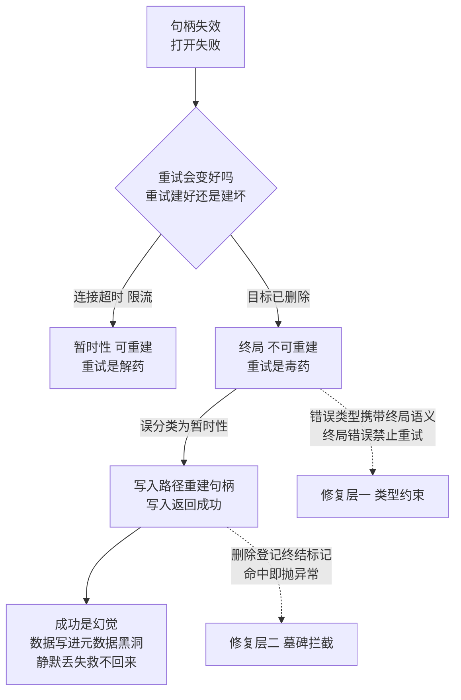

# 句柄的终局判定：失败可能重试，终局必须不重试

> **要点**：句柄指向的目标已不存在时，错误分两类——可重试的暂时性失败与不可撤销的终局判定；把终局判定当暂时性失败重试，重试路径会重建失效状态，生产者拿到成功确认，数据却永久不可读。

## 要解决的问题

分布式系统里持有远端对象句柄（文件句柄、账本句柄、会话句柄）的写入方，迟早会撞上"句柄失效"：目标在另一条路径上被删除了。此时打开失败，通用的容错直觉是**重试与重建**——"打开失败就再开一次"在连接类故障上是金科玉律。Apache BookKeeper 的一个真实缺陷（上游 commit 93118aa5，已在本环境真实复现）展示了撞上之后的完整链条：一个账本被客户端确认删除后，另一个持有旧句柄的写入方继续提交，发现内存句柄已被移除，写入路径**重新创建句柄并继续写入**——写入返回成功，账本元数据已被删除，写入的数据无法被读取。生产者收到成功确认，消费者收不到消息，静默丢失，重放与重试都救不回来。

这类缺陷的结构在所有句柄型系统里同构：**删除走元数据，写入走句柄，两条路径对"对象是否存在"的判定不一致**。本库并发域"删除与写入的并发窗口"一文已从并发窗口的角度解剖过这条缺陷（复活句柄），本篇把其中最锋利的一个点抽出来单独成篇：**失败分类里"终局判定"与"暂时性失败"的区分**。重试是暂时性失败的解药，是终局判定的毒药——对"目标已不存在"这种不可撤销的状态，每次重试都在重新制造不一致，而且重试成功了（错误意义上的成功）：写入路径真把句柄建回来了。

## 机制：错误分类的两象限

句柄失效后每次操作可能得到的错误，按两个维度分类：**持续性**（重试会变好吗）与**状态可重建性**（重试会把坏状态建回来吗）。

| | 可重建（重试建好） | 不可重建（重试建坏） |
| --- | --- | --- |
| 暂时性 | 连接超时、限流：重试是正确动作 | 罕见，多数场景不成立 |
| 终局 | 目标已删除但重建无害（幂等创建） | **目标已删除且重建即静默破坏** |

右上象限的常见例子是"删除后重建语义合法"的对象（临时文件、缓存条目），重试无害；右下象限就是 93118aa5 的形态：**账本已从元数据删除，重建的句柄写入的所有数据都指向一个元数据上不存在的账本**——写成功了，但成功是幻觉。写入方视角"重建成功"与"恢复成功"无法区分，只有下游读取失败才能暴露，而那时数据已经写进了黑洞。

为什么终局判定会被误分类？因为**API 返回的错误类型没有携带终局信息**："打开失败"可能是网络抖动（暂时性）也可能是对象已删除（终局），写入路径拿到一个笼统的失败就套用通用重试逻辑。分类的缺失发生在错误设计层，破坏发生在重试执行层——修复也就分两层。

错误分类的两象限与误分类的破坏链：



图回答的是误分类的完整破坏链：同一个「打开失败」下藏着两种性质截然不同的错误——暂时性失败重试是解药，终局判定重试是毒药。误分类后写入路径重建句柄、写入返回成功，但成功是幻觉：账本元数据已删除，数据写进黑洞，只有下游读取失败才暴露。两条虚线对应两层修复：错误类型系统携带终局语义（终局错误禁止重试），删除时登记终结墓碑（在线写入命中即抛异常，日志回放这类受控路径放行）。

## 修复与防线

上游修复抓住的是"刚被删除"这个过渡状态：删除时记录一个短期的终结标记，在线写入路径命中标记即抛出异常，仅日志回放这类受控路径放行。防线体系按层排：

**错误类型携带终局语义**：对象管理系统对"目标不存在"设计专门的错误类型（HTTP 410 Gone 对 404 的区分是同一个思想），调用方拿到终局错误时**禁止重试**——这是把分类从文档约定升级为类型系统的约束。

**删除即登记终结状态**：删除动作在元数据之外留下一个短期可查的终结标记（墓碑），并发路径的写入在"句柄不存在"与"终结标记存在"同时成立时明确失败。墓碑的时效要有界（配合真正的元数据清理），否则墓碑自己变成待删账本式的泄漏。

**重试预算按错误分类分配**：暂时性错误走退避重试，终局错误立即失败上抛。混在一个通用重试器里的代价是终局错误被预算反复消耗——重试预算的粒度应该是错误类别的函数。

**成功确认前的不变量对账**：本库正确性域的对账纪律在这里的具体形态是"写成功 ⇒ 可读"——抽样验证刚确认的写入真的可读，句柄复活类缺陷会在对账里以高置信度现形。

## 边界

三条边界防止防线变形。

**终局判定有时效**：终结标记是过渡状态，不是永久状态；"永远失败"的对象（名字永不复用的删除）与"名字可复用"的对象（重建合法）要用不同的标记时效。把终局标记做成永久，会挡住合法的重建语义。

**日志回放放行是刻意的例外**：内部恢复路径需要从旧数据重建状态，它持有的是受控的旧句柄——例外通道要显式命名、限定调用方、与在线路径隔离，防止"内部例外"演变成"第二入口"。

**终局错误也要可观测**：立即失败与静默失败是两回事——终局失败要有独立的错误码与计数，运维能看到"有多少写入撞上了已删除对象"，这个数字本身是调用方代码有问题的信号。

## 验证

可复现的验证路径：

1. 构造并发窗口：客户端 A 持句柄持续写入，客户端 B 打开同一账本并删除；窗口对齐后 A 继续提交（测试调度控制时序）；
2. 未修复基线：A 的写入返回成功，随后读取该账本报条目不可读——成功确认与不可读并存即为缺陷证据；
3. 修复后重跑：同一时序下，A 命中终结标记得到明确异常，无假成功；日志回放路径按预期放行；
4. 断言锚点：**写入返回成功 ⇒ 元数据存在且条目可读**（抽样对账）；终局失败有独立计数。

```text
时序 = B 删除 && A 提交（句柄已移除）
修复前断言 = A 成功 → 数据不可读（缺陷）
修复后断言 = A 得到终局异常，无假成功；重放路径正常
```

"成功确认 ⇒ 可读"与并发窗口的对账结合，构成句柄类静默丢失的完整检测面。

## 相关

- [[工程知识/缺陷分析：从个案到体系/并发/删除与写入的并发窗口：复活句柄是静默丢数据的机器]] —— 同一缺陷的并发窗口视角：窗口、栅栏与墓碑的完整讨论
- [[工程知识/缺陷分析：从个案到体系/正确性/静默失真的检测靠对账与不变量而不是报错]] —— "写成功⇒可读"不变量的方法论出处
- [[工程知识/后端系统：在并发、失败与变化中维持服务/任务与并发/幂等性的完整谱系：从操作语义到删除接口的天然陷阱]] —— 删除接口语义与重建合法性的完整讨论
- [[工程知识/后端系统：在并发、失败与变化中维持服务/分布式可靠性/重试的正确姿势：退避、抖动与重试预算]] —— 重试纪律的总纲，本篇给"按错误分类分配预算"补充了终局维度
