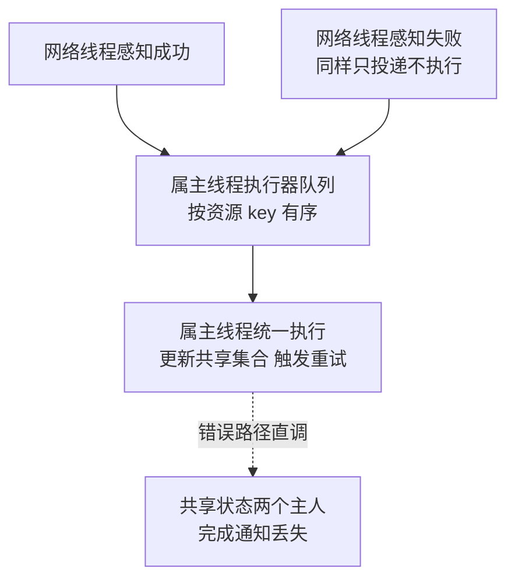

# 回调必须回到属主线程：完成通知的线程归属纪律

> **要点**：完成回调是"碰共享状态"的动作，它的执行线程必须与状态属主的串行域一致；错误路径上的回调最容易在别人的线程上直接执行，一致性在那一刻被换掉了主人。

## 要解决的问题

错误分支是回调线程归属这条防线上最容易被绕过的一段。成功路径的回调通常规规矩矩投递回属主线程，错误路径却常常以"尽快通知、别耽误重试"的名义，在感知到错误的线程上直接调用——而感知错误的线程几乎总是网络 I/O 线程，并不拥有被回调触碰的那些状态。

这不是理论担忧。BookKeeper 客户端的两个真实缺陷（上游 commit 804b2b61 与 47c3fc37，均已在本环境真实复现）都发生在"完成通知由谁执行"这个点上：前者是错误回调在网络线程上与账本工作线程并发进出共享集合，部分写入收不到完成通知；后者是管理接口在请求线程上新建客户端对象后直接回调释放逻辑，用完不关，线程与连接按调用次数累积。两个病例、两种表现，同一个根源：**回调的执行线程没有回到状态属主的串行域。**

## 机制：线程归属是状态一致性的隐含参数

一次完成通知（成功或失败）要做的事：更新共享集合或计数、触发上层回调、可能发起后续动作（重试、清理）。每一步都可能触碰"属主线程拥有的状态"。

**成功路径**通常设计成：网络线程只做报文解析，把完成事件投递到属主线程的队列里，属主线程统一处理。这条路径上，线程归属是显式设计过的。

**错误路径**的诱惑在于：错误往往在网络线程上被感知（连接断开、超时到期），"顺手"在当前线程调用失败回调，省一次投递。省掉的这次投递，恰好把一致性约定撕开——从此完成通知有两条执行线程，共享状态有两个主人。

错误路径的辩护词通常是"错误通知无状态，只是转告"。辩护词在多数情况下不成立：失败回调要移除在途项、要更新重试计数、要决定是否重连——这些都是属主状态。真正的无状态转告极少；"看起来无状态"是因为状态藏在上层回调的闭包里，评审时看不见。

## 修复模式：出口收敛

把这类问题的修复抽象成一个可复用的模式：**出口收敛**。完成通知无论成功失败，收敛到一个出口——属主线程的执行器。实现上有三个要点。

**投递点在感知侧**：网络线程（或任何非属主线程）感知到结果后，第一动作是投递，不执行任何状态操作。感知侧代码应短到"解析结果、投递、结束"。

**执行器按 key 有序**：同一资源（账本、连接、会话）的完成通知进同一串行域，不同资源之间并行。ordered executor 是这个语义的标准实现。

**投递自身有兜底**：执行器拒绝或关闭时，投递的失败通知要有出路（同步执行、记录后放弃），兜底路径也要过评审——它是错误路径的错误路径。

出口收敛之后，"哪些代码在哪个线程上跑"从口头约定变成结构保证：属主串行域之外，没有任何代码碰得到共享状态。线程归属纪律由此从"记得"变成"做不到错"。



图回答的是出口收敛的结构：成功与失败两类完成通知在网络线程上只做「解析结果、投递、结束」，收敛进属主线程的执行器队列（同一资源的通知按 key 有序，不同资源并行），共享状态只在属主串行域内被触碰。虚线是被禁止的捷径：错误路径「顺手」在感知线程上直调失败回调，省下的那次投递恰好把一致性约定撕开——完成通知从此有两条执行线程，部分写入收不到通知。投递的微秒级开销对上事故的小时级定位，这笔账只有在故障复盘里才算得平。

## 代价与边界

**投递的开销是常数，漏投递的代价是事故**：每次回调多一次队列往返，微秒级；并发缺陷的一次事故是小时级定位加不可解释的线上表现。这笔账在压测报告里算不平（压测不注入故障），在故障复盘里才算得平。评审要压住"这里可以优化掉投递"的冲动。

**判断"是否需要投递"的判据只有一条**：回调是否触碰属主串行域内的状态（直接或经闭包间接）。碰就投递，不碰才允许直调。判据可执行，但"间接触碰"要靠评审盯闭包——这是该纪律残余的人工成本。

**嵌套回调要防重入**：属主线程执行回调 A 时，A 内部同步触发了回调 B 的投递，B 排在队列里等当前执行完——这是正确行为；如果 A 内部直接调用 B 的处理函数，串行域内出现嵌套，重入问题回来了。收敛纪律要覆盖嵌套场景：回调内部再触发通知，同样走投递。

## 验证

可复现的验证路径：

1. 线程审计：在共享状态的所有修改点打上执行线程标记（测试断言或运行时检查"当前线程 == 属主线程"），跑全量测试与故障注入；
2. 竞态压力：并发写入 + 周期性故障注入（连接中断、超时），统计"提交数 == 完成通知数"，不等即有丢失或重复；
3. 修复后回归：同一压力下断言恒成立，并保留为持续集成里的常规用例；
4. 关闭路径单独压：执行器关闭瞬间的在途回调要有确定结局（完成或收到兜底处理），不允许静默消失。

```text
审计断言 = 共享状态修改点的当前线程 == 属主线程
压力断言 = 提交数 == 完成通知数（成功 + 失败）
```

线程审计断言是这条纪律的机械化检查：改代码的人不需要记住纪律，违反时测试当场红。跑验证时预期与实际的对照要对应到两个数上：提交数与完成通知数必须相等，对不上即存在丢失或重复；属主断言的违规次数必须是零，任何一次"回调在别人的线程上碰了共享状态"都说明收敛有缺口。

## 相关

- [[工程知识/性能工程：从用户等待到资源瓶颈/处理器与内存/无锁数据结构的证据门槛：CAS与内存序]] —— 串行域之外的"线程安全"为什么不算数
- [[工程知识/缺陷分析：从个案到体系/并发/案例三：并发两面——写回调卡死与心跳竞态]] —— 同一上游缺陷的案例侧写
- [[工程知识/后端系统：在并发、失败与变化中维持服务/任务与并发/并发控制先定义共享状态和完成条件]] —— 属主与完成条件的设计入口
- [[工程知识/缺陷分析：从个案到体系/并发/并发缺陷的复现策略：压力放大与确定性调度]] —— 本文验证节的压力构造出处
