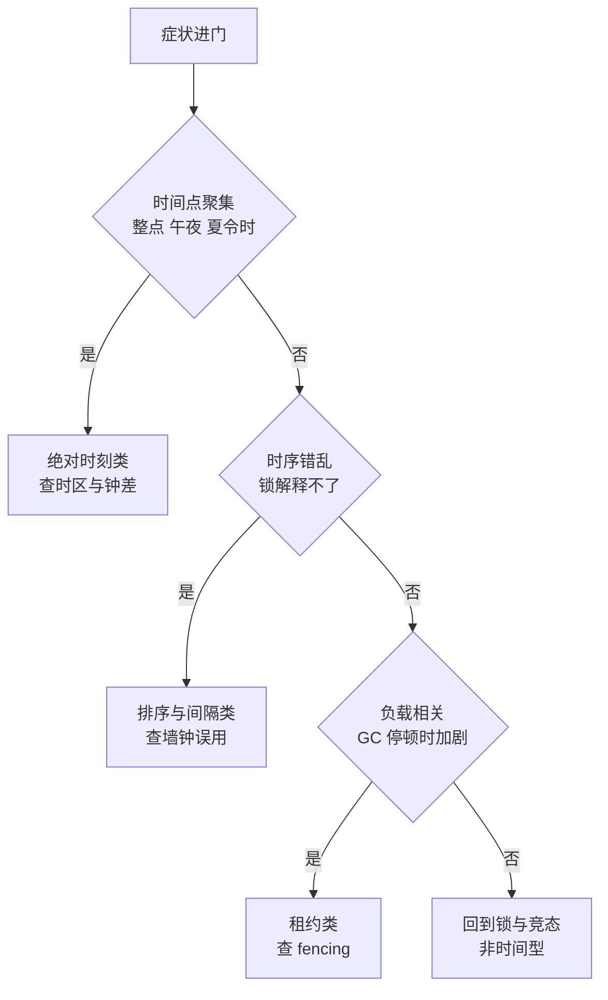

## 要解决的问题

一批线上怪象共享同族根源：优惠券到点了不发（机器时间慢 3 秒）、抢购开卖瞬间超卖（网关与库存服务的"同一秒"不是同一秒）、任务定时执行两遍（两台机器都认为自己到点了）、缓存永不过期（过期时间算出负数被当"从不过期"）、证书还没到期就报过期（时区解析错位）。这类缺陷的共同点：**正确性依赖时间语义，而时间在分布式系统里是一个不可靠的输入**——不同机器的钟不一致（漂移）、同一机器的钟会跳（NTP 校正/闰秒）、时间的读法有歧义（墙钟/单调钟/逻辑钟）。排查这类问题的判定树：先识别"时间在这里被当什么用了"，再按用途查对应的失效模式。

## 机制

**时间的四种用法，四种失效**。用法一：绝对时刻判断（"8 点开卖"、"3 天后过期"）。失效：机器间时钟偏差让"8 点"在各机器不同步到达（快钟先开卖、慢钟先拒绝）；时区与夏令时解析错位（8 点 CST 存成 8 点 UTC，差 8 小时）。用法二：超时与间隔（"等 500ms 放弃"、"每 60 秒跑一次"）。失效：用墙钟（CLOCK_REALTIME）算间隔，NTP 跳变瞬间间隔为负或翻倍，任务双跑或漏跑；正确做法是单调钟（CLOCK_MONOTONIC）。用法三：事件排序（"后到的覆盖先到的"、"最新的赢"）。失效：两台机器的"先后"用各自墙钟比较，钟差大于事件间隔时顺序颠倒，缓存与配置的 last-write-wins 丢更新。用法四：租约与 TTL（"锁 30 秒自动过期"）。失效：持锁方处理慢于租约期（租约已过期、对象还在跑），或续租时钟与过期判断时钟不一致，双主。

**判定树的主干**。症状进门先问三问。一问：错误是否只在特定时间点附近出现（整点、午夜、夏令时切换日）？是 → 查绝对时刻类（时区/钟差/夏令时）。二问：错误是否伴随"偶发双跑/漏跑/顺序错乱"且无法用锁解释？是 → 查排序与间隔类（墙钟误用/钟差）。三问：错误是否在负载高或 GC 停顿时加剧？是 → 查租约类（持有时长超租约，fencing 缺失）。三问定位到用法，再进对应分支：绝对时刻分支查 TZ 配置、UTC 存储、机器钟差（chrony/NTP 状态）；间隔分支 grep 代码里用 System.currentTimeMillis/Date.now 做差值的地方（应换单调钟）；排序分支查 last-write-wins 的字段来源与冲突策略；租约分支查 fencing token 与续租逻辑。

时间的四种用法各自对应一张失效表，进门先把用途分开，下面的树按用途分叉：



图回答的是判定树的主干怎么走：三问按症状特征分流（时间点聚集、时序错乱、负载相关），各指向一类失效根源；第三问答「否」的回到普通锁与竞态的排查线，时间语义在这类症状里没有参与正确性决策。分支内的取证动作按上面四段展开。

**检测手段**。钟差观测：各机器的 clock skew 监控（NTP 状态、与参考源的偏差告警）；跳变检测：日志里所有时间戳的倒退检测（时间戳比上一条小即跳变证据）；双跑检测：定时任务加执行指纹（分布式锁 + 执行记录），重复指纹即双跑；排错检测：数据版本字段（更新时间戳）与实际更新顺序的抽样比对。

时间语义错误落到进程与调度层面，等于把一张本该由事件驱动的状态图挂到了会跳的钟上——进程状态迁移的标准形态：


*图源：Wikimedia Commons「Process states」，作者 Sergiodlr2，许可 [CC BY-SA 4.0](https://commons.wikimedia.org/wiki/File:Process_states.svg)。*

## 背景与代价

思想背景：分布式时间问题是 1978 年就立论的领域（Lamport "Time, Clock, and the Ordering of Events"，逻辑钟的起源），NTP（1985 RFC 958）与后续的 PTP（IEEE 1588，微秒级精度）提供物理同步的两档。Google Spanner 的 TrueTime（2012，带不确定区间的 API）代表工业解法的天花板：不假装时间精确，给出区间 [earliest, latest]，提交等待区间收窄。Jepsen 系列测试持续揭示各系统在时钟假设上的裂缝。

最精巧的一笔是**把"时间"从单一输入分成"用途-时钟-失效"三列表**：墙钟回答"现在几点"（会跳）、单调钟回答"过了多久"（不会跳）、逻辑钟/版本号回答"谁先谁后"（不依赖物理时间）。三钟各配各的用途，缺陷的根源几乎都是"拿 A 钟回答 B 问题"。这一笔把玄学排查（"时间相关 bug"）变成查表（这个场景该用哪个钟、实际用了哪个）。代价要摆明：单调钟不可跨机器比较（各机起点任意），排序要跨机时要么引入中心授时（TrueTime/Spanner 的成本）、要么放弃物理时间用逻辑序（Lamport/向量钟的实现复杂度）；**绝对时刻的精度需求要显式声明**（开卖场景 1 秒钟差就是事故，需要 NTP 严管或中心授时；日志场景 100ms 偏差无所谓，普通同步就够），不声明就默认所有人按最高精度付费是不现实的。

## 边界

- **不是所有时间引用都是缺陷**。日志时间戳、监控打点的墙钟用法无害（不参与正确性判断）。判定树只追"参与正确性决策的时间"：判断顺序、判断过期、判断调度点的地方。
- **租约问题的正解在 fencing 不在加长租约**。租约加长只是降低概率（处理再慢也有超的时候），fencing token（每次获锁递增的编号，存储侧拒绝旧编号的写）才是结构解。详见分布式锁篇的 fencing 论述。
- **夏令时与本地时间的坑多于时区**。"2:30 AM 在夏令时切换日不存在/出现两次"（本地时间的折叠与间隙），调度任务存本地时间在切换日双跑或漏跑。存储与调度一律 UTC，展示层才转本地。
- **测试时间的两个手段**。时钟注入（业务代码收 Clock 接口，测试传假钟，快进/跳变任意模拟）与混沌时钟（Chaos Engineering 的 clock skew 注入，tc/netem 或专用工具让某机器快慢 5 秒）。没做过跳变注入的系统，第一次 NTP 大校正就是生产实验。

## 验证

- **墙钟差值缺陷复现实验**：写一个"每 60 秒执行"的定时器，分别用墙钟与单调钟实现，注入一次时钟跳变（libfaketime 或手动 date -s）。预期：墙钟版双跑或跳过一次，单调钟版节奏不变。两种钟语义差异的可复现证据。
- **钟差超卖复现**：两台机器（手动拨快/拨慢 2 秒）跑"整点开卖"，共享库存扣减。预期：快钟机器先开卖，慢钟机器在"没到点"的窗口拒绝请求，开卖瞬间两机的库存视图错位，超卖或漏卖出现。机器间钟差影响正确性的一手证据。
- **last-write-wins 丢更新复现**：两客户端并发更新同一条记录（版本字段用各自机器时间戳），客户端 A 的写先到服务器但时间戳更晚（A 机器钟快）。预期：后到的写因时间戳更大被判定"最新"而胜出，先到的写丢失。排序依赖墙钟的失效复现。

## 可运行示例与案例回流：时间的账

```text
两类时间型缺陷的判定推演账（通用形态）：

  过期竞态：拿旧数据做新决策
    例：读配置（10ms 前）→ 配置被更新 → 用旧配置下单
    判定：决策用的值与决策时刻之间隔着多久？中间有无版本号/时间戳校验？
    修复方向：读后校验版本（乐观锁思想），带过期时间的数据用前先验是否过期
  时钟依赖：两台机器时钟差 800ms，事件顺序判定翻转
    例：按本地时间戳去重 → 两台网关时钟漂移 → 同一请求被判成两条
    判定：跨机顺序判定用的是谁的时钟？单调性有保证吗（NTP 回拨）？
    修复方向：顺序判定用单一来源（数据库自增、逻辑时钟），少信物理时钟

  共同指纹：单机测试必现不出来的（时序被压平），压测/生产才现形
```

案例回流：过期竞态的实录——风控规则缓存 5 秒刷新，用户在规则生效前的窗口连刷 20 单套利（决策与配置版本之间无校验）；规则带版本号、下单时校验版本一致后窗口关闭。时钟漂移的实录——两台对账机时钟差 2 秒（NTP 未配），跨机交易对账每天凌晨报几百条"流水不存在"（按各自本地时间戳匹配）；时间来源统一到数据库后归零。NTP 回拨的实录——时钟回拨 1 秒，程序里 `System.nanoTime` 与 `currentTimeMillis` 混用，定时任务提前触发重复执行；单调时钟与时钟时间要分场景使用。判定树总入口见 [[工程知识/缺陷分析：从个案到体系/症状到机制的判定树——新缺陷的归类入口.md]]、滞后读的会话层补救见 [[工程知识/数据系统：在并发与故障中保存事实/事务与存储/复制滞后的一致性补救：读己之写与会话保证.md]]、缓存一致性的时间窗口见 [[工程知识/后端系统：在并发、失败与变化中维持服务/服务设计/缓存改变读写路径、一致性与故障模式.md]]。

## 相关

- [[工程知识/后端系统：在并发、失败与变化中维持服务/任务与并发/分布式锁的正确与错误用法：fencing与租约.md]] —— 租约失效是时间型缺陷的最大族，fencing 是结构解
- [[工程知识/性能工程：从用户等待到资源瓶颈/存储与网络/端到端网络延迟来自排队、协议、传输与处理.md]] —— 延迟测量的时钟选择（单调钟）与跨机延迟的钟差干扰，同一主题在观测侧
- [[工程知识/缺陷分析：从个案到体系/复现与回归/从复现到回归——让证据走完一圈.md]] —— 时间型缺陷的复现依赖时钟注入，让证据走完一圈的方法论
