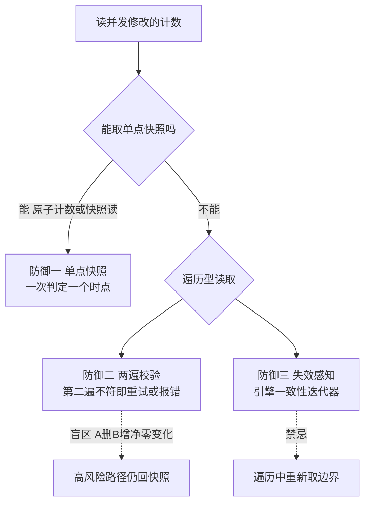

# 计数的语义取决于读的时机：两遍读数与重新取值是并发界的老坑

> **要点**：并发场景下读一个被并发修改的计数，读两次与读一次是两个语义——"先取 size 再遍历"与"遍历时重新取 size"的混用，让边界判定建立在两个时点的快照上；上游 KeyValueStorageRocksDB.count 的 coredump 正是两遍读数与迭代器失效的组合。防御的次序：能取单点快照就取（原子计数器、一致性读），必须两遍就校验一致性（二遍不符即重试或报错），绝不混用两种时点的数。

## 要解决的问题：读数是并发操作，时点错位怎么判

"取个数"看起来是只读操作，在并发修改的环境里它是一次与写入者赛跑的读——**count 的两种实现形态**：维护原子计数器（O(1) 读，与写入同步增减）与现场遍历统计（O(n) 读，读的是遍历过程的动态集合）。两种形态混用、或遍历中"再取一次计数"做边界判断，产生**时点错位**：第一个数来自 t1，第二个数来自 t2，t1 与 t2 之间集合被修改——按两个时点的数做的判定（如"还有 N 个没读完"）在并发下不成立。本库"取到了已经不存在的那个"（估算器读取竞态）是同族个案；本篇给这类缺陷的**通用判定与防御**。

## 机制：三种防御的适用与次序

**防御一：单点快照（首选，能取就取）**。把"取数"变成原子操作：原子计数器（写入路径同步增减，读路径一次读）、快照读（RocksDB 的 GetSnapshot、MVCC 的一致性读）——**快照的代价**：计数器要维护一致性（增减与事务同提交，崩溃恢复时重建）；快照读有持有成本（引用计数阻止 compaction 回收）。**判定的标准**：count 的用途如果要求"与后续遍历一致"，只有快照能保证；如果只要求"约数"（监控指标），原子计数器最便宜。

**防御二：两遍校验（遍历型读取的护栏）**。必须"先取边界再遍历"的场景（无快照可用时），第二遍取同样的数并比对——**不一致即并发修改实锤**，选择重试（拿新值重来）或报错（fail-fast，本库 fast-fail 纪律），**绝不拿着不一致的两个数继续**。两遍校验的盲区：两遍恰好读到相同的值但集合内容变了（A 删 B 增的净零变化）——校验是概率防御，**高风险路径仍以快照为正解**，两遍校验是低成本场景的退让。

**防御三：失效感知（迭代器与句柄的配合）**。遍历用的迭代器对底层修改的感知方式因引擎而异：RocksDB 迭代器基于快照语义（遍历中看不到后续写入，天然一致）；裸哈希表迭代器遇扩容/删除直接失效（coredump 的正源）——**用对迭代器**：能选引擎自带一致性迭代器就不手搓遍历；必须手搓时，遍历中重新取值（size）做循环边界是禁忌——**边界在遍历开始前固定，或遍历每步自判有效性**，两种都可以，混用必炸。

**上游缺陷的定位**：count 的 coredump 组合了两个错误——遍历中重新取 count（时点错位）+ 无快照语义的裸迭代（修改后迭代器指向已释放内存）。**修复的方向**在防御一与三：计数走引擎的快照读，或迭代器用引擎提供的一致性游标。



图回答的是三种防御的选择次序：能取单点快照就取（原子计数器或快照读，一次判定只用一个时点），快照不可用时遍历型读取配两遍校验（第二遍不符即重试或报错，绝不拿不一致的两个数继续）与引擎一致性迭代器（游标自带失效感知）。两条虚线是各自的边界：两遍校验挡不住「A 删 B 增」的净零变化，它是低成本退让，高风险路径仍回快照；遍历中重新取边界做循环条件是禁忌——边界在遍历开始前固定，或每步自判有效性，混用必出时点错位。

## 看完能判断：现场排查的三个问题

遇到"遍历崩溃/计数不对"先问三问：**一问计数从哪来**（原子变量、每次现场统计、还是缓存值——来源决定它代表哪个时点）；**二问遍历用什么游标**（引擎一致性迭代器、裸指针、还是带校验的自定义——游标决定并发修改的后果）；**三问边界判定用了几个时点的数**（一个时点的快照、两遍校验、还是两个时点混用——混用即缺陷嫌疑）。**三问的答案组合直接定位**：混用时点 + 裸游标 = 高危（coredump 候选）；混用时点 + 一致性游标 = 逻辑错误（结果不准但不崩）；单时点快照 = 达标。

**修复优先级**：引擎快照语义（根治）> 两遍校验（护栏）> 加锁串行化（最重，能不用就不用——锁把读的并发性牺牲掉，本库"锁的竞争按临界区治理"的成本核算）。

## 边界

三条边界防止防线走形。

**"只读"不等于"无并发"**：读操作之间也会赛跑（两个 reader 各自遍历同一动态集合），快照的需求来自"与写入的一致"，也来自"自身步骤间的一致"——防御设计按后者自查时容易漏，评审要问"这几次读数要求是同一时刻吗"。

**快照的成本有下限约束**：长持有快照阻止回收（compaction、GC、内存释放）——快照的持有期要短且显式释放（try-with-resources 类结构保证），**长事务持快照**是存储引擎膨胀的经典成因（本库"虚拟内存与文件系统"的页缓存类比）。

**统计类用途不追强一致**：监控指标、容量估算用约数（原子计数器）足够，追快照一致性是把强一致的成本花在不需要的地方——**用途决定语义，语义决定实现**，反向推导（实现决定用途）会让简单计数背上事务成本。

## 验证

可复现的验证路径：

1. 竞态复现：并发写 + 遍历统计的压力测试，混用时点的实现预期出现计数错乱或崩溃，快照实现预期稳定——复现即验证判定法；
2. 两遍校验验证：注入遍历中的并发修改，校验逻辑检出不一致并重试/报错，日志含两次读数；
3. 快照成本验证：长持有快照的负载下观测 compaction 停滞（空间不回收），释放后恢复——成本边界的实证；
4. 断言锚点：**count 来源在代码注释里写明时点语义、遍历游标统一用引擎一致性接口、评审清单含"多时点读数"检查项**——三件齐备，计数类并发缺陷在代码评审层就被拦住。

```text
时点断言 = 一次判定只用一个时点
游标断言 = 遍历游标有失效感知
用途断言 = 强一致只花在强需处
```

计数的并发语义本质是时点语义：两个数能不能代表同一时刻，决定了判定是否成立——快照给确定，校验给护栏，混用给 coredump，三选一的纪律写进评审习惯，这类老坑就能在写代码的时候绕开。

## 相关

- [[工程知识/缺陷分析：从个案到体系/并发/案例三十二：取到了已经不存在的那个——估算器的读取竞态.md]] —— 同族竞态个案
- [[工程知识/缺陷分析：从个案到体系/并发/删除与写入的并发窗口：复活句柄是静默丢数据的机器.md]] —— 并发窗口的同类形态
- [[工程知识/后端系统：在并发、失败与变化中维持服务/任务与并发/锁的竞争要按临界区治理：缩小范围、读写分离、分片加锁三路走.md]] —— 加锁的成本核算
- [[工程知识/数据系统：在并发与故障中保存事实/事务与存储/快照隔离与MVCC：多版本如何在不阻塞读写的前提下挡住脏读.md]] —— 快照语义的机制层
