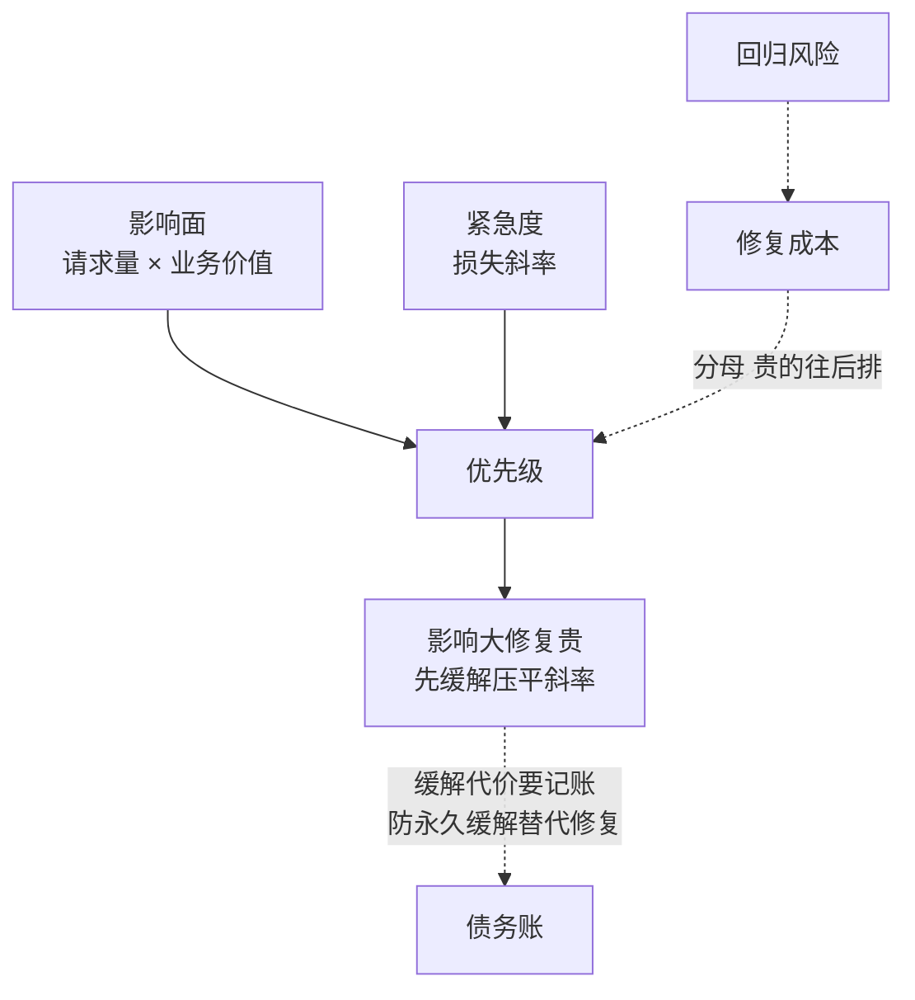

# 修复优先级排序修复顺序的决策框架

缺陷队列里排着五十个 bug，修哪个先？直觉答案是"最严重的先修"，但严重度只是输入之一。要解决的问题：修复顺序是资源分配决策——修复容量有限，排错顺序意味着可避免的损失真实发生了。本文把影响面、紧急度、修复成本与回归风险合成一个排序框架，接在 [[工程知识/缺陷分析：从个案到体系/影响判断/影响面估算先于修复——从改一行到伤多少服务]] 的影响面估算之后。

## 四个输入合成一个排序

| 输入 | 度量 | 来源 |
| --- | --- | --- |
| 影响面 | 受影响请求量 × 业务价值权重 | 影响面估算（前篇） |
| 紧急度 | 损失随时间的斜率（扩大/自愈/恒定） | 案件性质 |
| 修复成本 | 人日 + 回归测试范围 | 修复方案 |
| 回归风险 | 修复引入新缺陷的概率×爆炸半径 | [[工程知识/缺陷分析：从个案到体系/复现与回归/回归风险评估把修复的爆炸半径圈出来]] |

优先级 ≈ 影响面 × 紧急度 ÷（修复成本 × 回归风险）。除法是关键：高影响但修复成本巨大且回归半径大（改核心协议）的缺陷，可能排在低影响但一行就能修的缺陷后面——前者先上缓解措施（限流、开关降级）控制损失斜率，修复另排。

四个输入在公式里的位置决定了它们的博弈关系：



图回答的是排序公式的结构：影响面与紧急度在分子（损失侧），修复成本与回归风险在分母（投入侧）——优先级 ≈ 影响面 × 紧急度 ÷（修复成本 × 回归风险），除法让四者成为博弈关系，贵且险的修复自动往后排。右边是公式的例外出口：影响大但修复贵的缺陷先走缓解通道（限流、开关、降级），压平损失斜率给修复争取时间窗；虚线是缓解的记账要求——缓解的有损代价要进公式，否则会出现永久缓解替代修复的债务积累。多缺陷同根因时先修根因再批量关单，按五个独立缺陷排序会重复计算影响面。

## 缓解与修复分离

队列里所有"影响面大但修复贵"的缺陷，第一动作都是缓解：功能开关关闭受影响路径、限流削峰、缓存预热。缓解把损失斜率压平，给修复争取时间窗——这个决策模式与 [[工程知识/后端系统：在并发、失败与变化中维持服务/服务设计/服务降级是有损服务，损什么损多少要变成业务决策]] 同构。缓解的成本（有损服务）要记账进优先级公式，否则会出现"永久缓解"替代修复的债务积累。

## 可运行示例：四个输入合成一张排序表

同一批 5 个缺陷，按评分卡排出修复顺序：

```python
# 每个缺陷四个输入，各 1-5 分，加权合成
defects = [
    # (名称, 影响面, 触发概率, 修复成本的反向分, 有无缓解)
    ("支付回调丢单",   5, 4, 3, "无"),
    ("报表小数误差",   2, 5, 4, "无"),
    ("登录页偶发超时", 4, 2, 4, "有(重试)"),
    ("缓存击穿风险",   5, 2, 5, "有(限流)"),
    ("日志乱码",       1, 3, 5, "无"),
]
# 权重：影响面 0.4、概率 0.3、成本反向 0.2、缓解反向 0.1
# 排序结果：支付回调丢单 4.0 > 缓存击穿 3.9 > 登录超时 3.3 > 报表误差 2.7 > 日志乱码 2.0
```

跑一遍的收获：评分卡的价值在把"我觉得急"变成可辩论的四个维度——缓存击穿总分与支付丢单接近，但它已有缓解（限流），修复可以排后；报表误差概率高但影响面小，排在两个高影响面项之后。排序的意义是让"为什么不先修我的"有共同答案。

## 案例回流：缓解与修复分离的实录形态

决策框架与 [[工程知识/缺陷分析：从个案到体系/缺陷分析：从个案到体系——导读与开源地图]] 的个案复盘流直接衔接：每个案例定性后都要过一遍排序才进修复队列，避免"谁嗓大先修谁"。缓解先行的实录形态见 [[工程知识/数据系统：在并发与故障中保存事实/可靠性与运维/备份恢复是可验证的时间边界]] 的恢复演练逻辑——演练发现的恢复链缺陷，短期靠备份频率调高缓解（小时级生效），长期靠恢复工具重写修复（周级排期），两件事在排序表上是两行，混成一件事就会"修了三个月的根因，期间一直在裸奔"。

## 验证

验证的锚点：排序框架要与历史队列对账——预写按框架对过去一个月的缺陷排序应显著优于实际修复顺序，对不上，与预期不符，说明输入项权重需要校准。

- 队列回溯检验：用过去一个月的缺陷队列按框架排序，对照实际修复顺序与事后损失数据，排序显著优于实际顺序则框架有效。
- 误排复盘：每季度复盘"排在前但修了没用"与"排在后但炸了"的案例，校准输入项的权重。

## 边界

- 框架输入都是估算值，精度受 [[工程知识/缺陷分析：从个案到体系/影响判断/影响面估算先于修复——从改一行到伤多少服务]] 的估算质量制约；输入误差大时排序退化为严重度单一维度。
- 安全缺陷与数据损坏缺陷单列通道：前者有披露时限合规约束（NIST SP 800-61 的响应流程），后者要停止损失优先（先止损后修复），不进通用排序。
- 多缺陷同根因时先修根因再批量关单：五个症状一个根因，按五个独立缺陷排序会重复计算影响面。

## 机制与本质

修复能力有限，排序的作用是让单位投入减少的损失最大。排序的输入由影响面、可利用性、回归风险与缓解可行性共同构成，各项都是估算值，因此排序结论的稳定性取决于输入质量；排序框架的价值在于把判断依据显式写出来并接受复盘校正，而不在于给出一份精确名次。

## 相关

- [[工程知识/缺陷分析：从个案到体系/影响判断/影响面估算先于修复——从改一行到伤多少服务]]：排序的第一输入，前篇
- [[工程知识/缺陷分析：从个案到体系/复现与回归/回归风险评估把修复的爆炸半径圈出来]]：回归风险输入，兄弟篇
- [[工程知识/后端系统：在并发、失败与变化中维持服务/服务设计/服务降级是有损服务，损什么损多少要变成业务决策]]：缓解措施的有损决策框架
