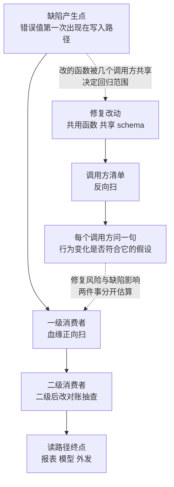

# 影响面估算先于修复——从改一行到伤多少服务

修一个 bug 之前先要回答一个独立的问题：**这条缺陷已经伤到谁、伤到多深**。这决定修的优先级、发布节奏与回归范围。影响判断（见 [[工程知识/缺陷分析：从个案到体系/影响判断/影响判断——这条修复值不值得跟]]）回答"值不值得修"，影响面估算回答"波及多大"——后者是前者的输入。

影响面估算的核心机制是**沿着数据流与调用链双向传播**：一个错误值从产生点向下游扩散（哪些消费者读到它），修复行为本身向上下游回溯（改动涉及哪些共用路径）。两条传播方向要分开估算，只算其中一条都会低估。

## 影响面的三个维度

| 维度 | 问的问题 | 证据来源 |
| --- | --- | --- |
| 空间 | 哪些服务/表/报表/用户读到错误值 | 依赖图、血缘、调用链 |
| 时间 | 错误存在多久了、积累多少脏数据 | 日志、审计、首次出现时间 |
| 深度 | 错误是否已固化（下游已消费、已写入数据库、已外发） | 下游表结构、导出记录 |

错误值从产生点沿数据流正向扩散，修复改动沿调用链反向回溯，两条传播方向合起来才是完整影响面：

图回答的是影响面的完整形状：上半是缺陷传播（错误值沿血缘正向流到读路径终点，二级之后穷举让位给对账抽查），下半是修复传播（改动沿调用链反向扫到每个调用方）。两条虚线把两件事的关系画出来：修复风险与缺陷影响是两个独立估算，混在一起会互相低估；缺陷产生点的位置决定修复要动哪里，修复动哪里又决定回归范围。只算其中一条，影响面少一半。

时间维度经常被跳过但它决定工作量：一个昨天引入的静默错算，可能只需要修代码；一个存在半年的，要先估算**存量脏数据的范围**（多少行、哪些分片、哪些报表），修复方案里必须包含数据订正，而这部分工作量常常大于改代码本身。案例四十二（备份里的假账）就是错误固化到备份、恢复路径放大它的例子。

深度维度决定修复的紧迫度排序：错误值流到"不可撤回"边界（对外发送、扣款、合同性报表）之前拦截，代价是量级级别的差异。

## 估算步骤

1. **定产生点**：错误值第一次出现在哪个写入路径。用 Trace 或日志的时间戳定位首次出现。
2. **沿血缘正向扫**：列出所有直接与间接消费者。用血缘表（见 [[工程知识/数据系统：在并发与故障中保存事实/数据治理/数据质量与血缘让指标可以被解释]]）或调用链工具；没有血缘表时用 rg 搜字段名做穷举。
3. **沿调用链反向扫**：修复要动的共用代码（公共函数、共享 schema）被谁调用。这一步估的是**修复风险**而非缺陷影响，两件事容易被混为一谈。
4. **量化暴露**：把 2、3 的结果转换为数字——受影响行数、请求量占比、报表份数。没有数字的"影响很大"无法参与优先级排序。
5. **分级**：按深度分四级——已外发不可撤回 / 已写入数据库可订正 / 在途可清理 / 未流出。级别决定修复节奏。

## 修复风险是影响面的第二半

修复本身引入回归，是缺陷分析里的高频模式：案例三十四（省下的句柄与多出的删除——一次优化引入的回归）里一次优化带出新 bug；案例十一（上游修好了你这边没有）里上游修复在自己的发行分支上不可见。所以影响面估算必须包含**修复改动的波及面**：改动的函数被几个调用方共享、改动是否触碰语义边界（见 [[工程知识/软件构建：让变化可以理解、验证与交付/架构与代码/API与Schema演进必须兼容新旧消费者]]）、回滚路径是否干净。

估修复风险的具体做法：对改动函数做调用方清单（rg 符号搜索即可起步），对每个调用方问一句"行为变化是否符合它的假设"。调用方越多，越应该把行为变化做成显式开关而不是静默改变。

## 边界

影响面估算有截止条件，不能无限展开：依赖图会随网络增长，穷举到二级消费者通常已覆盖 90% 的暴露（深层数据管道的传播多经汇总表，汇总表数量远少于明细表）。超过二级的传播用**对账抽查**代替穷举：抽样检查最深层的报表值，值正确则停止下钻。

估算依赖血缘与调用链的准确性，而这两个图在演进中的滞后是常态。所以估算结论要标注置信度：有血缘表支撑的标高，靠人工回忆的标低，标低的部分在修复上线后用监控验证而不是事前穷举。

## 验证

验证的锚点：影响面估算要与实际报警对账——预写修复上线后的实际报警对象清单，与事前预估的清单对不上就是估算方法需要修正的地方，差异与预期不符时要回头修估算方法。

估算结果要用事实验证：修复上线后，把"预估受影响对象清单"与监控/对账的"实际报警对象"对比。差异清单就是估算方法需要修正的地方——漏掉的传播路径要补进血缘认知，多估的要找过度保守的原因。

最小验证：拿库内一个已知案例（如案例三十跨地域复制的 ack 空洞）做纸面推演，按五步走一遍，对照案例的实际情况，检验估算步骤是否能得出与事实相符的暴露面。

## 要解决的问题

修复上线之前无法说明这条缺陷已经影响到哪些对象、影响到什么程度，因此发布节奏与回归范围无从确定。本篇回答：暴露面按什么路径传播、估算步骤包含哪些环节、哪些数据可以帮助圈定受影响对象，以及估算结果怎样用上线后的实际报警清单来校正。

## 相关

关系：[[工程知识/缺陷分析：从个案到体系/影响判断/影响判断——这条修复值不值得跟]] · [[工程知识/数据系统：在并发与故障中保存事实/数据治理/数据质量与血缘让指标可以被解释]] · [[工程知识/缺陷分析：从个案到体系/正确性/案例三十四：省下的句柄与多出的删除——一次优化引入的回归]]

- [[工程知识/缺陷分析：从个案到体系/症状到机制的判定树——新缺陷的归类入口]] —— 估算前的归类入口
- [[工程知识/缺陷分析：从个案到体系/复现与回归/从复现到回归——让证据走完一圈]] —— 修复风险管控的下游环节
- [[工程知识/软件构建：让变化可以理解、验证与交付/测试与交付/发布门禁必须绑定真实证据]] —— 分级结果如何进发布决策
- [[工程知识/缺陷分析：从个案到体系/影响判断/修复优先级排序修复顺序的决策框架]] —— 估算之后的排序框架，本文的下游
