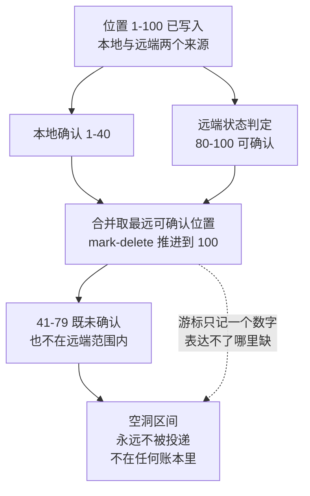

# 案例三十：中间缺了一块——跨地域复制的 ack 空洞

> **要点**：游标用"已确认的最远位置"表示进度，这默认了确认是连续的；当中间某段被跳过而后面的先确认，空洞就产生了——进度显示已推进，实际中间那段永远不会被投递。

用一个位置表示进度，隐含地假设了进度是连续的。这个假设在单条路径上成立，一旦有多个来源推进同一个游标，它就不成立了。Apache Pulsar 的这个病例（已在本环境真实复现）展示了这个假设破裂的具体形态——以及为什么它比"丢一条消息"更麻烦。

## 案例背景（要解决的问题见下节）

**项目**：Apache Pulsar——分布式的消息与流处理平台，其订阅游标用单一位置表达消费进度，跨地域复制让已处理部分不再是一段连续区间。

订阅游标（cursor）记录消费进度。常规场景下，消费者顺序确认消息，游标单调向前推进，用一个"最后确认的位置"（mark-delete position）足以表达进度。

跨地域复制（geo-replication）改变了这个前提。启用复制后，消息可能来自本地生产，也可能来自远端集群的复制。这些来源在游标上的推进**不是同一个顺序流**：远端的确认状态与本地的确认状态需要合并，而合并后的结果可能不是连续的。

## 问题：进度越过了未确认的一段

上游报告的现象（[上游 commit e0cc63a2](https://github.com/apache/pulsar/commit/e0cc63a22223)，P0）是：跨地域复制场景下游标上出现 **ack 空洞**——一段位置被跳过，而它前后的位置都已确认。

空洞的后果是这一段消息**永远不会被投递**。游标记录的进度已经越过了它们，消费方不会再收到；而它们也没有被确认过，不属于"已处理"。它们处在一种两不属的状态：不在待投递集合里，也不在已确认集合里。

与丢一条消息不同，空洞是一片区间。区间里可能包含成百上千条消息，而系统对它们的存在没有任何记录。

## 为什么是问题：进度这个抽象本身失效了

**单一位置无法表达非连续状态。** 这是根本困难。游标用"最远确认位置"表示进度，其语义是"这个位置之前的都处理完了"。出现空洞时，这个语义不再成立——位置之前有未处理的，但游标没有地方记录"哪里没处理"。**不是游标的值错了，是这个表示能力不够**。

**系统无法自证。** 游标看不到自己的空洞，因为它不保存"应该有哪些位置"这份信息。要发现空洞，需要一份独立的清单（比如实际写入的位置范围）与之比对。没有这个比对，空洞就不可见。

**它只在复制场景下出现，测试覆盖往往不足。** 单集群顺序消费不会产生空洞。跨地域复制的测试通常关注"消息是否到达"，而不是"确认状态是否连续"。这让它能长期存在而不被发现。

**后果是静默的批量丢失。** 空洞区间内的消息不会报错、不会重试、不会进死信队列——它们只是不在了。发现往往来自业务侧的对账："这个时间段的数据好像少了一批"。

**与 [案例十八](./案例十八：空集合被当成了"全部已确认"——游标跳过的位置.md) 同源而形态不同。** 两者都导致游标越过本不该越过的位置：案例十八源于空集合被解释为"全部完成"，本例源于多个来源的确认合并后不连续。用同一句话概括：**游标的位置推进逻辑默认了连续性，而连续性不是免费的**。

## 本质：用一个标量表达集合状态时的信息损失

把这份游标位置的表示方式抽象出来，骨架是：

> **当进度用"最远位置"这个标量表示时，它隐含假设"已处理的部分是从起点到该位置的连续区间"；一旦已处理部分不是连续区间，这个表示就无法表达真实状态，且无法自愈——因为表示本身没有记录缺失。**

这条骨架值得分三层来看。

**第一层：表示能力决定可表达的状态。** 一个标量位置能表达的状态是"前 N 个都完成了"。真实状态可能是"前 N 个里除了第 30 到 50 个都完成了"。后者无法用前者表达，只能退化为前者——而退化过程丢掉了"30 到 50 未完成"这个信息。

**第二层：丢失的信息不会出现在任何日志里。** 因为系统从不知道自己丢过它。表示能力之外的东西，连"没记录到"这个事实都没有记录。

**第三层：多个独立来源合并时，连续性假设最易破。** 单个来源顺序推进，连续性是自然结果。两个来源各自连续，合并后未必连续——来源A 推进到 100，来源B 只到 50，合并后"最远 100"与"实际到 50"之间有空洞。**合并操作天然会破坏连续性**，这是这类缺陷集中的地方。

## 比喻：点名只记最后一个到的人

老师点名，规则是"记住最后一个答到的人，他之前的都算到了"。这个规则在全员按序答到时完全正确。

现在有两个班合并上课。A 班按序答到，最后一个答到的是第 40 号；B 班也按序答到，最后一个是第 25 号。老师记下"最后一个答到的是 40 号"，于是认为 1 到 40 都到了。

实际 26 到 40 号里，只有 A 班的人到了，B 班那部分人没来。他们没有被记为缺席（没人记缺席），也没有被记为到场（他们没答到）——他们在花名册上消失了。

老师的记录方式决定了他发现不了这件事：他只记一个数字，而"26 到 40 号里缺了几个"这件事需要一个名单才能表达。他不是记错了数字，是**记数字这个方式本身表达不了这个情况**。

要修，要么改成记名单（能表达空洞），要么在合并时确保不产生空洞（等两边都到齐再推进）。

## 机制：两个来源的确认如何合并

ack 空洞发生在游标的这一处推进逻辑里：

```
managed-ledger/src/main/java/org/apache/bookkeeper/mledger/impl/ManagedCursorImpl.java
```

跨地域复制下，消息的确认状态由本地消费与远端复制状态共同决定。游标在推进 mark-delete 位置时，需要综合这两个来源。

产生空洞的结构是这样的：

1. 位置 1 到 100 已写入，其中一部分来自本地、一部分来自远端复制。
2. 本地消费确认了 1 到 40。
3. 远端复制的状态使某些后续位置（比如 80 到 100）被判定为可确认。
4. 合并后 mark-delete 推进到 100。
5. 位置 41 到 79 既未被本地确认，也不在远端确认范围内——它们成了空洞。

关键在于第 4 步：**推进逻辑取的是"最远的可确认位置"，而不是"连续可确认的最远位置"**。前者允许跨越，后者不允许。顺序消费场景下两者等价（因为可确认的总是连续的），多来源场景下两者不同。

这是一个"隐含前提在演化中失效"的典型：推进逻辑最初为单来源设计，那时跨越与连续是一回事；引入多来源后前提变了，逻辑没变。这与 [案例十八](./案例十八：空集合被当成了"全部已确认"——游标跳过的位置.md) 的结构一致——**代码没有错，是它所依赖的假设不再成立**。

两个来源各自连续推进，合并取最远位置时空洞怎么出现：



图回答的是空洞的诞生过程：两个来源各自遵守连续推进（本地 1-40 连续，远端 80-100 连续），合并逻辑取“最远”时把中间的 41-79 跨了过去——跨过的区间没有归属（不是已确认，也不是待投递），它从两个账本里同时消失。虚线标注根本困难：游标只保存一个标量位置，“哪里缺了”这个信息在表示能力之外，连“没记录”都没有被记录。

上游修复的方向是让推进逻辑感知连续性：在跨地域复制场景下，不能简单取最远位置，而要确保被跳过的位置确实处于可确认状态；同时对已经产生的空洞提供检测与修复路径。

## 怎么发现：用独立清单做比对

**维护一份独立的"应有位置"清单并定期比对。** 游标只记进度，不记"应该有哪些"。比对需要外部参照——比如账本实际写入的位置范围。两者做差集，差集非空就是空洞。这是唯一能主动发现的手段。

**在推进时断言连续性。** 每次 mark-delete 前进，检查被跨过的区间是否都处于已确认状态。跨越未确认区间时记录告警。这个检查有成本，但可以在非热点路径或采样模式下启用。

**跨地域复制场景必须有专门的确认连续性测试。** 构造"本地部分确认 + 远端部分确认"的交错场景，验证合并后不存在空洞。顺序消费的测试完全覆盖不到这里。

**业务侧做端到端对账。** 生产端记录发出的消息 ID 集合，消费端记录收到的，定期比对。系统内部的空洞检测可能不完善，业务侧对账是最后一道网。

**监控订阅积压的非单调变化。** 积压突然下降一大截而无对应消费增长，可能是游标跳跃而非消费加速。这是一个廉价的异常信号。

## 上游怎么修

修复在推进逻辑上：让游标在多来源合并时正确处理确认状态，不产生跨越未确认区间的推进；对跨地域复制这一特定场景做针对性处理。

这里有一个值得注意的设计取舍。彻底的解法是把游标从"单个位置"改成"区间集合"（能表达空洞），但代价是存储与计算复杂度大幅上升，且影响所有订阅。上游没有走这条路，而是在推进逻辑上做约束——**保持简单表示，同时禁止会产生空洞的推进**。

这个取舍的合理性在于：空洞是异常状态，不是正常状态。为一个异常状态付出常态化的复杂度代价不划算；更好的选择是让它在结构上不可能发生，并为已发生的情况提供检测与修复工具。

## 边界与教训

- **一个标量位置表达不了非连续的进度。** 多来源合并时，连续性假设天然会破。
- **合并操作是连续性失效的高发区。** 各自连续，合起来未必连续。
- **丢失的信息不会出现在日志里。** 表示能力之外的东西，连"没记录"都没有记录。
- **顺序消费的测试覆盖不到跨场景。** 多来源交错必须有专门测试。
- **独立参照是发现空洞的唯一手段。** 系统内部无法自证。
- **取舍：为异常状态付常态化代价不划算。** 优先让它在结构上不可能发生。

概念入口：消息投递与业务提交的一致性边界——[[工程知识/后端系统：在并发、失败与变化中维持服务/分布式可靠性/消息投递与业务提交需要显式的一致性边界]]；复制与分片改变数据归属——[[工程知识/后端系统：在并发、失败与变化中维持服务/分布式可靠性/复制分片与再平衡改变数据归属]]。

相关：[[工程知识/缺陷分析：从个案到体系/正确性/案例十八：空集合被当成了"全部已确认"——游标跳过的位置]] · [[工程知识/缺陷分析：从个案到体系/正确性/案例二十九：离开的人还占着座位——机架信息的陈旧映射]] · [[工程知识/缺陷分析：从个案到体系/缺陷分析：从个案到体系——导读与开源地图]]

## 验证

1. 上游对照：到 Pulsar 的提交 e0cc63a2 里核对修复方式，确认游标能够表达非连续区间而不是单一的最远位置。
2. 机制复现：在开启跨地域复制的订阅上让确认来源不按同一顺序推进，修复前游标出现空洞、区间内的消息既不被投递也不被重新读取，修复后这些位置仍在待处理范围内。
3. 空洞检测：准备一份独立于游标的已写入位置清单，与游标推进结果逐段比对，确认缺失区间能被这份对照发现；没有对照时空洞不可见。
4. 边界核验：在单集群顺序消费场景下重复同一流程，预期不产生空洞，确认症状只在多来源合并确认时出现。
5. 断言锚点：空洞区间的起止位置与消息数量留档，独立清单与游标推进结果的比对进入复现脚本。

