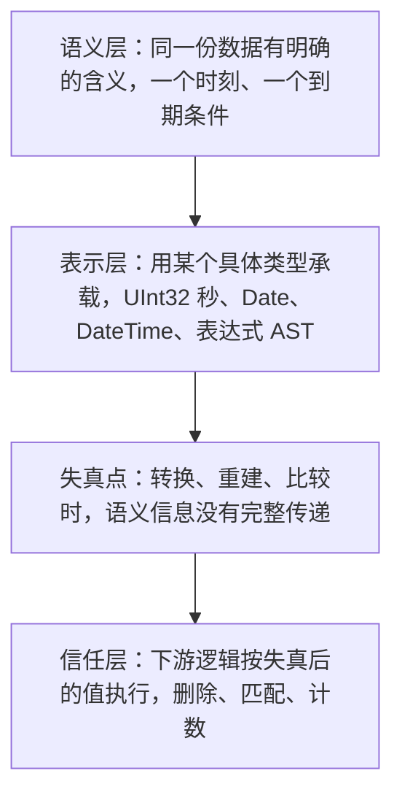

# 案例十：类型说谎时——静默删数据的 TTL 与算错的比较

> **要点**：当类型系统对同一份数据给出两种解释，依赖它的逻辑就会算错。ClickHouse 的三个病例里，这个错位分别表现为后台合并删掉了未到期的数据行、IN 比较漏掉应有的行、数组查找的结果随列编码而变——前者的后果是数据永久丢失且不报错。

算错结果可以重算，删错数据不能。ClickHouse 的上游修复里有三个病例，根因是同一类：**类型信息在传递或重建的过程中丢失了精度，而下一段逻辑信任了这份不精确的信息**。它们分布在不同的子系统，表现的严重程度却从"结果略有出入"一直排到"数据没了"。

## 病例一：TTL 删掉了未到期的数据

**缺陷**（[上游 commit 1efa7a35](https://github.com/ClickHouse/ClickHouse/commit/1efa7a3541120567cd8f0f00c4f6a8b26938495b)，P0）。表的 TTL 表达式里使用了 `arrayJoin` 时，TTL 表达式在重建时不校验。后台合并或 INSERT 执行时，表达式按行位置错位求值，**静默删除尚未到期的数据行**。

**为什么这是最严重的一档**。TTL 的语义是"到期的数据可以删"。这个缺陷让删除发生在未到期的数据上，而删除是物理的——合并完成后，那些行不在了，没有回收站，没有 undo。用户在查询时只会发现"数据少了"，不会收到任何错误。

**修复**：重建表达式时校验，遇到无法安全重建的 TTL 表达式抛出 `BAD_TTL_EXPRESSION`。修复特意保留了表的可用性——表仍可加载，可以用 `REMOVE TTL` 或 `MODIFY TTL` 修复。这是一个值得注意的取舍：**让故障在加载时显式暴露，而不是让它在合并时静默执行**。

## 病例二：超出 UInt32 的常量参与 IN 比较

**缺陷**（[上游 commit b50a2a40](https://github.com/ClickHouse/ClickHouse/commit/b50a2a408e13d3c510cbd2d094f64763cdb0b3a6)，P1）。DateTime 列与超出 `UInt32` 范围的 `UInt64` 常量做 IN 比较时，返回错误结果——既多匹配了无关的行，也漏掉了本应命中的行。

**机制**：DateTime 内部表示为 `UInt32` 秒。常量是 `UInt64` 且超出 `UInt32` 可表示的范围，转换时截断，比较在错误的数值上进行。修复在转换层加了范围检查，越界常量不再参与匹配，`values()` 按边界报错。

这例和 [[工程知识/缺陷分析：从个案到体系/正确性/案例九：数字越过了边界——Redis 里三次截断导致的崩溃]] 是同一个根因——数值在类型边界上被截断。差异在于后果：Redis 那里截断导致越界读和崩溃，这里截断导致查询结果错误。同一个根因，因为下游用途不同，一个变成稳定性缺陷，一个变成正确性缺陷。

## 病例三：Date 与 DateTime 混用时的数组查找

**缺陷**（[上游 commit 11744f27](https://github.com/ClickHouse/ClickHouse/commit/11744f2733f28b94e42dee7e3e003602020e6cc8)，P2）。数组查找在 Date 与 DateTime 混用时漏掉本应命中的元素，`has` 返回 0、`countEqual` 少计。

**最麻烦的一点**：结果随列编码而变。同一个逻辑上的时刻，编码成 Date 和编码成 DateTime 会得到不同的查找结果。这意味着缺陷的表现依赖于表的物理定义，而用户通常不会意识到自己在混用两种编码。

**修复**：统一比较逻辑，使数组查找与 equals、IN 对同一时刻给出一致的答案。

## 要解决的问题：类型信息在哪里失真

（机制与本质见本节）

三例的共同结构是：

三个病例的失真点各不相同：

- **病例一**是**表达式重建失真**。TTL 表达式以元数据存储，加载时需要从元数据重建回可执行的表达式。`arrayJoin` 改变了行数，重建时没有考虑这一点，导致表达式与数据行的对应关系错位。
- **病例二**是**数值转换失真**。宽类型转窄类型，超范围部分被截断。
- **病例三**是**类型等价判断失真**。Date 和 DateTime 在语义上都表示时刻，但在比较时走了不同的路径，没有统一到同一个可比表示。

三者的共同点是：**失真发生在中间层，而错误表现发生在下游**。删数据的是合并逻辑，不是 TTL 解析逻辑；返回错行的是执行器，不是类型转换函数。这个错位让定位变得困难——你看到的故障现场，往往离失真点有好几层调用。

## 为什么这一类危险

**静默是默认状态**。三个病例都不抛异常、不写错误日志。病例二和病例三返回的是"看起来正常"的错误结果；病例一执行的是"看起来正常"的删除。没有信号可供监控。

**数据丢失不可逆**。算错可以重算，删错不行。病例一的严重性来自删除的物理性，而不是来自缺陷本身的复杂度。

**发现时间决定损失大小**。TTL 删除是在后台合并时持续发生的。从表创建到发现数据缺失，中间可能已经历多次合并，每次都在删。等到用户察觉，损失早已累积，且无法区分哪些行是被误删的。

**它依赖数据定义而非数据内容**。病例三的结果随列编码而变，病例一依赖 TTL 表达式的写法。这意味着同一份查询逻辑，在不同表上表现不同——测试覆盖了一种建表方式，不代表覆盖了另一种。

验证的锚点：静默删除要与对照查询对账——预写含复杂表达式的记录在合并后应完整保留，实测数据被静默删除且无任何报错，与预期对不上。

## 边界与教训

- **元数据重建出来的表达式，要当作不可信输入来校验。** 存储时合法不代表重建后仍合法，尤其是涉及行数变化的算子。
- **隐式类型转换是正确性的常见敌人。** 宽转窄、Date 转 DateTime、有符号转无符号——转换点应当有明确的范围检查，转换失败应当报错而不是继续。
- **让不可恢复的操作在早期失败。** 病例一的修复选择"加载时报 `BAD_TTL_EXPRESSION"而不是"合并时静默删错"，是把不可逆操作的失败点前移。删除、覆盖、 truncation 这类操作，宁可显式失败也不要静默执行。
- **同一语义的不同表示要有统一的比较路径。** Date 与 DateTime 都表示时刻，比较时就该走同一条路；两条路径并存，迟早给出不同答案。
- **回归用例要覆盖类型组合，而不只是类型本身。** 混用 Date 与 DateTime、用 UInt64 常量比较 UInt32 列，这些组合才是缺陷的藏身处。

概念入口：静默错算为什么比崩溃更危险——[[工程知识/缺陷分析：从个案到体系/正确性/案例二：静默错算——Spark SQL Union 的别名陷阱]]；数值边界上的截断行为——[[工程知识/缺陷分析：从个案到体系/正确性/案例九：数字越过了边界——Redis 里三次截断导致的崩溃]]。

相关：[[工程知识/缺陷分析：从个案到体系/缺陷分析的本质——期望与现实的偏差]] · [[工程知识/缺陷分析：从个案到体系/缺陷分析五步法——从个案到通用模型]] · [[工程知识/缺陷分析：从个案到体系/缺陷分析：从个案到体系——导读与开源地图]]

## 验证

1. 上游对照：分别到 ClickHouse 的提交 1efa7a35、b50a2a40 与 11744f27 里核对三处修复，确认一处是重建 TTL 表达式时校验并抛出 `BAD_TTL_EXPRESSION`、一处是转换层加范围检查、一处是统一数组查找与 equals、IN 的比较逻辑。
2. 数据丢失复现：对含 `arrayJoin` 的 TTL 表执行后台合并，修复前未到期的数据行被删除且没有任何错误，修复后表加载时报出 TTL 表达式错误但仍可用 `REMOVE TTL` 修复。
3. 比较错算复现：用超出 `UInt32` 范围的常量与 DateTime 列做 IN 比较，记录多匹配与漏匹配的行数；修复后越界常量不参与匹配或按边界报错。
4. 编码依赖复现：把同一个时刻分别以 Date 与 DateTime 编码后做数组查找，修复前 `has` 与 `countEqual` 的结果随编码而变，修复后三者结果一致。
5. 断言锚点：三处修复各自的对照实验留档，删除类症状确认无错误提示这一特征被记录。

## 收益与代价

把类型转换点与元数据重建结果当作需要校验的输入，换来的是隐式转换、跨类型比较这些藏身处会被独立核对，不可恢复的删除类操作能在加载阶段显式失败。代价是个案定位要跨越多层调用找到中间失真点，回归用例需要覆盖类型组合而不只是类型本身，已删除数据无法通过重算恢复。

