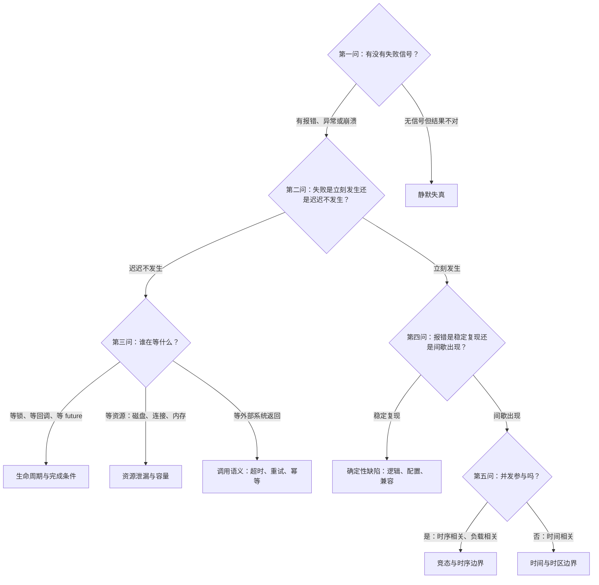

# 症状到机制的判定树——新缺陷的归类入口

案例库按现象分目录（正确性、稳定性、并发、性能），但新缺陷来的时候，手上只有一句现象描述："任务卡住了""数字不对""服务时好时坏"。从现象描述到机制类别之间缺一个入口——这正是判定树要解决的问题：拿可观察的症状特征做二分，把新缺陷导到正确的机制类别，每个机制类别再指向库内的代表案例。

判定树的每一层只用**当时就能观察到的信息**做分支，不用事后才能确认的信息。这样树可以在排查最早期使用，而不是等结论出来了才对号入座。

## 判定树主体

每一片叶子指向库内的代表案例：

| 机制类别 | 代表案例 |
| --- | --- |
| 静默失真 | [[工程知识/缺陷分析：从个案到体系/正确性/案例二：静默错算——Spark SQL Union 的别名陷阱]] |
| 生命周期与完成条件 | [[工程知识/缺陷分析：从个案到体系/稳定性/案例二十一：异常路径上没有完成——永不兑现的 future]] |
| 资源泄漏与容量 | [[工程知识/缺陷分析：从个案到体系/资源与容量/案例六：容量与泄漏——连接泄漏和 SST 堆积]] |
| 调用语义 | [[工程知识/缺陷分析：从个案到体系/稳定性/案例八：承诺没有兑现——Pulsar 里六个永不返回的请求]] |
| 确定性缺陷 | [[工程知识/缺陷分析：从个案到体系/配置/案例四：配置不生效——recover 速率与重复日志]] |
| 竞态与时序边界 | [[工程知识/缺陷分析：从个案到体系/并发/案例二十：关闭之后还有人在用——生命周期的时序竞态]] |
| 时间与时区边界 | [[工程知识/缺陷分析：从个案到体系/稳定性/案例二十二：时间也是输入——夏令时让序列生成越界]] |

这棵树的骨架来自缺陷分析五步法（见 [[工程知识/缺陷分析：从个案到体系/缺陷分析五步法——从个案到通用模型]]）的第一步"定界"，把定界的三个问题展开成机制类别的分支。树的叶子不是答案，是**排查的起点与同类案例的索引**。

## 为什么按症状特征而不是按组件分

按组件分（数据库问题、网络问题）要求排查者预先猜对组件，猜错就整棵子树白走。按症状特征分（有没有信号、谁在等什么、是否间歇）不预设组件，分支判据直接来自观察。这与缺陷的本质定义一致：缺陷是期望与现实的偏差（见 [[工程知识/缺陷分析：从个案到体系/缺陷分析的本质——期望与现实的偏差]]），症状特征就是偏差的可观察面。

树的高度故意控制在五问以内。更深的两问（根因在哪个 commit、哪个版本引入）属于复现与回归阶段的方法，见 [[工程知识/缺陷分析：从个案到体系/复现与回归/从复现到回归——让证据走完一圈]]。

## 使用约束与边界

判定树的适用前提：症状描述来自第一手观察，经过二手转述的现象（"用户说很慢"）先要转成可判定的特征（慢在全部请求还是部分、稳定还是间歇）。

树的三个边界：

1. **叠加缺陷**。一个现象可能是多个机制叠加（资源泄漏导致超时，超时重试加剧泄漏），树只能给出主要分支，排查时对每个分支都快速验证一遍而不是只走一条。
2. **树不能替代复现**。归类只是缩小假设空间，确认还是要走最小复现，见 [[工程知识/软件构建：让变化可以理解、验证与交付/测试与交付/调试从假设到最小复现]]。
3. **静默类要主动验证**。"无信号"分支是最危险的入口——静默失真往往已经存在很久才被发现，判定后应直接进入对账与不变量检查，方法见 [[工程知识/缺陷分析：从个案到体系/正确性/静默失真的检测靠对账与不变量而不是报错]]。

## 验证

验证的锚点：判定树可用性要与案例反测对账——预写把既有案例只凭现象描述过树应走到正确机制类，走错分支与预期对不上时改判据而不加分支。

树的可用性用库内案例反测：把 42 篇案例的现象描述（不看结论）逐篇过树，统计走到正确机制类的比例。任何一篇走错分支，说明该分支的判据有歧义，需要改判据，不需要加分支——判据要求是二分的、无歧义的、当时可观察的。

新增案例时同样过一遍树：如果新案例的机制类在树上没有叶子，说明体系缺一类机制的表达，先补树再归档案例。

## 效果与代价

按可观察症状而不是按组件归类，换来的是排查最早阶段就能把假设空间缩小到某一类机制，分支判据不依赖事后结论。代价是树的每个分支需要保持二分且无歧义，叠加缺陷的情况下只能先给出主要分支，归类之后仍需走最小复现才能确认。

## 相关

关系：[[工程知识/缺陷分析：从个案到体系/缺陷分析五步法——从个案到通用模型]] · [[工程知识/缺陷分析：从个案到体系/缺陷分析的本质——期望与现实的偏差]] · [[工程知识/缺陷分析：从个案到体系/正确性/静默失真的检测靠对账与不变量而不是报错]]

- [[工程知识/缺陷分析：从个案到体系/复现与回归/从复现到回归——让证据走完一圈]] —— 归类之后的完整证据流程
- [[工程知识/软件构建：让变化可以理解、验证与交付/测试与交付/调试从假设到最小复现]] —— 判定树终点的复现方法
- [[工程知识/AI 系统工程：从模型能力到生产能力/质量与运营/失败要分类才能对症下药]] —— AI 系统里同构的失败分类法
- [[工程知识/缺陷分析：从个案到体系/稳定性/异常处理器的覆盖面：Error 逃逸终止周期任务]] —— "后台任务静默终止"症状的机制归类：周期任务 + 异常名单缺口
- [[工程知识/缺陷分析：从个案到体系/性能/锁内的长动作：临界区里藏着的延迟放大器]] —— "延迟与故障时长同步涨"症状的机制归类：临界区内藏慢路径
- [[工程知识/缺陷分析：从个案到体系/资源与容量/只增不减的索引：墓碑靠压实才能变成空间]] —— "删了数据磁盘不降"症状的机制归类：两段式删除的兑现环节缺席
