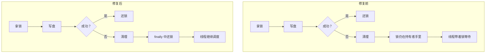

# 案例十二：调度线程的永久等待——广播写锁不释放

> **要点**：广播数据写盘失败时，清理路径没有释放块写锁，持有等待语义的调度线程永远等了下去——一个异常路径上缺失的 finally，把"一次写入失败"放大成"这个应用的所有后续作业都无法调度"。

这类缺陷值得单独占一篇，是因为它的输入和后果之间隔得太远：一次本地磁盘写入失败，最终让整个应用再也调度不了任何作业。中间没有报错、没有崩溃、没有重启，只有一个线程安静地等着一把永远不会归还的锁。理解它需要把"异常路径上的资源释放"和"锁的等待语义"这两件事连起来看——单独看任何一件，都推不出这个结局。

## 要解决的问题

本篇要解决的问题是：一次本地磁盘写入失败，怎样经过一条缺失的资源释放，放大成全局调度停滞。答案涉及两处机制——异常路径上的资源释放，以及锁的等待语义。

## 从一句描述开始

缺陷描述只有一句：

> 广播数据写入本地磁盘失败时，块写锁不释放，后续作业无法调度。

初读的人心里会冒出三个疑问，每一个都打在要害上：

1. **写失败就失败呗，为什么会"卡住"？** 失败不是应该抛个异常、报个错、继续往下走吗？
2. **锁不释放，影响的应该只是"这一次广播"吧？** 怎么会变成"后续所有作业"？
3. **为什么没有任何报错？** 失败好歹留条日志，这条连痕迹都没有。

这三个疑问的答案，恰好就是这类缺陷的全部本质。先立一个比喻，把机制分开来看。

## 银行柜台比喻：章被扣下了

| 现实 | 比喻 |
|---|---|
| 调度事件循环线程 | 银行**柜员**——所有业务都要过她的手 |
| 块写锁 | 柜员手里的**公章**——盖章才能办下一笔 |
| 广播数据写盘 | 办理**一笔具体的业务** |
| 写盘失败 | 这笔业务的**材料有问题** |
| 清理路径不释放锁 | 业务办砸了，**章没还给柜台** |
| 后续作业无法调度 | 柜员空着手站在那儿，**整个银行不办业务** |

正常流程：拿章 → 盖章办业务 → **把章放回柜台** → 叫下一位。失败流程：拿章 → 办业务 → 材料有问题 → 转入善后处理 → **善后的人忘了把章放回去**。柜员没有章，叫号系统还在叫号，队伍越排越长——银行表面上开着门，实际上什么业务都办不了。

这里的结构性原因值得说透：**写锁的获取和释放写在两条代码路径上**。正常路径"拿锁 → 写 → 还锁"写得清清楚楚；失败路径"出错了 → 清理 → （这里忘了还锁）"。程序员不是不知道要还锁，是**清理代码的作者和加锁代码的作者关注的场景不同**——清理逻辑通常在事故之后补写，补写的人盯着"把失败现场收拾干净"，锁这件事不在他的视野里。这正是案例一里 Bookie 垃圾回收线程终止的同一个结构性原因：**异常路径是人少的路径，人少的路径没有人审。**

## 逐层回答三个疑问

**疑问一：写失败为什么会卡住，而不是报错？**

因为失败发生了两次，卡住发生在第二次。第一次失败是"写盘失败"——它确实抛了异常。第二次失败藏在**清理路径**里：清理代码要处理半成品文件、要更新状态、要释放资源——锁的释放被遗漏在这一段里。而**锁的等待方没有超时语义**：调度线程等锁的方式是"一直等到锁可用"，没有"最多等多久"。于是第一次失败的后果不是报错，而是把一个没有超时的等待挂进了系统。

这里有一条可迁移的判断：**凡是"失败后进入清理"的代码，要按完整业务来审**——清理自己也可能失败，清理涉及的所有资源都要逐一释放。

**疑问二：锁不释放，为什么影响的是"后续所有作业"？**

这由等待者的身份决定。锁的等待者如果是单个请求，爆炸半径就是这一个请求；本例的等待者是**调度事件循环线程**——它负责把所有排队的作业一个个推上执行。它等锁，等于整条流水线停线。这也是审这类缺陷时的关键一问：**谁在等这把锁？** 等待者越多、越核心，一个未释放的锁就越接近全局故障。

**疑问三：为什么没有任何报错？**

有两个"没有"。第一，写盘失败的那次异常被清理路径处理了，处理完没有继续向外抛——失败被"就地消化"。第二，等锁的线程没有超时，它不认为自己在故障中，它认为自己"还在正常等待"。两边都不觉得自己该报警。**静默的停摆比崩溃更难发现**：崩溃有尸体（堆栈、core），静默停摆只有一个"一切正常但就是不干活"的进程。

## 案例关联

和 [案例一](./../稳定性/案例一：垃圾回收线程的终止——BookKeeper 磁盘写满.md)并排放着看：Bookie 终止在磁盘上，Spark 终止在调度队列里，不变量是同一个——**异常路径上少一个 finally，一次错误就升级成永久停摆**。和 [案例八](./../稳定性/案例八：承诺没有兑现——Pulsar 里六个永不返回的请求.md)也互为印证：Pulsar 的六个病例是"回调没有被完成"，本例是"锁没有被释放"——本质都是**某个承诺（完成回调、释放锁）只在正常路径上被兑现，异常路径上成了空头支票**。

修复互为印证：Bookie 补"跳过并记录"，Pulsar 给每条悬空路径一个终态，Spark 补 try/finally——三个项目、三种表述，剪断的是同一根传导链。

## 上游怎么修

修复（[上游 commit b95a7710](https://github.com/apache/spark/commit/b95a77107a6f9e91e1a1ad57e7efd6b90c5517f8)）把锁的释放挪进 try/finally 的保障范围：无论写入成功还是失败，控制流必然经过释放。改动本身极小——把释放语句的位置和执行保证调整一下。这一族的共性再次成立：**发现的成本远高于修的成本**。

## 复现与验证

这一例已在本环境真实复现。复现的构造方式是让广播写入的本地目录不可写——触发写入失败，然后观察调度线程的状态。修复前，线程停在对写锁的等待上，应用日志中没有与该失败相关的错误；修复后，写入失败正常抛出，锁被释放，后续作业继续调度。

验证要盯的**指标**不是错误数，而是调度线程的状态：它是否仍阻塞在同一把锁上。这个缺陷不产生错误日志，靠日志检索发现不了它，只能靠线程转储或等待时长的观测。

验证的锚点：调度线程状态要与写入失败对账——预写广播写入失败后应抛错并释放写锁，实测线程停在等待写锁上且日志无相关记录，与预期对不上。

## 边界与教训

- **"拿锁 → 干活 → 还锁"的代码，固定问一句：活干砸了，锁还吗？** 异常、超时、中途取消，每条路径都要走一遍这个问题。
- **等待必须有边界**。没有超时的等待是把控制权交给对方——对方出任何问题，都变成你的永久停摆。给等待加上限，停摆才会变成"一次失败"。
- **清理代码按完整业务审查**。它处理的是异常现场，它自己也可能有异常；它触碰的每一份资源都要逐一确认释放责任。
- **等待者的身份决定爆炸半径**。修这类缺陷之前，先画清楚：锁的等待者是谁，等待会沿着调用链传导到哪里。

概念入口：后台任务的生命周期与清理责任——[[工程知识/后端系统：在并发、失败与变化中维持服务/任务与并发/任务生命周期必须覆盖进程、日志、超时与清理]]；等待与超时的语义约定——[[工程知识/后端系统：在并发、失败与变化中维持服务/分布式可靠性/超时、重试与幂等共同定义调用语义]]；锁的等待者视角——[[工程知识/后端系统：在并发、失败与变化中维持服务/任务与并发/并发控制先定义共享状态和完成条件]]。

相关：[[工程知识/缺陷分析：从个案到体系/稳定性/案例一：垃圾回收线程的终止——BookKeeper 磁盘写满]] · [[工程知识/缺陷分析：从个案到体系/稳定性/案例八：承诺没有兑现——Pulsar 里六个永不返回的请求]] · [[工程知识/缺陷分析：从个案到体系/缺陷分析：从个案到体系——导读与开源地图]]

## 验证

1. 上游对照：到 Spark 的提交 b95a7710 里核对修复方式，确认清理路径补上了释放块写锁的动作。
2. 机制复现：让广播数据写盘失败，修复前块写锁未释放、调度事件循环线程持续等待，该应用的所有后续作业都无法调度；修复后锁被归还，后续作业正常调度。
3. 路径核对：逐条检查持有该锁的代码路径，确认异常分支与清理分支都走到释放动作；核对等待该锁的一方是否存在超时上限。
4. 无痕特征确认：修复前该故障不产生任何报错日志，只有线程停住这一现象，这一点在复现记录中明确写出。
5. 断言锚点：锁的获取与释放在同一代码范围内成对出现，异常路径有释放动作，等待方有上限或可观测的停滞信号。

