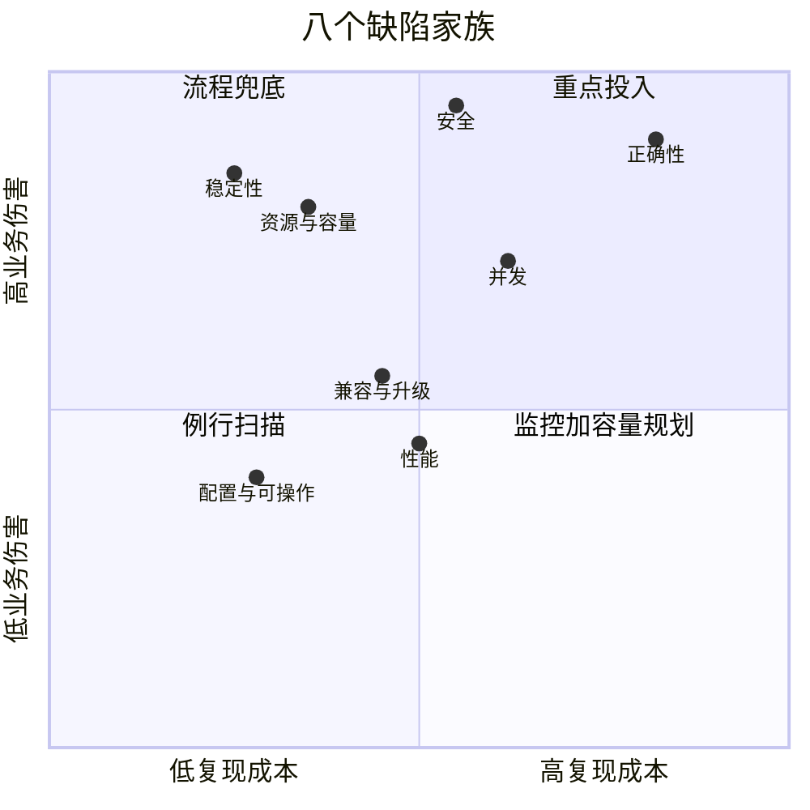

# 缺陷分析：从个案到体系——导读与开源地图

面对一条开源缺陷，怎样系统地走完"判断—复现—修复—回归"的全过程，并且每一步都留下可复核的证据？回答它靠的是真实案例：全部来自对 Apache BookKeeper 和 Apache Spark 累计 1900 余条提交的例行扫描，每一条都有上游 commit 可查、有可复跑的复现步骤、有修复前后的对照。

## 要解决的问题

开源项目的提交流是一条持续增长的长河。看完单条提交不难，把判断、复现、修复、回归每一步都留下可以复核的证据这套做法稳定下来却很难。本篇要解决的问题是：把这套做法组织成一张可以查阅的地图，交代每部分的读法、案例如何入库与去重、地图如何继续生长。

## 怎么读

全书分三部分，读法不同：

**第一部分：本质与方法（5 篇）**。先建立"缺陷是什么"的判断框架，再按五步法的顺序逐段展开。这五篇是骨架，建议按顺序读：[[工程知识/缺陷分析：从个案到体系/缺陷分析的本质——期望与现实的偏差]] → [[工程知识/缺陷分析：从个案到体系/影响判断/影响判断——这条修复值不值得跟]] → [[工程知识/缺陷分析：从个案到体系/影响判断/影响面估算先于修复——从改一行到伤多少服务]] → [[工程知识/缺陷分析：从个案到体系/复现与回归/从复现到回归——让证据走完一圈]] → [[工程知识/缺陷分析：从个案到体系/缺陷分析五步法——从个案到通用模型]]。

**第二部分：案例索引（42 篇）**。按缺陷的家族排列，每篇讲一两个真实缺陷的完整病例——它怎么发生、为什么危险、上游怎么修、可迁移的教训是什么。可以按需跳读，也可以通读：[[工程知识/缺陷分析：从个案到体系/稳定性/案例一：垃圾回收线程的终止——BookKeeper 磁盘写满|案例一·垃圾回收线程的终止——B]] · [[工程知识/缺陷分析：从个案到体系/正确性/案例二：静默错算——Spark SQL Union 的别名陷阱|案例二·静默错算——Spark ]] · [[工程知识/缺陷分析：从个案到体系/并发/案例三：并发两面——写回调卡死与心跳竞态|案例三·并发两面——写回调卡死与]] · [[工程知识/缺陷分析：从个案到体系/配置/案例四：配置不生效——recover 速率与重复日志|案例四·配置不生效——recov]] · [[工程知识/缺陷分析：从个案到体系/安全/案例五：安全两例——认证绕过与带漏洞依赖|案例五·安全两例——认证绕过与带]] · [[工程知识/缺陷分析：从个案到体系/资源与容量/案例六：容量与泄漏——连接泄漏和 SST 堆积|案例六·容量与泄漏——连接泄漏和]] · [[工程知识/缺陷分析：从个案到体系/兼容与升级/案例七：兼容与性能——滞后的依赖与放大的日志|案例七·兼容与性能——滞后的依赖]] · [[工程知识/缺陷分析：从个案到体系/稳定性/案例八：承诺没有兑现——Pulsar 里六个永不返回的请求|案例八·承诺没有兑现——Puls]] · [[工程知识/缺陷分析：从个案到体系/正确性/案例九：数字越过了边界——Redis 里三次截断导致的崩溃|案例九·数字越过了边界——Red]] · [[工程知识/缺陷分析：从个案到体系/正确性/案例十：类型说谎时——静默删数据的 TTL 与算错的比较|案例十·类型说谎时——静默删数据]] · [[工程知识/缺陷分析：从个案到体系/稳定性/案例十一：上游修好了，你这边没有——一个发行分支的移植缺口|案例十一·移植缺口]] · [[工程知识/缺陷分析：从个案到体系/稳定性/案例十二：调度线程的永久等待——广播写锁不释放|案例十二·调度线程的永久等待——广]] · [[工程知识/缺陷分析：从个案到体系/正确性/案例十三：键序与列名——Spark SQL 又两种静默错算|案例十三·键序与列名——Spark]] · [[工程知识/缺陷分析：从个案到体系/并发/案例十四：一方取消，旁观者陪葬——RocksDB 状态加载的并发陷阱|案例十四·一方取消，旁观者陪葬——]] · [[工程知识/缺陷分析：从个案到体系/配置/案例十五：错误最晚在哪一刻暴露——Imputer 与公平调度的两种延迟|案例十五·错误最晚在哪一刻暴露——]] · [[工程知识/缺陷分析：从个案到体系/正确性/案例十六：数据被自己人删掉——entry log 头里的假账|案例十六·数据被自己人删掉——en]] · [[工程知识/缺陷分析：从个案到体系/资源与容量/案例十七：删除列表里的幽灵——永不收敛的待删账本|案例十七·删除列表里的幽灵——永不]] · [[工程知识/缺陷分析：从个案到体系/正确性/案例十八：空集合被当成了"全部已确认"——游标跳过的位置|案例十八·空集合被当成了"全部已确]] · [[工程知识/缺陷分析：从个案到体系/并发/案例十九：在回调里改自己——清理路径的重入与回收后复用|案例十九·在回调里改自己——清理路]] · [[工程知识/缺陷分析：从个案到体系/并发/案例二十：关闭之后还有人在用——生命周期的时序竞态|案例二十·关闭之后还有人在用——生]] · [[工程知识/缺陷分析：从个案到体系/稳定性/案例二十一：异常路径上没有完成——永不兑现的 future|案例二十一·异常路径上没有完成——永]] · [[工程知识/缺陷分析：从个案到体系/稳定性/案例二十二：时间也是输入——夏令时让序列生成越界|案例二十二·时间也是输入——夏令时让]] · [[工程知识/缺陷分析：从个案到体系/稳定性/案例二十三：一次抖动变成一次重算——SASL 拉取没有重试|案例二十三·一次抖动变成一次重算——]] · [[工程知识/缺陷分析：从个案到体系/性能/案例二十四：并行度被自己折叠——repartition 的 2 的幂倾斜|案例二十四·并行度被自己折叠——re]] · [[工程知识/缺陷分析：从个案到体系/性能/案例二十五：库自带了一支军队——OpenBLAS 的隐式线程|案例二十五·库自带了一支军队——Op]] · [[工程知识/缺陷分析：从个案到体系/安全/案例二十六：公告栏没查门禁——Redis 的 ACL 键名泄露与解析崩溃|案例二十六·公告栏没查门禁——Red]] · [[工程知识/缺陷分析：从个案到体系/正确性/案例二十九：离开的人还占着座位——机架信息的陈旧映射|案例二十九·离开的人还占着座位——机]] · [[工程知识/缺陷分析：从个案到体系/正确性/案例三十：中间缺了一块——跨地域复制的 ack 空洞|案例三十·中间缺了一块——跨地域复]] · [[工程知识/缺陷分析：从个案到体系/并发/案例三十一：回收之后还在飞——跨线程复用可回收对象|案例三十一·回收之后还在飞——跨线程]] · [[工程知识/缺陷分析：从个案到体系/并发/案例三十二：取到了已经不存在的那个——估算器的读取竞态|案例三十二·取到了已经不存在的那个—]] · [[工程知识/缺陷分析：从个案到体系/正确性/案例三十三：估算不等于算术——按大小推条目的错算|案例三十三·估算不等于算术——按大小]] · [[工程知识/缺陷分析：从个案到体系/正确性/案例三十四：省下的句柄与多出的删除——一次优化引入的回归|案例三十四·省下的句柄与多出的删除—]] · [[工程知识/缺陷分析：从个案到体系/配置/案例三十五：后写的覆盖了先写的——策略层级的覆盖顺序|案例三十五·后写的覆盖了先写的——策]] · [[工程知识/缺陷分析：从个案到体系/稳定性/案例三十六：写被自己的回调堵住——挂起的 add 回调|案例三十六·写被自己的回调堵住——挂]] · [[工程知识/缺陷分析：从个案到体系/性能/案例三十七：锁自己变成了瓶颈——争用背后的临界区错配|案例三十七·锁自己变成了瓶颈——争用]] · [[工程知识/缺陷分析：从个案到体系/配置/案例三十八：没有写下来的版本——默认值里的迁移债|案例三十八·没有写下来的版本——默认]] · [[工程知识/缺陷分析：从个案到体系/正确性/案例三十九：身份在改写中丢失——RLS 子查询与视图 DEFAULT 的静默失真|案例三十九·身份在改写中丢失——RL]] · [[工程知识/缺陷分析：从个案到体系/并发/案例四十：谁在回答谁——Pulsar 连接复用与去重的键不完整|案例四十·谁在回答谁——Pulsa]] · [[工程知识/缺陷分析：从个案到体系/正确性/案例四十一：确认了却没确认——Pulsar 消息语义的三种失真|案例四十一·确认了却没确认——Pul]] · [[工程知识/缺陷分析：从个案到体系/正确性/案例四十二：备份里的假账——恢复路径的静默损坏|案例四十二·备份里的假账——恢复路径]] · [[工程知识/缺陷分析：从个案到体系/兼容与升级/案例四十三：升级把前提带走了——依赖行为变更引发的下游失效|案例四十三·升级把前提带走了——依赖行为变更引发的下游失效]] · [[工程知识/缺陷分析：从个案到体系/安全/案例四十四：投毒不是写错，是写给你看——依赖投毒的三个真实剧本|案例四十四·投毒不是写错，是写给你看——依赖投毒的三个真实剧本]]。

**第三部分：本篇**。缺陷地图、项目扩容标准、案例入库与去重规则——地图如何持续生长。

## 开源缺陷地图

八个缺陷家族，按"复现成本"和"业务伤害"两个维度摆进象限：



右上角（又难复现又致命）是投入重心：正确类缺陷要靠独立参照答案去抓，安全类要靠扫描器和最小权限压暴露面。左下角交给例行扫描就够。这张图决定了每一章该带什么武器。

## 项目扩容标准

案例池的覆盖度取决于选了哪些项目。选择标准有三条：生产中常见、上游社区活跃（提交流不断）、与已覆盖项目形成语言或场景互补。下表按这三条列出候选，当前已接入六个项目。

| 项目 | 语言 | 补什么维度 | 状态 |
|---|---|---|---|
| BookKeeper | Java | 存储、一致性、后台周期任务 | 已接入 |
| Spark | Java/Scala | 批计算、SQL 正确性、资源管理 | 已接入 |
| Redis | C | 内存数据结构、单线程模型、协议解析 | 已接入 |
| PostgreSQL 系发行分支 | C | 查询优化、事务与 MVCC、崩溃路径 | 已接入 |
| MySQL | C++ | InnoDB、主从复制、优化器 | 候选 |
| Pulsar | Java | 消息投递、订阅语义、异步回调 | 已接入 |
| Kafka | Java/Scala | 日志追加、消费组协议 | 候选 |
| etcd | Go | Raft 实现、Compact 与 watch | 候选 |
| Kubernetes | Go | 调度器、控制器 reconcile 模型 | 候选 |
| Nginx | C | 事件循环、内存池 | 候选 |
| Envoy | Go/C++ | 网络过滤链、热重启 | 候选 |
| ClickHouse | C++ | 列式执行、TTL 与类型系统 | 已接入 |
| RocksDB | C++ | LSM 压缩、SST 生命周期 | 候选 |

各仓库统一克隆到本地同一目录即可：

```sh
mkdir -p ~/code && cd ~/code
for repo in redis/spiredb redis/redis postgres/postgres mysql/mysql-server \
            apache/pulsar apache/kafka etcd-io/etcd kubernetes/kubernetes \
            nginx/nginx envoyproxy/envoy ClickHouse/ClickHouse facebook/rocksdb; do
  git clone --bare "https://github.com/${repo}.git" "$(basename ${repo}).git"
done
```

--bare 只拉历史不打工作区，扫描用不到工作区，体积小一半以上。

## 案例入库与去重

文章会长，入库必须守规矩，否则半年后没人分得清哪篇讲过什么：

- **唯一键是上游 commit hash**。一个缺陷的身份证就是它，入库前先查这个 hash 是否已被收录——收录过就只更新对应文章的案例段，不开新篇。
- **同机制同教训的并入已有文章**。判断标准不是项目相同，是"出错的机制和得出的教训是否同一类"：BookKeeper 和 Spark 各出一个心跳竞态，并入同一篇并发案例，而不开两篇。
- **新机制才开新篇**。能并入的并入，开新篇的标准是出现了一个现有文章没有回答的问题。
- **案例段永远指向 commit**。读者要能从文章里任何一个案例跳到上游原始提交去核对。

## 规模化后的自动去重

去重与入库的规则已经写成可判定的形式——唯一键是 commit hash、并入条件是机制与教训同类——因此可以交给程序执行：新提交进来先过关键词与规则初筛，再对候选做相似度比对（RAG 检索加 BM25 关键词双路），命中的走并入路径并生成建议段落，未命中的生成案例草稿排队等人工复核。规则先立稳，机器接手时才有据可依。

## 延伸阅读

书里用到的每个概念都在此定位：值得单独成文的已链过去，内容较轻的在正文里当场讲清。下面三处是独立的工程主题，各有完整方法，单独查阅即可：

已有专文的概念：

- 垃圾回收与内存分配（案例一、案例七）→ [[工程知识/性能工程：从用户等待到资源瓶颈/操作系统与运行时/垃圾回收与内存分配决定延迟尾部]]
- 后台任务的生命周期与清理（案例一）→ [[工程知识/后端系统：在并发、失败与变化中维持服务/任务与并发/任务生命周期必须覆盖进程、日志、超时与清理]]
- SQL 从查询到执行引擎的路径（案例二）→ [[工程知识/数据系统：在并发与故障中保存事实/查询与索引/一条SQL如何穿过优化器与存储引擎]]
- 内存模型与并发可见性（案例三）→ [[工程知识/软件构建：让变化可以理解、验证与交付/语言与运行时/内存模型决定并发读写何时可见]]
- 共享状态与完成条件的设计（案例三）→ [[工程知识/后端系统：在并发、失败与变化中维持服务/任务与并发/并发控制先定义共享状态和完成条件]]
- 认证与授权的分工（案例五）→ [[工程知识/后端系统：在并发、失败与变化中维持服务/服务设计/认证授权决定请求能看什么和做什么]]
- LSM 与 SST 的生命周期（案例六）→ [[工程知识/数据系统：在并发与故障中保存事实/事务与存储/LSM树用写放大换取顺序写和可扩展性]]
- 观测体系中的日志与指标（案例七）→ [[工程知识/性能工程：从用户等待到资源瓶颈/观测与诊断/系统指标与观测]]
- 失败分类决定处置动作（影响判断）→ [[工程知识/AI 系统工程：从模型能力到生产能力/质量与运营/失败要分类才能对症下药]]
- 约定作为期望的成文来源（本质）→ [[工程知识/后端系统：在并发、失败与变化中维持服务/服务设计/API接口约定定义输入输出和演进边界]]
- 结构检查与行为正确性的区别（案例二）→ [[工程知识/软件构建：让变化可以理解、验证与交付/架构与代码/静态分析发现结构问题但不能证明行为正确]]
- 故障注入与验证（从复现到回归）→ [[工程知识/软件构建：让变化可以理解、验证与交付/测试与交付/混沌工程验证系统是否真的能处理故障]]

正文内讲清、不单独成文的概念：计划改写的等价性（案例二）、mTLS 与双向认证（案例五）、try-with-resources 的资源归还（案例六）、TPC-DS 计划基线机制（案例二）。

三个常被案例引用、但各自成体系的主题：

- **依赖升级与回滚管理**——案例五、案例七的核心方法，什么时候升、怎么验证、怎么回滚
- **配置校验与可操作性**——案例四的家族：配置如何声明、如何在启动时验证生效
- **复现环境工程**——从复现到回归那篇讲了确定性原则，环境隔离与容器化复现的实操方法另见该主题

## 适用范围与用法

- **方法建立在一个前提上：缺陷的期望有据可查。** 这里案例的期望来源都是上游已合入的修复提交——有 commit、有 diff、有修复前后的对照，判断、复现、回归每一步都能对齐。在自有项目里，期望同样可以来自测试失败、评审意见、线上告警或故障复盘，收集步换一个线索来源，后面四步原样适用。
- **案例按机制代表性收录**。1900 余条提交里收录十几条，标准写在每个案例段的第一句：这个机制能不能迁移到别的系统。能迁移的才收，与严重程度无关。
- **象限图用来定投入重心**。复现成本与业务伤害是经验刻度，用途是决定哪一类缺陷该配哪一种武器（对照测试、扫描器、例行扫描、容量规划），不是给单个缺陷打分的标尺。
- **地图与正文同步更新**。每接入一个新项目，先补地图的项目表和象限图，再写案例。

相关：[[工程知识/缺陷分析：从个案到体系/缺陷分析的本质——期望与现实的偏差]] · [[工程知识/缺陷分析：从个案到体系/影响判断/影响判断——这条修复值不值得跟]] · [[工程知识/缺陷分析：从个案到体系/复现与回归/从复现到回归——让证据走完一圈]] · [[工程知识/缺陷分析：从个案到体系/缺陷分析五步法——从个案到通用模型]] · [[工程知识/缺陷分析：从个案到体系/稳定性/案例一：垃圾回收线程的终止——BookKeeper 磁盘写满]]

验证的锚点：索引可用性要与对照核对对账——预写每篇案例在索引中的家族归属与目录一致、上游链接可访问，任一项与预期对不上就先修正地图。

## 验证

1. 索引核对：按家族把 42 篇案例逐个对照地图上的象限位置，确认每篇案例都出现在索引中且家族归属与目录一致。
2. 上游可查：对索引中的每篇案例抽查其上游 commit 链接，确认链接可访问且现象描述与正文一致。
3. 复现可用：抽查案例给出的复现步骤在实际环境中跑通，确认修复前后的对照能够重现。
4. 阅读顺序：按本质与方法五篇的顺序走一遍，确认每一篇的前置概念都在前一篇里给出。
5. 断言锚点：索引条目与目录一致、上游链接可查、复现步骤可跑通，三项齐备才算地图可用。

