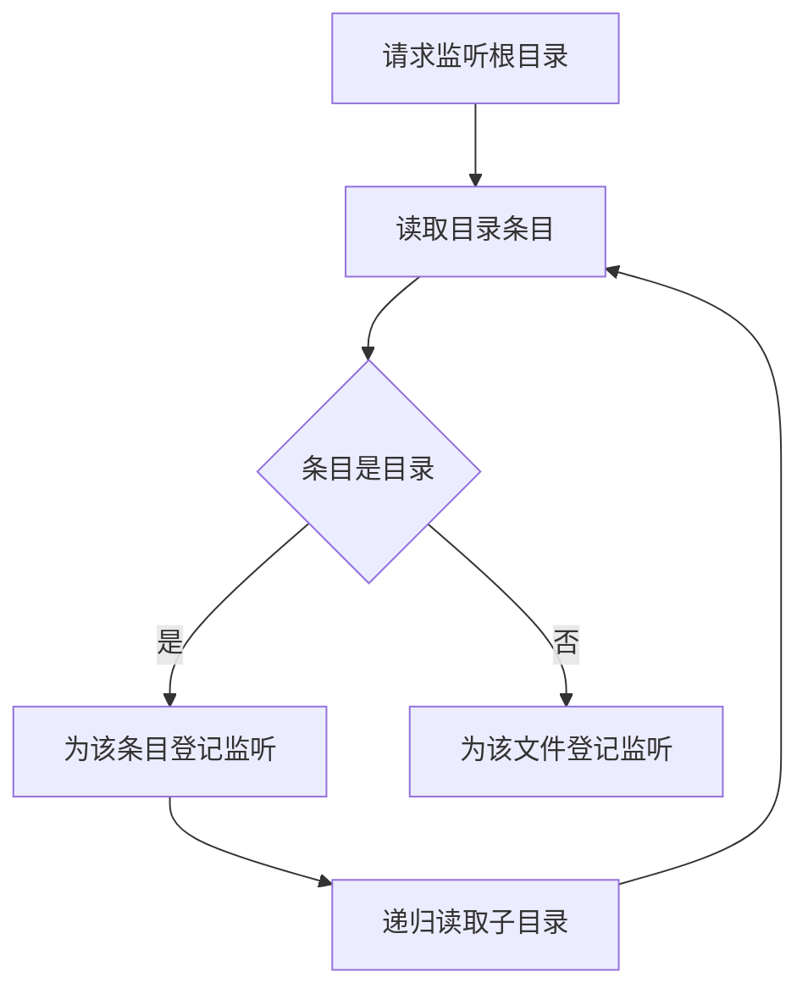

# 文件监视器数量失控：递归监听与上限裁剪

给一个目录树加上「文件变化就重新执行」的能力，最直接的做法是递归监听整棵树。这个做法用在含成千上万个条目的工作副本上会立刻暴露代价：进程的句柄数量与常驻内存一起上涨，涨到某一步开始出现创建失败，而失败位置在树的深处，报错信息看不出是哪一层。

## 要解决的问题

递归监听的实际成本由树中的条目数量决定。内核提供的监听接口只登记单个路径，递归语义由用户态库模拟：遍历这棵树，为每个条目各建一个监听，并在新条目出现时补建。监视器数量因此与条目数量同一个数量级；「监听了几个根目录」这个数字与它没有关系，一个根目录也能产生上万个监听。

三个后果连着来：

- 句柄与原生内存随条目数量线性增长，工作副本越大开销越高。
- 内核侧有按用户计算的上限，越过之后创建失败并返回 `ENOSPC`，失败点取决于遍历顺序。
- 条目数量是外部输入：依赖目录、构建产物、缓存目录都会重新出现，启动时正常不代表运行中一直正常。

## 机制：递归怎么被模拟出来



内核接口每次只登记一个路径。用户态库要做递归，只能自己走一遍目录树逐个登记，文件与子目录都要各建一个；为了覆盖运行期间新建的条目，还要在收到「目录创建」事件时对新目录再登记一次。这条补建链路正是数量失控的入口：依赖安装一次，条目数量可以翻几倍。

裁剪参数的价值在此处体现。一个「最多监听多少个条目」的上限参数，只有作用在每个条目各判断一次的位置才能封顶数量；若它只在遍历根目录时判断一次，对条目数量的增长毫无约束。

## 边界

- **忽略规则带来数量级的下降**。把依赖目录、构建产物、版本控制目录排除，常见的仓库能从数千个条目降到数十个。忽略掉的目录内部变化不可见，需要与定期全量扫描配合，否则会漏掉变更。
- **创建失败只在创建时刻出现一次**。之后的运行不再报错，表现为「某些条目的变化一直没有被响应」，与「本来就没有变化」无法区分，这是它难查的原因。
- **监听器创建与释放不配对会累积**。配置变更后重建监听时若不先释放旧的，数量会跨重启累加。
- **内核上限对定期扫描没有约束力**。改成扫描条目时间戳就不占用监听名额，代价是变化发现延迟与全量扫描开销。

## 验证

先确认内核对监听资源的预算还有余量。这里有两个独立的上限，任一耗尽都会让创建立即失败：

```bash
cat /proc/sys/fs/inotify/max_user_instances
cat /proc/sys/fs/inotify/max_user_watches
find /proc/*/fd -lname anon_inode:inotify 2>/dev/null | wc -l
```

第一条是每个用户可创建的 inotify 实例数上限，第二条是可登记的 watch 条目数上限，第三条给出当前已创建的实例数。实例数接近上限时创建立刻返回 `ENOSPC`；watch 条目总数接近上限时同样如此，只是条目总数要遍历 `/proc/<pid>/fdinfo/<fd>` 统计 `inotify wd:` 的行数才能得到。预算是每个用户共享的，同一台机器上其他进程建得越多，留给本次复现的余量越少。

预算有余量之后，造一棵含数千个空目录的树，用递归监听跑起来，再对照资源计数：

```bash
mkdir -p "$HOME/treedemo" && for i in $(seq 1 3000); do mkdir -p "$HOME/treedemo/d$i"; done
node -e 'require("fs").watch(process.env.HOME+"/treedemo",{recursive:true},()=>{});setInterval(()=>{const c={};for(const x of process.getActiveResourcesInfo())c[x]=(c[x]||0)+1;console.log(c)},1000)'
```

**预期**是文件监听那一类资源的计数（不同运行时版本下可能显示为 `FSWatcher` 或 `FSEventWrap`）随条目数量同向上涨。加上忽略规则或改成非递归监听后重跑，计数应当回到个位数。**对不上**说明监听数量并不由条目数量决定，需要检查实现是否做了合并处理。

## 影响与代价

- 条目数量成为启动开销的隐含上限，工作副本一大就触发。
- 忽略规则换来数量级下降，代价是这些目录内的变化需要靠定期扫描补上。
- 上限参数只有放在正确的判断位置才有意义，放错位置等于没有。
- 启动自检应当核对「实际登记的监听数量」与「预期数量」，两者差距过大时立刻告警。

## 从什么地方做

1. **先数**：打印当前登记的监听数量与条目数量，确认两者处于同一个数量级。
2. **再加忽略**：把依赖目录、构建产物、缓存目录加入忽略，重新计数。
3. **再改策略**：条目数量依然很大时改用「根目录监听加定期全量扫描」的混合策略。
4. **补上自检**：启动时核对监听数量，超出阈值就记录并告警，让下一次失控在启动阶段被看见。

相关：[[工程知识/性能工程：从用户等待到资源瓶颈/观测与诊断/进程内存异常：堆转储与句柄清单的现场诊断]] · [[工程知识/缺陷分析：从个案到体系/资源与容量/资源泄漏的三段式排查法：预筛确认与归因]] · [[工程知识/软件构建：让变化可以理解、验证与交付/开发工具/Linux调查先收集事实再改变状态]]