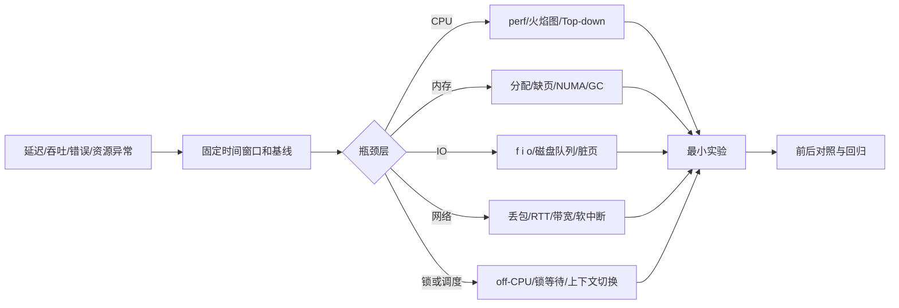

# 性能工程：从用户等待到资源瓶颈

性能不是“把某个参数调大”，而是用模型、测量和实验回答：系统的瓶颈在哪里，优化后代价转移到了哪里，是否值得上线。

## 从现象到根因



## 系统层次

| 能力 | 主问题 | 现有页面 |
| --- | --- | --- |
| 性能建模 | 延迟、吞吐、并发、容量如何互相约束？ | [[工程知识/计算机系统与性能/观测与诊断/性能问题定位]] |
| CPU、内存与运行时 | 指令、分支、缓存、调度、NUMA、分配和 GC 谁在消耗时间？ | [[工程知识/计算机系统与性能/处理器与内存/CPU性能来自有效执行与数据供给]]、[[工程知识/计算机系统与性能/操作系统与运行时/垃圾回收与内存分配决定延迟尾部]]、[[工程知识/计算机系统与性能/观测与诊断/性能剖析与火焰图]] |
| GPU | kernel、显存带宽、并行度、同步与通信谁在限制工作完成？ | [[工程知识/计算机系统与性能/处理器与内存/GPU性能取决于计算、访存、并行与通信]] |
| IO/存储 | 随机/顺序、队列深度、刷盘和带宽如何影响尾延迟？ | [[工程知识/计算机系统与性能/存储与网络/存储IO性能取决于访问模式、队列与持久化语义]]、[[工程知识/计算机系统与性能/观测与诊断/性能剖析与火焰图]] |
| 网络 | RTT、拥塞、连接、软中断和协议栈如何影响请求？ | [[工程知识/计算机系统与性能/存储与网络/端到端网络延迟来自排队、协议、传输与处理]] |
| 观测/剖析 | 如何从指标下钻到线程、系统调用和函数？ | [[工程知识/计算机系统与性能/观测与诊断/系统指标与观测]]、[[工程知识/计算机系统与性能/观测与诊断/性能剖析与火焰图]] |

底层基础与实验方法：[[工程知识/计算机系统与性能/操作系统与运行时/进程线程与系统调用构成执行边界]]、[[工程知识/计算机系统与性能/操作系统与运行时/虚拟内存与文件系统把地址和持久化分层]]、[[工程知识/计算机系统与性能/处理器与内存/CPU缓存与分支决定有效执行时间]]、[[工程知识/计算机系统与性能/存储与网络/Socket与TCP把连接可靠性分成多层]]、[[工程知识/计算机系统与性能/观测与诊断/基准测试必须先定义负载和测量误差]]。

## 延迟、吞吐和并发的关系

Little's Law 在稳定系统中给出平均关系：系统内请求数 L = 到达率 lambda × 平均停留时间 W。它不是容量保证，却能解释为什么延迟上升会迅速堆积并发状态。系统接近饱和后，新增并发主要进入队列，吞吐不再线性增长，尾延迟和超时开始放大。

性能工程因此先问用户等待发生在哪里，再问哪个资源造成等待。CPU 使用率、GPU 利用率、IOPS 和带宽都是中间证据，不是目标。

## 证据优先级

1. 用户可感知的 SLO、请求 trace 和错误率。
2. 资源指标与队列/锁/GC 等运行时证据。
3. Profile、系统调用、内核事件和硬件计数器。
4. 基准测试和合成数据。它们用于验证假设，不能替代真实负载。

## 调优闭环

```text
定义目标和不可退让约束
 -> 建立基线和可重复负载
 -> 只改一个变量
 -> 记录吞吐、p50/p95/p99、资源和错误
 -> 判断收益是否转移瓶颈
 -> 回归、灰度、设置回滚阈值
```

不要把“CPU 使用率下降”“火焰图变窄”直接当作成功；最终目标是业务 SLO、容量和成本改善。
