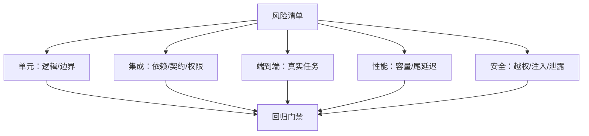

# 测试策略从风险选择证据

测试的目标是降低未知风险，不是堆数量。测试层次要和故障成本、反馈速度以及可观测性匹配。

## 风险到验证

## 工程规则

- 每个失败用例固定版本、配置、数据、时间、随机性和复现概率。
- 用最小输入重现问题，修复后增加相邻边界和反例，避免只对单个样例过拟合。
- 测试结果要关联 commit、环境、日志、trace 和数据库状态；“通过”必须可解释。
- 性能测试报告同时记录吞吐、p50/p95/p99、资源、错误和负载模型。
- Agent 评测增加工具调用正确性、引用支持率、拒答准确率、越权和副作用验证。

## AI 驱动测试的事实门禁

AI 可以负责识别项目、选择构建/测试入口、适配 API、分析失败并提出下一步；测试框架只负责隔离、执行和证明：命令是否真的运行、退出码和产物是什么、目标 revision 是否一致、进程是否被杀、资源是否仍被占用。测试报告不得把 AI 的“测试不适用”“编译成功”或“已经复现”当作事实，除非能指向对应日志、进程、报告和版本证据。完整职责边界见 [[工程知识/AI系统/安全与治理/执行证据必须独立于AI结论]]。

## 测试层次与失败定位

| 层次 | 主要证明 | 不能证明 |
| --- | --- | --- |
| 静态检查 | 格式、类型、规则和部分数据流 | 真实依赖和运行行为 |
| 单元测试 | 小范围逻辑、不变量和边界 | 序列化、数据库、网络契约 |
| 集成/契约 | 组件间 schema、事务、权限和兼容 | 完整用户路径与真实容量 |
| 端到端 | 关键用户任务在完整环境可完成 | 所有内部边界和故障分支 |
| 性能/容量 | 给定 workload 下的 SLO 和资源曲线 | 其他数据分布与未来流量 |
| 故障/安全 | 部分失败、恢复、越权和攻击面 | 未建模的未知风险 |

失败必须分类为：测试断言失败、构建失败、依赖/环境阻断、超时/资源耗尽、权限拒绝或测试基础设施失败。只有目标代码被实际执行且断言观察到期望行为，才能称为“产品行为已验证”；命令返回 0、Maven validate 成功或生成了报告文件都不是充分条件。

## 回归资产

- 用例绑定 bug/风险、输入、预期、revision、环境指纹和证据产物；
- 修复原始样本后增加相邻边界、反例和故障注入，避免只记住一个 case；
- flaky test 记录失败率和条件，不靠无限重试变绿；
- 测试数据可创建、隔离和清理，敏感数据脱敏；
- 门禁按风险设置，质量、延迟、成本和安全分别报告，不压成一个总分。

## 入口

- [[工程知识/AI系统/Agent与工作流/AI辅助研发必须形成证据闭环]]
- [[工程知识/AI系统/质量与运营/可靠生成需要结构、证据、拒答与回归]]
- [[工程知识/计算机系统与性能/观测与诊断/性能问题定位]]
