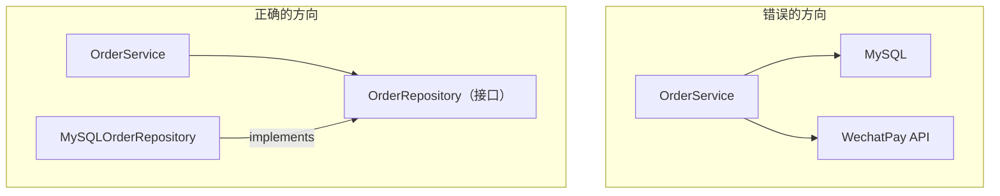

# 分层与依赖方向决定可测试性和演进成本

## 背景：改一行代码，要启动半个系统

一个下单服务，测试它要先起 MySQL、Redis、Kafka，还要 mock 三个外部 HTTP 服务。跑一次测试 4 分钟，还不稳定——时不时因为网络超时红一次。

这不是测试写得差，是**依赖方向反了**：业务逻辑直接依赖了数据库和外部服务这些"细节"，于是测试业务逻辑就必须带上所有细节。

依赖方向决定两件事：**改一个东西会牵连多少东西**，以及**测试它要拖上多少东西**。

## 方案：让依赖指向稳定的方向

核心原则只有一条：**依赖方向应该从"易变"指向"稳定"，从"细节"指向"策略"。**

错误的方向让业务服务直接依赖具体的数据库驱动与支付 SDK；正确的方向让业务服务只依赖一个接口，由基础设施层的实现来满足它：



反转之后：

- `OrderService` 只依赖 `OrderRepository` 接口，不知道 MySQL 存在
- 测试时注入一个内存实现，**不需要数据库，测试从 4 分钟变成 200 毫秒**
- 换数据库时，`OrderService` 一行不改

### 稳定依赖原则（SDP）

一个组件应该只依赖**比自己更稳定**的组件。判断稳定性：

```
不稳定性 I = 出向依赖 / (出向依赖 + 入向依赖)
```

- `I = 0`：所有人都依赖它，它不依赖任何人（最稳定，如基础类型、领域模型）
- `I = 1`：它依赖所有人，没人依赖它（最不稳定，如 controller、main）

**依赖应该从 I 大的指向 I 小的。** 如果业务核心依赖了 controller，方向就错了。

### 分层，但别让层次变成摆设

典型四层：

| 层 | 内容 | 依赖谁 |
| --- | --- | --- |
| 接口层 | HTTP handler、RPC、CLI | 应用层 |
| 应用层 | 用例编排、事务边界 | 领域层 |
| 领域层 | 业务规则、实体、领域服务 | 无（只依赖自己） |
| 基础设施层 | 数据库、缓存、MQ、外部客户端 | 实现上层定义的接口 |

关键是**领域层不依赖任何外部东西**。它是你系统里最该稳定的部分，如果它依赖了 Spring、依赖了 ORM 注解，那它就不再是领域层了。

## 效果与代价

**收益**

- **测试金字塔能立起来**：领域层和应用层可以纯单元测试，只有少量集成测试碰真实基础设施
- **替换成本可控**：换数据库、换 MQ、换 RPC 框架，改的是基础设施层的实现类
- **编译依赖减少**：改一个外部客户端不会触发半个系统重编译

**代价**

- **多一层接口**：每个仓储一个接口 + 一个实现，文件数量翻倍
- **绕**：排查问题时要在接口和实现之间跳转，IDE 的 "go to implementation" 用得多
- **过度抽象的风险**：如果某个"接口"永远只有一个实现，也没有测试替身需求，这层就是纯开销

## 从什么地方做

**第一步：画出当前的依赖图**

不要猜。用一个简单办法：统计每个包的 import，看谁依赖谁。如果发现：

- 业务包 import 了 `database/sql` 或 ORM → 依赖方向反了
- 领域模型上有 `@Column`、`@JsonProperty` 这类注解 → 领域被基础设施污染了

**第二步：定义接口时，站在使用方这边**

接口应该由**调用方**定义，而不是由实现方提取。

错误做法：把 `MySQLOrderRepository` 的所有 public 方法抽成 `IOrderRepository`——这样接口会跟着实现走，包含一堆调用方根本不需要的方法。

正确做法：在 `OrderService` 里写下"我需要什么"—`FindByID`、`Save`，然后让实现去满足它。这叫**接口隔离 + 依赖倒置的组合**。

**第三步：依赖在组合根注入**

所有 `NewXxxRepository(...)` 的调用集中在 `main` 或专门的 `wire` 文件里。业务代码里不出现 `new` 外部依赖。

**第四步：用架构测试锁住方向**

写一条测试，断言领域包的 import 白名单：

```go
// 领域层只允许 import 标准库和自身
func TestDomainHasNoInfraDeps(t *testing.T) {
    // 解析 domain/ 下所有文件的 import，发现非白名单就失败
}
```

这条测试比任何文档都管用——它让"依赖方向"变成编译器能检查的事实，而不是靠 code review 记忆。

## 常见错误

**错误 1：把接口和实现放同一个文件/包**

`order_repository.go` 里同时有接口和 MySQL 实现，那么 `OrderService` import 这个包时，MySQL 的依赖还是被传递进来了。**接口要单独放在使用方所在的包（或独立的 port 包），实现放基础设施层。**

**错误 2：为了测试而加接口，但生产代码不用它**

只在测试里用的接口是坏味道。正确的动机是"变化点隔离"或"依赖方向修正"，可测试性只是副产品。

**错误 3：循环依赖**

`OrderService` 依赖 `UserService`，`UserService` 又依赖 `OrderService`。解法不是加接口绕过去，而是**抽出两者都依赖的第三个概念**（比如 `OrderPolicy`），或者用事件解耦。

相关：[[工程知识/软件构建：让变化可以理解、验证与交付/架构与代码/策略与依赖注入把变化关在边界外]] · [[工程知识/软件构建：让变化可以理解、验证与交付/架构与代码/错误处理是策略问题，异常只是运输手段]] · [[工程知识/软件构建：让变化可以理解、验证与交付/架构与代码/设计模式解决的是变化点的隔离]]
- [[工程知识/软件构建：让变化可以理解、验证与交付/架构与代码/架构适应度函数：把架构约束写成可执行检查.md]] —— 依赖方向是适应度函数最常检查的架构性质

验证的锚点：分层边界要与依赖扫描对账——用 import 检查器（或包依赖图）扫出跨层反向引用，扫出的每一条与设计的依赖方向对账，对不上的要么改依赖方向、要么承认分层已变并更新设计。

## 验证

最小验证：对一行业务逻辑写一条单元测试，断言测试运行过程中不需要启动数据库、消息中间件与外部服务。再写一条架构测试，断言领域包只引用白名单内的包，人为引入一次非法引用时该测试失败。

方向验证：把实现替换为内存版本，断言业务代码无需改动即可运行。

## 机制与本质

依赖方向决定一处改动会传播到哪些文件。业务逻辑依赖外部实现时，替换实现或调整外部接口都需要改动业务代码；把依赖指向由使用方定义的接口之后，实现的变更被限制在装配位置。可测试性与演进成本来自同一条方向关系，因此两者总是一起改善或一起恶化。

## 要解决的问题

测试一段业务逻辑需要先启动数据库、缓存与消息中间件，还要替换三个外部服务，一次测试耗时数分钟且不稳定。本篇回答：分层与依赖方向怎样决定可测试性、接口应当由哪一侧定义、依赖在什么位置注入，以及架构约束怎样变成可自动检查的事实。

