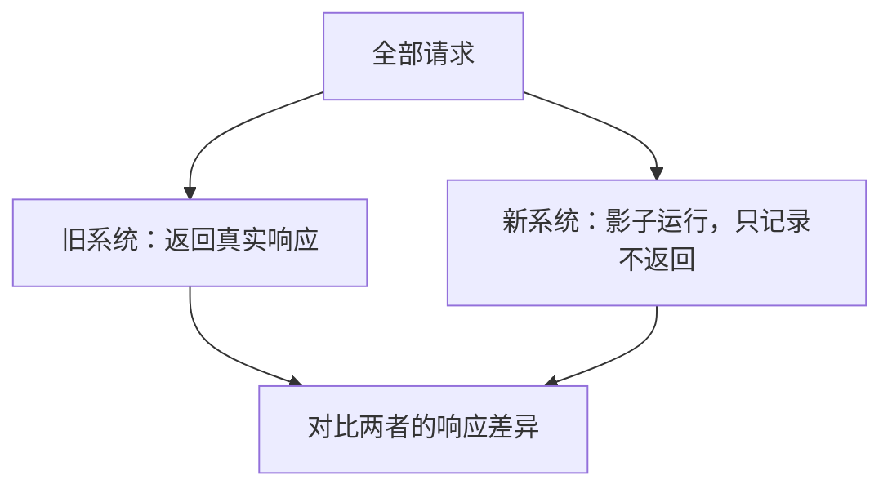

# 绞杀者模式用增量迁移替代整体重写

## 机制与要解决的问题：为什么重写了 8 个月，上线就回滚

一个跑了 6 年的单体，决定重写。8 个月后新系统完成，切流当天：

- 3 个旧功能新系统没实现（因为没人记得有这些功能）
- 2 个报表结果和旧系统对不上（规则在旧代码里，且没文档）
- 一个定时任务只有旧系统有

回滚。又花了 3 个月补齐，**前后 11 个月**。

**大爆炸式重写的问题**：

1. 旧系统里埋着大量"没人记得但有人在用"的功能
2. 业务在重写期间还在变化，新系统上线即落后
3. 长时间没有可交付的东西，风险在最后一天集中爆发

## 方案：新旧并存，逐步绞杀

### 核心思路

```
1. 在系统前面加一层代理（网关/路由）
2. 新功能用新系统实现，路由指向新系统
3. 旧功能逐个迁移，迁移一个切一个
4. 旧系统流量逐步降到 0，最后下线
```

**关键：任何时刻系统都是可用的**，且每一步都可回滚。

### 三种切入方式

**方式 1：按路由切（最常用）**

| 路由 | 去向 |
| --- | --- |
| `/api/users/*` | 旧系统 |
| `/api/orders/*` | 新系统（已迁移） |
| `/api/reports/*` | 旧系统 |

在网关层配置路由。**每迁移一个接口，改一条配置。**

**方式 2：按流量比例切（灰度）**

- 5% 流量走新系统（观察）
- 50% 走新系统
- 100% 走新系统

适合风险高、需要对比验证的迁移。

**方式 3：影子流量（验证用）**



**这是最有价值的验证手段**：用真实流量验证新系统，零风险。发现差异就去修。

### 数据迁移：双写 + 校验

最难的部分不是代码，是数据。

```
阶段 1：旧库写入，同步到新库（双写）
阶段 2：双写 + 对比校验（发现不一致就告警）
阶段 3：读切换到新库（保留回滚能力）
阶段 4：写切换到新库
阶段 5：停止同步，下线旧库
```

**每个阶段都要能回退。** 特别是阶段 3 和 4 之间要留足够长的观察期。

### 抽象分支（Branch by Abstraction）

当无法在网关层切分时（比如改的是内部模块，不是接口）：

```
1. 在旧实现外面包一层抽象接口
2. 调用方改为依赖接口
3. 写新实现
4. 逐步把调用方切到新实现
5. 删除旧实现
```

**好处：每一步都在主干上，不需要长期分支。**

## 效果与代价

**收益**

- **随时可交付**：每迁移一个功能就有一次价值交付，不用等 8 个月
- **风险分散**：每次切换的影响范围小，出问题回滚一个接口就行
- **能发现隐藏功能**：迁移过程中会不断发现"原来还有这个功能"
- **业务不冻结**：重写期间业务照常演进，新旧系统都能加功能

**代价**

- **两套系统并存期长**：可能要维护 6-18 个月，运维成本翻倍
- **数据同步复杂**：双写期间的一致性、冲突处理都要处理
- **总工作量更大**：比起"理想的一次重写"，绞杀模式的重复工作更多
- **需要网关/代理层**：如果原来没有，要先建

## 从什么地方做

**第一步：先加代理层，不改任何逻辑**

在旧系统前面加网关，100% 流量转发到旧系统。**确保这一层不影响现有功能**，这是后续所有工作的基础。

**第二步：选最容易的模块先迁**

不要从最难的入手。选：
- 依赖最少的功能
- 有明确输入输出定义的功能
- 出问题影响小的功能

**先建立信心和流程。**

**第三步：加影子流量对比**

对要迁移的功能，先跑影子模式。**响应一致了再切真实流量。** 这一步能拦住大部分 bug。

**第四步：一个一个切，每次只切一个**

切一个 → 观察（至少一天）→ 再切下一个。**不要一次切多个。**

**第五步：保留回滚能力直到旧系统下线**

路由配置要能一键切回。**不要过早删除旧代码**——宁可多留几个月。

## 常见错误

**错误 1：没有代理层就直接改**

在旧系统里直接改代码加分支——那不是绞杀，是把新系统的复杂度塞进旧系统。**先加路由层。**

**错误 2：同时迁移太多**

一次切 10 个接口，出问题不知道是哪个。**一次一个。**

**错误 3：跳过影子验证**

直接切流量，发现不一致时已经影响用户了。**影子模式是零成本保险。**

**错误 4：过早删除旧代码**

新系统跑了 2 周就删旧代码 → 3 个月后发现有个季度报表依赖它。**旧代码保留到确认无流量后至少 1 个月。**

**错误 5：忽略数据迁移的难度**

代码迁移完了，数据迁移卡住半年。**数据迁移要先于代码迁移开始。**

**错误 6：没有定义"完成"的标准**

绞杀模式最怕无限期。明确定义：**旧系统流量降到 0 且持续 30 天，即可下线。**

相关：[[工程知识/软件构建：让变化可以理解、验证与交付/架构与代码/适配器与防腐层隔离外部模型]] · [[工程知识/软件构建：让变化可以理解、验证与交付/架构与代码/技术方案先写清约束、取舍与验证]]

- [[工程知识/软件构建：让变化可以理解、验证与交付/架构与代码/重构的安全边界由测试网和绞杀者模式共同划定]] —— 模式的安全前提
