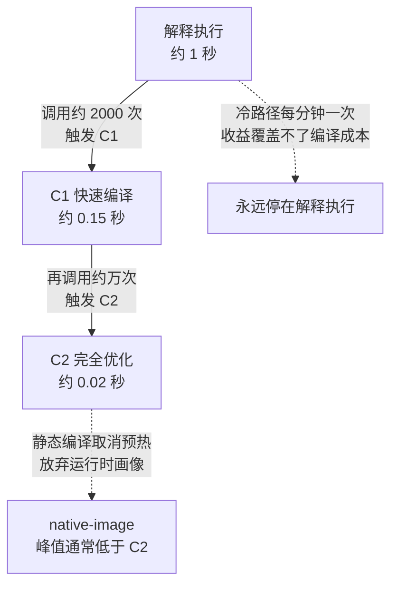

# 编译器与 JIT 把源码变成可执行行为

编译器和 JIT 的边界是：它们只能优化已经可见且可证明的代码路径，不能保证业务语义、外部依赖或冷启动性能。投入使用时记录源码、编译器、目标架构、选项、profile 和运行时版本，再分别测编译、预热、稳态和回滚；收益是把抽象代码变成高效指令，代价是构建身份、预热和可观测性复杂度增加。

源码经过词法/语法分析、类型与语义检查、中间表示、优化、代码生成、链接和加载，才成为 CPU 执行的指令。解释器、AOT、JIT 和混合运行时在启动、峰值性能、可观测性和环境依赖之间取舍。

词法/语法分析的产物是一棵抽象语法树——源码的结构形态在优化开始前就已经定型。欧几里得算法的 AST 长这样：


*图源：Wikimedia Commons「Abstract syntax tree for Euclidean algorithm」，作者 npmushun，许可 [CC BY-SA 4.0](https://commons.wikimedia.org/wiki/File:Abstract_syntax_tree_for_Euclidean_algorithm.svg)。*

同一段代码在冷启动、预热中和稳态可能走过不同执行路径；把一次短 benchmark 的结果当作生产性能，会把编译时间、JIT 采样和缓存状态误算成业务能力。

## 最小编译实验

固定源码、依赖、目标架构和输入，分别测解释/AOT/JIT 的冷启动、预热、稳态吞吐、峰值延迟和产物大小；保存编译器选项、优化记录和生成代码。升级编译器或 CPU 特性时，用相同基线验证功能、ABI、性能和回滚。

## 为什么性能会变化

内联、逃逸分析、常量折叠、向量化、去虚拟化和 profile-guided 优化可能减少调用、分配和分支；但动态加载、反射、未预热路径、图中断、调试构建和不同 CPU 特性会阻止优化。一次短 benchmark 可能主要测编译或 JIT warm-up。

## 构建身份

编译器版本、目标架构、ABI、链接器、编译选项、生成代码、依赖和环境都属于产物输入。可执行文件能启动不代表 ABI、符号、时区、证书、CPU 指令集或容器运行库兼容。

## 可运行示例：同一份代码的 AOT 与 JIT 差距

Java 的一段热循环，分别以解释执行、C1（快速编译）、C2（完全优化）跑，差距可以直接量出来：

```bash
javac HotLoop.java
java -Xint HotLoop          # 纯解释执行
java -XX:TieredStopAtLevel=1 HotLoop   # 只用 C1
java HotLoop                # 默认分层编译（C1+C2）
```

典型读数（同一段数值循环）：解释执行约 1 秒，C1 约 0.15 秒，C2 约 0.02 秒——C2 与解释执行的差距在 50 倍量级，来源是方法内联、逃逸分析消除分配、循环展开。JVM 参数 `-XX:+PrintCompilation` 能看到每个方法在什么 tier 被编译，第 4 层（C2）出现在热循环被调用约万次之后。

## 量化锚点：预热与稳定

JIT 的代价是预热：服务重启后前几分钟 C2 还没就位，延迟分布的长尾全在预热期。预热预算按 tier 触发次数对账（默认 C2 需要约 1 万次调用），冷路径（每分钟一次的定时任务）永远停在解释执行——它不需要优化，优化收益覆盖不了编译成本。静态编译（GraalVM native-image）取消预热，代价是放弃运行时画像，峰值性能通常低于充分预热的 C2。

三种执行形态在同一段热循环上的读数与代价对照：



图回答的是预热的账：同一段代码的三种执行形态是阶梯关系，越靠右越快，但每一级的触发条件都是调用次数累计——服务刚重启时全在左端，长尾延迟的来源就是这段爬梯时间；两条虚线是阶梯之外的两种形态：冷路径永远停在第一级（优化收益覆盖不了编译成本），静态编译直接砍掉爬梯但峰值通常到不了 C2 的水平。

## 验证

验证的锚点：编译收益要与冷启动和稳态对照对账——预写预热完成后性能应稳定在稳态区间，实测波动远超预期，与预期不符，说明度量点位于编译期。

分别测冷启动、稳态、编译/JIT 时间和峰值；查看生成代码、优化记录、profile、系统调用和业务延迟。跨编译器/架构升级做 ABI、功能、性能、内存和回滚回归，记录不可重现差异。

关系：[[工程知识/软件构建：让变化可以理解、验证与交付/开发工具/依赖供应链需要锁定来源与构建输入]] · [[工程知识/性能工程：从用户等待到资源瓶颈/处理器与内存/CPU缓存与分支决定有效执行时间]]

## 机制与本质

编译器与即时编译器能改变的是已经可见且可证明的代码路径：静态优化依据源码与目标架构，运行时优化依据采集到的执行画像。编译产物由源码、编译器版本、选项与目标架构共同决定，运行时优化结果由实际调用次数与分支分布决定，因此同一份源码在不同环境下可以得到不同的性能表现。

## 要解决的问题

同一份源码在不同机器上的性能表现差异明显，或者服务重启之后一段时间内延迟高于稳态，而代码没有变化。本篇回答：编译期优化与运行时优化各自依据什么信息、哪些代码路径无法被优化、预热期的延迟分布为什么不同于稳态，以及跨编译器或架构升级需要核对哪些内容。

