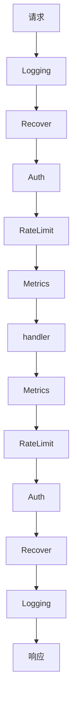

# 装饰器与中间件把横切关注点串成链

## 背景：每个 handler 都有同样的 8 行

```go
func GetUser(w http.ResponseWriter, r *http.Request) {
    start := time.Now()
    user := auth.GetUser(r)          // 1 鉴权
    if user == nil { w.WriteHeader(401); return }
    if !rateLimiter.Allow(user.ID) { // 2 限流
        w.WriteHeader(429); return
    }
    log.Infof("request %s user %s", r.URL, user.ID)  // 3 日志
    defer func() {
        metrics.Observe("get_user", time.Since(start))  // 4 指标
        if err := recover(); err != nil {                // 5 兜 panic
            log.Error(err); w.WriteHeader(500)
        }
    }()
    // ... 真正的业务逻辑 3 行
}
```

20 个 handler，同样的 8 行样板重复 20 遍。更糟的是：要给"限流"加一个例外规则，得改 20 个地方。

这些鉴权、限流、日志、指标、panic 兜底叫做**横切关注点（cross-cutting concerns）**——它们和业务逻辑无关，但每个入口都需要。

## 方案：把横切逻辑从 handler 里剥出来，串成一条链

### 中间件：函数包装函数

```go
type Middleware func(http.Handler) http.Handler

func WithAuth(next http.Handler) http.Handler {
    return http.HandlerFunc(func(w http.ResponseWriter, r *http.Request) {
        user := auth.GetUser(r)
        if user == nil { w.WriteHeader(401); return }
        next.ServeHTTP(w, r.WithContext(ctxWithUser(r.Context(), user)))
    })
}

func WithRateLimit(next http.Handler) http.Handler { /* ... */ }
func WithLogging(next http.Handler) http.Handler   { /* ... */ }
```

装配：

```go
handler := chain(GetUserHandler,
    WithLogging, WithRecover, WithAuth, WithRateLimit, WithMetrics)
```

handler 里只剩业务逻辑：

```go
func GetUser(w http.ResponseWriter, r *http.Request) {
    user := auth.FromContext(r.Context())
    // 3 行业务逻辑
}
```

### 顺序很重要，而且是易错点

链的执行是**洋葱模型**，请求从最外层逐层进入，响应再按相反顺序逐层返回：



几条必须遵守的顺序规则：

| 规则 | 原因 |
| --- | --- |
| `Recover` 尽量靠外 | 才能捕获内层所有中间件和 handler 的 panic |
| `Logging`/`Metrics` 靠外 | 才能记录被 `Auth` 拒绝的请求（401 也要有日志） |
| `Auth` 在 `RateLimit` 之前 | 限流通常按用户维度，需要先知道是谁 |
| 超时中间件靠外 | 才能给整条链设总时限 |

**顺序错了不会报错，但行为会悄悄不对**——比如 `Auth` 放在 `Recover` 外面，鉴权里的 panic 就没人兜。

### 装饰器 vs 中间件

两者是同一个思想，只是粒度不同：

| | 装饰器 | 中间件 |
| --- | --- | --- |
| 作用对象 | 任意对象/函数 | 通常是请求处理链 |
| 典型场景 | 给 Reader 加压缩、加密、缓冲 | HTTP/gRPC 的横切逻辑 |
| 组合方式 | `NewGzipReader(NewEncryptReader(f))` | `chain(handler, mw1, mw2)` |

装饰器的经典例子是 I/O 流的层层包装：

```go
r := bufio.NewReader(        // 加缓冲
     gzip.NewReader(        // 解压
     file))                 // 原始文件
```

## 效果与代价

**收益**

- **横切逻辑一处修改，全局生效**：改限流规则只改一个文件
- **业务代码干净**：handler 里只有业务逻辑，可读性大幅提升
- **可组合**：不同路由可以用不同的中间件组合（比如管理后台多加一层审计）

**代价**

- **执行路径变隐式**：看 handler 代码不知道它外面包了几层。**排查问题时要知道整条链是什么**
- **调用栈变深**：10 层中间件意味着 panic 的调用栈有 10 层噪音
- **上下文传递靠 context**：中间件之间的数据传递依赖 `context.Context`，滥用会变成隐式的全局状态
- **顺序 bug 难发现**：前面说的，顺序错了不报错

## 从什么地方做

**第一步：找出每个入口都重复的代码**

搜 handler 的开头和结尾，找重复出现的样板。**3 个以上 handler 都有的，就该抽成中间件。**

**第二步：先抽最稳的三个**

`Recover`、`Logging`、`Metrics`——这三个几乎每个服务都需要，且逻辑稳定。先做这三个，立刻见效。

**第三步：明确链的顺序，并写在注释里**

```go
// 顺序：Logging(最外) → Recover → Auth → RateLimit → Metrics → handler
// Recover 必须在 Auth 外层，才能兜住鉴权的 panic
```

**第四步：不要在中间件里做重活**

中间件在每个请求上都跑。里面做数据库查询、远程调用会显著增加延迟。**需要的数据尽量在进入时就解析好放 context。**

**第五步：给中间件加开关**

某些环境（比如健康检查、静态资源）不需要完整链。**支持按路由跳过中间件**，避免健康检查也要过鉴权。

## 常见错误

**错误 1：中间件里写响应但不 return**

```go
func WithAuth(next http.Handler) http.Handler {
    return http.HandlerFunc(func(w http.ResponseWriter, r *http.Request) {
        if !ok { w.WriteHeader(401) }   // 没 return！
        next.ServeHTTP(w, r)             // 继续往下走了
    })
}
```

这是最常见的 bug：**返回了 401 但请求继续处理**，业务逻辑照常执行。

**错误 2：滥用 context 传数据**

往 context 里塞十几个值，中间件和 handler 隐式耦合。**只放真正跨层需要的东西**（用户身份、trace_id、request_id）。

**错误 3：中间件顺序依赖没文档**

半年后有人加了一个中间件放在最外层，把 Recover 挤到里面——panic 开始逃逸。**在装配处写明顺序和原因。**

**错误 4：所有路由套同一条链**

健康检查也要过鉴权、过限流，导致监控系统拿不到响应。**按路由分组装配。**

**错误 5：装饰器嵌套过深**

`A(B(C(D(E(f)))))` —— 5 层以上就该考虑用配置化的 pipeline 而不是手写嵌套。

相关：[[工程知识/软件构建：让变化可以理解、验证与交付/架构与代码/设计模式解决的是变化点的隔离]] · [[工程知识/软件构建：让变化可以理解、验证与交付/架构与代码/观察者与事件解耦发布者与订阅者]]

验证的锚点：链上每个环节的职责要与单一职责对账——链路加长后同一关注点出现在两层（日志在装饰器和中间件各记一遍）说明职责重叠，抽查请求轨迹，对不上的环节合并或删除。

## 边界

- 链的执行顺序依赖装配而不是类型系统：顺序写错时编译与运行都不报错，行为却已经改变。
- panic 的兜底范围取决于位置：兜底逻辑放在鉴权内层时，鉴权自身的 panic 会逃逸。
- 链路越深排查越费力：panic 栈里混入每层中间件的帧，定位原始位置需要在栈中找到业务帧。
- 跨层传值依赖请求上下文：放入的键值对越多，中间件与处理函数之间的隐式耦合越强。
- 中间件在每个请求上执行：把数据库查询或远程调用放进去，会让所有请求都承担这份开销。

## 机制与本质

装饰器与中间件把函数当作可组合的输入，调用时按装配顺序形成进出两向的执行链。功能集中在一处修改即全局生效，代价是执行路径不再体现在处理函数里，读代码无法看出外层包了哪些行为；链的语义由装配顺序决定，因此顺序本身就是接口的一部分。

## 要解决的问题

鉴权、限流、日志、超时这些逻辑散落在每个处理函数的开头和结尾，改动一处要同步修改多个入口，遗漏一处就出现行为不一致。本篇回答：这些逻辑怎样抽成可组合的链、链的顺序依据什么确定、顺序错误会造成什么后果，以及链上不应该放哪些开销大的操作。

