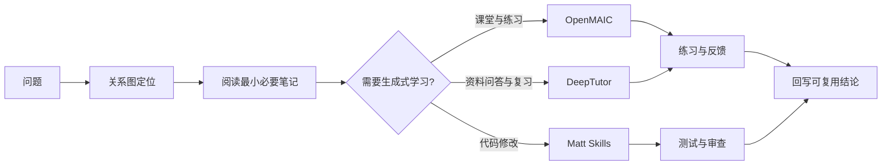

# 学习工具使用与调用成本

这四个入口解决的是不同问题：看清关系、形成课堂、围绕资料学习、让 AI 按工程纪律工作。先选问题，再选工具，不要为了“用了 AI”而把同一份材料重复喂给多个系统。

## 先这样选

| 你现在要做的事 | 入口 | 模型调用 | 结果 |
| --- | --- | --- | --- |
| 看一个主题缺了哪些关系、依赖或路径 | Archify 关系图 | 不需要 | 关系网络、知识流通、学习循环、AI 架构和选型象限 |
| 把主题变成能互动的讲解、练习或项目 | OpenMAIC | 需要，多轮生成 | 课堂页面、互动场景、测验、反馈和项目任务 |
| 用自己的资料追问、核对来源、形成复习路径 | DeepTutor | 需要；深度模式会多轮调用 | 带引用的回答、问题集、笔记、记忆和复习路径 |
| 让 Codex、Cursor 或其他 Agent 先对齐再改代码 | Matt Skills | 取决于当前 Agent | 需求澄清、领域语言、规格、TDD、审查和架构改进流程 |

## 四个可直接照做的例子

### 只看关系，不花模型额度

打开关系图，切换到“AI 系统架构”或“知识流通”。例如先看 `RAG`、`Agent`、`推理服务` 和 `评测` 的连接，再点节点回到正文。这个动作只读取当前笔记并在浏览器绘图，不会调用中转站模型。

### 用 OpenMAIC 生成一节课

在首页主题输入框填：

```text
RAG 为什么从“检索几段文本”演进为可验证的知识系统？
面向已经会向量数据库的后端工程师，要求解释倒排、向量、重排、引用、权限和时效，最后安排一个能测量召回与答案 groundedness 的小实验。
```

点击“互动课堂”。第一次访问需要输入站点访问码；通过后才会读取服务端配置并发起生成。短主题通常是中等调用量，包含多页讲解、互动、测验、媒体或项目任务时会明显增加调用轮次和等待时间。

### 用 DeepTutor 先问一小块资料

在 Chat 中先问一个可核对的问题：

```text
只根据我导入的 RAG 笔记，列出“混合召回 → 重排 → 引用”的因果链。
每一步给出证据位置；资料没有说明的地方明确说不知道。
```

先用 Chat 验证资料和模型配置，再考虑 Deep Research、Deep Solve 或长期学习路径。后者会搜索、拆题、复核或生成更多学习状态，调用次数和上下文长度都更高。Knowledge Base 的向量索引还需要 embedding 提供商；当前中转站的聊天模型可用，但 embedding 尚未配置，因此不要把“能聊天”误认为“已经完成 RAG 建库”。

### 用 Matt Skills 约束一次代码修改

在 Codex 或 Cursor 中先使用 `/ask-matt` 选择流程；需求不清时用 `/grill-with-docs`，需要落地时用 `/to-spec`、`/tdd`、`/implement`，结束前用 `/code-review`。这些技能本身不替你调用模型，它们只是让当前 Agent 的工作顺序、证据和交付边界更稳定；实际消耗取决于当前会话和代码量。

## 调用成本怎么估算

这里不写一个虚假的固定价格，因为中转站的计费、模型上下文和产品实现都会变化。用“是否调用模型、调用多少轮、带多少上下文”估算更可靠：

| 操作 | 相对消耗 | 主要消耗来源 |
| --- | --- | --- |
| 浏览首页、目录、Markdown、关系图 | 零 | 本地 HTTP 和浏览器渲染 |
| OpenMAIC 短讲解或 DeepTutor 一次短问答 | 低到中 | 一次或少量模型请求 |
| OpenMAIC 完整课堂、DeepTutor 研究/求解 | 中到高 | 多轮规划、生成、工具调用和较长上下文 |
| 导入长文档、反复重生成、带图片/语音/视频 | 高 | 输入 token、媒体服务和重复生成 |
| 建立或重建向量索引 | 视资料量而定 | embedding 请求、存储和索引计算；当前尚未配置 embedding |

## 控制消耗的顺序

- 先用关系图和现有笔记定位问题，再把最小必要材料交给模型。
- 先问一个能在几分钟内判断方向的问题，再升级到深度研究或完整课堂。
- 长资料先按主题拆分，避免每次把整库重新放进上下文。
- 只在需要时生成媒体、复习路径和长期记忆；生成前先确认提示词和输出目标。
- 发现方向错误就停止当前任务，修改问题后重新开始，不要让失败的长任务继续烧额度。

## 当前服务与安全边界

OpenMAIC 和 DeepTutor 都已接入本机配置的 OpenAI 兼容中转站，当前默认模型是 `gpt-5.6-sol`。API key 只在服务端进程中读取，不会写进 Markdown，也不会下发到浏览器。

打开页面不等于可以调用模型：

- OpenMAIC 使用站点访问码，未通过访问码时生成、配置和其他 API 请求会被服务端拒绝。
- DeepTutor 使用账号密码登录；未登录时 Chat、Knowledge Bases、记忆和 Agent 接口均受保护。
- 浏览器无法可靠证明“这是你的 Mac”。真正有效的是服务端认证；仅靠隐藏按钮、URL 参数或浏览器指纹都不能保护额度。
- 当前服务仍可从局域网打开页面，但把地址发给别人不会授予模型调用权限。访问码和密码保存在 macOS 钥匙串，不写入本知识库。

需要查看本机访问码时，在终端执行：

```bash
security find-generic-password -a "$USER" -s knowledge-tools-model-access -w
```

## 推荐工作流



工具是入口，不是知识分类。真正长期保留的内容仍应回到对应的 AI 系统、后端与分布式系统、数据系统、计算机系统与性能或软件构建与质量主题中。
