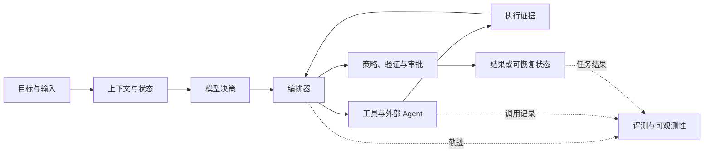

# Agent 应用工程技术核验

> 核验基准日：**2026-09-03**。只采用官方规范、官方文档、官方仓库和原始论文。本文是来源核验稿，不把厂商宣称等同于跨场景结论；版本事实需要按 `review_after` 复查。

## 结论

Agent 应用工程不是某个框架的使用教程，而是把概率性的模型决策接入确定性软件系统的工程。最值得长期维护的知识结构是：

1. **模型交互**：输入、输出、推理、工具调用和结构化契约；
2. **上下文状态**：工作上下文、会话状态、长期记忆和外部知识；
3. **行动系统**：工具、MCP、远程 Agent、权限与副作用；
4. **执行系统**：编排、持久化、异步任务、重试、取消和恢复；
5. **可信系统**：证据、评测、追踪、安全策略和人工接管。

模型、SDK、协议和框架只是这些能力的当前实现。知识库应以能力和不变量为主干，把具体版本放在可替换的“当前实现”层。



## 稳定主轴与时效层

| 层次 | 应长期掌握 | 需要持续核验 |
| --- | --- | --- |
| 模型交互 | 工具调用循环、schema 校验、错误语义、成本与延迟权衡 | 模型名、上下文窗口、推理参数、托管工具 |
| 上下文 | 选择、压缩、隔离、来源、token 预算 | Provider 的状态保存、缓存与 compaction 接口 |
| 记忆 | 工作状态与长期知识分离；写入、读取、纠错、删除策略 | SDK session/memory API、托管存储期限 |
| 工具 | 最小能力、明确输入输出、幂等、副作用分级 | MCP 规范、Provider 内置工具、工具搜索接口 |
| 编排 | 状态机、checkpoint、事件日志、重放、补偿、人工接管 | Agent SDK、LangGraph、ADK 等框架 API |
| 检索 | 数据治理、召回、排序、引用、时效与 ACL | embedding、reranker、GraphRAG 和 agentic retrieval 实现 |
| 质量 | 任务结果、轨迹、组件、安全和成本联合评测 | 具体 benchmark、grader、评测平台 |
| 安全 | 模型外授权、隔离、完整仲裁、审计 | 新攻击方式、协议授权规范、供应链公告 |

## 模型、Responses 与工具调用

### 稳定原理

- 模型产生的是**调用建议**，应用才是执行主体。应用负责参数校验、身份、权限、超时、重试、幂等和结果持久化。
- 结构化输出只证明结果符合 schema，不证明事实正确或动作被允许；业务约束必须二次验证。
- 模型路由应由任务评测、延迟、成本、数据策略和能力要求驱动，不按“最新最大模型”单点决定。
- 工具描述是模型看到的 API 契约。工具数量增长后，应做命名空间、候选集过滤或动态加载，而不是把全部 schema 永久塞入上下文。

### 截至基准日的事实

- OpenAI 当前新集成的主接口是 **Responses API**；它统一承载 function calling、托管搜索、远程 MCP、shell/computer use 等工具。`tool_search` 是特定新模型能力，不能抽象成所有 Provider 都支持的通用协议。[Using tools](https://developers.openai.com/api/docs/guides/tools)
- Responses 可用 `previous_response_id` 延续响应链，也可与 Conversations API 使用持久 conversation；二者是 Provider 状态接口，不应成为业务任务唯一状态源。[Conversation state](https://developers.openai.com/api/docs/guides/conversation-state)
- **Assistants API 已于 2026-08-26 下线**，官方替代是 Responses API 与 Conversations API。[Assistants migration guide](https://developers.openai.com/api/docs/assistants/migration) · [Deprecations](https://developers.openai.com/api/docs/deprecations)
- 当前 OpenAI 模型目录变化很快；生产配置应记录实际请求模型和返回模型，能锁快照时锁快照，并在升级前跑同一评测集。[Model catalog](https://developers.openai.com/api/docs/models)

### 工程验收

- 每次运行绑定 `provider/model snapshot/prompt/tool schema/code revision`。
- 工具调用保存原始参数、校验后参数、执行者、授权主体、退出状态和产物引用。
- 并行调用必须定义依赖、冲突和合并规则；写操作默认串行或使用并发控制。
- 拒绝、截断、内容过滤、限流、超时和工具错误是不同状态，不可折叠成“模型失败”。

## 上下文与记忆

### 四种不同状态

| 状态 | 作用 | 生命周期 | 关键风险 |
| --- | --- | --- | --- |
| 工作上下文 | 当前一步需要的指令、证据和工具结果 | 单次模型调用 | 噪声、注入、token 超限 |
| 会话状态 | 多轮消息、待办、已完成步骤 | 一个会话或任务 | 串线、无限增长、错误摘要 |
| 运行状态 | checkpoint、重试次数、锁、审批和产物句柄 | 一次可恢复执行 | 重复副作用、版本不兼容 |
| 长期记忆 | 用户偏好、事实、经验和跨会话知识 | 跨任务 | 过期、污染、隐私、无法删除 |

上下文窗口不是记忆数据库。长上下文仍可能因信息位置和干扰而退化；原始研究显示相关信息位于上下文中部时性能可能显著下降。[Lost in the Middle](https://arxiv.org/abs/2307.03172)

长期记忆至少需要：来源、主体、写入理由、置信度、创建/访问时间、过期策略、纠错和删除入口。模型可提出记忆候选，但持久写入应经过应用规则；敏感事实不能因一次对话自动升级为永久记忆。

OpenAI Conversations、`previous_response_id`、SDK sessions 和数据库 checkpoint 是不同层次的机制。Provider 保存了对话，不等于保存了业务锁、审批、幂等键和真实执行事实。[OpenAI conversation state](https://developers.openai.com/api/docs/guides/conversation-state) · [OpenAI Agents SDK sessions](https://openai.github.io/openai-agents-python/sessions/)

## MCP 与 A2A

### 分工

| 接口 | 解决什么问题 | 不解决什么问题 |
| --- | --- | --- |
| 普通函数/API | 同一应用内执行明确能力 | 跨产品能力发现 |
| MCP | Host 与外部工具、资源、提示的标准连接 | 业务授权、可信身份、远程 Agent 协作语义 |
| A2A | 独立远程 Agent 的发现、消息、任务和状态协作 | 本地工具执行、内部工作流编排 |

### MCP 当前状态

- 当前已发布规范版本为 **2026-07-28**。核心改为无状态请求/响应，移除协议级 session 和初始化握手；状态需求通过显式句柄表达。[MCP 2026-07-28 specification](https://modelcontextprotocol.io/specification/2026-07-28) · [Release announcement](https://blog.modelcontextprotocol.io/posts/2026-07-28/)
- `server/discover`、每请求版本/能力元数据、MRTR、缓存提示和 header 路由是该版本的重要变化；Tasks 是官方扩展，不是核心协议。[2026-07-28 changelog](https://github.com/modelcontextprotocol/modelcontextprotocol/blob/main/docs/specification/2026-07-28/changelog.mdx)
- Roots、Sampling、Logging、HTTP+SSE 和 OAuth Dynamic Client Registration 已进入弃用路径；新实现不应继续把它们作为主架构。[MCP changelog: Deprecated](https://github.com/modelcontextprotocol/modelcontextprotocol/blob/main/docs/specification/2026-07-28/changelog.mdx#deprecated)

### A2A 当前状态

- 当前规范主版本为 **1.0**，固定规范页为 v1.0.0；官方仓库的 patch 修订和发布时间需要在每次复查时重新核验。它定义 Agent Card、Message、Task、Artifact、流式更新、推送通知、取消、版本协商和多种协议绑定。[A2A v1.0.0 specification](https://a2a-protocol.org/v1.0.0/specification/) · [A2A releases](https://github.com/a2aproject/A2A/releases)
- A2A 适合跨服务、跨团队、独立部署的 Agent。单进程中的角色拆分不需要 A2A；普通函数或工作流节点更简单、可测。
- Agent Card 和协议认证只建立接口与身份基础，业务资源授权仍由服务端执行。远程 Agent 输出应按第三方输入处理。

### 共同边界

协议标准化不等于可信。无论 MCP 还是 A2A，都必须校验服务身份、协议版本、能力清单、租户、scope、数据出站范围、超时和审计。模型不能自行扩大工具集或凭据范围。

## Agent 运行时与编排

Agent 最小循环可以表达为：

```text
观察状态 -> 选择下一动作 -> 策略校验 -> 执行动作
         -> 保存结果和证据 -> 判断完成、继续、暂停或失败
```

### 选择原则

- 路径确定、规则稳定：用普通代码、DAG 或状态机。
- 路径不确定、需要根据环境反馈选工具：在局部节点引入模型决策。
- 多 Agent 只有在权限、上下文、部署、专业能力或并行性确实不同的时候才有价值；“角色扮演数量”不是架构质量。
- 框架是减少实现成本的运行时，不是业务状态、权限或正确性的来源。

ReAct 提出的“推理与行动交错”是 Agent 循环的重要研究来源，但生产系统应保存动作和观察，不依赖暴露或持久化模型的私有推理文本。[ReAct](https://arxiv.org/abs/2210.03629)

OpenAI Agents SDK、LangGraph、Google ADK、Microsoft Agent Framework 等都覆盖模型、工具、状态、编排或 tracing 的一部分。选择时比较持久化语义、恢复边界、错误模型、可观测性和 Provider 耦合，而不是比较抽象类数量。[OpenAI Agents SDK](https://github.com/openai/openai-agents-python) · [LangGraph](https://github.com/langchain-ai/langgraph) · [Google ADK](https://github.com/google/adk-python) · [Microsoft Agent Framework](https://github.com/microsoft/agent-framework)

## RAG 与 Agentic Retrieval

### 演进的本质

```text
一次检索
  -> 混合召回与重排
  -> 查询改写/分解与多跳检索
  -> 判断是否检索、何时检索、检索什么
  -> 评估证据并纠错/换源/停止
  -> 按任务在向量、全文、SQL、图和工具之间路由
```

- 2020 年 RAG 论文明确了参数记忆与外部非参数记忆结合的基本范式，以及知识更新和来源追踪的动机。[Retrieval-Augmented Generation](https://arxiv.org/abs/2005.11401)
- FLARE 将检索从一次前置操作推进到生成过程中的主动检索。[FLARE](https://arxiv.org/abs/2305.06983)
- Self-RAG 和 CRAG 分别研究按需检索/反思以及检索质量评估与纠错。[Self-RAG](https://arxiv.org/abs/2310.11511) · [CRAG](https://arxiv.org/abs/2401.15884)
- Adaptive-RAG 按问题复杂度在不检索、单步和迭代策略之间选择。[Adaptive-RAG](https://arxiv.org/abs/2403.14403)
- RAPTOR 和 GraphRAG 分别面向层次化长文档与语料级全局问题；它们是针对特定查询结构的索引/检索策略，不是所有 RAG 的默认升级。[RAPTOR](https://arxiv.org/abs/2401.18059) · [GraphRAG](https://arxiv.org/abs/2404.16130)

因此，**agentic retrieval** 最合理的定义是：把检索变成有状态、可评测的决策过程。它不等于“用了 Agent 框架”，也不等于“循环越多越先进”。

### 必须分别评测

- 语料覆盖、解析成功率、ACL 和删除传播；
- query rewriting 是否保留意图；
- recall@k、MRR/nDCG、reranker 效果；
- 证据支持率、引用准确率和拒答质量；
- 迭代检索的任务收益、额外延迟和成本；
- 索引、embedding、reranker 和文档 revision 的可重放性。

“向量数据库”“知识图谱”“长上下文”都是可选组件，不应独立成为 RAG 成熟度等级。

## 评测

Agent 评测至少分四层：

| 层 | 回答的问题 | 典型信号 |
| --- | --- | --- |
| 结果 | 用户目标是否真正完成 | 任务成功率、事实正确、产物测试 |
| 轨迹 | 是否以允许的方式完成 | 工具选择、参数、步骤数、违规动作 |
| 组件 | 哪个部件导致变化 | 检索、路由、schema、记忆命中率 |
| 系统 | 是否值得上线 | 延迟、成本、可用性、安全和人工接管率 |

测试集应包含正常样本、历史失败、对抗输入、权限边界、工具故障和长任务恢复。每次改变模型、prompt、工具 schema、检索器或编排逻辑都跑同一版本化回归集。

LLM grader 适合规模化语义判断，但需用人工标注集校准，并监控偏置和漂移。可由确定性程序验证的事实（退出码、数据库状态、测试结果、文件哈希）不应交给 LLM grader。

轨迹评测能够定位结果失败发生在哪一步；OpenAI 的 trace grading 文档也把 trace 定义为端到端决策、工具调用和步骤日志。[Trace grading](https://developers.openai.com/api/docs/guides/trace-grading) 原始 benchmark 可帮助理解任务设计，但旧榜单成绩不能替代自身场景回归集。[AgentBench](https://arxiv.org/abs/2308.03688) · [SWE-bench](https://arxiv.org/abs/2310.06770)

**时效提醒**：OpenAI 当前文档把 Agent Builder 和 Evals 列在 Legacy APIs；具体迁移或下线日期应以官方弃用页的当前条目为准。无论托管产品是否变化，eval-driven development 仍是独立的工程方法：任务夹具、轨迹、确定性证据和回归门禁不能绑定到某个托管界面。[OpenAI deprecations](https://developers.openai.com/api/docs/deprecations)

## 可观测性与证据

一个 Agent trace 应能回答：谁以什么版本启动了什么任务，模型看到了哪些受控输入，提出了什么工具调用，实际执行了什么，产生了哪些产物，策略为何允许或拒绝，最终结果如何被验证。

最小记录集合：

- `trace_id/run_id/tenant/user/task/revision`；
- model/provider、prompt 和 tool schema 版本；
- 检索 query、文档 ID、索引版本和排序分数；
- 工具调用 ID、参数摘要、权限决策、时间、重试和结果；
- token、缓存、延迟、费用、错误类别和取消原因；
- checkpoint、审批、最终产物与验证证据。

OpenTelemetry 已有 GenAI inference、retrieval、memory、agent、workflow 和 tool span 的语义约定，但当前 Agent/GenAI 约定状态仍为 **Development**。可以参考字段含义，不应在内部数据模型中硬编码未经版本隔离的实验字段。[GenAI agent spans](https://github.com/open-telemetry/semantic-conventions-genai/blob/main/docs/gen-ai/gen-ai-agent-spans.md) · [GenAI spans](https://github.com/open-telemetry/semantic-conventions-genai/blob/main/docs/gen-ai/gen-ai-spans.md)

日志和 trace 可能包含 prompt、工具参数、文档和个人信息。默认记录标识、摘要、哈希与受控产物引用；完整内容应按敏感度选择性采集、脱敏、加密和限期保存。

## 安全、权限与事实门禁

稳定的职责边界是：

> AI 负责语义理解、方案选择和失败分析；系统负责身份、权限、隔离、执行、证据、一致性和资源上限。

这不是削弱 Agent，而是防止“模型说已完成”直接成为系统事实。

### 必要控制

- 不可信网页、邮件、文档、检索结果和远程 Agent 输出都带污染标记，不能升级为高优先级指令。
- 权限在工具或下游服务中按用户、租户、资源和动作完整仲裁；不要让模型决定自己是否有权。
- 工具只暴露任务需要的最小功能与 scope；高风险写操作使用明确预览、审批、幂等键和补偿路径。
- shell、浏览器、代码执行和文件操作运行在任务隔离的沙箱；限制网络、凭据、目录、时间、进程和费用。
- schema 校验之后仍要做业务校验、目标资源校验和策略校验。
- 审批界面显示真实动作、对象、影响和差异，不能只显示模型生成的解释。
- 结果由执行记录和独立验证器确认；后续失败不能覆盖已经确认的成功事实。

OpenAI 安全文档明确指出 prompt injection 可通过工具导致数据泄露或错误动作，并建议使用结构化节点间数据、工具审批、隔离、trace 与 eval；同时强调这些措施不能完全消除风险。[Safety in building agents](https://developers.openai.com/api/docs/guides/agent-builder-safety) OWASP 把过多功能、过多权限和过多自主性归为 Excessive Agency 的根因，并建议在下游系统执行完整仲裁。[OWASP Excessive Agency](https://owasp.org/www-project-top-10-for-large-language-model-applications/2_0_vulns/LLM06_ExcessiveAgency.html)

## 长任务、异步与状态恢复

Provider 的 background mode 解决连接保持与异步轮询，不等于业务级 durable execution。OpenAI background response 可查询、取消和续接流，但仍有数据保存和 Provider 生命周期约束。[Background mode](https://developers.openai.com/api/docs/guides/background)

生产长任务还需要应用层：

- 持久 `run_id`、任务代际和不可变输入 revision；
- 事件日志与 checkpoint，区分“计划”“已提交”“已确认”；
- lease/heartbeat 防止两个 worker 同时推进同一任务；
- 幂等键和 outbox/inbox 防止重放副作用；
- 分步骤超时、全局 deadline、取消传播和资源回收；
- 人工审批可暂停数小时或数天，恢复时校验代码、prompt、工具与权限版本；
- 恢复后不重复已经确认的副作用；不确定状态进入 reconciliation，而不是盲目重试。

LangGraph 文档明确提示恢复时节点可能从头执行，因此副作用必须幂等；OpenAI Agents SDK 的 `RunState` 支持序列化与恢复，但持久化内容及版本兼容仍由应用负责。[LangGraph interrupts](https://langchain-ai.github.io/langgraph/concepts/breakpoints/) · [OpenAI Agents SDK HITL](https://openai.github.io/openai-agents-python/human_in_the_loop/)

## 不应作为知识库主轴的名词

| 名词 | 处理方式 | 原因 |
| --- | --- | --- |
| Prompt engineering | 降为“上下文与契约设计”的子主题 | 只优化文本不能覆盖状态、工具、数据、权限和评测 |
| ReAct | 保留为历史机制 | 是重要循环思想，不是完整生产架构 |
| CoT / Tree of Thoughts | 保留为推理研究，不作为系统层 | Provider 可能不暴露私有推理；生产更需要可验证动作和结果 |
| AutoGPT 式自主循环 | 作为历史案例 | 开放循环缺少状态、边界和验收时不适合默认架构 |
| 多 Agent | 作为可选拓扑 | 多角色不自动提升质量，反而增加延迟、协调和错误面 |
| 向量数据库 | 作为检索组件 | RAG 的主要难点还包括数据、ACL、查询、排序、引用和评测 |
| GraphRAG | 作为特定查询策略 | 更适合全局/关系问题，不是线性替代所有检索 |
| 长上下文替代 RAG | 作为待评测假设 | 容量不等于利用率、时效、权限或来源治理 |
| OpenAI Swarm | 归入历史 | 官方仓库称其为实验/教学项目，已由 Agents SDK 取代。[Swarm repository](https://github.com/openai/swarm) |
| Assistants API | 删除出当前实现层 | 已于 2026-08-26 下线 |
| OpenAI Agent Builder | 标记为迁移中 | 当前文档归入 Legacy APIs；具体日期按官方弃用页复查 |
| OpenAI Evals 平台 | 标记为迁移中 | 当前文档归入 Legacy APIs；保留通用评测方法，不绑定托管界面 |
| Microsoft AutoGen | 归入维护/迁移 | 官方已进入 maintenance mode，新项目推荐 Microsoft Agent Framework。[AutoGen repository](https://github.com/microsoft/autogen) |
| MCP HTTP+SSE / protocol session | 只留迁移说明 | 新规范已弃用 HTTP+SSE，并移除协议级 session |

## 推荐的知识库架构

Agent 应用工程主题应重构为以下六个并列领域，而不是把 MCP、RAG、模型名和框架平铺在一起：

```text
Agent 应用工程
├── 模型交互与上下文
│   ├── 模型 API、结构化输出与工具调用
│   ├── 上下文选择、压缩与缓存
│   └── 会话状态与长期记忆
├── 工具与互操作
│   ├── 工具契约、权限与副作用
│   ├── MCP
│   └── A2A 与远程 Agent
├── 知识与检索
│   ├── 数据接入、索引、召回与排序
│   ├── Agentic Retrieval
│   └── 引用、时效、ACL 与知识更新
├── 运行时与可靠性
│   ├── 工作流、Agent loop 与编排
│   ├── 长任务、异步与状态恢复
│   └── 沙箱、并发、幂等与资源治理
├── 质量与运营
│   ├── 任务、轨迹和组件评测
│   ├── 追踪、日志、成本与 SLO
│   └── 失败分类、回放和人工接管
└── 安全与治理
    ├── Prompt injection 与数据边界
    ├── 身份、授权、审批与审计
    └── 供应链、隐私与合规
```

模型目录、SDK、框架、协议和论文放在这些主题的“当前实现/演进证据”中，不单独主导分类。

## 版本与来源登记

以下均于 **2026-09-06** 访问；版本号只记录当日可核验快照，不能替代发布门禁。

| 对象 | 版本/状态 | 一手来源 | 下次核验重点 |
| --- | --- | --- | --- |
| OpenAI Responses API | 当前主接口 | [Responses API reference](https://developers.openai.com/api/reference/resources/responses/methods/create) · [Using tools](https://developers.openai.com/api/docs/guides/tools) | 工具、状态、background、deprecations |
| OpenAI Assistants API | 2026-08-26 已下线 | [Migration guide](https://developers.openai.com/api/docs/assistants/migration) | 删除残留实现 |
| OpenAI Agent Builder | 当前文档归入 Legacy APIs | [Deprecations](https://developers.openai.com/api/docs/deprecations) | 迁移到 SDK/其他运行时 |
| OpenAI Evals 平台 | 当前文档归入 Legacy APIs | [Deprecations](https://developers.openai.com/api/docs/deprecations) | 保留独立评测工具链，按弃用页复查 |
| OpenAI Agents SDK Python | `0.x` 快速演进；官方文档覆盖 Runner、tools、guardrails、handoffs、sessions、sandbox、tracing 与 testing | [Official releases](https://github.com/openai/openai-agents-python/releases) · [Release policy](https://openai.github.io/openai-agents-python/release/) | 记录实际安装版本，回归破坏性变更、状态序列化、沙箱 |
| MCP | 发布规范 `2026-07-28` | [Specification](https://modelcontextprotocol.io/specification/2026-07-28) · [Changelog](https://github.com/modelcontextprotocol/modelcontextprotocol/blob/main/docs/specification/2026-07-28/changelog.mdx) | SDK 落地、扩展、弃用迁移 |
| A2A | 规范主版本 `1.0`；patch 修订按官方仓库复查 | [Specification](https://a2a-protocol.org/v1.0.0/specification/) · [Releases](https://github.com/a2aproject/A2A/releases) | SDK 兼容、Agent Card 安全、绑定互通 |
| OpenTelemetry GenAI conventions | Development | [Official repository](https://github.com/open-telemetry/semantic-conventions-genai) | schema 状态和字段迁移 |
| LangGraph | 官方文档持续维护，版本快速迭代 | [Official overview](https://docs.langchain.com/oss/python/langgraph/overview) · [Official releases](https://github.com/langchain-ai/langgraph/releases) | checkpoint/replay 语义和破坏性变更 |
| Google ADK | 官方文档与 SDK 持续迭代 | [Official releases](https://github.com/google/adk-python/releases) · [Official docs](https://google.github.io/adk-docs/) | workflow、memory、A2A/MCP、版本差异 |
| Microsoft Agent Framework | 官方提供从 AutoGen 迁移的路径，版本快速迭代 | [Official docs](https://learn.microsoft.com/en-us/agent-framework/) · [Official releases](https://github.com/microsoft/agent-framework/releases) | 多语言版本差异、checkpoint、A2A/MCP |
| Microsoft AutoGen | maintenance mode | [Official repository](https://github.com/microsoft/autogen) | 迁移计划与安全修复 |
| OWASP GenAI Top 10 | 2026 当前发布 | [Official project](https://genai.owasp.org/resource/owasp-genai-llm-top-10-2026/) | Agentic 风险与缓解更新 |

## 复查规则

每月复查模型目录、OpenAI deprecations、MCP/A2A 固定版本规范、Agent SDK release 和 OpenTelemetry GenAI schema。出现下列事件时立即更新相关主题：正式版/破坏性版本、弃用或下线、安全公告、协议状态变化、评测基线显著变化。只有新名词、营销发布或单一 benchmark 提升，不足以进入主知识结构。
