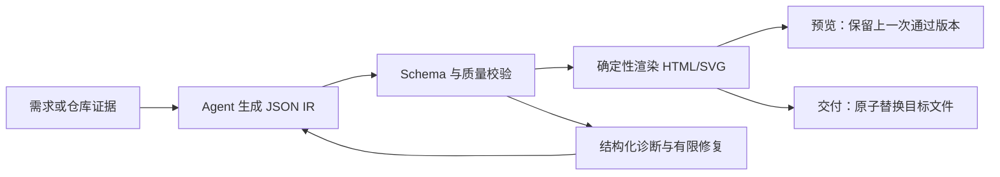

# Archify：可验证技术图谱生成器

## 它解决什么问题

Archify 把自然语言需求、代码仓库证据或 Mermaid 意图，转换为类型化 JSON 图描述，再确定性地渲染成可交互的独立 HTML/SVG。它的价值不在“画一张漂亮的图”，而在于让图的结构、校验、证据和交付可以被重复检查。

本地副本：`/Users/leoqqian/Developer/knowledge-tools/archify`  
核验 commit：`06dd052`（2026-09-02）  
版本：`2.17.0-dev.1`  
安装状态：已执行 `npm ci`，`archify doctor` 全部通过。

## 核心机制

- **类型化中间表示**：模型只负责提出结构化图意图；渲染器不接受任意 HTML 作为隐式布局指令。
- **验证先于交付**：schema、布局、链接、文本溢出和图形质量在交付前检查，失败结果带诊断码和支持的修复方向。
- **预览与交付分离**：预览服务只观察一个输入并保留 last-good；交付命令才原子替换目标产物。
- **来源证据**：需要反映真实代码时，图节点可以绑定文件、符号、命令和观察结果，而不是把模型推断当作仓库事实。
- **稳定迭代**：修改一个节点时保留不相关结构，减少每次生成造成的全图漂移。

## 图类型与适用问题

| 类型 | 适合表达 | 知识库中的用途 |
| --- | --- | --- |
| Architecture | 组件、边界、依赖和部署层次 | 领域总图、系统分层和选型边界 |
| Workflow | 步骤、分支、重试和回退 | 学习流程、更新门禁、故障处理 |
| Sequence | 跨参与者的调用顺序 | Agent、MCP、RAG 和请求链路 |
| Data Flow | 数据、转换、索引和去向 | 来源到证据、数据管道和血缘 |
| Lifecycle | 状态、转移和终止条件 | 候选内容、任务运行和发布状态 |

## 对本知识库的直接启发

1. 图谱的节点必须链接到实际 Markdown 页面，点击图节点能回到可阅读的原理或来源。
2. 图谱生成数据与最终 HTML 分离；图谱可以重建，Markdown 仍是知识事实源。
3. 关系图要表达“为什么相连”和“证据来自哪里”，不能只展示关键词共现。
4. 每次图谱更新都应检查孤儿节点、断链、重复边和无法回溯的结论。

当前网站已经提供网络、知识流通、AI 架构和选型象限四种视图；后续可把本页的方法用于生成更大规模的静态图谱资产。

## 边界与风险

- Archify 验证的是图描述和渲染事实，不会证明图中业务判断本身正确；事实仍需来源、代码或实验支持。
- 它不是通用绘图编辑器，也不是自动理解整个仓库的替代品；仓库证据采集和节点取舍仍需明确任务范围。
- Node 依赖存在供应链风险；升级时要保留 lockfile、运行 `doctor` 和最小渲染回归。

## 复核清单

- [ ] 版本与 commit 是否仍对应本地副本？
- [ ] Skill 的 schema、图类型和交付语义是否有破坏性变化？
- [ ] 生成图是否仍能链接到现有知识页并通过移动端查看？
- [ ] 失败时是否保留上一次通过的产物，而不是覆盖有效结果？

## 关联知识

- [[工程知识/AI系统/Agent与工作流/Agent学习工具把资料变成可验证学习循环]]
- [[工程知识/AI系统/Agent与工作流/模型负责判断，运行时负责执行语义]]
- [[工程知识/AI系统/质量与运营/可观测性必须能重建一次决策]]
- [[工程知识/AI系统/知识与检索/RAG数据管道从文档到可引用证据]]
