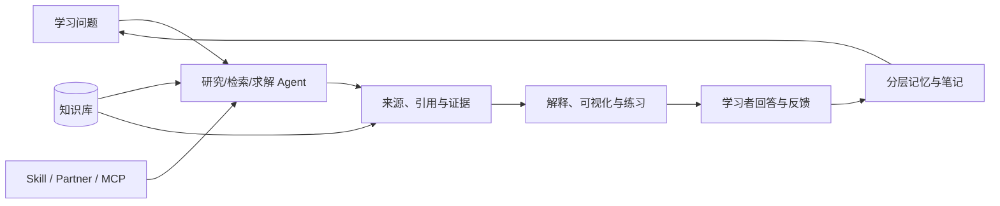

# DeepTutor：带检索、记忆与研究闭环的学习伴侣

## 它解决什么问题

DeepTutor 是一个 Agent-native 学习平台，把对话、深度研究、深度求解、提问、可视化、课程路径、知识库、记忆和笔记放进同一学习工作区。它的工程价值在于：学习不是一次生成答案，而是围绕资料、问题、解释、练习、反馈和长期状态形成闭环。

本地副本：`/Users/leoqqian/Developer/knowledge-tools/DeepTutor`  
核验 commit：`4328bc7`（2026-09-03）  
版本参考：README 当前列出的发布线为 `v1.6.x`  
安装状态：Python 3.13 隔离环境 `.venv` 已创建，源码包与 `rag-lightrag` extra 已安装；`web/` 前端依赖和生产构建已完成。

## 能力结构

## 值得吸收的工程思想

- **多引擎知识库**：LlamaIndex、PageIndex、GraphRAG、LightRAG、LightRAG Server 和链接到 Obsidian 的知识库分别适配向量/词法、页面级推理、图关系和外部索引；这证明“RAG”不是单一组件，而是按问题结构选择检索引擎。
- **来源同步**：GitHub 仓库与文档站可以作为知识源，按 hash 差异同步新增、修改和删除内容；索引重建写入新版本目录，避免工作索引在重建中被破坏。
- **三层记忆**：短期轨迹、工作区状态和长期记忆有不同生命周期，不能用无限增长的聊天记录替代治理过的知识。
- **学习产物可回收**：Notebook、Question Bank、Book 和 Co-Writer 让一次对话变成可复用材料，而不是留在聊天历史里。
- **模型能力门控**：按模型是否支持工具调用、图像、JSON、推理或 embedding 选择路径，避免把“配置存在”误认为“能力可用”。

## 对本知识库的直接启发

1. 外部仓库和文档应作为可同步来源，记录源版本、抓取时间、解析结果和删除传播。
2. 同一主题可以同时有全文、向量和关系视图；知识图谱解决关系导航，不代替证据正文。
3. 每个学习产物应能回链到来源和主题页，并保留问题、回答、参考答案与解释。
4. 复习触发应由“掌握证据、遗忘风险和主题变化”共同决定，而不是只按日期提醒。

## 边界与风险

- DeepTutor 的完整运行需要至少一个 LLM 配置；embedding、搜索、文档解析和部分 RAG 引擎还需要单独配置或安装 extra。
- 多引擎检索增加维护成本。切换引擎前必须比较召回、引用、延迟、成本和索引可回滚性。
- 记忆和知识库可能包含个人或敏感信息；权限、删除、租户隔离和凭据保护不能交给模型。
- README 的版本发布时间线变化很快；本页只记录核验时的仓库事实，不把版本号当作长期知识。

## 复核清单

- [ ] Python、Node 和可选 RAG extra 是否仍满足当前发布线？
- [ ] 默认检索引擎、解析器和索引版本语义是否变化？
- [ ] GitHub/文档同步是否保留删除、ACL 和 source-to-index 绑定？
- [ ] 记忆写入、清除和导出是否有明确的用户控制？

## 关联知识

- [[工程知识/AI系统/Agent与工作流/Agent学习工具把资料变成可验证学习循环]]
- [[工程知识/AI系统/知识与检索/检索从一次查询演进为有状态的证据获取]]
- [[工程知识/AI系统/模型与上下文/记忆是受治理的状态，不是更长的聊天记录]]
- [[工程知识/AI系统/质量与运营/RAG评测要分离检索质量与生成质量]]
