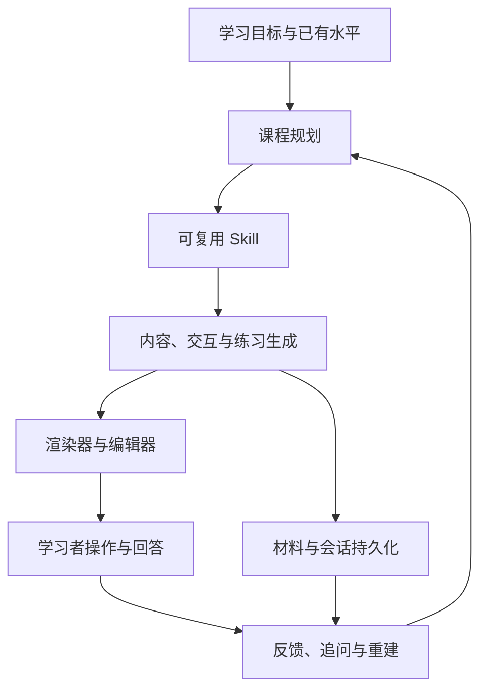

# OpenMAIC：多智能体互动课堂与可复用技能

## 它解决什么问题

OpenMAIC 是一个面向互动课堂的 Agent 工作台：模型根据学习目标生成由页面、交互、练习、讲解和反馈组成的课程，运行时保存会话与材料，Skill 为不同教学任务提供可复用的规划和编辑方法。它把“回答一个问题”提升为“帮助一个人形成可观察的理解过程”。

本地副本：`/Users/leoqqian/Developer/knowledge-tools/OpenMAIC`  
核验 commit：`9b7b42c`（2026-09-03）  
版本：`1.0.0`  
安装状态：Node 26.7.0 + pnpm 10.28.0，`pnpm install --frozen-lockfile` 完成，工作区构建已执行。

## 能力结构

- **技能化教学策略**：`deep-research`、`fact-check`、`feynman-learning`、`learning-to-learn`、`deep-interactive`、`lecture-style`、`workshop-style` 等 Skill 将目标、风格和评价标准变成可复用 playbook。
- **课程是可交互产物**：页面不只是文本，交互、模拟、测验、PBL 和视觉表达承担理解与迁移。
- **持久会话与材料**：课程生成、编辑、材料和运行状态分开保存，使长任务可以继续、修订和复用。
- **SDK 与运行时分层**：`@openmaic/*` SDK 处理 DSL、生成、存储、导入、渲染和编辑；Agent runtime 负责会话、工具和 Skill 编排。
- **Provider 中立**：支持多个模型提供商，但模型切换不能替代课程质量评测和事实核验。

## 教师、助教与学生如何形成学习闭环

课堂中的多角色不是装饰性人设，而是把一次模型输出拆成三种互补职责：

- **教师**：负责建立因果模型，先说明问题、变量、本质和演进，再把新结论放回已有知识结构。
- **助教**：负责从质量、成本、实现和故障角度追问，要求给出指标、代码、反例或可复现实验。
- **学生**：负责先预测、解释和做选择，再面对新场景和新约束迁移；不能只接受一段看似完整的讲解。

这套分工可以直接转成知识库的展示协议：每个高价值主题至少提供“核心机制”“工程取舍”“验证任务”和“迁移问题”四个入口。模型可以生成草稿、问题和反馈，但最终主题仍须绑定来源、版本和真实实验；课堂的历史记录也不自动成为长期知识。

## 对知识库的可复用部分

| OpenMAIC 机制 | 转换为知识库能力 |
| --- | --- |
| `deep-research` + `fact-check` | 外部来源先核验，再进入主题页 |
| `feynman-learning` | 每个核心概念提供自测、反例和迁移问题 |
| `deep-interactive` | 用架构图、流通图和可点击关系替代单纯目录 |
| `pro-editing` + `stage-dsl` | 以结构化局部编辑提升页面一致性 |
| `curriculum-planner` + `spiral-curriculum` | 让学习路径按概念依赖和复访设计，不按资料时间线堆叠 |

## 边界与风险

- 课程生成依赖模型和媒体提供商；没有 API key 时可以安装和检查代码，但不能假定生成内容已经完成事实验证。
- 互动页面能提升理解，却不能自动证明学习者掌握；必须结合可迁移任务、回答质量和复习记录。
- Skill 是行为指导，不是权限系统。工具、存储、模型和外部 API 仍需运行时做 schema、授权、超时和审计。
- 版本变化快，课程 DSL、Provider 和渲染器应按 lockfile 与回归样例复核。

## 复核清单

- [ ] Node engine 是否仍满足 `>=22.19.0`，pnpm lockfile 是否可重复安装？
- [ ] Skill frontmatter、stage DSL 和 renderer 是否有破坏性变化？
- [ ] 课程是否同时包含解释、练习、反馈和迁移，而不是模型长文？
- [ ] 外部事实是否保留 claim-to-source 对照并经过人工抽查？

## 关联知识

- [[工程知识/AI系统/Agent与工作流/Agent学习工具把资料变成可验证学习循环]]
- [[工程知识/AI系统/质量与运营/Agent评测必须覆盖轨迹而不只看最终答案]]
- [[工程知识/AI系统/知识与检索/RAG的核心是选择可引用证据]]
- [[知识库管理/归档/知识演化机制.md]]
