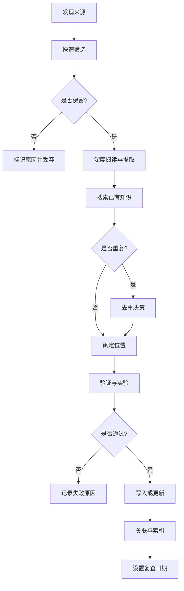

# 知识更新方法论

这份文档记录完整的知识更新流程，从发现来源到验证发布的每一步操作、判断依据和常见错误。适用于人工维护和 AI 辅助执行。

## 为什么需要方法论

知识更新的核心挑战不是"收集信息"，而是：

1. **信息过载**：每天都有新论文、产品发布、框架更新，不可能全部跟踪
2. **质量不一**：博客、社交媒体、营销材料、官方文档、论文的可信度差异极大
3. **重复内容**：同一个概念可能有多篇文章、多个版本、多种表述
4. **时效性陷阱**：AI 领域变化快，昨天的最佳实践今天可能已弃用
5. **验证困难**：没有实验或实际使用，无法确认某个结论是否真实有效

方法论的目标：用最少时间筛选出高价值、可验证、可复用的知识，并保持其时效性和正确性。

## 整体流程



## 第一步：发现来源

### 来源分类与优先级

| 级别 | 来源类型 | 可信度 | 使用方式 | 检查频率 |
|------|----------|--------|----------|----------|
| **P0** | 官方文档、API reference、RFC、标准规范、官方 changelog | 最高 | 直接引用版本、接口、限制 | 产品更新时 |
| **P1** | 原始论文、官方 benchmark、维护者博客、项目 README | 高 | 引用方法、实验设置、设计决策 | 每周-每月 |
| **P2** | 知名工程师文章、技术会议演讲、高质量教程 | 中 | 作为线索，需回链 P0/P1 验证 | 每月 |
| **P3** | 社交媒体、二手总结、营销材料、新闻稿 | 低 | 仅作为发现线索，不直接引用 | 被动发现 |

### 发现渠道

**主动订阅（高信噪比）**：
- 官方 changelog 和 release notes（GitHub releases, product updates）
- 论文预印本（arXiv 相关分类的 RSS）
- 技术博客（工程团队官方博客、核心维护者个人博客）
- 标准组织公告（W3C, IETF, OpenAPI）

**被动收集（需筛选）**：
- 技术社区（Hacker News, Reddit, Twitter/X）
- 会议录像和演讲稿
- 问题反馈（GitHub issues, Stack Overflow）
- 工作中遇到的实际问题

### 快速筛选决策树

遇到一个新来源时，按顺序问以下问题：

```
1. 是否来自 P0/P1 来源？
   └─ 是 → 保留
   └─ 否 → 继续

2. 是否解决一个会重复出现的问题？
   └─ 是 → 保留
   └─ 否 → 继续

3. 是否包含可验证的新方法、新数据或新工具？
   └─ 是 → 保留
   └─ 否 → 继续

4. 是否纠正了现有知识中的错误？
   └─ 是 → 保留
   └─ 否 → 丢弃
```

**直接丢弃的内容**：
- 纯观点、无证据的预测
- 只有结论、没有过程的教程
- 重复宣传、换汤不换药的营销文
- 过时版本、已有更新版本的旧内容
- 特定项目的一次性脚本（除非能提炼成通用模式）

### 登记格式

保留的来源进入 `知识库管理/更新候选/待核验内容.md`，使用以下格式：

```markdown
## [来源标题](URL)

- **来源级别**：P0/P1/P2/P3
- **发现日期**：2026-09-17
- **作者/组织**：OpenAI / Google DeepMind / 个人
- **版本/日期**：v2.5.0 / 2026-09-15
- **要回答的问题**：这个内容解决什么问题？改变了什么决策？
- **初步判断**：保留 / 深读 / 稍后 / 实验后决定
- **关联主题**：`[[工程知识/AI 系统工程：从模型能力到生产能力/推理与服务/模型推理优化]]`
```

## 第二步：深度阅读与提取

### 结构化提取清单

阅读一个来源时，分开记录以下内容：

| 类别 | 提取内容 | 记录要求 |
|------|----------|----------|
| **事实主张** | 性能数字、版本变化、接口签名、限制条件 | 直接引用原文，标注页码或段落 |
| **核心机制** | 算法原理、架构设计、工作流程 | 用自己的话解释，画图辅助 |
| **适用条件** | 什么场景下有效、前置假设是什么 | 列举具体条件，注意隐含假设 |
| **边界与限制** | 什么情况下失效、已知问题、权衡取舍 | 特别关注"not suitable for"和警告 |
| **实验证据** | benchmark 设置、数据集、对比方法、结果 | 记录环境、版本、样本量、显著性 |
| **不确定点** | 作者没说清楚的、矛盾的、需要验证的 | 标记为待实验或待查证 |

### 常见提取错误

| 错误 | 例子 | 正确做法 |
|------|------|----------|
| **混淆相关性与因果** | "使用 X 后性能提升了" | 确认是否有对照组，是否排除了其他变量 |
| **忽略版本** | "TensorRT 支持动态 shape" | 记录从哪个版本开始支持，是否有限制 |
| **过度泛化** | "这个方法适合所有 LLM" | 查看实验只在哪些模型上做过 |
| **省略前置条件** | "使用 FlashAttention 加速" | 确认 GPU 型号、CUDA 版本、精度要求 |
| **只记结论** | "方法 A 比方法 B 快" | 记录快多少、在什么数据上、延迟还是吞吐 |

### 提取模板示例

```markdown
### 核心内容提取

**问题**：现有的 RAG 系统在多跳推理时召回率低

**方法**：
1. 用 query rewriting 生成多个检索查询
2. 对每个查询结果做 rerank
3. 用 CoT 合并多个证据

**适用条件**：
- 问题需要多步推理
- 文档已经分块并索引
- 有 rerank 模型（如 bge-reranker）

**限制**：
- 增加了 3-5 倍检索延迟
- rewrite 质量依赖 LLM
- 不适合实时场景（<500ms）

**实验证据**：
- 数据集：HotpotQA, 2WikiMultihopQA
- 对比：DPR baseline vs. 本方法
- 结果：召回率从 42% 提升到 68%（p<0.01）
- 环境：OpenAI gpt-4, bge-large-zh-v1.5

**不确定点**：
- 是否适用于中文长文档？（论文只测了英文）
- rewrite 数量是否有最优值？（论文用了固定 3 个）
```

## 第三步：搜索已有知识

在写入新知识前，必须先搜索知识库，避免重复和冲突。

### 搜索策略

**1. 关键词搜索**

使用 Obsidian 搜索或 `rg` 命令：

```bash
# 搜索核心概念
rg -i "flashattention|flash attention" 工程知识/

# 搜索相关文件名
find 工程知识/ -iname "*attention*" -o -iname "*推理*"

# 搜索元数据
rg "tags:.*inference" 工程知识/ -A 5
```

**搜索关键词清单**：
- 核心概念的中英文名称
- 技术缩写（RAG, RLHF, CoT）
- 工具/框架名称（vLLM, LangChain）
- 问题领域（推理优化、检索增强）

**2. 图谱搜索**

在知识站的关系图中：
- 查看相关领域有哪些已有页面
- 检查是否有父主题或子主题
- 查找相关引用和被引用

**3. 文件结构搜索**

浏览 `工程知识/` 目录结构：
- 同一领域下是否已有类似主题
- 是否有"总览"或"地图"页面可以挂靠

### 去重决策矩阵

找到相似内容后，按以下规则决策：

| 情况 | 判断标准 | 处理方式 |
|------|----------|----------|
| **完全重复** | 内容、结论、版本都相同 | 丢弃新内容，更新旧页面的 `updated` 时间 |
| **版本更新** | 相同主题，但新版本有变化 | 更新旧页面，在 `supersedes` 中标注旧版本 |
| **补充信息** | 新内容是旧内容的深入或扩展 | 合并到旧页面，增加章节或案例 |
| **不同角度** | 解决相同问题，但方法不同 | 在旧页面中增加"替代方案"对比章节 |
| **冲突结论** | 结论互相矛盾 | 标记冲突，记录来源和证据强度，待验证 |
| **不同层次** | 一个是原理，一个是实践 | 保留两个页面，用链接连接 |
| **真正新内容** | 新问题、新机制、新工具 | 创建新页面 |

### 去重实例

**案例 1：版本更新**

```markdown
# 搜索发现
已有页面：`工程知识/AI 系统工程：从模型能力到生产能力/推理与服务/vLLM推理引擎.md`
版本：v0.3.0（2026-06）

新来源：vLLM v0.4.0 release notes（2026-09）
变化：新增 prefix caching 支持

# 决策
- 不创建新页面
- 更新已有页面的"特性"章节
- 添加 prefix caching 原理和性能对比
- 更新 frontmatter: updated: 2026-09-17
- 添加 supersedes: v0.3.0
```

**案例 2：冲突结论**

```markdown
# 搜索发现
已有页面：`工程知识/AI 系统工程：从模型能力到生产能力/推理与服务/模型量化对比.md`
结论：INT4 量化在 7B 模型上几乎无质量损失

新来源：某论文测试发现 INT4 在某些任务上有明显退化

# 决策
- 在原页面增加"冲突证据"小节
- 记录：数据集、模型、任务类型、评测方法
- 标注：需要在本地复现实验
- 暂不删除原结论，标记 confidence: medium
```

**案例 3：不同层次**

```markdown
# 搜索发现
已有页面：`工程知识/AI 系统工程：从模型能力到生产能力/推理与服务/KV缓存原理.md`（原理）

新来源：某团队的 KV cache 实践经验（实践）

# 决策
- 保留原页面不变
- 创建新页面：`工程知识/AI 系统工程：从模型能力到生产能力/推理与服务/KV缓存工程实践.md`
- 两个页面互相链接
- 原理页面链接："实践案例见 [[KV缓存工程实践]]"
- 实践页面链接："原理参见 [[KV缓存原理]]"
```

## 第四步：验证与实验

新知识在写入前必须经过验证，尤其是涉及性能、成本、兼容性的主张。

### 验证类型

| 验证类型 | 适用场景 | 验证方法 |
|----------|----------|----------|
| **来源验证** | 所有 P2/P3 来源 | 回溯到 P0/P1 来源，确认事实未被曲解 |
| **版本验证** | API、工具、模型 | 检查官方文档，确认版本号和发布日期 |
| **逻辑验证** | 推理链、因果主张 | 检查是否有逻辑跳跃、隐含假设、过度泛化 |
| **实验验证** | 性能、兼容性、效果 | 在本地或测试环境复现，记录结果 |
| **反例验证** | "总是"、"从不"类主张 | 寻找反例，测试边界条件 |

### 实验验证流程

对于涉及性能、效果的关键主张，必须实验验证：

```markdown
### 实验验证记录

**待验证主张**：使用 FlashAttention-2 可使 LLaMA-7B 推理速度提升 2x

**实验设置**：
- 模型：LLaMA-2-7B-chat
- 框架：PyTorch 2.1.0 + transformers 4.35.0
- GPU：NVIDIA A100 40GB
- 输入：512 tokens prompt, 生成 128 tokens
- 对比：标准 attention vs. FlashAttention-2

**步骤**：
1. 安装 flash-attn==2.3.0
2. 运行 baseline: python infer.py --attention=standard
3. 运行 flash: python infer.py --attention=flash2
4. 重复 10 次取平均

**结果**：
- Baseline: 95ms/token (±5ms)
- FlashAttention-2: 52ms/token (±3ms)
- 加速比：1.83x

**结论**：
- 主张基本成立，但加速比略低于宣称的 2x
- 可能与 batch size=1 有关（原论文用 batch size=8）
- 写入时注明：加速比与 batch size 和序列长度相关

**环境信息**：
- OS: Ubuntu 22.04
- CUDA: 12.1
- Driver: 530.30.02
- 日期: 2026-09-17
```

### 常见验证陷阱

| 陷阱 | 说明 | 避免方法 |
|------|------|----------|
| **环境差异** | 原文的硬件、软件版本与你不同 | 记录完整环境，说明差异 |
| **样本偏差** | 只在特定数据上测试 | 使用多样化测试集 |
| **缺少对照** | 没有 baseline 对比 | 同时运行旧方法和新方法 |
| **忽略方差** | 只跑一次就下结论 | 重复多次，计算均值和标准差 |
| **版本不一致** | 使用了不同版本的依赖 | 锁定依赖版本，记录在实验中 |

### 无法验证时的处理

如果暂时无法验证（如缺少硬件、数据集、权限），明确标注：

```markdown
> **未验证主张**
> 
> 来源声称：使用 8x A100 可以实现 1000 tokens/s 吞吐
> 
> **当前状态**：无法验证（缺少 8x A100 环境）
> 
> **风险**：数字可能基于理想条件，实际吞吐可能更低
> 
> **使用建议**：仅作为参考上限，实际部署前需实测
```

## 第五步：写入或更新

验证通过后，将知识写入对应主题页面。

### 页面结构

标准主题页面包含以下部分：

```markdown
---
title: 页面标题
type: concept | playbook | reference
status: active
updated: 2026-09-17
review_after: 2026-12-17
change_rate: stable | medium | fast
confidence: high | medium | low
tags:
  - domain/subdomain
sources:
  - "https://..."
  - "[[相关页面]]"
---

# 页面标题

一句话说明这个页面解决什么问题。

## 核心机制

解释原理、架构、工作流程。

## 适用场景

什么情况下应该使用这个方法/工具/概念。

## 限制与边界

什么情况下不应该使用，已知问题和权衡。

## 操作与验证

如何实际使用、如何验证效果。

## 相关主题

- [[相关页面1]]
- [[相关页面2]]
```

### 写作原则

| 原则 | 说明 | 示例 |
|------|------|------|
| **机制优先** | 先解释为什么，再说怎么做 | ❌ "运行这个命令" ✅ "因为 X 原因，需要 Y 操作" |
| **边界明确** | 明确适用范围和限制 | ❌ "这个方法很好" ✅ "适合 batch 推理，不适合流式" |
| **证据充分** | 关键主张要有来源或实验 | ❌ "性能提升显著" ✅ "实测提升 1.8x（见实验记录）" |
| **版本明确** | 涉及工具、API 必须标注版本 | ❌ "PyTorch 支持" ✅ "PyTorch 2.0+ 支持" |
| **可验证** | 提供验证步骤或命令 | ✅ "运行 `pytest tests/` 确认功能正常" |

### 更新已有页面的规则

| 更新类型 | 操作 | Frontmatter 变化 |
|----------|------|------------------|
| **修正错误** | 直接改正，添加纠正说明 | updated 改为今天 |
| **补充内容** | 增加章节或段落 | updated 改为今天 |
| **版本升级** | 更新版本相关内容，标注旧版本 | updated 改为今天，添加 supersedes |
| **冲突信息** | 增加"冲突证据"小节，不删除旧结论 | confidence 可能降低 |
| **弃用内容** | 标注已弃用，说明原因和替代方案 | status 改为 deprecated |

### 避免的写作错误

| 错误 | 问题 | 正确做法 |
|------|------|----------|
| **堆砌命令** | 只有命令，没有解释 | 说明每个命令的作用和为什么需要 |
| **过度抽象** | 只讲理论，没有例子 | 提供至少一个具体例子或场景 |
| **假设背景** | 假设读者已知某些知识 | 链接到前置知识页面或简短解释 |
| **时间性表述** | "最新"、"目前"、"即将" | 使用具体版本号和日期 |
| **情感化表述** | "很好"、"强大"、"简单" | 用具体指标和对比替代 |

## 第六步：关联与索引

写入知识后，需要建立关联，让知识可被发现和使用。

### 链接类型

| 链接方向 | 何时添加 | 位置 |
|----------|----------|------|
| **前置知识** | 当前页面依赖其他概念 | "相关主题"或正文中 |
| **后续扩展** | 当前页面有更详细的子主题 | "相关主题"或正文中 |
| **对比参考** | 有替代方案或类似方法 | "替代方案"章节 |
| **实践案例** | 有实际应用例子 | "实践"章节 |
| **来源页面** | 引用其他知识页面的结论 | frontmatter 的 sources |

### 索引更新

新增页面后，更新相关索引：

1. **领域地图页**：在 `工程知识/XX领域/README.md` 中添加链接
2. **相关主题页**：在相关页面中添加反向链接
3. **标签系统**：确保 tags 准确，便于搜索

### 图谱验证

在知识站中检查：
- 新页面是否出现在图谱中
- 链接是否正确显示
- 是否有孤岛节点（没有任何链接的页面）

## 第七步：设置复查日期

不同类型的知识需要不同的复查频率。

### 复查周期

| 知识类型 | review_after 间隔 | 原因 |
|----------|-------------------|------|
| **模型别名、API preview** | 7-30 天 | 变化极快，可能随时弃用 |
| **框架、工具版本** | 30-90 天 | 更新频繁，需跟踪 changelog |
| **工程实践** | 3-6 个月 | 社区实践演进较快 |
| **算法原理** | 6-12 个月 | 相对稳定，但可能有新研究 |
| **基础概念** | 12 个月+ | 很少变化，偶尔复查即可 |

### 复查触发条件

除了定期复查，以下情况需要立即复查相关页面：

- **安全公告**：涉及的工具、框架、模型
- **破坏性更新**：API 变更、弃用通知
- **重大 bug 修复**：可能影响已有结论
- **新论文**：对现有方法的改进或质疑
- **实际问题**：生产环境遇到的与知识页面矛盾的现象

### 复查流程

到达 `review_after` 日期后：

1. **检查来源**：原始链接是否仍有效，是否有更新版本
2. **验证结论**：关键实验或操作是否仍然有效
3. **搜索新信息**：是否有新的相关论文、工具、实践
4. **决策**：
   - ✅ 仍然正确 → 更新 `updated` 和 `review_after`，延长周期
   - ⚠️ 部分过时 → 更新内容，标注变化
   - ❌ 已弃用 → 改为 `status: deprecated`，说明替代方案
   - 🔍 不确定 → 降低 `confidence`，标记需要验证

## 常见问题与解决方案

### Q1: 如何判断一个来源是否值得深读？

**快速判断清单**：
- [ ] 来源是 P0/P1 级别，或者引用了 P0/P1 来源
- [ ] 内容包含可验证的数字、实验、代码
- [ ] 解决的问题在你的知识库范围内
- [ ] 有明确的适用场景和限制说明
- [ ] 不是纯营销或观点文章

如果 3 项以上为"是"，值得深读。

### Q2: 遇到互相矛盾的来源怎么办？

**处理步骤**：
1. 检查来源级别（P0 > P1 > P2 > P3）
2. 检查发布时间（新版本可能修正旧问题）
3. 检查实验设置（可能适用场景不同）
4. 如果仍无法确定，两个结论都记录，标注冲突
5. 设计实验验证，或等待更多证据

### Q3: 一个主题有很多相关内容，如何组织？

**组织策略**：
- **核心页面**：概念、原理、架构（1 个）
- **实践页面**：工程实践、最佳实践（1-2 个）
- **工具对比**：不同工具的选型对比（1 个）
- **案例**：具体问题的完整解决方案（按需）

所有页面链接到核心页面，核心页面链接到子页面。

### Q4: 如何避免知识库变成"资料收藏夹"？

**关键区别**：
- ❌ 资料收藏：保存链接，写简单摘要
- ✅ 知识库：提炼机制，标注边界，实验验证，可直接指导决策

**执行规则**：
- 原文放在 `知识库管理/来源` 或 `Clippings`
- 提炼后的知识才进入 `工程知识`
- 如果一个页面只是"资料摘要"，不算合格知识页面

### Q5: AI 辅助更新时如何保证质量？

**AI 可以做的**：
- 搜索相关已有页面
- 提取来源中的关键信息
- 建议去重和合并方案
- 生成初稿

**AI 不能做的**（必须人工或工具确认）**：
- 验证来源的 URL 和哈希
- 运行实验和验证命令
- 决定删除哪些页面
- 最终的发布决策

**规则**：AI 的输出必须经过 [[工程知识/AI 系统工程：从模型能力到生产能力/安全与治理/执行证据必须独立于AI结论]] 检查。

## 检查清单

### 来源筛选检查

- [ ] 确认来源级别（P0/P1/P2/P3）
- [ ] 记录了发现日期和访问日期
- [ ] 标注了版本号或发布日期
- [ ] 写清了要回答的问题
- [ ] 判断了是否值得深读

### 提取质量检查

- [ ] 分离了事实、机制、条件、限制
- [ ] 没有混淆相关性与因果
- [ ] 标注了版本和环境依赖
- [ ] 记录了不确定点
- [ ] 引用了原文具体位置

### 去重检查

- [ ] 搜索了关键词
- [ ] 检查了文件结构
- [ ] 查看了知识图谱
- [ ] 做出了明确的去重决策
- [ ] 如果合并，保留了重要细节

### 验证检查

- [ ] 回溯到 P0/P1 来源（对 P2/P3 来源）
- [ ] 检查了版本和发布日期
- [ ] 实验验证了关键主张
- [ ] 记录了实验环境和结果
- [ ] 标注了无法验证的内容

### 写入检查

- [ ] Frontmatter 完整（title, type, status, updated, tags, sources）
- [ ] 快速变化内容有 review_after
- [ ] 解释了机制，不只是操作步骤
- [ ] 明确了适用场景和限制
- [ ] 提供了验证方法
- [ ] 没有时间性表述（"目前"、"最新"）

### 关联检查

- [ ] 添加了前置知识链接
- [ ] 添加了相关主题链接
- [ ] 更新了领域地图或索引页
- [ ] 在知识站图谱中验证链接
- [ ] 没有孤岛页面

### 发布前检查

- [ ] 运行了 `python3 -m unittest tests/test_site.py`
- [ ] 知识站可以正常加载和搜索
- [ ] 内部链接没有断链（跑 `python3 scripts/link_audit.py`）
- [ ] Markdown 格式正确（标题层级、列表、代码块）
- [ ] 没有密钥、密码、个人信息
- [ ] 更新了 `知识库管理/归档/变更记录.md`

## 相关主题

- [[知识库管理/归档/知识演化机制.md]] - 整体知识演化流程
- [[知识库管理/归档/知识质量标准.md]] - 质量评分和层级划分
- [[知识库管理/归档/来源注册表.md]] - 长期跟踪的信息源
- [[工程知识/AI 系统工程：从模型能力到生产能力/安全与治理/执行证据必须独立于AI结论]] - AI 辅助时的验证规则
