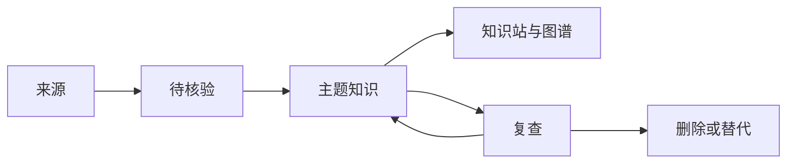

# 知识演化机制

本知识库的目标不是收集“看过的资料”，而是持续形成能帮助决策、设计、排障和学习的可复用知识。来源材料保留证据，模型辅助提炼，主题知识持续重写，图谱和索引帮助发现连接。

## 来源、候选、主题页与发布



| 层 | 位置 | 内容 | 规则 |
| --- | --- | --- | --- |
| 来源 | `知识库管理/来源`、`Clippings` | 不可替代的论文、项目证据、案例和外部输入 | 只保留有用途的原文；Clippings 不改写；可由官方重新获取的课程包不复制到知识库 |
| 待核验 | `知识库管理/更新候选` | 新论文、项目更新、产品变化、工作问题 | 只记录摘要、来源、价值判断和下一步，不永久堆积 |
| 主题知识 | `工程知识` | 按领域和机制聚合的原理、决策、操作和复盘 | 同一机制只保留一个主页面 |

`知识库管理/来源` 是证据存放位置，不是知识分类。课程名、日期、作者和文件格式不能成为主导航维度；它们只作为来源元数据和回溯入口。工作项目的结论必须提升到实际知识领域，而不是建立“工作经验”类别。

## 页面契约

主题页、论文页和项目页使用统一 Properties：

```yaml
---
title: 页面标题
type: concept | playbook | reference | map | paper | project
status: seed | candidate | active | needs-review | deprecated
updated: YYYY-MM-DD
review_after: 2026-09-28
change_rate: stable | medium | fast
confidence: low | medium | high
tags:
  - domain/example
sources:
  - "https://..."
supersedes:
  - "旧页面或版本"
---
```

正文至少回答：解决什么问题、核心机制是什么、何时适用、何时失效、如何验证、与哪些页面相连。快速变化页面必须有 `review_after` 和版本/发布日期；只剩观点、没有证据或验证方法的页面停留在 `needs-review`，不进入核心导航。

## 外部更新输入

### 来源优先级

| 级别 | 来源 | 可写入的内容 |
| --- | --- | --- |
| P0 | 官方规范、API reference、产品文档、changelog、官方仓库 release | 接口事实、版本、弃用、限制 |
| P1 | 原始论文、官方 benchmark、标准组织资料 | 方法、实验设置、指标和边界 |
| P2 | 高可信工程文章、维护者访谈 | 设计取舍和实践线索，需回链 P0/P1 |
| P3 | 社交媒体、二手总结、营销材料 | 只作候选线索，不直接当作事实 |

### 输入类别

- **论文**：新方法、评测基准、系统论文。先记贡献和证据，再判断它改变了哪个主题页。
- **项目**：GitHub 仓库、SDK、数据库、模型、插件。记录版本、许可证、成熟度、迁移成本和本地实验结果。
- **产品与规范**：模型发布、协议版本、API 变更、价格、弃用和安全公告。
- **工作证据**：故障、性能数据、代码评审和上线复盘。保留上下文，提炼结论后归入实际知识主题。

模板位于 `知识库管理/来源/论文与项目`；每日新增先进入 `知识库管理/更新候选/每日更新` 或论文/项目模板，不要直接进入主知识区。每日汇总格式见 [[知识库管理/归档/更新候选/每日更新模板.md]]。

长期跟踪的官方文档、变更记录、论文、项目发布和安全公告登记在 [[知识库管理/归档/来源注册表.md]]。来源注册表只负责发现变化，不直接改变主题知识；每条变化仍需经过来源等级、价值判断和验证门禁。

## 从来源到主题页

一次只处理一个来源或一个紧密相关的变更：

1. **登记**：记录 URL、标题、作者/组织、发布日期、访问日期、版本、来源级别和要回答的问题。
2. **提取**：分开写事实主张、机制、适用条件、限制、反例、实验数据和不确定点。
3. **定位**：在主题知识中按概念搜索；已有主题就合并，只有新机制才新建页面。
4. **验证**：核对官方版本/原论文；在本地数据、测试集或最小实验中复现影响，记录环境和结果。
5. **发布**：更新主页面、相关索引、反向链接和 `review_after`；旧结论不静默覆盖，保留 supersedes 或冲突说明。
6. **记录**：在 [[知识库管理/归档/变更记录.md]] 记录来源、改动、验证、未解决问题和下一次复查。

推荐给 Codex/Claude 的处理指令：

```text
阅读一个来源，先列出事实主张、适用条件、反例和证据位置。
搜索现有主题页，判断哪些内容应合并、修正或标记冲突。
只修改相关主题页和索引，不创建按课程、日期或模型名称命名的长期知识页。
输出：改动摘要、未解决冲突、需要实验验证的命题、来源链接和 review_after。
```

## 更新节奏

| 节奏 | 动作 | 产出 |
| --- | --- | --- |
| 每日 | 收集高信号论文、项目发布、厂商变更和工作问题；去重并快速判断价值 | 待核验条目，标注保留、阅读、稍后或删除 |
| 每周 | 深读保留项，合并到已有主题；检查断链、孤儿页、重复主题和候选堆积 | 主题知识更新与变更记录 |
| 每月 | 对模型与 API、RAG 与 Agent、推理引擎与服务平台运行回归集；扫描 `review_after` 到期页和过期版本 | 质量/性能结果、迁移任务、技术动态 |
| 每季度 | 重新审视主题边界、入口地图和来源质量；清理无证据、无复用价值的页面 | 分类调整、归档/删除记录 |
| 事件驱动 | 安全公告、破坏性 API、模型弃用、权限事故立即处理 | 紧急复查和回滚/兼容方案 |

AI 相关内容的默认复查窗口比稳定原理短：模型别名、preview、价格和协议版本 7-30 天；Agent/RAG 框架、推理引擎、GPU 运行时和服务编排 30-90 天；算法原理和工程模式 3-12 个月。推理后端升级必须同时回归模型支持、数值质量、TTFT、ITL、吞吐、显存、故障恢复和成本，不能只接受项目 benchmark。窗口只是触发器，不代表内容必然正确。

## AI 系统专项规则

- [[工程知识/AI 系统工程：从模型能力到生产能力/知识与检索/RAG的核心是选择可引用证据]] 保存稳定架构、选型和评测方法；[[工程知识/AI 系统工程：从模型能力到生产能力/生态与选型/AI技术动态]] 保存当前版本、产品和论文快照。
- 每次 embedding、reranker、索引、ACL、Prompt、模型或协议变更，都保存检索轨迹、引用、权限决策、token、延迟、成本和回归结果。
- freshness 记录 `source_updated_at -> indexed_at -> query_visible_at`；ACL 记录身份映射、同步延迟和拒绝行为。不能把“最新”或“模型会遵守权限”当作默认保证。
- Agent 工具和协议按 MCP/A2A 版本记录 capability、授权、任务状态、超时、幂等和回退；preview 能力必须有 classic/旧版兼容路径。
- 推理引擎、编译器、CUDA/驱动、GPU 型号、量化格式和服务框架作为一个兼容矩阵记录；任何一层变化都用相同 workload 和质量门槛重新测量。
- 分离式推理、跨节点并行、KV cache 复用和自动扩缩先记录拓扑、到达率、长度分布与故障场景，再比较是否优于单实例或静态副本基线。
- 论文只改变“候选方法”，不直接改变生产结论；生产采用必须经过本地数据和质量门禁。

## 质量门禁与删除标准

AI 参与提炼时沿用 [[工程知识/AI 系统工程：从模型能力到生产能力/安全与治理/执行证据必须独立于AI结论]]：AI 可以判断主题价值、归类、冲突、合并和改写方式；来源文件哈希、路径、发布时间、URL 可访问性、实际测试结果和删除范围必须由工具/文件系统证据确认。AI 的摘要不能反向冒充原文，后一次低质量更新也不能静默覆盖已验证结论。

发布前逐项确认：

- 是否属于明确知识主题，而不是课程流水账或时间线？
- 关键结论是否有 P0/P1 来源、实验或线上观测？
- 是否写了适用边界、失败模式、验证方法和版本？
- 是否复用已有主题页，而非制造重复入口？
- 是否含密钥、密码、内部地址、个人信息或不可公开的截图？
- 是否能被 HTML 导出器解析，内部链接和图谱边是否可用？

可以直接删除：空占位、重复副本、构建产物、临时日志、失效快捷方式、没有结论且可再生成的草稿。可能包含证据但当前未提炼的内容移入来源层，并在待核验内容中登记；敏感信息不因“原始记录”名义保留，先删除或彻底脱敏。

## 主题知识如何进入学习

主题页发布后不等于已经掌握。每个高价值主题至少应有一个由目标驱动的学习活动：先解释或预测，再进行最小操作，最后在不同约束下迁移。活动记录回答、实验输出、引用和错误类型；只有经过证据检查的稳定结论才合并回主题页，个人待办和复习状态留在学习记录中。活动设计见 [[工程知识/AI 系统工程：从模型能力到生产能力/质量与运营/学习活动需要结果、轨迹与迁移证据]]。

外部项目对本库的贡献也按同一原则处理：图谱、课程、检索或记忆能力只能作为方法证据；项目名称和版本留在来源层，抽象出的机制进入对应技术主题，不建立“工具项目”主分类。

## Obsidian

- `Clippings` 保持原样，用作剪藏区；有长期价值的内容应提炼进对应知识主题。
- 新资料先进入来源层或更新候选区，确认价值、证据和归属后再并入主题页。
- Properties、内部链接和来源字段用于连接知识，不在正文重复展示维护信息。
