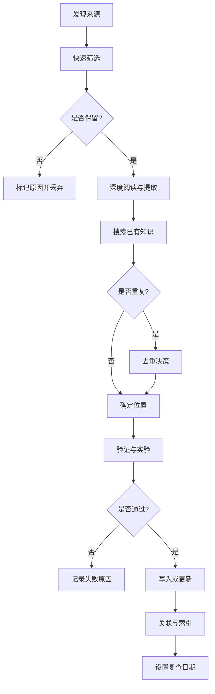

# 知识从哪来，怎么更新

这篇回答两件事：**新东西从哪发现**，以及**从发现到写进知识库要走完哪些步**。

真正的难点从来不是"收集信息"，而是四件事：

- **信息过载** —— 每天都有新论文、新版本、新框架，不可能全跟踪
- **质量差异极大** —— 官方文档、论文、博客、营销材料不在一个可信度上
- **重复** —— 同一个概念可能有多个版本、多种表述
- **时效陷阱** —— AI 领域变化快，昨天的最佳实践今天可能已被弃用

所以流程的目的不是"多收"，而是**用最少时间筛出可验证、可复用的知识，并让它保持正确**。

## 整体流程



## 第一步：来源分级

**先看来源级别，再决定投入多少精力。** 这是整个流程里最省时间的一步。

| 级别 | 来源类型 | 可信度 | 使用方式 |
|---|---|---|---|
| **P0** | 官方文档、API reference、RFC、标准规范、官方 changelog | 最高 | 直接引用版本、接口、限制 |
| **P1** | 原始论文、官方 benchmark、维护者博客、项目 README | 高 | 引用方法、实验设置、设计决策 |
| **P2** | 知名工程师文章、技术会议演讲、高质量教程 | 中 | **只作为线索**，需回溯 P0/P1 验证 |
| **P3** | 社交媒体、二手总结、营销材料、新闻稿 | 低 | 仅用于发现，**不直接引用** |

关键在于 **P2/P3 永远不能直接成为结论**。它们的价值是"提示你有个东西值得查"，结论必须落到 P0/P1。

### 发现渠道

**主动订阅（高信噪比）**
- 官方 changelog 与 release notes（GitHub releases、产品更新页）
- 论文预印本（arXiv 相关分类 RSS）
- 技术博客（工程团队官方博客、核心维护者个人博客）
- 标准组织公告（W3C、IETF、OpenAPI）

**被动收集（需筛选）**
- 技术社区（Hacker News、Reddit）
- 会议录像与演讲稿
- 问题反馈（GitHub issues、Stack Overflow）
- **工作中遇到的实际问题** —— 这类往往价值最高，因为有真实约束

### 快速筛选决策树

拿到一个新来源，按顺序问：

```
1. 是否来自 P0/P1 来源？
   └─ 是 → 保留
   └─ 否 → 继续

2. 是否解决一个会重复出现的问题？
   └─ 是 → 保留
   └─ 否 → 继续

3. 是否包含可验证的新方法、新数据或新工具？
   └─ 是 → 保留
   └─ 否 → 继续

4. 是否纠正了现有知识中的错误？
   └─ 是 → 保留
   └─ 否 → 丢弃
```

**直接丢弃**：纯观点无证据、只有结论没有过程、换汤不换药的营销文、已有更新版本的旧内容、
一次性项目脚本（除非能提炼成通用模式）。

### 来源失效怎么判定

可信来源会过期。出现下面任一情况就重查：

- 官方文档标注 deprecated / sunset，或给出替代方案
- 版本号跨越了 breaking change
- 来源链接 404 且无归档（Wayback 也没有）
- 出现了更新的 P0/P1 来源推翻原结论

**处理方式**：不要删旧结论。追加"已被 X 取代"并说明差异，`status` 改为 `deprecated`。

## 第二步：深度阅读与提取

**不要边读边写。** 先把内容摘成结构化笔记，再决定它属于哪。

### 结构化提取清单

- **事实**：版本号、限制、接口签名、默认值（可直接引用）
- **机制**：为什么这样设计，解决什么问题，代价是什么
- **数字**：性能、成本、规模 —— 连同测试条件一起记
- **边界**：什么时候不适用，已知失效场景
- **出处**：能不能回溯到 P0/P1

### 常见的提取错误

| 错误 | 后果 | 正确做法 |
|---|---|---|
| 只抄结论 | 无法判断适用性 | 连条件和代价一起记 |
| 丢掉上下文 | 数字被误用 | 记录测试环境与版本 |
| 转述时加推断 | 把猜测当事实 | 区分"来源说的"和"我推的" |
| 只摘支持结论的部分 | 幸存者偏差 | 反例和限制同等重要 |

## 第三步：搜索已有知识，做去重决策

**动笔前必须搜。** 否则同一个概念会散成多页，之后互相矛盾。

搜索方式：

```bash
# 搜索核心概念（正文）
grep -rn "核心概念" vault/工程知识/

# 搜索文件名
find vault -name "*关键词*"

# 搜索元数据（tags / 标题）
grep -rln "tags:" vault/工程知识/ | xargs grep -l "关键词"
```

### 去重决策矩阵

| 情况 | 决策 |
|---|---|
| 完全重复，无新信息 | 丢弃，只更新原页的 `updated` |
| 同一主题，补充细节 | **合并进原页**，不新建 |
| 同一主题，但有独立场景 | 新建页，两侧互相链接 |
| 纠正原页错误 | 改原页 + 添加纠正说明 |
| 与原页结论冲突 | **不删旧结论**，加"冲突证据"小节，`confidence` 降级 |

### 去重实例

```
# 搜索发现
已有：工程知识/AI系统/推理服务/KV缓存原理.md（讲机制）

新来源：某团队的 KV cache 实践经验

# 决策
- 保留原原理页不变
- 新建：工程知识/AI系统/推理服务/KV缓存工程实践.md
- 两页互相链接：
  原理页 → "实践案例见 [[KV缓存工程实践]]"
  实践页 → "原理参见 [[KV缓存原理]]"
```

判断标准是**知识对象是否相同**：同样的机制 vs. 落地时的取舍，是两页。

## 第四步：验证

涉及性能、成本、兼容性的主张，**写进去之前必须验证**。

| 验证类型 | 适用场景 | 方法 |
|---|---|---|
| **来源验证** | 所有 P2/P3 | 回溯 P0/P1，确认未被曲解 |
| **版本验证** | API、工具、模型 | 查官方文档确认版本与日期 |
| **逻辑验证** | 推理链、因果主张 | 找逻辑跳跃、隐含假设、过度泛化 |
| **实验验证** | 性能、兼容性、效果 | 本地复现并记录结果 |
| **反例验证** | "总是""从不"类主张 | 主动找反例，测边界 |

### 实验记录格式

```
待验证主张：使用 FlashAttention-2 可使 LLaMA-7B 推理速度提升 2x

实验设置
  模型：LLaMA-2-7B-chat
  框架：PyTorch 2.1.0 + transformers 4.35.0
  硬件：NVIDIA A100 40GB
  输入：512 tokens prompt，生成 128 tokens
  对比：标准 attention vs. FlashAttention-2

结果
  Baseline：95ms/token (±5ms)
  FlashAttention-2：52ms/token (±3ms)
  加速比：1.83x

结论
  主张基本成立，但加速比低于宣称的 2x
  可能与 batch size=1 有关（原论文用 batch size=8）
  写入时必须注明：加速比与 batch size 和序列长度相关

环境：Ubuntu 22.04 / CUDA 12.1 / Driver 530.30.02 / 2026-09-17
```

**注意最后一行。** 没有环境信息的性能数字等于没有数字。

### 验证陷阱

| 陷阱 | 表现 | 避免 |
|---|---|---|
| 环境差异 | 原文硬件/版本与你不同 | 记录完整环境，说明差异 |
| 样本偏差 | 只在一种数据上测 | 用多样化测试集 |
| 缺少对照 | 没跑 baseline | 新旧方法同时跑 |
| 忽略方差 | 只跑一次就下结论 | 多次重复，算均值与标准差 |
| 版本不一致 | 依赖版本不同 | 锁定版本并写进记录 |

### 验证不了怎么办

缺硬件、数据集或权限时，**明确标注未验证**，不要含糊过去：

```
> 未验证主张
>
> 来源声称：使用 8x A100 可以达到 1000 tokens/s 吞吐
>
> 当前状态：无法验证（缺少 8x A100 环境）
>
> 风险：数字可能基于理想条件，实际吞吐更低
>
> 使用建议：仅作参考上限，部署前必须实测
```

## 第五步：写入与更新

### 更新已有页面的规则

| 更新类型 | 操作 | frontmatter |
|---|---|---|
| 修正错误 | 直接改正 + 纠正说明 | `updated` 改为今天 |
| 补充内容 | 增加章节 | `updated` 改为今天 |
| 版本升级 | 更新版本内容，标注旧版本 | `updated` + 加 `supersedes` |
| 冲突信息 | 加"冲突证据"小节，**不删旧结论** | `confidence` 可能降级 |
| 弃用内容 | 标注原因与替代方案 | `status` 改为 `deprecated` |

具体一页该怎么组织，见 [[知识库管理/方法/一篇知识怎么写]]。

## 第六步：关联与复查

写完要建立关系，否则知识等于不存在。

| 链接方向 | 何时加 |
|---|---|
| 前置知识 | 本页依赖其他概念 |
| 后续扩展 | 本页有更细的子主题 |
| 对比参考 | 存在替代方案 |
| 实践案例 | 有实际应用例子 |
| 来源 | 引用其他知识页结论时写进 `sources` |

新增页后同步更新：领域地图页 → 相关页的反向链接 → `tags`。

### 复查日期怎么定

按 `change_rate` 反推 `review_after`：

| change_rate | 复查周期 | 举例 |
|---|---|---|
| `fast` | 1 个月 | AI 模型能力、工具链、定价 |
| `medium` | 3 个月 | 框架用法、工程实践 |
| `stable` | 6 个月 | 协议、算法、系统原理 |

### 变更记录

重要变更写进 `知识库管理/归档/变更记录.md`：日期、类型（新增/更新/重构/废弃）、影响范围、原因。

**为什么值得记**：半年后你会想知道"这页为什么改过"，尤其是被推翻的结论。

## 什么时候该动手更新

三种触发：

1. **主动扫描** —— 每月检查领域前沿（论文、官方更新、开源项目）
2. **被动回填** —— 实际工作中遇到问题、踩坑、需要方案时
3. **质量审计** —— 每季度查过时内容、断链、缺证据的页面

第 2 种通常价值最高：**带着真实约束来的知识，最容易写准**。

## 相关

- [[知识库管理/方法/一篇知识怎么写]] —— 单页内容该包含什么
- [[知识库管理/归档/知识更新方法论]] —— 原始完整版（含更多示例）
- [[知识库管理/归档/来源注册表]] —— 已登记来源清单
- [[知识库管理/知识库管理]] —— 结构与硬规则
